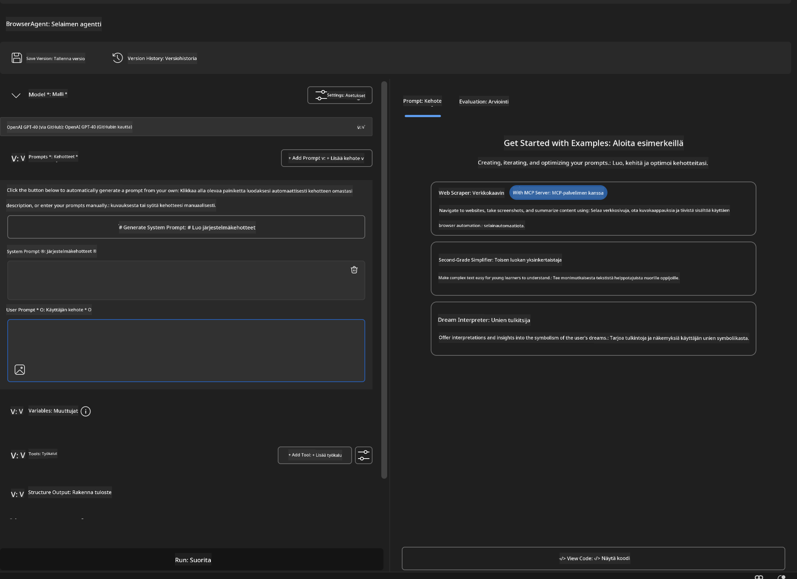
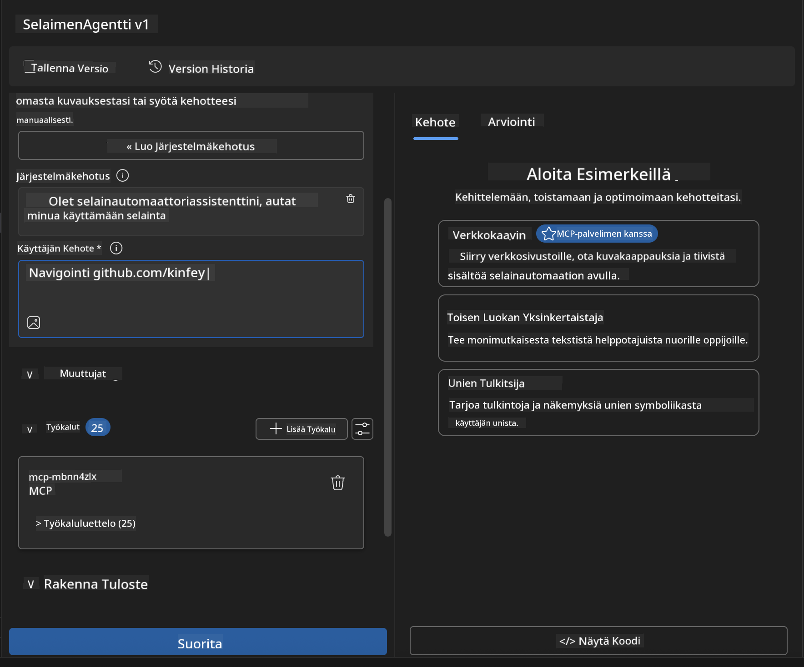
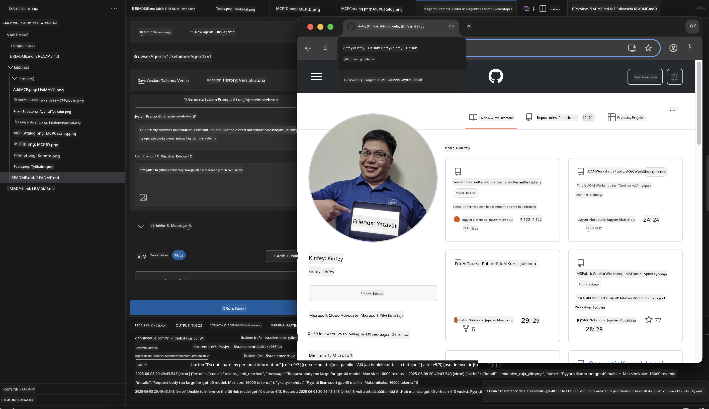

<!--
CO_OP_TRANSLATOR_METADATA:
{
  "original_hash": "a22b7dd11cd7690f99f9195877cafdc3",
  "translation_date": "2025-06-10T05:51:28+00:00",
  "source_file": "10-StreamliningAIWorkflowsBuildingAnMCPServerWithAIToolkit/lab2/README.md",
  "language_code": "fi"
}
-->
# 🌐 Moduuli 2: MCP ja AI Toolkit -perusteet

[]()
[]()
[]()

## 📋 Oppimistavoitteet

Tämän moduulin jälkeen osaat:
- ✅ Ymmärtää Model Context Protocolin (MCP) arkkitehtuurin ja hyödyt
- ✅ Tutustua Microsoftin MCP-palvelin-ekosysteemiin
- ✅ Integroida MCP-palvelimet AI Toolkit Agent Builderiin
- ✅ Rakentaa toimivan selainautomaattisen agentin Playwright MCP:n avulla
- ✅ Konfiguroida ja testata MCP-työkaluja agenteissasi
- ✅ Viedä ja ottaa MCP-voimalla toimivia agenteja käyttöön tuotantoympäristössä

## 🎯 Rakentaminen moduulin 1 päälle

Moduulissa 1 opettelimme AI Toolkitin perusteet ja loimme ensimmäisen Python-agenttimme. Nyt **tehostamme** agenttejasi yhdistämällä ne ulkoisiin työkaluihin ja palveluihin mullistavan **Model Context Protocolin (MCP)** avulla.

Ajattele tätä siirtymänä peruslaskimesta täysiveriseksi tietokoneeksi – AI-agenttisi saavat kyvyn:
- 🌐 Selailla ja olla vuorovaikutuksessa verkkosivujen kanssa
- 📁 Käyttää ja käsitellä tiedostoja
- 🔧 Yhdistyä yritysjärjestelmiin
- 📊 Käsitellä reaaliaikaista dataa API:sta

## 🧠 Model Context Protocolin (MCP) ymmärtäminen

### 🔍 Mikä on MCP?

Model Context Protocol (MCP) on **"USB-C AI-sovelluksille"** – mullistava avoin standardi, joka yhdistää suurten kielimallien (LLM) ulkoisiin työkaluihin, tietolähteisiin ja palveluihin. Samalla tavalla kuin USB-C poisti kaosmaisen kaapelien sekamelskan yhdellä universaalilla liittimellä, MCP yksinkertaistaa AI-integraatiota yhdellä standardoidulla protokollalla.

### 🎯 MCP:n ratkaisema ongelma

**Ennen MCP:tä:**
- 🔧 Räätälöidyt integraatiot jokaista työkalua varten
- 🔄 Toimittajalukkoon joutuminen suljetuilla ratkaisuilla
- 🔒 Turvallisuusongelmat ad-hoc-yhteyksistä
- ⏱️ Kuukausien kehitystyö perusintegraatioissa

**MCP:n kanssa:**
- ⚡ Plug-and-play-työkalujen integrointi
- 🔄 Toimittajariippumaton arkkitehtuuri
- 🛡️ Sisäänrakennetut turvallisuuskäytännöt
- 🚀 Uusien ominaisuuksien lisääminen minuuteissa

### 🏗️ Syväsukellus MCP-arkkitehtuuriin

MCP perustuu **asiakas-palvelin-arkkitehtuuriin**, joka luo turvallisen ja skaalautuvan ekosysteemin:

```mermaid
graph TB
    A[AI Application/Agent] --> B[MCP Client]
    B --> C[MCP Server 1: Files]
    B --> D[MCP Server 2: Web APIs]
    B --> E[MCP Server 3: Database]
    B --> F[MCP Server N: Custom Tools]
    
    C --> G[Local File System]
    D --> H[External APIs]
    E --> I[Database Systems]
    F --> J[Enterprise Systems]
```

**🔧 Keskeiset komponentit:**

| Komponentti | Rooli | Esimerkkejä |
|-------------|-------|-------------|
| **MCP Hosts** | Sovellukset, jotka käyttävät MCP-palveluita | Claude Desktop, VS Code, AI Toolkit |
| **MCP Clients** | Protokollankäsittelijät (1:1 palvelimien kanssa) | Sisäänrakennettu host-sovelluksiin |
| **MCP Servers** | Tarjoavat ominaisuuksia standardoidun protokollan kautta | Playwright, Files, Azure, GitHub |
| **Transport Layer** | Viestintämenetelmät | stdio, HTTP, WebSockets |


## 🏢 Microsoftin MCP-palvelin-ekosysteemi

Microsoft johtaa MCP-ekosysteemiä kattavalla yritystason palvelinvalikoimalla, jotka vastaavat todellisiin liiketoiminnan tarpeisiin.

### 🌟 Microsoftin MCP-palvelimet esittelyssä

#### 1. ☁️ Azure MCP Server
**🔗 Repo:** [azure/azure-mcp](https://github.com/azure/azure-mcp)  
**🎯 Tarkoitus:** Kattava Azure-resurssien hallinta AI-integraatiolla

**✨ Keskeiset ominaisuudet:**
- Deklaratiivinen infrastruktuurin provisiointi
- Reaaliaikainen resurssien seuranta
- Kustannusten optimointisuositukset
- Turvallisuusvaatimusten tarkistus

**🚀 Käyttötapaukset:**
- Infrastruktuuri koodina AI-avusteisesti
- Automaattinen resurssien skaalaus
- Pilvikustannusten optimointi
- DevOps-työnkulkujen automatisointi

#### 2. 📊 Microsoft Dataverse MCP
**📚 Dokumentaatio:** [Microsoft Dataverse Integration](https://go.microsoft.com/fwlink/?linkid=2320176)  
**🎯 Tarkoitus:** Luonnollisen kielen käyttöliittymä liiketoimintadataan

**✨ Keskeiset ominaisuudet:**
- Luonnollisen kielen tietokantakyselyt
- Liiketoimintakontekstin ymmärrys
- Räätälöidyt kehotemallit
- Yritystason datanhallinta

**🚀 Käyttötapaukset:**
- Liiketoimintatiedon raportointi
- Asiakasdatan analysointi
- Myyntiputken näkymät
- Säännöstenmukaisuuskyselyt

#### 3. 🌐 Playwright MCP Server
**🔗 Repo:** [microsoft/playwright-mcp](https://github.com/microsoft/playwright-mcp)  
**🎯 Tarkoitus:** Selainautomaation ja verkkovuorovaikutuksen mahdollistaminen

**✨ Keskeiset ominaisuudet:**
- Ristiselainautomaatiot (Chrome, Firefox, Safari)
- Älykäs elementtien tunnistus
- Kuvakaappaukset ja PDF:n generointi
- Verkkoliikenteen seuranta

**🚀 Käyttötapaukset:**
- Automaattiset testausprosessit
- Verkkosivujen tietojen keruu ja analyysi
- Käyttöliittymän valvonta
- Kilpailija-analyysin automatisointi

#### 4. 📁 Files MCP Server
**🔗 Repo:** [microsoft/files-mcp-server](https://github.com/microsoft/files-mcp-server)  
**🎯 Tarkoitus:** Älykäs tiedostojärjestelmän hallinta

**✨ Keskeiset ominaisuudet:**
- Deklaratiivinen tiedostonhallinta
- Sisällön synkronointi
- Versionhallinnan integrointi
- Metadatan poiminta

**🚀 Käyttötapaukset:**
- Dokumentaation hallinta
- Koodivaraston organisointi
- Sisällön julkaisuprosessit
- Dataputken tiedostojen käsittely

#### 5. 📝 MarkItDown MCP Server
**🔗 Repo:** [microsoft/markitdown](https://github.com/microsoft/markitdown)  
**🎯 Tarkoitus:** Kehittynyt Markdownin käsittely ja muokkaus

**✨ Keskeiset ominaisuudet:**
- Monipuolinen Markdownin jäsentäminen
- Muotoilun muunnokset (MD ↔ HTML ↔ PDF)
- Sisällön rakenteen analyysi
- Mallipohjien käsittely

**🚀 Käyttötapaukset:**
- Teknisten dokumenttien työnkulut
- Sisällönhallintajärjestelmät
- Raporttien generointi
- Tietopankin automaatio

#### 6. 📈 Clarity MCP Server
**📦 Paketti:** [@microsoft/clarity-mcp-server](https://www.npmjs.com/package/@microsoft/clarity-mcp-server)  
**🎯 Tarkoitus:** Verkkosivuanalytiikka ja käyttäjäkäyttäytymisen ymmärrys

**✨ Keskeiset ominaisuudet:**
- Heatmap-datan analyysi
- Käyttäjäistuntojen tallennukset
- Suorituskykymittarit
- Konversioputken analyysi

**🚀 Käyttötapaukset:**
- Verkkosivujen optimointi
- Käyttäjäkokemuksen tutkimus
- A/B-testauksen analyysi
- Liiketoimintatiedon koontinäytöt

### 🌍 Yhteisön ekosysteemi

Microsoftin palvelimien lisäksi MCP-ekosysteemiin kuuluu:
- **🐙 GitHub MCP**: Repojen hallinta ja koodianalyysi
- **🗄️ TietokantamCP:t**: PostgreSQL, MySQL, MongoDB -integraatiot
- **☁️ Pilvipalveluiden MCP:t**: AWS, GCP, Digital Ocean -työkalut
- **📧 Viestintä MCP:t**: Slack, Teams, Sähköpostin integraatiot

## 🛠️ Käytännön harjoitus: Selainautomaattisen agentin rakentaminen

**🎯 Projektin tavoite:** Luo älykäs selainautomaattinen agentti Playwright MCP -palvelimen avulla, joka pystyy selaamaan verkkosivuja, keräämään tietoa ja suorittamaan monimutkaisia web-toimintoja.

### 🚀 Vaihe 1: Agentin perustaminen

#### Vaihe 1: Agentin alustaminen
1. **Avaa AI Toolkit Agent Builder**
2. **Luo uusi agentti** seuraavilla asetuksilla:
   - **Nimi**: `BrowserAgent`
   - **Model**: Choose GPT-4o 




### 🔧 Phase 2: MCP Integration Workflow

#### Step 3: Add MCP Server Integration
1. **Navigate to Tools Section** in Agent Builder
2. **Click "Add Tool"** to open the integration menu
3. **Select "MCP Server"** from available options


**🔍 Understanding Tool Types:**
- **Built-in Tools**: Pre-configured AI Toolkit functions
- **MCP Servers**: External service integrations
- **Custom APIs**: Your own service endpoints
- **Function Calling**: Direct model function access

#### Step 4: MCP Server Selection
1. **Choose "MCP Server"** option to proceed


2. **Browse MCP Catalog** to explore available integrations


### 🎮 Phase 3: Playwright MCP Configuration

#### Step 5: Select and Configure Playwright
1. **Click "Use Featured MCP Servers"** to access Microsoft's verified servers
2. **Select "Playwright"** from the featured list
3. **Accept Default MCP ID** or customize for your environment


#### Step 6: Enable Playwright Capabilities
**🔑 Critical Step**: Select **ALL** available Playwright methods for maximum functionality


**🛠️ Essential Playwright Tools:**
- **Navigation**: `goto`, `goBack`, `goForward`, `reload`
- **Interaction**: `click`, `fill`, `press`, `hover`, `drag`
- **Extraction**: `textContent`, `innerHTML`, `getAttribute`
- **Validation**: `isVisible`, `isEnabled`, `waitForSelector`
- **Capture**: `screenshot`, `pdf`, `video`
- **Network**: `setExtraHTTPHeaders`, `route`, `waitForResponse`

#### Vaihe 7: Varmista integraation onnistuminen
**✅ Onnistumisen merkit:**
- Kaikki työkalut näkyvät Agent Builderin käyttöliittymässä
- Integraatiopaneelissa ei virheilmoituksia
- Playwright-palvelimen tila näyttää "Connected"


**🔧 Yleisimmät ongelmat ja ratkaisut:**
- **Yhteys epäonnistui**: Tarkista internet-yhteys ja palomuuriasetukset
- **Työkaluja puuttuu**: Varmista, että kaikki ominaisuudet valittiin asennuksen aikana
- **Lupaongelmat**: Tarkista, että VS Code:lla on tarvittavat järjestelmäoikeudet

### 🎯 Vaihe 4: Edistynyt kehotteiden suunnittelu

#### Vaihe 8: Suunnittele älykkäät järjestelmäkehotteet
Luo kehittyneitä kehotteita, jotka hyödyntävät Playwrightin koko kapasiteettia:

```markdown
# Web Automation Expert System Prompt

## Core Identity
You are an advanced web automation specialist with deep expertise in browser automation, web scraping, and user experience analysis. You have access to Playwright tools for comprehensive browser control.

## Capabilities & Approach
### Navigation Strategy
- Always start with screenshots to understand page layout
- Use semantic selectors (text content, labels) when possible
- Implement wait strategies for dynamic content
- Handle single-page applications (SPAs) effectively

### Error Handling
- Retry failed operations with exponential backoff
- Provide clear error descriptions and solutions
- Suggest alternative approaches when primary methods fail
- Always capture diagnostic screenshots on errors

### Data Extraction
- Extract structured data in JSON format when possible
- Provide confidence scores for extracted information
- Validate data completeness and accuracy
- Handle pagination and infinite scroll scenarios

### Reporting
- Include step-by-step execution logs
- Provide before/after screenshots for verification
- Suggest optimizations and alternative approaches
- Document any limitations or edge cases encountered

## Ethical Guidelines
- Respect robots.txt and rate limiting
- Avoid overloading target servers
- Only extract publicly available information
- Follow website terms of service
```

#### Vaihe 9: Luo dynaamisia käyttäjäkehotteita
Suunnittele kehotteita, jotka havainnollistavat erilaisia toimintoja:

**🌐 Verkkosivuanalyysin esimerkki:**
```markdown
Navigate to github.com/kinfey and provide a comprehensive analysis including:
1. Repository structure and organization
2. Recent activity and contribution patterns  
3. Documentation quality assessment
4. Technology stack identification
5. Community engagement metrics
6. Notable projects and their purposes

Include screenshots at key steps and provide actionable insights.
```



### 🚀 Vaihe 5: Suoritus ja testaus

#### Vaihe 10: Suorita ensimmäinen automaatio
1. **Klikkaa "Run"** käynnistääksesi automaatiosarjan
2. **Seuraa suoritusta reaaliajassa**:
   - Chrome-selain avautuu automaattisesti
   - Agentti navigoi kohdesivustolle
   - Kuvakaappaukset tallentuvat jokaisesta merkittävästä vaiheesta
   - Analyysitulokset päivittyvät reaaliaikaisesti



#### Vaihe 11: Analysoi tulokset ja havainnot
Tarkastele kattavia analyysituloksia Agent Builderin käyttöliittymässä:


### 🌟 Vaihe 6: Edistyneet ominaisuudet ja käyttöönotto

#### Vaihe 12: Vie agentti ja ota tuotantoon
Agent Builder tukee useita käyttöönotto vaihtoehtoja:


## 🎓 Moduuli 2 yhteenveto & seuraavat askeleet

### 🏆 Saavutus: MCP-integraation mestari

**✅ Hallitsemasi taidot:**
- [ ] MCP-arkkitehtuurin ja hyötyjen ymmärtäminen
- [ ] Microsoftin MCP-palvelin-ekosysteemin tuntemus
- [ ] Playwright MCP:n integrointi AI Toolkitiin
- [ ] Kehittyneiden selainautomaattisten agenttien rakentaminen
- [ ] Edistynyt kehotteiden suunnittelu web-automaatioon

### 📚 Lisäresurssit

- **🔗 MCP Spesifikaatio**: [Virallinen protokolladokumentaatio](https://modelcontextprotocol.io/)
- **🛠️ Playwright API**: [Täydellinen metodiviite](https://playwright.dev/docs/api/class-playwright)
- **🏢 Microsoft MCP Servers**: [Yritysintegrointiohje](https://github.com/microsoft/mcp-servers)
- **🌍 Yhteisön esimerkit**: [MCP Server Gallery](https://github.com/modelcontextprotocol/servers)

**🎉 Onnittelut!** Olet nyt hallinnut MCP-integraation ja voit rakentaa tuotantovalmiita AI-agentteja, joilla on ulkoisten työkalujen ominaisuudet!

### 🔜 Jatka seuraavaan moduuliin

Haluatko viedä MCP-taitosi seuraavalle tasolle? Siirry kohtaan **[Moduuli 3: Kehittynyt MCP-kehitys AI Toolkitin kanssa](../lab3/README.md)**, jossa opit:
- Luomaan omia räätälöityjä MCP-palvelimia
- Konfiguroimaan ja käyttämään uusinta MCP Python SDK:ta
- Ottamaan MCP Inspectorin käyttöön virheenkorjaukseen
- Hallitsemaan edistyneitä MCP-palvelin-kehitysprosesseja
- Rakentamaan Sää MCP -palvelimen alusta alkaen

**Vastuuvapauslauseke**:  
Tämä asiakirja on käännetty käyttämällä tekoälypohjaista käännöspalvelua [Co-op Translator](https://github.com/Azure/co-op-translator). Vaikka pyrimme tarkkuuteen, otathan huomioon, että automaattikäännöksissä saattaa esiintyä virheitä tai epätarkkuuksia. Alkuperäistä asiakirjaa sen alkuperäiskielellä tulee pitää virallisena lähteenä. Tärkeissä tiedoissa suositellaan ammattimaista ihmiskäännöstä. Emme ole vastuussa mahdollisista väärinymmärryksistä tai tulkinnoista, jotka johtuvat tämän käännöksen käytöstä.