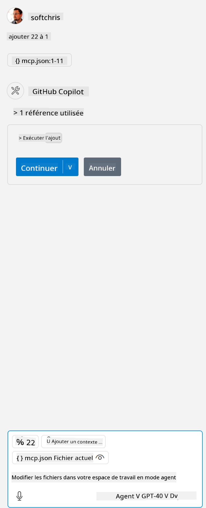

<!--
CO_OP_TRANSLATOR_METADATA:
{
  "original_hash": "8ea28e5e566edd5969337fd0b191ba3f",
  "translation_date": "2025-07-16T21:28:02+00:00",
  "source_file": "03-GettingStarted/04-vscode/README.md",
  "language_code": "fr"
}
-->
# Consommer un serveur depuis le mode Agent de GitHub Copilot

Visual Studio Code et GitHub Copilot peuvent agir comme un client et consommer un serveur MCP. Vous vous demandez peut-être pourquoi faire cela ? Eh bien, cela signifie que toutes les fonctionnalités du serveur MCP peuvent désormais être utilisées directement depuis votre IDE. Imaginez par exemple ajouter le serveur MCP de GitHub, cela permettrait de contrôler GitHub via des invites en langage naturel plutôt que de taper des commandes spécifiques dans le terminal. Ou imaginez tout ce qui pourrait améliorer votre expérience de développeur, contrôlé uniquement par le langage naturel. Vous commencez à voir l’intérêt, non ?

## Vue d’ensemble

Cette leçon explique comment utiliser Visual Studio Code et le mode Agent de GitHub Copilot comme client pour votre serveur MCP.

## Objectifs d’apprentissage

À la fin de cette leçon, vous serez capable de :

- Consommer un serveur MCP via Visual Studio Code.
- Exécuter des fonctionnalités comme des outils via GitHub Copilot.
- Configurer Visual Studio Code pour détecter et gérer votre serveur MCP.

## Utilisation

Vous pouvez contrôler votre serveur MCP de deux manières différentes :

- Interface utilisateur, vous verrez comment faire cela plus tard dans ce chapitre.
- Terminal, il est possible de contrôler le serveur depuis le terminal en utilisant l’exécutable `code` :

  Pour ajouter un serveur MCP à votre profil utilisateur, utilisez l’option en ligne de commande --add-mcp, et fournissez la configuration JSON du serveur sous la forme {\"name\":\"server-name\",\"command\":...}.

  ```
  code --add-mcp "{\"name\":\"my-server\",\"command\": \"uvx\",\"args\": [\"mcp-server-fetch\"]}"
  ```

### Captures d’écran

  
  


Parlons un peu plus de l’utilisation de l’interface visuelle dans les sections suivantes.

## Approche

Voici comment aborder cela à un niveau global :

- Configurer un fichier pour localiser notre serveur MCP.
- Démarrer/Se connecter au serveur pour qu’il liste ses capacités.
- Utiliser ces capacités via l’interface GitHub Copilot Chat.

Parfait, maintenant que nous comprenons le processus, essayons d’utiliser un serveur MCP via Visual Studio Code à travers un exercice.

## Exercice : Consommer un serveur

Dans cet exercice, nous allons configurer Visual Studio Code pour qu’il détecte votre serveur MCP afin de pouvoir l’utiliser depuis l’interface GitHub Copilot Chat.

### -0- Étape préalable, activer la découverte des serveurs MCP

Il se peut que vous deviez activer la découverte des serveurs MCP.

1. Allez dans `Fichier -> Préférences -> Paramètres` dans Visual Studio Code.

1. Recherchez "MCP" et activez `chat.mcp.discovery.enabled` dans le fichier settings.json.

### -1- Créer un fichier de configuration

Commencez par créer un fichier de configuration à la racine de votre projet, vous aurez besoin d’un fichier nommé MCP.json à placer dans un dossier appelé .vscode. Il devrait ressembler à ceci :

```text
.vscode
|-- mcp.json
```

Ensuite, voyons comment ajouter une entrée serveur.

### -2- Configurer un serveur

Ajoutez le contenu suivant dans *mcp.json* :

```json
{
    "inputs": [],
    "servers": {
       "hello-mcp": {
           "command": "node",
           "args": [
               "build/index.js"
           ]
       }
    }
}
```

Voici un exemple simple ci-dessus pour démarrer un serveur écrit en Node.js, pour d’autres environnements d’exécution, indiquez la commande appropriée pour lancer le serveur en utilisant `command` et `args`.

### -3- Démarrer le serveur

Maintenant que vous avez ajouté une entrée, lançons le serveur :

1. Trouvez votre entrée dans *mcp.json* et assurez-vous de voir l’icône "play" :

    

1. Cliquez sur l’icône "play", vous devriez voir l’icône des outils dans GitHub Copilot Chat augmenter le nombre d’outils disponibles. En cliquant sur cette icône, vous verrez la liste des outils enregistrés. Vous pouvez cocher/décocher chaque outil selon que vous souhaitez que GitHub Copilot les utilise comme contexte :

  

1. Pour exécuter un outil, tapez une invite correspondant à la description d’un de vos outils, par exemple une invite comme "add 22 to 1" :

  

  Vous devriez voir une réponse indiquant 23.

## Exercice à faire

Essayez d’ajouter une entrée serveur dans votre fichier *mcp.json* et assurez-vous de pouvoir démarrer/arrêter le serveur. Vérifiez également que vous pouvez communiquer avec les outils de votre serveur via l’interface GitHub Copilot Chat.

## Solution

[Solution](./solution/README.md)

## Points clés à retenir

Les points importants de ce chapitre sont les suivants :

- Visual Studio Code est un excellent client qui vous permet de consommer plusieurs serveurs MCP et leurs outils.
- L’interface GitHub Copilot Chat est le moyen d’interagir avec les serveurs.
- Vous pouvez demander à l’utilisateur des entrées comme des clés API qui peuvent être transmises au serveur MCP lors de la configuration de l’entrée serveur dans le fichier *mcp.json*.

## Exemples

- [Calculatrice Java](../samples/java/calculator/README.md)  
- [Calculatrice .Net](../../../../03-GettingStarted/samples/csharp)  
- [Calculatrice JavaScript](../samples/javascript/README.md)  
- [Calculatrice TypeScript](../samples/typescript/README.md)  
- [Calculatrice Python](../../../../03-GettingStarted/samples/python)

## Ressources supplémentaires

- [Documentation Visual Studio](https://code.visualstudio.com/docs/copilot/chat/mcp-servers)

## Et après ?

- Suivant : [Créer un serveur SSE](../05-sse-server/README.md)

**Avertissement** :  
Ce document a été traduit à l’aide du service de traduction automatique [Co-op Translator](https://github.com/Azure/co-op-translator). Bien que nous nous efforcions d’assurer l’exactitude, veuillez noter que les traductions automatiques peuvent contenir des erreurs ou des inexactitudes. Le document original dans sa langue d’origine doit être considéré comme la source faisant foi. Pour les informations critiques, une traduction professionnelle réalisée par un humain est recommandée. Nous déclinons toute responsabilité en cas de malentendus ou de mauvaises interprétations résultant de l’utilisation de cette traduction.