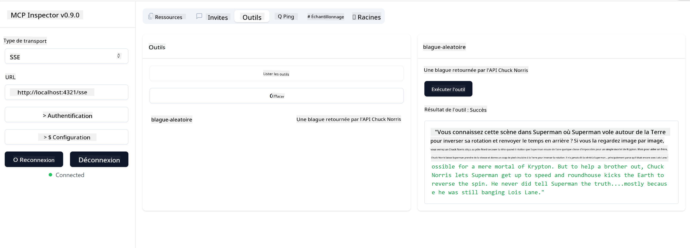

<!--
CO_OP_TRANSLATOR_METADATA:
{
  "original_hash": "3dd2f1e39277c31b0e57e29d165354d6",
  "translation_date": "2025-06-12T21:32:20+00:00",
  "source_file": "03-GettingStarted/05-sse-server/README.md",
  "language_code": "fr"
}
-->
Maintenant que nous en savons un peu plus sur SSE, construisons un serveur SSE.

## Exercice : Créer un serveur SSE

Pour créer notre serveur, il faut garder deux choses à l’esprit :

- Utiliser un serveur web pour exposer des points de terminaison pour la connexion et les messages.
- Construire notre serveur comme d’habitude avec les outils, ressources et invites que nous utilisions avec stdio.

### -1- Créer une instance de serveur

Pour créer notre serveur, nous utilisons les mêmes types qu’avec stdio. Cependant, pour le transport, il faut choisir SSE.

---

Passons maintenant à l’ajout des routes nécessaires.

### -2- Ajouter des routes

Ajoutons des routes qui gèrent la connexion et les messages entrants :

---

Ajoutons ensuite des fonctionnalités au serveur.

### -3- Ajouter des capacités au serveur

Maintenant que tout ce qui est spécifique à SSE est défini, ajoutons des fonctionnalités serveur comme des outils, des invites et des ressources.

---

Votre code complet devrait ressembler à ceci :

---

Super, nous avons un serveur utilisant SSE, testons-le maintenant.

## Exercice : Déboguer un serveur SSE avec Inspector

Inspector est un excellent outil que nous avons vu dans une leçon précédente [Créer votre premier serveur](/03-GettingStarted/01-first-server/README.md). Voyons si nous pouvons utiliser Inspector ici aussi :

### -1- Lancer Inspector

Pour lancer Inspector, vous devez d’abord avoir un serveur SSE en fonctionnement, faisons cela maintenant :

1. Démarrer le serveur

---

1. Lancer Inspector

    > ![NOTE]
    > Exécutez cette commande dans une fenêtre de terminal différente de celle où tourne le serveur. Notez également que vous devez adapter la commande ci-dessous à l’URL où votre serveur est hébergé.

    ```sh
    npx @modelcontextprotocol/inspector --cli http://localhost:8000/sse --method tools/list
    ```

    Lancer Inspector est identique dans tous les environnements d’exécution. Notez qu’au lieu de passer un chemin vers notre serveur et une commande pour le démarrer, on passe ici l’URL où tourne le serveur et on spécifie aussi la route `/sse`.

### -2- Tester l’outil

Connectez-vous au serveur en sélectionnant SSE dans la liste déroulante et renseignez l’URL où votre serveur est actif, par exemple http://localhost:4321/sse. Cliquez ensuite sur le bouton "Connect". Comme précédemment, choisissez de lister les outils, sélectionnez un outil et fournissez les valeurs d’entrée. Vous devriez voir un résultat similaire à l’image ci-dessous :



Parfait, vous pouvez utiliser Inspector, voyons maintenant comment travailler avec Visual Studio Code.

## Travail à faire

Essayez d’enrichir votre serveur avec plus de fonctionnalités. Consultez [cette page](https://api.chucknorris.io/) pour, par exemple, ajouter un outil qui appelle une API. C’est vous qui décidez de l’aspect que doit avoir le serveur. Amusez-vous bien :)

## Solution

[Solution](./solution/README.md) Voici une solution possible avec du code fonctionnel.

## Points clés à retenir

Voici les points essentiels de ce chapitre :

- SSE est le second type de transport supporté après stdio.
- Pour supporter SSE, il faut gérer les connexions entrantes et les messages via un framework web.
- Vous pouvez utiliser à la fois Inspector et Visual Studio Code pour consommer un serveur SSE, tout comme pour les serveurs stdio. Notez cependant quelques différences entre stdio et SSE. Pour SSE, il faut démarrer le serveur séparément puis lancer l’outil Inspector. Pour Inspector, il y a aussi des différences, notamment qu’il faut spécifier l’URL.

## Exemples

- [Calculatrice Java](../samples/java/calculator/README.md)
- [Calculatrice .Net](../../../../03-GettingStarted/samples/csharp)
- [Calculatrice JavaScript](../samples/javascript/README.md)
- [Calculatrice TypeScript](../samples/typescript/README.md)
- [Calculatrice Python](../../../../03-GettingStarted/samples/python)

## Ressources supplémentaires

- [SSE](https://developer.mozilla.org/en-US/docs/Web/API/Server-sent_events)

## Et ensuite

- Suivant : [Streaming HTTP avec MCP (HTTP Streamable)](/03-GettingStarted/06-http-streaming/README.md)

**Avertissement** :  
Ce document a été traduit à l’aide du service de traduction automatique [Co-op Translator](https://github.com/Azure/co-op-translator). Bien que nous nous efforçons d’assurer l’exactitude, veuillez noter que les traductions automatiques peuvent contenir des erreurs ou des inexactitudes. Le document original dans sa langue d’origine doit être considéré comme la source faisant foi. Pour les informations critiques, une traduction professionnelle réalisée par un humain est recommandée. Nous ne sommes pas responsables des malentendus ou des erreurs d’interprétation résultant de l’utilisation de cette traduction.