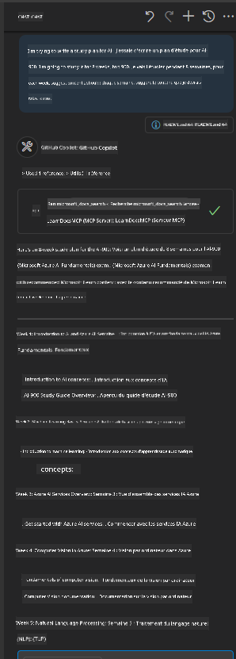

<!--
CO_OP_TRANSLATOR_METADATA:
{
  "original_hash": "4319d291c9d124ecafea52b3d04bfa0e",
  "translation_date": "2025-06-23T10:57:08+00:00",
  "source_file": "09-CaseStudy/docs-mcp/README.md",
  "language_code": "fr"
}
-->
> Pour un guide détaillé avec captures d'écran et instructions étape par étape, consultez le fichier [`README.md`](./solution/scenario3/README.md).

Cette approche est idéale pour tous ceux qui créent des cours techniques, rédigent de la documentation ou développent du code nécessitant des références fréquentes.

## Points clés à retenir

Intégrer la documentation directement dans vos outils n’est pas seulement une commodité — c’est un véritable atout pour la productivité. En vous connectant au serveur Microsoft Learn Docs MCP depuis votre client, vous pouvez :

- Éliminer les changements de contexte entre votre code et la documentation
- Récupérer des documents à jour et adaptés au contexte en temps réel
- Créer des outils de développement plus intelligents et interactifs

Ces compétences vous aideront à concevoir des solutions non seulement efficaces, mais aussi agréables à utiliser.

## Ressources supplémentaires

Pour approfondir vos connaissances, explorez ces ressources officielles :

- [Microsoft Learn Docs MCP Server (GitHub)](https://github.com/MicrosoftDocs/mcp)
- [Commencer avec Azure MCP Server (mcp-python)](https://learn.microsoft.com/en-us/azure/developer/azure-mcp-server/get-started#create-the-python-app)
- [Qu’est-ce que Azure MCP Server ?](https://learn.microsoft.com/en-us/azure/developer/azure-mcp-server/)
- [Introduction au Model Context Protocol (MCP)](https://modelcontextprotocol.io/introduction)
- [Ajouter des plugins depuis un MCP Server (Python)](https://learn.microsoft.com/en-us/semantic-kernel/concepts/plugins/adding-mcp-plugins)

**Avertissement** :  
Ce document a été traduit à l'aide du service de traduction automatique [Co-op Translator](https://github.com/Azure/co-op-translator). Bien que nous nous efforçons d'assurer l'exactitude, veuillez noter que les traductions automatiques peuvent contenir des erreurs ou des inexactitudes. Le document original dans sa langue d'origine doit être considéré comme la source faisant foi. Pour les informations critiques, une traduction professionnelle réalisée par un humain est recommandée. Nous déclinons toute responsabilité en cas de malentendus ou de mauvaises interprétations résultant de l'utilisation de cette traduction.