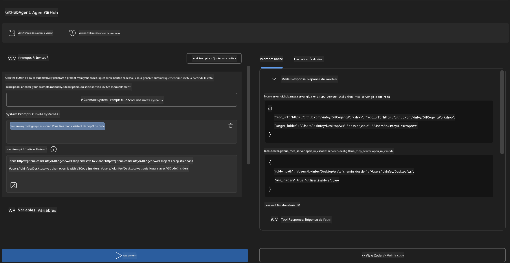
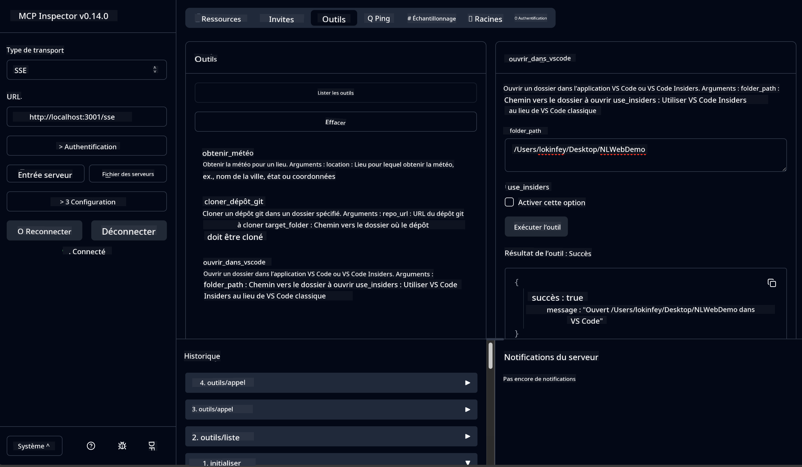

<!--
CO_OP_TRANSLATOR_METADATA:
{
  "original_hash": "f83bc722dc758efffd68667d6a1db470",
  "translation_date": "2025-06-10T06:39:12+00:00",
  "source_file": "10-StreamliningAIWorkflowsBuildingAnMCPServerWithAIToolkit/lab4/README.md",
  "language_code": "fr"
}
-->
# 🐙 Module 4 : Développement pratique MCP - Serveur personnalisé de clonage GitHub


> **⚡ Démarrage rapide :** Construisez un serveur MCP prêt pour la production qui automatise le clonage de dépôts GitHub et l’intégration avec VS Code en seulement 30 minutes !

## 🎯 Objectifs d’apprentissage

À la fin de ce laboratoire, vous serez capable de :

- ✅ Créer un serveur MCP personnalisé pour des workflows de développement concrets  
- ✅ Implémenter la fonctionnalité de clonage de dépôts GitHub via MCP  
- ✅ Intégrer des serveurs MCP personnalisés avec VS Code et Agent Builder  
- ✅ Utiliser GitHub Copilot en Agent Mode avec des outils MCP personnalisés  
- ✅ Tester et déployer des serveurs MCP personnalisés en environnement de production  

## 📋 Prérequis

- Avoir terminé les laboratoires 1 à 3 (fondamentaux MCP et développement avancé)  
- Abonnement GitHub Copilot ([inscription gratuite disponible](https://github.com/github-copilot/signup))  
- VS Code avec les extensions AI Toolkit et GitHub Copilot  
- Git CLI installé et configuré  

## 🏗️ Présentation du projet

### **Défi de développement réel**  
En tant que développeurs, nous utilisons fréquemment GitHub pour cloner des dépôts et les ouvrir dans VS Code ou VS Code Insiders. Ce processus manuel consiste à :  
1. Ouvrir un terminal ou invite de commandes  
2. Se déplacer dans le répertoire souhaité  
3. Exécuter la commande `git clone`  
4. Ouvrir VS Code dans le dossier cloné  

**Notre solution MCP simplifie tout cela en une seule commande intelligente !**

### **Ce que vous allez construire**  
Un **serveur MCP GitHub Clone** (`git_mcp_server`) qui offre :

| Fonctionnalité | Description | Avantage |
|----------------|-------------|----------|
| 🔄 **Clonage intelligent de dépôts** | Cloner des repos GitHub avec validation | Vérification automatique des erreurs |
| 📁 **Gestion intelligente des répertoires** | Vérifie et crée les dossiers en toute sécurité | Évite l’écrasement accidentel |
| 🚀 **Intégration multiplateforme VS Code** | Ouvre les projets dans VS Code/Insiders | Transition fluide dans le workflow |
| 🛡️ **Gestion robuste des erreurs** | Gère les problèmes réseau, permissions et chemins | Fiabilité adaptée à la production |

---

## 📖 Mise en œuvre étape par étape

### Étape 1 : Créer un Agent GitHub dans Agent Builder

1. **Lancez Agent Builder** via l’extension AI Toolkit  
2. **Créez un nouvel agent** avec la configuration suivante :  
   ```
   Agent Name: GitHubAgent
   ```

3. **Initialisez le serveur MCP personnalisé :**  
   - Allez dans **Outils** → **Ajouter un outil** → **Serveur MCP**  
   - Sélectionnez **"Créer un nouveau serveur MCP"**  
   - Choisissez le **modèle Python** pour une flexibilité maximale  
   - **Nom du serveur :** `git_mcp_server`  

### Étape 2 : Configurer GitHub Copilot en Agent Mode

1. **Ouvrez GitHub Copilot** dans VS Code (Ctrl/Cmd + Shift + P → "GitHub Copilot: Open")  
2. **Sélectionnez le modèle d’agent** dans l’interface Copilot  
3. **Choisissez le modèle Claude 3.7** pour des capacités de raisonnement améliorées  
4. **Activez l’intégration MCP** pour accéder aux outils  

> **💡 Astuce de pro :** Claude 3.7 offre une meilleure compréhension des workflows de développement et des modèles de gestion des erreurs.

### Étape 3 : Implémenter les fonctionnalités principales du serveur MCP

**Utilisez la requête détaillée suivante avec GitHub Copilot en Agent Mode :**

```
Create two MCP tools with the following comprehensive requirements:

🔧 TOOL A: clone_repository
Requirements:
- Clone any GitHub repository to a specified local folder
- Return the absolute path of the successfully cloned project
- Implement comprehensive validation:
  ✓ Check if target directory already exists (return error if exists)
  ✓ Validate GitHub URL format (https://github.com/user/repo)
  ✓ Verify git command availability (prompt installation if missing)
  ✓ Handle network connectivity issues
  ✓ Provide clear error messages for all failure scenarios

🚀 TOOL B: open_in_vscode
Requirements:
- Open specified folder in VS Code or VS Code Insiders
- Cross-platform compatibility (Windows/Linux/macOS)
- Use direct application launch (not terminal commands)
- Auto-detect available VS Code installations
- Handle cases where VS Code is not installed
- Provide user-friendly error messages

Additional Requirements:
- Follow MCP 1.9.3 best practices
- Include proper type hints and documentation
- Implement logging for debugging purposes
- Add input validation for all parameters
- Include comprehensive error handling
```

### Étape 4 : Tester votre serveur MCP

#### 4a. Test dans Agent Builder

1. **Lancez la configuration de débogage** dans Agent Builder  
2. **Configurez votre agent avec cette invite système :**

```
SYSTEM_PROMPT:
You are my intelligent coding repository assistant. You help developers efficiently clone GitHub repositories and set up their development environment. Always provide clear feedback about operations and handle errors gracefully.
```

3. **Testez avec des scénarios utilisateur réalistes :**

```
USER_PROMPT EXAMPLES:

Scenario : Basic Clone and Open
"Clone {Your GitHub Repo link such as https://github.com/kinfey/GHCAgentWorkshop
 } and save to {The global path you specify}, then open it with VS Code Insiders"
```



**Résultats attendus :**  
- ✅ Clonage réussi avec confirmation du chemin  
- ✅ Lancement automatique de VS Code  
- ✅ Messages d’erreur clairs en cas de problème  
- ✅ Gestion correcte des cas limites  

#### 4b. Test dans MCP Inspector



---

**🎉 Félicitations !** Vous avez créé avec succès un serveur MCP pratique et prêt pour la production qui répond aux défis réels des workflows de développement. Votre serveur personnalisé de clonage GitHub illustre la puissance de MCP pour automatiser et améliorer la productivité des développeurs.

### 🏆 Récompenses obtenues :  
- ✅ **Développeur MCP** - Serveur MCP personnalisé créé  
- ✅ **Automatiseur de workflows** - Processus de développement simplifiés  
- ✅ **Expert en intégration** - Connexion de plusieurs outils de développement  
- ✅ **Prêt pour la production** - Solutions déployables construites  

---

## 🎓 Fin du workshop : Votre parcours avec Model Context Protocol

**Cher participant au workshop,**

Félicitations pour avoir terminé les quatre modules du workshop Model Context Protocol ! Vous avez parcouru un long chemin, depuis la compréhension des concepts de base de AI Toolkit jusqu’à la création de serveurs MCP prêts pour la production qui répondent à des défis réels de développement.

### 🚀 Récapitulatif de votre parcours d’apprentissage :

**[Module 1](../lab1/README.md)** : Vous avez commencé par explorer les fondamentaux d’AI Toolkit, les tests de modèles, et la création de votre premier agent IA.

**[Module 2](../lab2/README.md)** : Vous avez appris l’architecture MCP, intégré Playwright MCP, et construit votre premier agent d’automatisation navigateur.

**[Module 3](../lab3/README.md)** : Vous êtes passé au développement de serveurs MCP personnalisés avec le serveur Weather MCP et maîtrisé les outils de débogage.

**[Module 4](../lab4/README.md)** : Vous avez appliqué tout cela pour créer un outil pratique d’automatisation de workflow de dépôt GitHub.

### 🌟 Ce que vous avez maîtrisé :

- ✅ **Écosystème AI Toolkit** : Modèles, agents et schémas d’intégration  
- ✅ **Architecture MCP** : Design client-serveur, protocoles de transport et sécurité  
- ✅ **Outils pour développeurs** : Du Playground à l’Inspector jusqu’au déploiement en production  
- ✅ **Développement personnalisé** : Construction, test et déploiement de vos propres serveurs MCP  
- ✅ **Applications pratiques** : Résolution de problèmes réels de workflow avec l’IA  

### 🔮 Vos prochaines étapes :

1. **Construisez votre propre serveur MCP** : Appliquez ces compétences pour automatiser vos workflows uniques  
2. **Rejoignez la communauté MCP** : Partagez vos créations et apprenez des autres  
3. **Explorez l’intégration avancée** : Connectez les serveurs MCP aux systèmes d’entreprise  
4. **Contribuez à l’open source** : Aidez à améliorer les outils MCP et la documentation  

Gardez à l’esprit que ce workshop n’est que le début. L’écosystème Model Context Protocol évolue rapidement, et vous êtes désormais prêt à être à la pointe des outils de développement alimentés par l’IA.

**Merci pour votre participation et votre engagement dans cet apprentissage !**

Nous espérons que ce workshop a suscité des idées qui transformeront votre manière de créer et d’interagir avec les outils IA tout au long de votre parcours de développement.

**Bon codage !**

---

**Avertissement** :  
Ce document a été traduit à l'aide du service de traduction automatique [Co-op Translator](https://github.com/Azure/co-op-translator). Bien que nous nous efforçons d'assurer l'exactitude, veuillez noter que les traductions automatiques peuvent contenir des erreurs ou des inexactitudes. Le document original dans sa langue d'origine doit être considéré comme la source faisant foi. Pour les informations critiques, une traduction professionnelle réalisée par un humain est recommandée. Nous déclinons toute responsabilité en cas de malentendus ou de mauvaises interprétations résultant de l'utilisation de cette traduction.