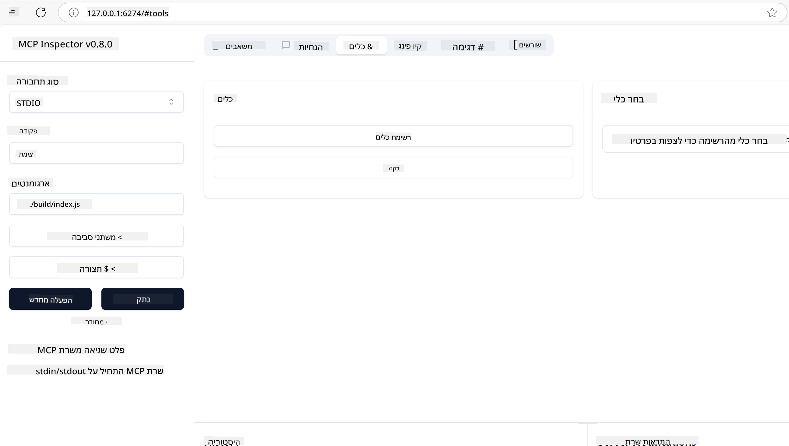

<!--
CO_OP_TRANSLATOR_METADATA:
{
  "original_hash": "d90651bcd1df019768921d531653638a",
  "translation_date": "2025-06-13T00:22:44+00:00",
  "source_file": "03-GettingStarted/01-first-server/README.md",
  "language_code": "he"
}
-->
### -2- יצירת פרויקט

עכשיו כשיש לך את ה-SDK מותקן, בוא ניצור פרויקט בשלב הבא:

### -3- יצירת קבצי הפרויקט

### -4- יצירת קוד השרת

### -5- הוספת כלי ומשאב

הוסף כלי ומשאב על ידי הוספת הקוד הבא:

### -6 קוד סופי

בוא נוסיף את הקוד האחרון הדרוש כדי שהשרת יוכל להתחיל לפעול:

### -7- בדיקת השרת

הפעל את השרת עם הפקודה הבאה:

### -8- הפעלה באמצעות ה-Inspector

ה-Inspector הוא כלי נהדר שיכול להפעיל את השרת שלך ומאפשר לך לתקשר איתו כדי לבדוק שהוא פועל. בוא נתחיל אותו:

> [!NOTE]
> ייתכן שהשדה "command" ייראה שונה כי הוא מכיל את הפקודה להרצת שרת עם סביבת הריצה הספציפית שלך

אתה אמור לראות את ממשק המשתמש הבא:

1. התחבר לשרת על ידי בחירת כפתור Connect  
   ברגע שתתחבר לשרת, תראה את המסך הבא:

   

2. בחר ב-"Tools" ואז ב-"listTools", תראה את האפשרות "Add", בחר ב-"Add" ומלא את ערכי הפרמטרים.

   תראה את התגובה הבאה, כלומר תוצאה מהכלי "add":

   

כל הכבוד, הצלחת ליצור ולהפעיל את השרת הראשון שלך!

### SDKs רשמיים

MCP מספק SDKs רשמיים למספר שפות:
- [C# SDK](https://github.com/modelcontextprotocol/csharp-sdk) - מתוחזק בשיתוף עם Microsoft
- [Java SDK](https://github.com/modelcontextprotocol/java-sdk) - מתוחזק בשיתוף עם Spring AI
- [TypeScript SDK](https://github.com/modelcontextprotocol/typescript-sdk) - המימוש הרשמי של TypeScript
- [Python SDK](https://github.com/modelcontextprotocol/python-sdk) - המימוש הרשמי של Python
- [Kotlin SDK](https://github.com/modelcontextprotocol/kotlin-sdk) - המימוש הרשמי של Kotlin
- [Swift SDK](https://github.com/modelcontextprotocol/swift-sdk) - מתוחזק בשיתוף עם Loopwork AI
- [Rust SDK](https://github.com/modelcontextprotocol/rust-sdk) - המימוש הרשמי של Rust

## נקודות מפתח

- הקמת סביבת פיתוח ל-MCP פשוטה עם SDK ספציפיים לשפות
- בניית שרתי MCP כוללת יצירה ורישום של כלים עם סכימות ברורות
- בדיקה וניפוי שגיאות חיוניים ליישומי MCP אמינים

## דוגמאות

- [Java Calculator](../samples/java/calculator/README.md)
- [.Net Calculator](../../../../03-GettingStarted/samples/csharp)
- [JavaScript Calculator](../samples/javascript/README.md)
- [TypeScript Calculator](../samples/typescript/README.md)
- [Python Calculator](../../../../03-GettingStarted/samples/python)

## מטלה

צור שרת MCP פשוט עם כלי לבחירתך:  
1. מימוש הכלי בשפת התכנות המועדפת עליך (.NET, Java, Python או JavaScript).  
2. הגדר פרמטרי קלט וערכי החזרה.  
3. הפעל את כלי ה-Inspector כדי לוודא שהשרת פועל כראוי.  
4. בדוק את המימוש עם קלטים שונים.

## פתרון

[פתרון](./solution/README.md)

## משאבים נוספים

- [בניית סוכנים באמצעות Model Context Protocol ב-Azure](https://learn.microsoft.com/azure/developer/ai/intro-agents-mcp)
- [MCP מרוחק עם Azure Container Apps (Node.js/TypeScript/JavaScript)](https://learn.microsoft.com/samples/azure-samples/mcp-container-ts/mcp-container-ts/)
- [.NET OpenAI MCP Agent](https://learn.microsoft.com/samples/azure-samples/openai-mcp-agent-dotnet/openai-mcp-agent-dotnet/)

## מה הלאה

הבא: [התחלת עבודה עם לקוחות MCP](/03-GettingStarted/02-client/README.md)

**כתב ויתור**:  
מסמך זה תורגם באמצעות שירות תרגום מבוסס בינה מלאכותית [Co-op Translator](https://github.com/Azure/co-op-translator). למרות שאנו שואפים לדיוק, יש לקחת בחשבון שתרגומים אוטומטיים עלולים להכיל שגיאות או אי-דיוקים. המסמך המקורי בשפת המקור שלו צריך להיחשב כמקור הסמכותי. למידע קריטי מומלץ להשתמש בתרגום מקצועי על ידי אדם. איננו אחראים לכל אי הבנות או פרשנויות שגויות הנובעות משימוש בתרגום זה.