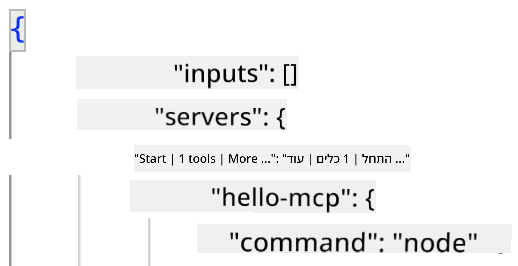

<!--
CO_OP_TRANSLATOR_METADATA:
{
  "original_hash": "0eb9557780cd0a2551cdb8a16c886b51",
  "translation_date": "2025-06-17T15:58:21+00:00",
  "source_file": "03-GettingStarted/04-vscode/README.md",
  "language_code": "he"
}
-->
בוא נדבר יותר על איך להשתמש בממשק הוויזואלי בסעיפים הבאים.

## גישה

ככה צריך לגשת לזה ברמה גבוהה:

- להגדיר קובץ שימצא את שרת ה-MCP שלנו.
- להפעיל/להתחבר לשרת המדובר כדי לקבל ממנו את רשימת היכולות שלו.
- להשתמש ביכולות האלו דרך ממשק השיחה של GitHub Copilot.

מצוין, עכשיו כשאנחנו מבינים את הזרימה, בוא ננסה להשתמש בשרת MCP דרך Visual Studio Code באמצעות תרגיל.

## תרגיל: צריכת שרת

בתרגיל זה, נגדיר את Visual Studio Code כדי שימצא את שרת ה-MCP שלך כך שיוכל לשמש דרך ממשק השיחה של GitHub Copilot.

### -0- שלב מקדים, הפעלת גילוי שרתי MCP

יתכן שתצטרך להפעיל את גילוי שרתי MCP.

1. עבור אל `File -> Preferences -> Settings` in Visual Studio Code.

1. Search for "MCP" and enable `chat.mcp.discovery.enabled` בקובץ settings.json.

### -1- יצירת קובץ קונפיגורציה

התחל ביצירת קובץ קונפיגורציה בשורש הפרויקט שלך, תזדקק לקובץ בשם MCP.json ולמקם אותו בתיקייה בשם .vscode. הוא אמור להיראות כך:

```text
.vscode
|-- mcp.json
```

עכשיו, בוא נראה איך להוסיף רשומת שרת.

### -2- הגדרת שרת

הוסף את התוכן הבא ל-*mcp.json*:

```json
{
    "inputs": [],
    "servers": {
       "hello-mcp": {
           "command": "node",
           "args": [
               "build/index.js"
           ]
       }
    }
}
```

הנה דוגמה פשוטה איך להפעיל שרת שנכתב ב-Node.js, עבור סביבות ריצה אחרות ציין את הפקודה הנכונה להפעלת השרת באמצעות `command` and `args`.

### -3- הפעלת השרת

עכשיו כשהוספת רשומה, בוא נתחיל את השרת:

1. אתר את הרשומה שלך ב-*mcp.json* וודא שאתה רואה את סמל "הפעלה":

    

1. לחץ על סמל "הפעלה", אמור להראות שסמל הכלים בממשק השיחה של GitHub Copilot מראה על מספר כלים זמינים. אם תלחץ על סמל הכלים, תראה רשימה של כלים רשומים. תוכל לסמן או להסיר סימון לכל כלי לפי אם ברצונך ש-GitHub Copilot ישתמש בהם כהקשר:

  

1. כדי להפעיל כלי, הקלד פקודה שאתה יודע שתתאים לתיאור של אחד מהכלים שלך, לדוגמה פקודה כמו "add 22 to 1":

  

  אמור להופיע תגובה שאומרת 23.

## משימה

נסה להוסיף רשומת שרת לקובץ *mcp.json* שלך וודא שאתה יכול להפעיל/לכבות את השרת. וודא גם שאתה יכול לתקשר עם הכלים בשרת שלך דרך ממשק השיחה של GitHub Copilot.

## פתרון

[פתרון](./solution/README.md)

## נקודות מפתח

הנקודות החשובות מהפרק הזה הן:

- Visual Studio Code הוא לקוח מצוין שמאפשר לך לצרוך מספר שרתי MCP וכלים שלהם.
- ממשק השיחה של GitHub Copilot הוא איך אתה מתקשר עם השרתים.
- אתה יכול לבקש מהמשתמש להזין פרטים כמו מפתחות API שניתן להעביר לשרת ה-MCP בעת הגדרת רשומת השרת בקובץ *mcp.json*.

## דוגמאות

- [מחשבון ב-Java](../samples/java/calculator/README.md)
- [מחשבון ב-.Net](../../../../03-GettingStarted/samples/csharp)
- [מחשבון ב-JavaScript](../samples/javascript/README.md)
- [מחשבון ב-TypeScript](../samples/typescript/README.md)
- [מחשבון ב-Python](../../../../03-GettingStarted/samples/python)

## משאבים נוספים

- [מסמכי Visual Studio](https://code.visualstudio.com/docs/copilot/chat/mcp-servers)

## מה הלאה

- הבא: [יצירת שרת SSE](/03-GettingStarted/05-sse-server/README.md)

**כתב ויתור**:  
מסמך זה תורגם באמצעות שירות תרגום מבוסס בינה מלאכותית [Co-op Translator](https://github.com/Azure/co-op-translator). למרות שאנו שואפים לדיוק, יש לקחת בחשבון כי תרגומים אוטומטיים עלולים להכיל שגיאות או אי-דיוקים. יש להתייחס למסמך המקורי בשפתו כאל המקור הסמכותי. עבור מידע קריטי מומלץ להיעזר בתרגום מקצועי שנעשה על ידי אדם. אנו לא אחראים לכל אי-הבנה או פרשנות שגויה הנובעת משימוש בתרגום זה.