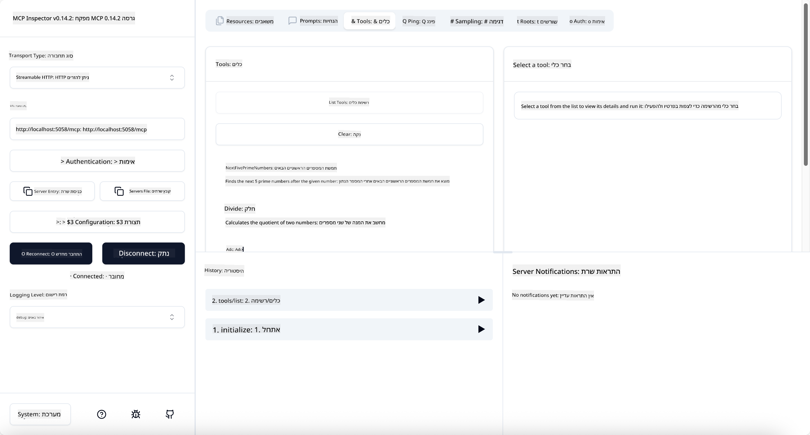

<!--
CO_OP_TRANSLATOR_METADATA:
{
  "original_hash": "0bc7bd48f55f1565f1d95ccb2c16f728",
  "translation_date": "2025-06-18T07:51:37+00:00",
  "source_file": "04-PracticalImplementation/samples/csharp/README.md",
  "language_code": "he"
}
-->
# דוגמה

הדוגמה הקודמת מראה כיצד להשתמש בפרויקט .NET מקומי עם הסוג `stdio`. ואיך להריץ את השרת באופן מקומי בתוך קונטיינר. זו פתרון טוב במצבים רבים. עם זאת, יכול להיות שימושי להפעיל את השרת מרחוק, כמו בסביבת ענן. כאן נכנס הסוג `http` לתמונה.

כשמסתכלים על הפתרון בתיקייה `04-PracticalImplementation`, זה עשוי להיראות מורכב יותר מהקודם. אבל במציאות, זה לא כך. אם תסתכלו מקרוב על הפרויקט `src/Calculator`, תראו שזה בעיקר אותו קוד כמו בדוגמה הקודמת. ההבדל היחיד הוא שאנחנו משתמשים בספרייה שונה `ModelContextProtocol.AspNetCore` לטיפול בבקשות HTTP. ושינינו את המתודה `IsPrime` כדי שתהיה פרטית, רק כדי להראות שאפשר להחזיק מתודות פרטיות בקוד שלכם. שאר הקוד זהה לקודם.

הפרויקטים האחרים הם מ-[.NET Aspire](https://learn.microsoft.com/dotnet/aspire/get-started/aspire-overview). הכנסת .NET Aspire לפתרון תשפר את חוויית המפתח בזמן הפיתוח והבדיקות ותסייע בנראות. זה לא חובה כדי להפעיל את השרת, אבל זו פרקטיקה טובה לכלול אותו בפתרון שלכם.

## הפעלת השרת מקומית

1. מ-VS Code (עם התוסף C# DevKit), עברו לתיקייה `04-PracticalImplementation/samples/csharp`.
1. הריצו את הפקודה הבאה כדי להפעיל את השרת:

   ```bash
    dotnet watch run --project ./src/AppHost
   ```

1. כשדפדפן אינטרנט יפתח את לוח הבקרה של .NET Aspire, שימו לב לכתובת ה-`http`. היא אמורה להיות משהו כמו `http://localhost:5058/`.

   

## בדיקת Streamable HTTP עם MCP Inspector

אם יש לכם Node.js בגרסה 22.7.5 ומעלה, תוכלו להשתמש ב-MCP Inspector כדי לבדוק את השרת שלכם.

הפעילו את השרת והריצו את הפקודה הבאה בטרמינל:

```bash
npx @modelcontextprotocol/inspector http://localhost:5058
```



- בחרו ב-`Streamable HTTP` as the Transport type.
- In the Url field, enter the URL of the server noted earlier, and append `/mcp`. היא אמורה להיות `http` (ולא `https`) something like `http://localhost:5058/mcp`.
- select the Connect button.

A nice thing about the Inspector is that it provide a nice visibility on what is happening.

- Try listing the available tools
- Try some of them, it should works just like before.

## Test MCP Server with GitHub Copilot Chat in VS Code

To use the Streamable HTTP transport with GitHub Copilot Chat, change the configuration of the `calc-mcp`) השרת שנוצר קודם, כדי להיראות כך:

```jsonc
// .vscode/mcp.json
{
  "servers": {
    "calc-mcp": {
      "type": "http",
      "url": "http://localhost:5058/mcp"
    }
  }
}
```

בצעו כמה בדיקות:

- בקשו "3 מספרים ראשוניים אחרי 6780". שימו לב איך Copilot ישתמש בכלים החדשים `NextFivePrimeNumbers` ויחזיר רק את שלושת המספרים הראשוניים הראשונים.
- בקשו "7 מספרים ראשוניים אחרי 111", כדי לראות מה קורה.
- בקשו "לג'ון יש 24 סוכריות והוא רוצה לחלק אותן ל-3 הילדים שלו. כמה סוכריות יש לכל ילד?", כדי לראות מה קורה.

## פריסת השרת ל-Azure

בואו נפרוס את השרת ל-Azure כדי שיותר אנשים יוכלו להשתמש בו.

מהטרמינל, עברו לתיקייה `04-PracticalImplementation/samples/csharp` והריצו את הפקודה הבאה:

```bash
azd up
```

בסיום הפריסה, אמור להופיע הודעה כזו:


קחו את הכתובת והשתמשו בה ב-MCP Inspector וב-GitHub Copilot Chat.

```jsonc
// .vscode/mcp.json
{
  "servers": {
    "calc-mcp": {
      "type": "http",
      "url": "https://calc-mcp.gentleriver-3977fbcf.australiaeast.azurecontainerapps.io/mcp"
    }
  }
}
```

## מה הלאה?

ננסה סוגי תחבורה וכלי בדיקה שונים. גם נפרוס את שרת ה-MCP שלכם ל-Azure. אבל מה אם השרת שלנו צריך גישה למשאבים פרטיים? למשל, מסד נתונים או API פרטי? בפרק הבא נראה איך אפשר לשפר את אבטחת השרת שלנו.

**כתב ויתור**:  
מסמך זה תורגם באמצעות שירות תרגום מבוסס בינה מלאכותית [Co-op Translator](https://github.com/Azure/co-op-translator). למרות שאנו שואפים לדיוק, יש לקחת בחשבון כי תרגומים אוטומטיים עלולים להכיל שגיאות או אי-דיוקים. יש להתייחס למסמך המקורי בשפתו המקורית כמקור הסמכותי. עבור מידע קריטי מומלץ להיעזר בתרגום מקצועי על ידי אדם. אנו לא נושאים באחריות לכל אי-הבנה או פרשנות שגויה הנובעים מהשימוש בתרגום זה.