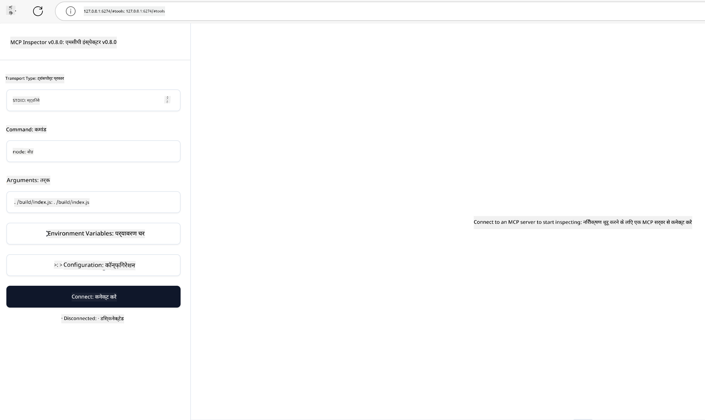

<!--
CO_OP_TRANSLATOR_METADATA:
{
  "original_hash": "315ecce765d22639b60dbc41344c8533",
  "translation_date": "2025-07-09T23:00:55+00:00",
  "source_file": "03-GettingStarted/01-first-server/README.md",
  "language_code": "hi"
}
-->
### -2- प्रोजेक्ट बनाएं

अब जब आपका SDK इंस्टॉल हो चुका है, तो अगला कदम प्रोजेक्ट बनाना है:

### -3- प्रोजेक्ट फाइलें बनाएं

### -4- सर्वर कोड बनाएं

### -5- एक टूल और एक रिसोर्स जोड़ना

निम्नलिखित कोड जोड़कर एक टूल और एक रिसोर्स जोड़ें:

### -6 अंतिम कोड

आइए वह अंतिम कोड जोड़ते हैं जिसकी जरूरत है ताकि सर्वर शुरू हो सके:

### -7- सर्वर का परीक्षण करें

निम्नलिखित कमांड के साथ सर्वर शुरू करें:

### -8- इंस्पेक्टर का उपयोग करके चलाएं

इंस्पेक्टर एक बेहतरीन टूल है जो आपके सर्वर को शुरू करता है और आपको इसके साथ इंटरैक्ट करने देता है ताकि आप यह जांच सकें कि यह सही काम कर रहा है। आइए इसे शुरू करें:
> [!NOTE]
> "command" फ़ील्ड में यह अलग दिख सकता है क्योंकि इसमें आपके विशिष्ट रनटाइम के साथ सर्वर चलाने का कमांड होता है।
आपको निम्नलिखित उपयोगकर्ता इंटरफ़ेस दिखाई देना चाहिए:

1. Connect बटन चुनकर सर्वर से कनेक्ट करें  
  एक बार जब आप सर्वर से कनेक्ट हो जाते हैं, तो आपको अब निम्नलिखित दिखाई देगा:

  

1. "Tools" और "listTools" चुनें, आपको "Add" दिखाई देगा, "Add" चुनें और पैरामीटर मान भरें।

  आपको निम्नलिखित प्रतिक्रिया दिखाई देगी, यानी "add" टूल से परिणाम:

  

बधाई हो, आपने अपना पहला सर्वर सफलतापूर्वक बनाया और चलाया है!

### Official SDKs

MCP कई भाषाओं के लिए आधिकारिक SDK प्रदान करता है:

- [C# SDK](https://github.com/modelcontextprotocol/csharp-sdk) - Microsoft के सहयोग से मेंटेन किया गया
- [Java SDK](https://github.com/modelcontextprotocol/java-sdk) - Spring AI के सहयोग से मेंटेन किया गया
- [TypeScript SDK](https://github.com/modelcontextprotocol/typescript-sdk) - आधिकारिक TypeScript इम्प्लीमेंटेशन
- [Python SDK](https://github.com/modelcontextprotocol/python-sdk) - आधिकारिक Python इम्प्लीमेंटेशन
- [Kotlin SDK](https://github.com/modelcontextprotocol/kotlin-sdk) - आधिकारिक Kotlin इम्प्लीमेंटेशन
- [Swift SDK](https://github.com/modelcontextprotocol/swift-sdk) - Loopwork AI के सहयोग से मेंटेन किया गया
- [Rust SDK](https://github.com/modelcontextprotocol/rust-sdk) - आधिकारिक Rust इम्प्लीमेंटेशन

## मुख्य बातें

- भाषा-विशिष्ट SDK के साथ MCP विकास पर्यावरण सेटअप करना सरल है
- MCP सर्वर बनाने में स्पष्ट स्कीमाओं के साथ टूल बनाना और रजिस्टर करना शामिल है
- विश्वसनीय MCP इम्प्लीमेंटेशन के लिए परीक्षण और डिबगिंग आवश्यक हैं

## नमूने

- [Java Calculator](../samples/java/calculator/README.md)
- [.Net Calculator](../../../../03-GettingStarted/samples/csharp)
- [JavaScript Calculator](../samples/javascript/README.md)
- [TypeScript Calculator](../samples/typescript/README.md)
- [Python Calculator](../../../../03-GettingStarted/samples/python)

## असाइनमेंट

अपनी पसंद के टूल के साथ एक सरल MCP सर्वर बनाएं:

1. अपने पसंदीदा भाषा (.NET, Java, Python, या JavaScript) में टूल को इम्प्लीमेंट करें।
2. इनपुट पैरामीटर और रिटर्न मान परिभाषित करें।
3. सुनिश्चित करने के लिए inspector टूल चलाएं कि सर्वर सही काम कर रहा है।
4. विभिन्न इनपुट के साथ इम्प्लीमेंटेशन का परीक्षण करें।

## समाधान

[Solution](./solution/README.md)

## अतिरिक्त संसाधन

- [Azure पर Model Context Protocol का उपयोग करके एजेंट बनाएं](https://learn.microsoft.com/azure/developer/ai/intro-agents-mcp)
- [Azure Container Apps के साथ Remote MCP (Node.js/TypeScript/JavaScript)](https://learn.microsoft.com/samples/azure-samples/mcp-container-ts/mcp-container-ts/)
- [.NET OpenAI MCP Agent](https://learn.microsoft.com/samples/azure-samples/openai-mcp-agent-dotnet/openai-mcp-agent-dotnet/)

## आगे क्या

अगला: [MCP Clients के साथ शुरुआत](../02-client/README.md)

**अस्वीकरण**:  
यह दस्तावेज़ AI अनुवाद सेवा [Co-op Translator](https://github.com/Azure/co-op-translator) का उपयोग करके अनुवादित किया गया है। जबकि हम सटीकता के लिए प्रयासरत हैं, कृपया ध्यान दें कि स्वचालित अनुवादों में त्रुटियाँ या अशुद्धियाँ हो सकती हैं। मूल दस्तावेज़ अपनी मूल भाषा में ही अधिकारिक स्रोत माना जाना चाहिए। महत्वपूर्ण जानकारी के लिए, पेशेवर मानव अनुवाद की सलाह दी जाती है। इस अनुवाद के उपयोग से उत्पन्न किसी भी गलतफहमी या गलत व्याख्या के लिए हम जिम्मेदार नहीं हैं।