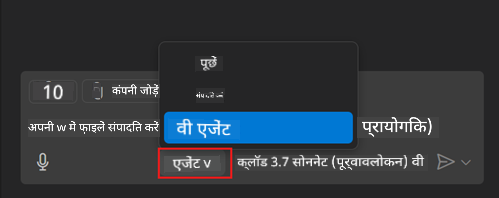
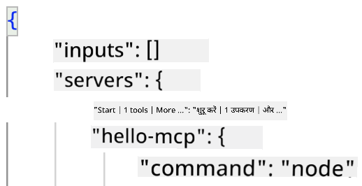
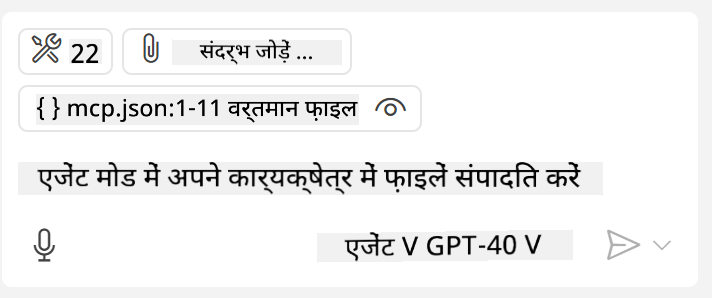

<!--
CO_OP_TRANSLATOR_METADATA:
{
  "original_hash": "8ea28e5e566edd5969337fd0b191ba3f",
  "translation_date": "2025-07-16T22:52:13+00:00",
  "source_file": "03-GettingStarted/04-vscode/README.md",
  "language_code": "hi"
}
-->
# GitHub Copilot Agent मोड से सर्वर का उपयोग करना

Visual Studio Code और GitHub Copilot एक क्लाइंट के रूप में काम कर सकते हैं और MCP Server का उपयोग कर सकते हैं। आप सोच सकते हैं कि ऐसा क्यों करना चाहिए? इसका मतलब है कि MCP Server की जो भी सुविधाएँ हैं, उन्हें अब आपके IDE के अंदर से इस्तेमाल किया जा सकता है। उदाहरण के लिए, अगर आप GitHub का MCP सर्वर जोड़ते हैं, तो यह टर्मिनल में विशिष्ट कमांड टाइप करने के बजाय प्रॉम्प्ट के जरिए GitHub को नियंत्रित करने की अनुमति देगा। या फिर कोई भी ऐसी चीज़ जो आपके डेवलपर अनुभव को बेहतर बना सके, वह प्राकृतिक भाषा के माध्यम से नियंत्रित हो सके। अब आप समझ रहे होंगे कि इसका फायदा क्या है, है ना?

## अवलोकन

यह पाठ Visual Studio Code और GitHub Copilot के Agent मोड को आपके MCP Server के क्लाइंट के रूप में उपयोग करने के बारे में है।

## सीखने के उद्देश्य

इस पाठ के अंत तक, आप सक्षम होंगे:

- Visual Studio Code के माध्यम से MCP Server का उपयोग करना।
- GitHub Copilot के जरिए टूल्स जैसी क्षमताओं को चलाना।
- Visual Studio Code को कॉन्फ़िगर करना ताकि वह आपके MCP Server को खोज सके और प्रबंधित कर सके।

## उपयोग

आप अपने MCP सर्वर को दो तरीकों से नियंत्रित कर सकते हैं:

- यूजर इंटरफेस, जिसे आप इस अध्याय के बाद के हिस्सों में देखेंगे।
- टर्मिनल, टर्मिनल से `code` executable का उपयोग करके चीज़ों को नियंत्रित करना संभव है:

  अपने यूजर प्रोफ़ाइल में MCP सर्वर जोड़ने के लिए, --add-mcp कमांड लाइन विकल्प का उपयोग करें, और JSON सर्वर कॉन्फ़िगरेशन इस रूप में प्रदान करें: {\"name\":\"server-name\",\"command\":...}।

  ```
  code --add-mcp "{\"name\":\"my-server\",\"command\": \"uvx\",\"args\": [\"mcp-server-fetch\"]}"
  ```

### स्क्रीनशॉट्स

  
  


आइए अगले हिस्सों में विज़ुअल इंटरफेस के उपयोग के बारे में और बात करें।

## दृष्टिकोण

उच्च स्तर पर हमें इसे इस तरह से करना होगा:

- एक फ़ाइल कॉन्फ़िगर करें ताकि हमारा MCP Server मिल सके।
- उक्त सर्वर को शुरू करें/कनेक्ट करें ताकि वह अपनी क्षमताओं की सूची दिखा सके।
- GitHub Copilot Chat इंटरफेस के माध्यम से इन क्षमताओं का उपयोग करें।

बहुत बढ़िया, अब जब हमें प्रक्रिया समझ आ गई है, तो चलिए एक अभ्यास के जरिए Visual Studio Code के माध्यम से MCP Server का उपयोग करते हैं।

## अभ्यास: सर्वर का उपयोग करना

इस अभ्यास में, हम Visual Studio Code को कॉन्फ़िगर करेंगे ताकि वह आपका MCP सर्वर खोज सके और GitHub Copilot Chat इंटरफेस से इसका उपयोग कर सके।

### -0- प्रारंभिक चरण, MCP Server खोज सक्षम करें

आपको MCP Servers की खोज सक्षम करनी पड़ सकती है।

1. Visual Studio Code में `File -> Preferences -> Settings` पर जाएं।

1. "MCP" खोजें और settings.json फ़ाइल में `chat.mcp.discovery.enabled` को सक्षम करें।

### -1- कॉन्फ़िग फ़ाइल बनाएं

अपने प्रोजेक्ट रूट में एक कॉन्फ़िग फ़ाइल बनाएं, आपको MCP.json नाम की फ़ाइल बनानी होगी और इसे .vscode नाम के फोल्डर में रखना होगा। यह कुछ इस तरह दिखनी चाहिए:

```text
.vscode
|-- mcp.json
```

अब देखते हैं कि सर्वर एंट्री कैसे जोड़ें।

### -2- सर्वर कॉन्फ़िगर करें

* mcp.json* में निम्नलिखित सामग्री जोड़ें:

```json
{
    "inputs": [],
    "servers": {
       "hello-mcp": {
           "command": "node",
           "args": [
               "build/index.js"
           ]
       }
    }
}
```

ऊपर एक सरल उदाहरण है कि Node.js में लिखा गया सर्वर कैसे शुरू करें, अन्य रनटाइम्स के लिए `command` और `args` का उपयोग करके सर्वर शुरू करने के लिए सही कमांड बताएं।

### -3- सर्वर शुरू करें

अब जब आपने एंट्री जोड़ दी है, तो चलिए सर्वर शुरू करते हैं:

1. *mcp.json* में अपनी एंट्री ढूंढें और सुनिश्चित करें कि आपको "play" आइकन दिख रहा है:

    

1. "play" आइकन पर क्लिक करें, आपको GitHub Copilot Chat में टूल्स आइकन में उपलब्ध टूल्स की संख्या बढ़ती हुई दिखनी चाहिए। यदि आप उस टूल्स आइकन पर क्लिक करते हैं, तो आपको पंजीकृत टूल्स की सूची दिखेगी। आप प्रत्येक टूल को चेक/अनचेक कर सकते हैं कि आप GitHub Copilot को उन्हें संदर्भ के रूप में उपयोग करने देना चाहते हैं या नहीं:

  

1. किसी टूल को चलाने के लिए, ऐसा प्रॉम्प्ट टाइप करें जो आपके टूल के विवरण से मेल खाता हो, उदाहरण के लिए "add 22 to 1" जैसा प्रॉम्प्ट:

  

  आपको 23 का उत्तर दिखाई देना चाहिए।

## असाइनमेंट

अपने *mcp.json* फ़ाइल में एक सर्वर एंट्री जोड़ने का प्रयास करें और सुनिश्चित करें कि आप सर्वर को शुरू/रोक सकते हैं। यह भी सुनिश्चित करें कि आप GitHub Copilot Chat इंटरफेस के माध्यम से अपने सर्वर के टूल्स के साथ संवाद कर सकते हैं।

## समाधान

[Solution](./solution/README.md)

## मुख्य बातें

इस अध्याय से मुख्य बातें निम्नलिखित हैं:

- Visual Studio Code एक बेहतरीन क्लाइंट है जो आपको कई MCP Servers और उनके टूल्स का उपयोग करने देता है।
- GitHub Copilot Chat इंटरफेस के माध्यम से आप सर्वरों के साथ इंटरैक्ट करते हैं।
- आप उपयोगकर्ता से API keys जैसे इनपुट मांग सकते हैं, जिन्हें *mcp.json* फ़ाइल में सर्वर एंट्री कॉन्फ़िगर करते समय MCP Server को पास किया जा सकता है।

## नमूने

- [Java Calculator](../samples/java/calculator/README.md)  
- [.Net Calculator](../../../../03-GettingStarted/samples/csharp)  
- [JavaScript Calculator](../samples/javascript/README.md)  
- [TypeScript Calculator](../../../../03-GettingStarted/samples/typescript)  
- [Python Calculator](../../../../03-GettingStarted/samples/python)

## अतिरिक्त संसाधन

- [Visual Studio docs](https://code.visualstudio.com/docs/copilot/chat/mcp-servers)

## आगे क्या है

- अगला: [Creating an SSE Server](../05-sse-server/README.md)

**अस्वीकरण**:  
यह दस्तावेज़ AI अनुवाद सेवा [Co-op Translator](https://github.com/Azure/co-op-translator) का उपयोग करके अनुवादित किया गया है। जबकि हम सटीकता के लिए प्रयासरत हैं, कृपया ध्यान दें कि स्वचालित अनुवादों में त्रुटियाँ या अशुद्धियाँ हो सकती हैं। मूल दस्तावेज़ अपनी मूल भाषा में ही अधिकारिक स्रोत माना जाना चाहिए। महत्वपूर्ण जानकारी के लिए, पेशेवर मानव अनुवाद की सलाह दी जाती है। इस अनुवाद के उपयोग से उत्पन्न किसी भी गलतफहमी या गलत व्याख्या के लिए हम जिम्मेदार नहीं हैं।