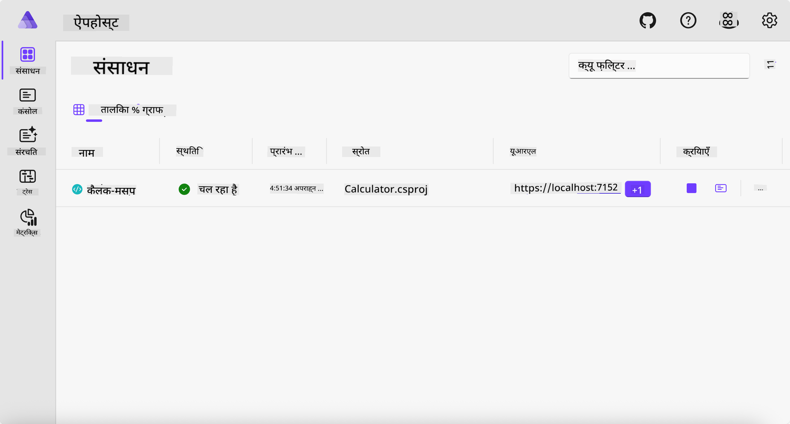
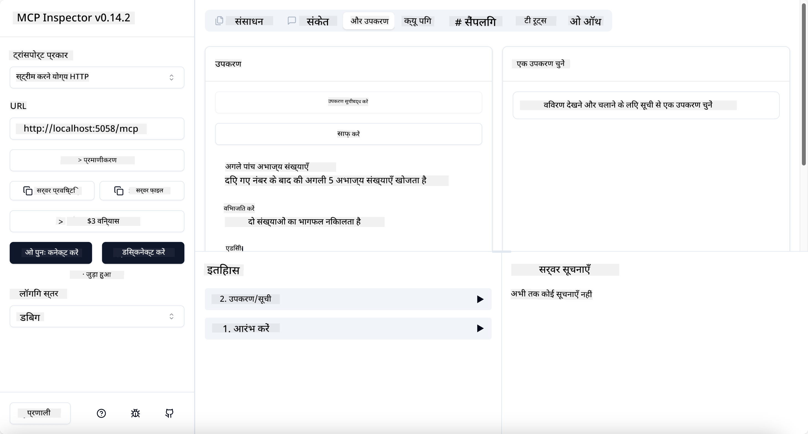

<!--
CO_OP_TRANSLATOR_METADATA:
{
  "original_hash": "0bc7bd48f55f1565f1d95ccb2c16f728",
  "translation_date": "2025-06-18T07:48:17+00:00",
  "source_file": "04-PracticalImplementation/samples/csharp/README.md",
  "language_code": "hi"
}
-->
# Sample

पिछले उदाहरण में दिखाया गया है कि स्थानीय .NET प्रोजेक्ट को `stdio` प्रकार के साथ कैसे उपयोग किया जाता है। और कैसे कंटेनर में सर्वर को स्थानीय रूप से चलाया जाता है। यह कई परिस्थितियों में एक अच्छा समाधान है। हालांकि, यह उपयोगी हो सकता है कि सर्वर दूरस्थ रूप से चले, जैसे कि क्लाउड वातावरण में। यही वह जगह है जहां `http` प्रकार काम आता है।

`04-PracticalImplementation` फ़ोल्डर में समाधान को देखने पर, यह पिछले उदाहरण की तुलना में कहीं अधिक जटिल लग सकता है। लेकिन वास्तव में ऐसा नहीं है। यदि आप प्रोजेक्ट `src/Calculator` को ध्यान से देखें, तो आप पाएंगे कि यह ज्यादातर वही कोड है जो पिछले उदाहरण में था। एकमात्र अंतर यह है कि हम HTTP अनुरोधों को संभालने के लिए एक अलग लाइब्रेरी `ModelContextProtocol.AspNetCore` का उपयोग कर रहे हैं। और हमने मेथड `IsPrime` को प्राइवेट बनाया है, केवल यह दिखाने के लिए कि आपके कोड में प्राइवेट मेथड्स भी हो सकते हैं। बाकी कोड पहले जैसा ही है।

अन्य प्रोजेक्ट [.NET Aspire](https://learn.microsoft.com/dotnet/aspire/get-started/aspire-overview) से हैं। समाधान में .NET Aspire होने से डेवलपर का अनुभव बेहतर होता है, विकास और परीक्षण के दौरान मदद मिलती है और अवलोकनीयता में सुधार होता है। सर्वर चलाने के लिए यह आवश्यक नहीं है, लेकिन इसे अपने समाधान में रखना एक अच्छी प्रैक्टिस है।

## सर्वर को स्थानीय रूप से शुरू करें

1. VS Code (C# DevKit एक्सटेंशन के साथ) से, `04-PracticalImplementation/samples/csharp` डायरेक्टरी पर जाएं।
1. सर्वर शुरू करने के लिए निम्न कमांड चलाएं:

   ```bash
    dotnet watch run --project ./src/AppHost
   ```

1. जब कोई वेब ब्राउज़र .NET Aspire डैशबोर्ड खोलता है, तो `http` URL नोट करें। यह कुछ इस तरह होना चाहिए: `http://localhost:5058/`।

   

## MCP इंस्पेक्टर के साथ Streamable HTTP का परीक्षण करें

यदि आपके पास Node.js 22.7.5 या उससे ऊपर का संस्करण है, तो आप MCP इंस्पेक्टर का उपयोग करके अपने सर्वर का परीक्षण कर सकते हैं।

सर्वर शुरू करें और टर्मिनल में निम्न कमांड चलाएं:

```bash
npx @modelcontextprotocol/inspector http://localhost:5058
```



- `Streamable HTTP` as the Transport type.
- In the Url field, enter the URL of the server noted earlier, and append `/mcp` चुनें। यह `http` होना चाहिए (न कि `https`) something like `http://localhost:5058/mcp`.
- select the Connect button.

A nice thing about the Inspector is that it provide a nice visibility on what is happening.

- Try listing the available tools
- Try some of them, it should works just like before.

## Test MCP Server with GitHub Copilot Chat in VS Code

To use the Streamable HTTP transport with GitHub Copilot Chat, change the configuration of the `calc-mcp` सर्वर जो पहले बनाया गया था, ऐसा दिखने के लिए:

```jsonc
// .vscode/mcp.json
{
  "servers": {
    "calc-mcp": {
      "type": "http",
      "url": "http://localhost:5058/mcp"
    }
  }
}
```

कुछ परीक्षण करें:

- "6780 के बाद के 3 प्रमुख संख्याएँ" पूछें। देखें कि Copilot नए टूल्स `NextFivePrimeNumbers` का उपयोग कैसे करता है और केवल पहले 3 प्रमुख संख्याएँ लौटाता है।
- "111 के बाद के 7 प्रमुख संख्याएँ" पूछें, यह देखने के लिए कि क्या होता है।
- "जॉन के पास 24 लॉलीज़ हैं और वह उन्हें अपने 3 बच्चों में समान रूप से बाँटना चाहता है। प्रत्येक बच्चे के पास कितनी लॉलीज़ होंगी?" पूछें, यह देखने के लिए कि क्या होता है।

## सर्वर को Azure पर तैनात करें

आइए सर्वर को Azure पर तैनात करें ताकि अधिक लोग इसका उपयोग कर सकें।

टर्मिनल से, `04-PracticalImplementation/samples/csharp` फ़ोल्डर में जाएं और निम्न कमांड चलाएं:

```bash
azd up
```

तैनाती समाप्त होने पर, आपको इस तरह का संदेश दिखाई देगा:


URL लें और MCP इंस्पेक्टर तथा GitHub Copilot Chat में इसका उपयोग करें।

```jsonc
// .vscode/mcp.json
{
  "servers": {
    "calc-mcp": {
      "type": "http",
      "url": "https://calc-mcp.gentleriver-3977fbcf.australiaeast.azurecontainerapps.io/mcp"
    }
  }
}
```

## आगे क्या?

हम विभिन्न ट्रांसपोर्ट प्रकारों और परीक्षण उपकरणों को आजमाते हैं। हम आपका MCP सर्वर Azure पर भी तैनात करते हैं। लेकिन अगर हमारे सर्वर को निजी संसाधनों तक पहुंच की जरूरत हो? उदाहरण के लिए, कोई डेटाबेस या निजी API? अगले अध्याय में, हम देखेंगे कि हम अपने सर्वर की सुरक्षा को कैसे बेहतर बना सकते हैं।

**अस्वीकरण**:  
यह दस्तावेज़ AI अनुवाद सेवा [Co-op Translator](https://github.com/Azure/co-op-translator) का उपयोग करके अनुवादित किया गया है। जबकि हम सटीकता के लिए प्रयासरत हैं, कृपया ध्यान रखें कि स्वचालित अनुवादों में त्रुटियाँ या अशुद्धियाँ हो सकती हैं। मूल दस्तावेज़ अपनी मूल भाषा में ही प्रामाणिक स्रोत माना जाना चाहिए। महत्वपूर्ण जानकारी के लिए, पेशेवर मानव अनुवाद की सिफारिश की जाती है। इस अनुवाद के उपयोग से उत्पन्न किसी भी गलतफहमी या गलत व्याख्या के लिए हम जिम्मेदार नहीं हैं।