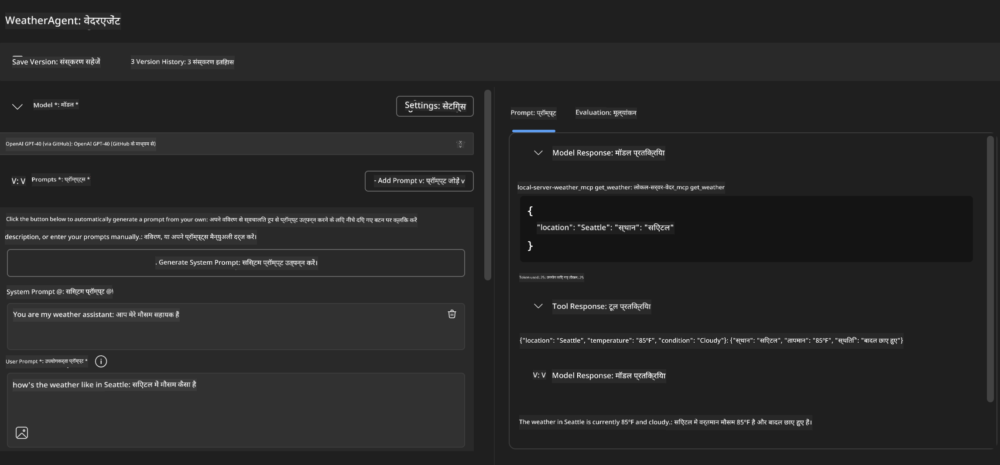
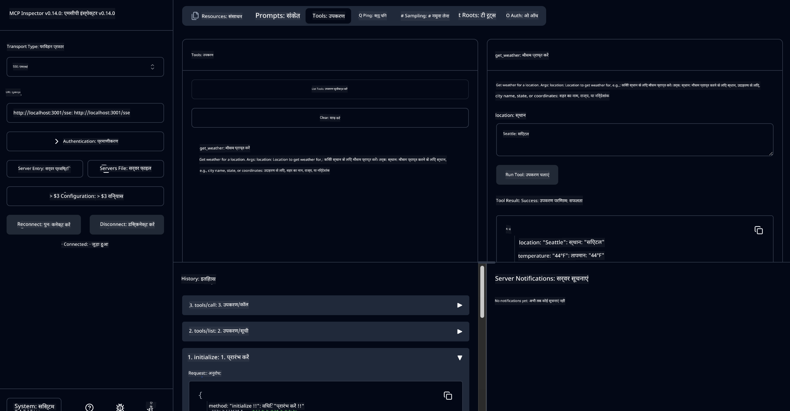

<!--
CO_OP_TRANSLATOR_METADATA:
{
  "original_hash": "dd8da3f75addcef453fe11f02a270217",
  "translation_date": "2025-06-10T06:06:56+00:00",
  "source_file": "10-StreamliningAIWorkflowsBuildingAnMCPServerWithAIToolkit/lab3/README.md",
  "language_code": "hi"
}
-->
# 🔧 Module 3: AI Toolkit के साथ Advanced MCP Development


## 🎯 सीखने के उद्देश्य

इस लैब के अंत तक, आप सक्षम होंगे:

- ✅ AI Toolkit का उपयोग करके कस्टम MCP सर्वर बनाना
- ✅ नवीनतम MCP Python SDK (v1.9.3) को कॉन्फ़िगर और उपयोग करना
- ✅ MCP Inspector को सेटअप कर के डिबगिंग करना
- ✅ Agent Builder और Inspector दोनों वातावरण में MCP सर्वरों का डिबग करना
- ✅ उन्नत MCP सर्वर विकास वर्कफ़्लो को समझना

## 📋 पूर्व आवश्यकताएँ

- Lab 2 (MCP Fundamentals) पूरा किया हुआ होना चाहिए
- AI Toolkit एक्सटेंशन के साथ VS Code इंस्टॉल हो
- Python 3.10+ का वातावरण
- Inspector सेटअप के लिए Node.js और npm

## 🏗️ आप क्या बनाएंगे

इस लैब में, आप एक **Weather MCP Server** बनाएंगे जो दिखाता है:
- कस्टम MCP सर्वर का निर्माण
- AI Toolkit Agent Builder के साथ इंटीग्रेशन
- पेशेवर डिबगिंग वर्कफ़्लो
- आधुनिक MCP SDK उपयोग के तरीके

---

## 🔧 मुख्य घटकों का अवलोकन

### 🐍 MCP Python SDK
Model Context Protocol Python SDK कस्टम MCP सर्वर बनाने की नींव प्रदान करता है। आप संस्करण 1.9.3 का उपयोग करेंगे जिसमें बेहतर डिबगिंग क्षमताएं हैं।

### 🔍 MCP Inspector
एक शक्तिशाली डिबगिंग टूल जो प्रदान करता है:
- रियल-टाइम सर्वर मॉनिटरिंग
- टूल निष्पादन का दृश्यांकन
- नेटवर्क अनुरोध/प्रतिक्रिया निरीक्षण
- इंटरैक्टिव परीक्षण वातावरण

---

## 📖 चरण-दर-चरण कार्यान्वयन

### चरण 1: Agent Builder में WeatherAgent बनाएं

1. **AI Toolkit एक्सटेंशन के माध्यम से VS Code में Agent Builder लॉन्च करें**
2. **नया एजेंट बनाएं** इस कॉन्फ़िगरेशन के साथ:
   - एजेंट का नाम: `WeatherAgent`


### चरण 2: MCP Server प्रोजेक्ट इनिशियलाइज़ करें

1. Agent Builder में **Tools → Add Tool** पर जाएं
2. उपलब्ध विकल्पों में से **"MCP Server"** चुनें
3. **"Create A new MCP Server"** चुनें
4. `python-weather` टेम्पलेट का चयन करें
5. अपने सर्वर का नाम दें: `weather_mcp`


### चरण 3: प्रोजेक्ट खोलें और जांचें

1. VS Code में उत्पन्न प्रोजेक्ट खोलें
2. प्रोजेक्ट संरचना की समीक्षा करें:
   ```
   weather_mcp/
   ├── src/
   │   ├── __init__.py
   │   └── server.py
   ├── inspector/
   │   ├── package.json
   │   └── package-lock.json
   ├── .vscode/
   │   ├── launch.json
   │   └── tasks.json
   ├── pyproject.toml
   └── README.md
   ```

### चरण 4: नवीनतम MCP SDK में अपग्रेड करें

> **🔍 अपग्रेड क्यों?** हम बेहतर फीचर्स और डिबगिंग क्षमताओं के लिए नवीनतम MCP SDK (v1.9.3) और Inspector सेवा (0.14.0) का उपयोग करना चाहते हैं।

#### 4a. Python Dependencies अपडेट करें

**`pyproject.toml`:** update [./code/weather_mcp/pyproject.toml](../../../../10-StreamliningAIWorkflowsBuildingAnMCPServerWithAIToolkit/lab3/code/weather_mcp/pyproject.toml)


#### 4b. Update Inspector Configuration

**Edit `inspector/package.json`:** update [./code/weather_mcp/inspector/package.json](../../../../10-StreamliningAIWorkflowsBuildingAnMCPServerWithAIToolkit/lab3/code/weather_mcp/inspector/package.json)

#### 4c. Update Inspector Dependencies

**Edit `inspector/package-lock.json`:** update [./code/weather_mcp/inspector/package-lock.json](../../../../10-StreamliningAIWorkflowsBuildingAnMCPServerWithAIToolkit/lab3/code/weather_mcp/inspector/package-lock.json)

> **📝 Note:** This file contains extensive dependency definitions. Below is the essential structure - the full content ensures proper dependency resolution.


> **⚡ Full Package Lock:** The complete package-lock.json contains ~3000 lines of dependency definitions. The above shows the key structure - use the provided file for complete dependency resolution.

### Step 5: Configure VS Code Debugging

*Note: Please copy the file in the specified path to replace the corresponding local file*

#### 5a. Update Launch Configuration

**Edit `.vscode/launch.json` को संपादित करें:**

```json
{
  "version": "0.2.0",
  "configurations": [
    {
      "name": "Attach to Local MCP",
      "type": "debugpy",
      "request": "attach",
      "connect": {
        "host": "localhost",
        "port": 5678
      },
      "presentation": {
        "hidden": true
      },
      "internalConsoleOptions": "neverOpen",
      "postDebugTask": "Terminate All Tasks"
    },
    {
      "name": "Launch Inspector (Edge)",
      "type": "msedge",
      "request": "launch",
      "url": "http://localhost:6274?timeout=60000&serverUrl=http://localhost:3001/sse#tools",
      "cascadeTerminateToConfigurations": [
        "Attach to Local MCP"
      ],
      "presentation": {
        "hidden": true
      },
      "internalConsoleOptions": "neverOpen"
    },
    {
      "name": "Launch Inspector (Chrome)",
      "type": "chrome",
      "request": "launch",
      "url": "http://localhost:6274?timeout=60000&serverUrl=http://localhost:3001/sse#tools",
      "cascadeTerminateToConfigurations": [
        "Attach to Local MCP"
      ],
      "presentation": {
        "hidden": true
      },
      "internalConsoleOptions": "neverOpen"
    }
  ],
  "compounds": [
    {
      "name": "Debug in Agent Builder",
      "configurations": [
        "Attach to Local MCP"
      ],
      "preLaunchTask": "Open Agent Builder",
    },
    {
      "name": "Debug in Inspector (Edge)",
      "configurations": [
        "Launch Inspector (Edge)",
        "Attach to Local MCP"
      ],
      "preLaunchTask": "Start MCP Inspector",
      "stopAll": true
    },
    {
      "name": "Debug in Inspector (Chrome)",
      "configurations": [
        "Launch Inspector (Chrome)",
        "Attach to Local MCP"
      ],
      "preLaunchTask": "Start MCP Inspector",
      "stopAll": true
    }
  ]
}
```

**`.vscode/tasks.json` संपादित करें:**

```
{
  "version": "2.0.0",
  "tasks": [
    {
      "label": "Start MCP Server",
      "type": "shell",
      "command": "python -m debugpy --listen 127.0.0.1:5678 src/__init__.py sse",
      "isBackground": true,
      "options": {
        "cwd": "${workspaceFolder}",
        "env": {
          "PORT": "3001"
        }
      },
      "problemMatcher": {
        "pattern": [
          {
            "regexp": "^.*$",
            "file": 0,
            "location": 1,
            "message": 2
          }
        ],
        "background": {
          "activeOnStart": true,
          "beginsPattern": ".*",
          "endsPattern": "Application startup complete|running"
        }
      }
    },
    {
      "label": "Start MCP Inspector",
      "type": "shell",
      "command": "npm run dev:inspector",
      "isBackground": true,
      "options": {
        "cwd": "${workspaceFolder}/inspector",
        "env": {
          "CLIENT_PORT": "6274",
          "SERVER_PORT": "6277",
        }
      },
      "problemMatcher": {
        "pattern": [
          {
            "regexp": "^.*$",
            "file": 0,
            "location": 1,
            "message": 2
          }
        ],
        "background": {
          "activeOnStart": true,
          "beginsPattern": "Starting MCP inspector",
          "endsPattern": "Proxy server listening on port"
        }
      },
      "dependsOn": [
        "Start MCP Server"
      ]
    },
    {
      "label": "Open Agent Builder",
      "type": "shell",
      "command": "echo ${input:openAgentBuilder}",
      "presentation": {
        "reveal": "never"
      },
      "dependsOn": [
        "Start MCP Server"
      ],
    },
    {
      "label": "Terminate All Tasks",
      "command": "echo ${input:terminate}",
      "type": "shell",
      "problemMatcher": []
    }
  ],
  "inputs": [
    {
      "id": "openAgentBuilder",
      "type": "command",
      "command": "ai-mlstudio.agentBuilder",
      "args": {
        "initialMCPs": [ "local-server-weather_mcp" ],
        "triggeredFrom": "vsc-tasks"
      }
    },
    {
      "id": "terminate",
      "type": "command",
      "command": "workbench.action.tasks.terminate",
      "args": "terminateAll"
    }
  ]
}
```

---

## 🚀 अपने MCP सर्वर को चलाना और टेस्ट करना

### चरण 6: Dependencies इंस्टॉल करें

कॉन्फ़िगरेशन परिवर्तन करने के बाद, निम्न कमांड चलाएं:

**Python dependencies इंस्टॉल करें:**
```bash
uv sync
```

**Inspector dependencies इंस्टॉल करें:**
```bash
cd inspector
npm install
```

### चरण 7: Agent Builder के साथ डिबग करें

1. **F5 दबाएं** या **"Debug in Agent Builder"** कॉन्फ़िगरेशन का उपयोग करें
2. डिबग पैनल से कॉम्पाउंड कॉन्फ़िगरेशन चुनें
3. सर्वर शुरू होने और Agent Builder खुलने का इंतजार करें
4. अपने weather MCP सर्वर को प्राकृतिक भाषा क्वेरी के साथ टेस्ट करें

इस तरह का इनपुट दें

SYSTEM_PROMPT

```
You are my weather assistant
```

USER_PROMPT

```
How's the weather like in Seattle
```



### चरण 8: MCP Inspector के साथ डिबग करें

1. **"Debug in Inspector"** कॉन्फ़िगरेशन (Edge या Chrome) का उपयोग करें
2. `http://localhost:6274` पर Inspector इंटरफेस खोलें
3. इंटरैक्टिव परीक्षण वातावरण का अन्वेषण करें:
   - उपलब्ध टूल देखें
   - टूल निष्पादन का परीक्षण करें
   - नेटवर्क अनुरोध मॉनिटर करें
   - सर्वर प्रतिक्रियाओं को डिबग करें



---

## 🎯 मुख्य सीखने के परिणाम

इस लैब को पूरा करके, आपने:

- [x] **AI Toolkit टेम्पलेट्स का उपयोग करके कस्टम MCP सर्वर बनाया**
- [x] **बेहतर कार्यक्षमता के लिए नवीनतम MCP SDK (v1.9.3) में अपग्रेड किया**
- [x] **Agent Builder और Inspector दोनों के लिए पेशेवर डिबगिंग वर्कफ़्लो कॉन्फ़िगर किए**
- [x] **इंटरैक्टिव सर्वर परीक्षण के लिए MCP Inspector सेटअप किया**
- [x] **MCP विकास के लिए VS Code डिबगिंग कॉन्फ़िगरेशन में महारत हासिल की**

## 🔧 खोजे गए उन्नत फीचर्स

| फीचर | विवरण | उपयोग का मामला |
|---------|-------------|----------|
| **MCP Python SDK v1.9.3** | नवीनतम प्रोटोकॉल इम्प्लीमेंटेशन | आधुनिक सर्वर विकास |
| **MCP Inspector 0.14.0** | इंटरैक्टिव डिबगिंग टूल | रियल-टाइम सर्वर परीक्षण |
| **VS Code Debugging** | एकीकृत विकास पर्यावरण | पेशेवर डिबगिंग वर्कफ़्लो |
| **Agent Builder Integration** | सीधे AI Toolkit से कनेक्शन | एंड-टू-एंड एजेंट परीक्षण |

## 📚 अतिरिक्त संसाधन

- [MCP Python SDK Documentation](https://modelcontextprotocol.io/docs/sdk/python)
- [AI Toolkit Extension Guide](https://code.visualstudio.com/docs/ai/ai-toolkit)
- [VS Code Debugging Documentation](https://code.visualstudio.com/docs/editor/debugging)
- [Model Context Protocol Specification](https://modelcontextprotocol.io/docs/concepts/architecture)

---

**🎉 बधाई हो!** आपने सफलतापूर्वक Lab 3 पूरा कर लिया है और अब आप पेशेवर विकास वर्कफ़्लो का उपयोग करके कस्टम MCP सर्वर बना, डिबग और डिप्लॉय कर सकते हैं।

### 🔜 अगले मॉड्यूल पर जाएं

क्या आप अपने MCP कौशल को वास्तविक विकास वर्कफ़्लो में लागू करने के लिए तैयार हैं? जारी रखें **[Module 4: Practical MCP Development - Custom GitHub Clone Server](../lab4/README.md)** जहाँ आप:
- प्रोडक्शन-रेडी MCP सर्वर बनाएंगे जो GitHub रिपॉजिटरी ऑपरेशन्स को ऑटोमेट करता है
- MCP के माध्यम से GitHub रिपॉजिटरी क्लोनिंग कार्यान्वित करेंगे
- VS Code और GitHub Copilot Agent Mode के साथ कस्टम MCP सर्वर इंटीग्रेट करेंगे
- प्रोडक्शन वातावरण में कस्टम MCP सर्वर टेस्ट और डिप्लॉय करेंगे
- डेवलपर्स के लिए व्यावहारिक वर्कफ़्लो ऑटोमेशन सीखेंगे

**अस्वीकरण**:  
यह दस्तावेज़ AI अनुवाद सेवा [Co-op Translator](https://github.com/Azure/co-op-translator) का उपयोग करके अनुवादित किया गया है। जबकि हम सटीकता के लिए प्रयासरत हैं, कृपया ध्यान दें कि स्वचालित अनुवादों में त्रुटियाँ या अशुद्धियाँ हो सकती हैं। मूल दस्तावेज़ अपनी मूल भाषा में ही आधिकारिक स्रोत माना जाना चाहिए। महत्वपूर्ण जानकारी के लिए, पेशेवर मानव अनुवाद की सिफारिश की जाती है। इस अनुवाद के उपयोग से उत्पन्न किसी भी गलतफहमी या गलत व्याख्या के लिए हम जिम्मेदार नहीं हैं।