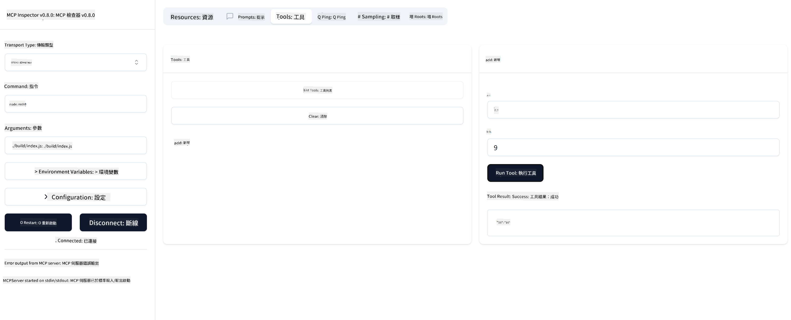

<!--
CO_OP_TRANSLATOR_METADATA:
{
  "original_hash": "315ecce765d22639b60dbc41344c8533",
  "translation_date": "2025-07-09T22:58:43+00:00",
  "source_file": "03-GettingStarted/01-first-server/README.md",
  "language_code": "hk"
}
-->
### -2- 建立專案

既然你已經安裝好 SDK，接下來讓我們建立一個專案：

### -3- 建立專案檔案

### -4- 撰寫伺服器程式碼

### -5- 新增工具和資源

透過加入以下程式碼來新增一個工具和一個資源：

### -6 最終程式碼

讓我們加入最後需要的程式碼，讓伺服器能夠啟動：

### -7- 測試伺服器

使用以下指令啟動伺服器：

### -8- 使用 inspector 執行

Inspector 是一個很棒的工具，可以啟動你的伺服器並讓你與它互動，方便你測試功能是否正常。讓我們啟動它：
> [!NOTE]
> 在「command」欄位中顯示可能會有所不同，因為它包含了用於運行伺服器的特定執行環境指令/
你應該會看到以下的使用者介面：

1. 按下 Connect 按鈕連接到伺服器
  連接成功後，你應該會看到以下畫面：

  

1. 選擇「Tools」然後選擇「listTools」，你會看到「Add」出現，點選「Add」並填入參數值。

  你應該會看到以下回應，也就是「add」工具的結果：

  

恭喜，你已成功建立並執行你的第一個伺服器！

### 官方 SDK

MCP 提供多種語言的官方 SDK：

- [C# SDK](https://github.com/modelcontextprotocol/csharp-sdk) - 與 Microsoft 共同維護
- [Java SDK](https://github.com/modelcontextprotocol/java-sdk) - 與 Spring AI 共同維護
- [TypeScript SDK](https://github.com/modelcontextprotocol/typescript-sdk) - 官方 TypeScript 實作
- [Python SDK](https://github.com/modelcontextprotocol/python-sdk) - 官方 Python 實作
- [Kotlin SDK](https://github.com/modelcontextprotocol/kotlin-sdk) - 官方 Kotlin 實作
- [Swift SDK](https://github.com/modelcontextprotocol/swift-sdk) - 與 Loopwork AI 共同維護
- [Rust SDK](https://github.com/modelcontextprotocol/rust-sdk) - 官方 Rust 實作

## 主要重點

- 使用語言專屬的 SDK，設定 MCP 開發環境非常簡單
- 建立 MCP 伺服器需要創建並註冊具有明確結構的工具
- 測試與除錯對於可靠的 MCP 實作至關重要

## 範例

- [Java 計算機](../samples/java/calculator/README.md)
- [.Net 計算機](../../../../03-GettingStarted/samples/csharp)
- [JavaScript 計算機](../samples/javascript/README.md)
- [TypeScript 計算機](../samples/typescript/README.md)
- [Python 計算機](../../../../03-GettingStarted/samples/python)

## 作業

建立一個簡單的 MCP 伺服器，並包含你選擇的工具：

1. 使用你偏好的語言 (.NET、Java、Python 或 JavaScript) 實作該工具。
2. 定義輸入參數與回傳值。
3. 執行 inspector 工具，確保伺服器運作正常。
4. 使用各種輸入測試你的實作。

## 解答

[Solution](./solution/README.md)

## 額外資源

- [在 Azure 上使用 Model Context Protocol 建立代理](https://learn.microsoft.com/azure/developer/ai/intro-agents-mcp)
- [使用 Azure Container Apps 遠端 MCP (Node.js/TypeScript/JavaScript)](https://learn.microsoft.com/samples/azure-samples/mcp-container-ts/mcp-container-ts/)
- [.NET OpenAI MCP 代理](https://learn.microsoft.com/samples/azure-samples/openai-mcp-agent-dotnet/openai-mcp-agent-dotnet/)

## 下一步

下一步：[MCP 用戶端入門](../02-client/README.md)

**免責聲明**：  
本文件由 AI 翻譯服務 [Co-op Translator](https://github.com/Azure/co-op-translator) 進行翻譯。雖然我們致力於確保準確性，但請注意自動翻譯可能包含錯誤或不準確之處。原始文件的母語版本應被視為權威來源。對於重要資訊，建議採用專業人工翻譯。我們不對因使用本翻譯而引起的任何誤解或誤釋承擔責任。