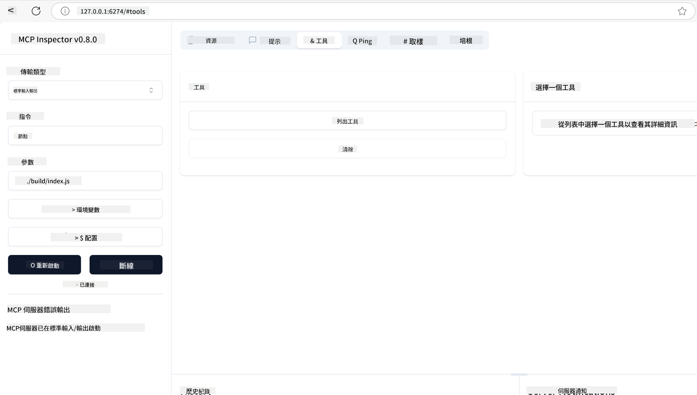

<!--
CO_OP_TRANSLATOR_METADATA:
{
  "original_hash": "d90651bcd1df019768921d531653638a",
  "translation_date": "2025-06-12T21:27:40+00:00",
  "source_file": "03-GettingStarted/01-first-server/README.md",
  "language_code": "hk"
}
-->
### -2- 建立項目

而家你已經安裝好 SDK，下一步就係建立一個項目：

### -3- 建立項目檔案

### -4- 編寫伺服器代碼

### -5- 加入工具同資源

透過加入以下代碼，新增一個工具同一個資源：

### -6- 最終代碼

加入最後一段代碼，令伺服器可以啟動：

### -7- 測試伺服器

用以下指令啟動伺服器：

### -8- 使用 Inspector 運行

Inspector 係一個好用嘅工具，可以幫你啟動伺服器，並且同伺服器互動，方便測試功能。依家我哋啟動佢：

> [!NOTE]
> 喺「command」欄位嘅指令可能會唔同，因為佢包含咗用你指定執行環境啟動伺服器嘅命令。

你應該會見到以下嘅用戶介面：

1. 按「Connect」按鈕連接伺服器  
   連接成功後，你應該會見到以下畫面：

   

2. 選擇「Tools」再揀「listTools」，你會見到「Add」功能，揀「Add」並填寫參數值。

   你應該會見到以下回應，即係「add」工具嘅結果：

   

恭喜你，成功建立並運行咗你嘅第一個伺服器！

### 官方 SDK

MCP 為多種語言提供官方 SDK：
- [C# SDK](https://github.com/modelcontextprotocol/csharp-sdk) - 與 Microsoft 合作維護
- [Java SDK](https://github.com/modelcontextprotocol/java-sdk) - 與 Spring AI 合作維護
- [TypeScript SDK](https://github.com/modelcontextprotocol/typescript-sdk) - 官方 TypeScript 實現
- [Python SDK](https://github.com/modelcontextprotocol/python-sdk) - 官方 Python 實現
- [Kotlin SDK](https://github.com/modelcontextprotocol/kotlin-sdk) - 官方 Kotlin 實現
- [Swift SDK](https://github.com/modelcontextprotocol/swift-sdk) - 與 Loopwork AI 合作維護
- [Rust SDK](https://github.com/modelcontextprotocol/rust-sdk) - 官方 Rust 實現

## 主要重點

- MCP 開發環境透過語言專用 SDK 設置簡單方便
- 建立 MCP 伺服器需要創建並註冊帶有明確結構的工具
- 測試同除錯對可靠嘅 MCP 實現非常重要

## 範例

- [Java 計算機](../samples/java/calculator/README.md)
- [.Net 計算機](../../../../03-GettingStarted/samples/csharp)
- [JavaScript 計算機](../samples/javascript/README.md)
- [TypeScript 計算機](../samples/typescript/README.md)
- [Python 計算機](../../../../03-GettingStarted/samples/python)

## 作業

建立一個簡單嘅 MCP 伺服器，並加入你揀嘅工具：
1. 用你慣用嘅語言 (.NET、Java、Python 或 JavaScript) 實現該工具。
2. 定義輸入參數同返回值。
3. 用 inspector 工具運行，確保伺服器正常工作。
4. 用不同輸入測試實現。

## 解答

[解答](./solution/README.md)

## 額外資源

- [用 Model Context Protocol 喺 Azure 建立 Agents](https://learn.microsoft.com/azure/developer/ai/intro-agents-mcp)
- [用 Azure Container Apps 遠端 MCP (Node.js/TypeScript/JavaScript)](https://learn.microsoft.com/samples/azure-samples/mcp-container-ts/mcp-container-ts/)
- [.NET OpenAI MCP Agent](https://learn.microsoft.com/samples/azure-samples/openai-mcp-agent-dotnet/openai-mcp-agent-dotnet/)

## 下一步

下一課：[Getting Started with MCP Clients](/03-GettingStarted/02-client/README.md)

**免責聲明**：  
本文件使用 AI 翻譯服務 [Co-op Translator](https://github.com/Azure/co-op-translator) 進行翻譯。雖然我們力求準確，但請注意，自動翻譯可能包含錯誤或不準確之處。原始文件的母語版本應視為權威來源。對於重要資料，建議採用專業人工翻譯。我們不會對因使用此翻譯而引起的任何誤解或誤釋承擔責任。