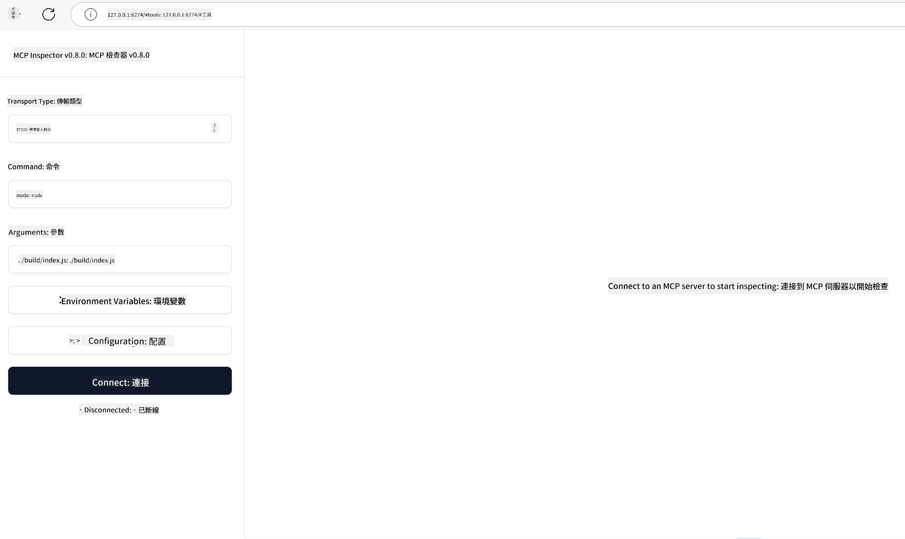

<!--
CO_OP_TRANSLATOR_METADATA:
{
  "original_hash": "e25bc265a51244a7a2d93b3761543a1f",
  "translation_date": "2025-06-12T22:22:59+00:00",
  "source_file": "03-GettingStarted/08-testing/README.md",
  "language_code": "hk"
}
-->
## Testing and Debugging

開始測試你的 MCP 伺服器之前，了解可用的工具和最佳除錯方法非常重要。有效的測試能確保伺服器按預期運作，並幫助你迅速找出及解決問題。以下章節會介紹驗證 MCP 實作的建議方法。

## Overview

本課程會講解如何選擇合適的測試方法及最有效的測試工具。

## Learning Objectives

完成本課程後，你將能夠：

- 描述不同的測試方法。
- 使用多種工具有效地測試你的程式碼。

## Testing MCP Servers

MCP 提供工具協助你測試及除錯伺服器：

- **MCP Inspector**：一個命令列工具，可以以 CLI 或視覺化介面使用。
- **Manual testing**：你可以用 curl 這類工具發送網絡請求，任何能執行 HTTP 的工具都適用。
- **Unit testing**：可以用你喜歡的測試框架，測試伺服器及客戶端的功能。

### Using MCP Inspector

之前的課程已介紹過這工具的用法，這裡簡單說明。它是用 Node.js 建立的工具，你可以透過執行 `npx` 指令使用，該指令會暫時下載及安裝工具，完成後會自動清理。

[MCP Inspector](https://github.com/modelcontextprotocol/inspector) 可以幫你：

- **發現伺服器功能**：自動偵測可用的資源、工具及提示
- **測試工具執行**：嘗試不同參數並即時查看回應
- **查看伺服器元資料**：檢視伺服器資訊、架構及設定

一般使用方式如下：

```bash
npx @modelcontextprotocol/inspector node build/index.js
```

上述指令會啟動 MCP 及其視覺介面，並在瀏覽器開啟本地網頁介面。你會看到顯示已註冊 MCP 伺服器、可用工具、資源及提示的儀表板。介面讓你互動式測試工具執行、檢視伺服器元資料及即時回應，方便驗證及除錯 MCP 伺服器實作。

介面大致如下圖： 

你也可以以 CLI 模式運行此工具，只需加上 `--cli` 參數。以下是以「CLI」模式運行，列出伺服器上所有工具的範例：

```sh
npx @modelcontextprotocol/inspector --cli node build/index.js --method tools/list
```

### Manual Testing

除了用 inspector 工具測試伺服器功能外，另一個類似方法是用能發送 HTTP 請求的客戶端，例如 curl。

用 curl 你可以直接用 HTTP 請求測試 MCP 伺服器：

```bash
# Example: Test server metadata
curl http://localhost:3000/v1/metadata

# Example: Execute a tool
curl -X POST http://localhost:3000/v1/tools/execute \
  -H "Content-Type: application/json" \
  -d '{"name": "calculator", "parameters": {"expression": "2+2"}}'
```

從上面 curl 的用法可以看到，你用 POST 請求調用工具，並在請求內容中帶入工具名稱及參數。選擇最適合你的方法。CLI 工具通常使用較快，且容易編寫腳本，對 CI/CD 環境特別有用。

### Unit Testing

為你的工具及資源寫單元測試，確保它們如預期運作。以下是範例測試程式碼。

```python
import pytest

from mcp.server.fastmcp import FastMCP
from mcp.shared.memory import (
    create_connected_server_and_client_session as create_session,
)

# Mark the whole module for async tests
pytestmark = pytest.mark.anyio


async def test_list_tools_cursor_parameter():
    """Test that the cursor parameter is accepted for list_tools.

    Note: FastMCP doesn't currently implement pagination, so this test
    only verifies that the cursor parameter is accepted by the client.
    """

 server = FastMCP("test")

    # Create a couple of test tools
    @server.tool(name="test_tool_1")
    async def test_tool_1() -> str:
        """First test tool"""
        return "Result 1"

    @server.tool(name="test_tool_2")
    async def test_tool_2() -> str:
        """Second test tool"""
        return "Result 2"

    async with create_session(server._mcp_server) as client_session:
        # Test without cursor parameter (omitted)
        result1 = await client_session.list_tools()
        assert len(result1.tools) == 2

        # Test with cursor=None
        result2 = await client_session.list_tools(cursor=None)
        assert len(result2.tools) == 2

        # Test with cursor as string
        result3 = await client_session.list_tools(cursor="some_cursor_value")
        assert len(result3.tools) == 2

        # Test with empty string cursor
        result4 = await client_session.list_tools(cursor="")
        assert len(result4.tools) == 2
    
```

上述程式碼做了以下幾點：

- 使用 pytest 框架，讓你以函式形式撰寫測試，並用 assert 陳述句檢查結果。
- 建立一個包含兩個不同工具的 MCP Server。
- 用 `assert` 陳述句檢查特定條件是否成立。

可以參考 [完整檔案](https://github.com/modelcontextprotocol/python-sdk/blob/main/tests/client/test_list_methods_cursor.py)

依照該檔案，你可以測試自己的伺服器，確保功能如預期被建立。

主要 SDK 都有類似的測試章節，你可以依選用的執行環境調整。

## Samples 

- [Java Calculator](../samples/java/calculator/README.md)
- [.Net Calculator](../../../../03-GettingStarted/samples/csharp)
- [JavaScript Calculator](../samples/javascript/README.md)
- [TypeScript Calculator](../samples/typescript/README.md)
- [Python Calculator](../../../../03-GettingStarted/samples/python) 

## Additional Resources

- [Python SDK](https://github.com/modelcontextprotocol/python-sdk)

## What's Next

- Next: [Deployment](/03-GettingStarted/09-deployment/README.md)

**免責聲明**：  
本文件係使用 AI 翻譯服務 [Co-op Translator](https://github.com/Azure/co-op-translator) 進行翻譯。雖然我哋努力確保準確性，但請注意自動翻譯可能包含錯誤或不準確之處。原始文件嘅母語版本應被視為權威來源。對於重要資訊，建議採用專業人工翻譯。我哋對因使用本翻譯而引致嘅任何誤解或誤釋概不負責。