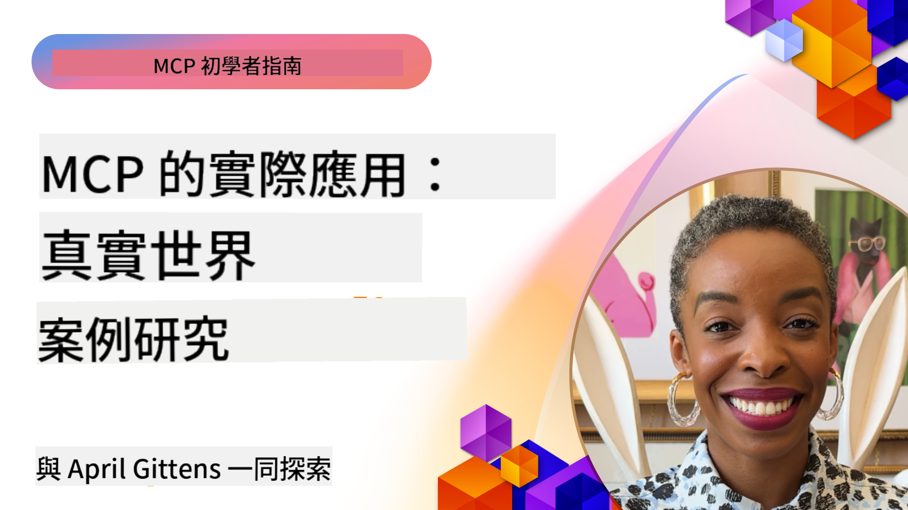

<!--
CO_OP_TRANSLATOR_METADATA:
{
  "original_hash": "61a160248efabe92b09d7b08293d17db",
  "translation_date": "2025-07-28T23:47:31+00:00",
  "source_file": "09-CaseStudy/README.md",
  "language_code": "hk"
}
-->
# MCP 實踐：真實案例研究

_（點擊上方圖片觀看本課程的影片）_

模型上下文協議（MCP）正在改變 AI 應用程式與數據、工具和服務的互動方式。本節展示了一些真實案例，說明 MCP 在各種企業場景中的實際應用。

## 概述

本節展示了 MCP 實施的具體例子，突出了各組織如何利用此協議解決複雜的業務挑戰。透過研究這些案例，您將深入了解 MCP 在真實場景中的靈活性、可擴展性及其實際效益。

## 主要學習目標

透過探索這些案例，您將能夠：

- 理解 MCP 如何應用於解決特定業務問題
- 學習不同的整合模式和架構方法
- 掌握在企業環境中實施 MCP 的最佳實踐
- 獲得在真實實施中遇到的挑戰及解決方案的洞察
- 發掘在自己的項目中應用類似模式的機會

## 精選案例研究

### 1. [Azure AI 旅行代理 – 參考實現](./travelagentsample.md)

此案例研究探討了 Microsoft 的全面參考解決方案，展示如何使用 MCP、Azure OpenAI 和 Azure AI Search 建立多代理、AI 驅動的旅行規劃應用程式。該項目展示了：

- 透過 MCP 進行多代理協調
- 使用 Azure AI Search 進行企業數據整合
- 利用 Azure 服務構建安全、可擴展的架構
- 使用可重用的 MCP 元件擴展工具
- 由 Azure OpenAI 驅動的對話式用戶體驗

架構和實施細節提供了構建複雜多代理系統的寶貴見解，MCP 作為協調層發揮了重要作用。

### 2. [從 YouTube 數據更新 Azure DevOps 項目](./UpdateADOItemsFromYT.md)

此案例研究展示了 MCP 在自動化工作流程中的實際應用。它說明了如何使用 MCP 工具：

- 從線上平台（如 YouTube）提取數據
- 更新 Azure DevOps 系統中的工作項目
- 創建可重複的自動化工作流程
- 整合分散系統中的數據

此例子說明了即使是相對簡單的 MCP 實施，也能透過自動化例行任務和改善系統間數據一致性帶來顯著的效率提升。

### 3. [使用 MCP 進行即時文件檢索](./docs-mcp/README.md)

此案例研究指導您如何連接 Python 控制台客戶端到模型上下文協議（MCP）伺服器，以檢索並記錄即時、上下文感知的 Microsoft 文件。您將學習：

- 使用 Python 客戶端和官方 MCP SDK 連接 MCP 伺服器
- 使用流式 HTTP 客戶端進行高效的即時數據檢索
- 調用伺服器上的文件工具並直接將響應記錄到控制台
- 將最新的 Microsoft 文件整合到您的工作流程中，而無需離開終端

本章包括一個動手作業、最小工作代碼範例，以及深入學習的額外資源連結。查看完整的操作指南和代碼，了解 MCP 如何改變文件訪問和開發者生產力。

### 4. [使用 MCP 的互動式學習計劃生成器網頁應用](./docs-mcp/README.md)

此案例研究展示了如何使用 Chainlit 和模型上下文協議（MCP）構建一個互動式網頁應用，生成任何主題的個性化學習計劃。用戶可以指定主題（例如 "AI-900 認證"）和學習時長（例如 8 週），應用程式將提供逐週的推薦內容。Chainlit 提供了一個對話式聊天介面，使體驗更具吸引力和適應性。

- 由 Chainlit 驅動的對話式網頁應用
- 用戶主導的主題和時長提示
- 使用 MCP 提供逐週內容推薦
- 在聊天介面中即時、適應性響應

該項目說明了如何將對話式 AI 和 MCP 結合，創建現代網頁環境中的動態、用戶驅動教育工具。

### 5. [在 VS Code 中使用 MCP 伺服器的編輯器內文件功能](./docs-mcp/README.md)

此案例研究展示了如何將 Microsoft Learn 文件直接帶入您的 VS Code 環境中，無需切換瀏覽器標籤！您將看到如何：

- 使用 MCP 面板或命令面板在 VS Code 中即時搜索和閱讀文件
- 參考文件並直接將連結插入到您的 README 或課程 Markdown 文件中
- 將 GitHub Copilot 和 MCP 結合，實現無縫的 AI 驅動文件和代碼工作流程
- 使用即時反饋和 Microsoft 提供的準確性驗證和增強您的文件
- 將 MCP 與 GitHub 工作流程整合，進行持續文件驗證

實施包括：

- 簡易設置的 `.vscode/mcp.json` 配置範例
- 編輯器內體驗的截圖式操作指南
- 結合 Copilot 和 MCP 的生產力最大化技巧

此場景非常適合課程作者、文件撰寫者和開發者，幫助他們在編輯器中專注工作，同時使用文件、Copilot 和驗證工具——全部由 MCP 驅動。

### 6. [APIM MCP 伺服器創建](./apimsample.md)

此案例研究提供了如何使用 Azure API 管理（APIM）創建 MCP 伺服器的逐步指南。內容包括：

- 在 Azure API 管理中設置 MCP 伺服器
- 將 API 操作公開為 MCP 工具
- 配置速率限制和安全性策略
- 使用 Visual Studio Code 和 GitHub Copilot 測試 MCP 伺服器

此例子說明了如何利用 Azure 的功能創建一個強大的 MCP 伺服器，可用於各種應用，增強 AI 系統與企業 API 的整合。

## 結論

這些案例研究突出了模型上下文協議在真實場景中的靈活性和實際應用。從複雜的多代理系統到針對性的自動化工作流程，MCP 提供了一種標準化的方式，將 AI 系統與所需的工具和數據連接起來，以創造價值。

透過研究這些實施，您可以獲得架構模式、實施策略和最佳實踐的洞察，並將其應用於自己的 MCP 項目中。這些例子證明了 MCP 不僅僅是一個理論框架，而是一個解決真實業務挑戰的實際方案。

## 其他資源

- [Azure AI 旅行代理 GitHub 資源庫](https://github.com/Azure-Samples/azure-ai-travel-agents)
- [Azure DevOps MCP 工具](https://github.com/microsoft/azure-devops-mcp)
- [Playwright MCP 工具](https://github.com/microsoft/playwright-mcp)
- [Microsoft Docs MCP 伺服器](https://github.com/MicrosoftDocs/mcp)
- [MCP 社群範例](https://github.com/microsoft/mcp)

下一步：實作實驗室 [簡化 AI 工作流程：使用 AI 工具包構建 MCP 伺服器](../10-StreamliningAIWorkflowsBuildingAnMCPServerWithAIToolkit/README.md)

**免責聲明**：  
本文件已使用人工智能翻譯服務 [Co-op Translator](https://github.com/Azure/co-op-translator) 進行翻譯。儘管我們致力於提供準確的翻譯，但請注意，自動翻譯可能包含錯誤或不準確之處。原始文件的母語版本應被視為權威來源。對於重要信息，建議使用專業人工翻譯。我們對因使用此翻譯而引起的任何誤解或錯誤解釋概不負責。