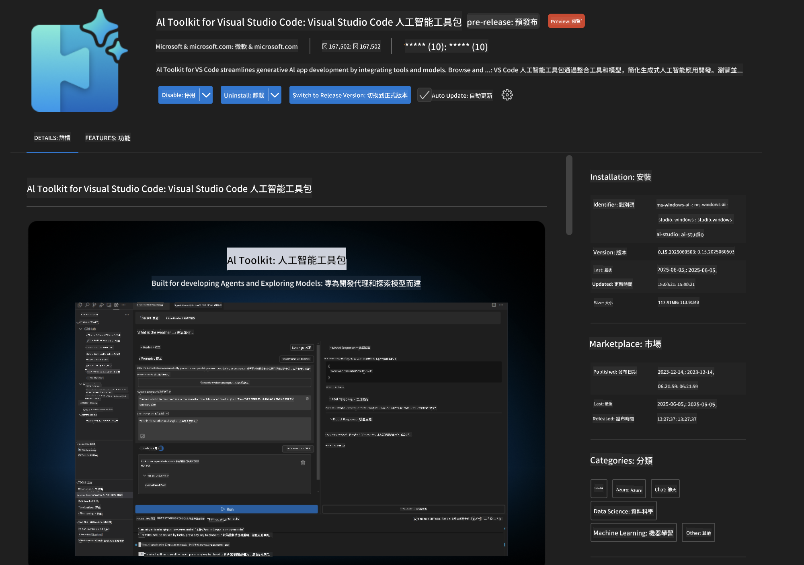
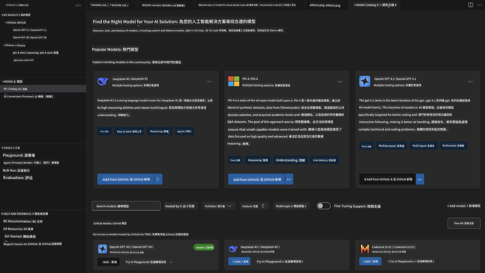
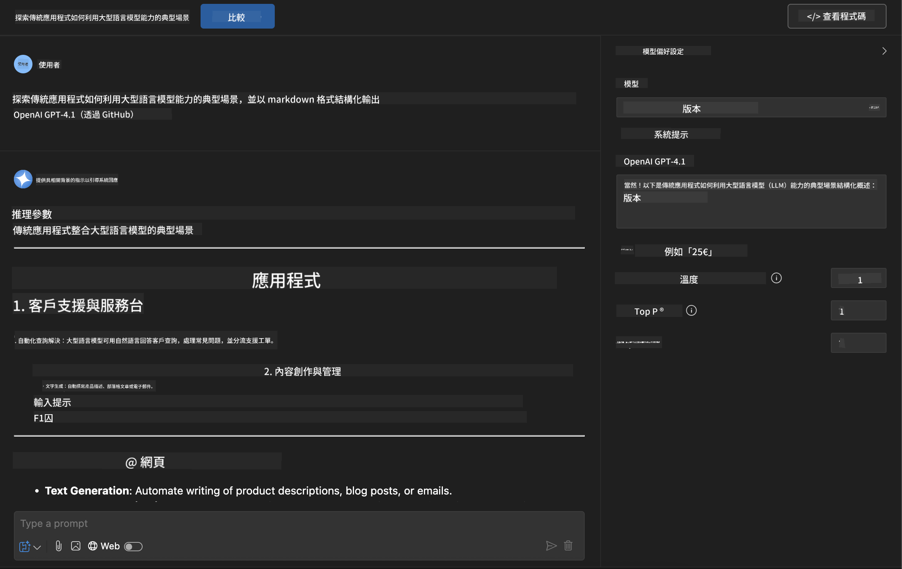
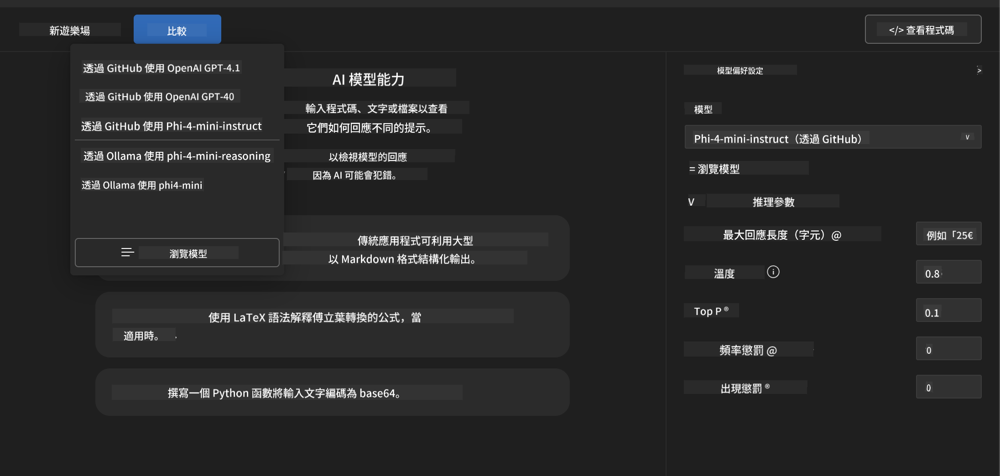
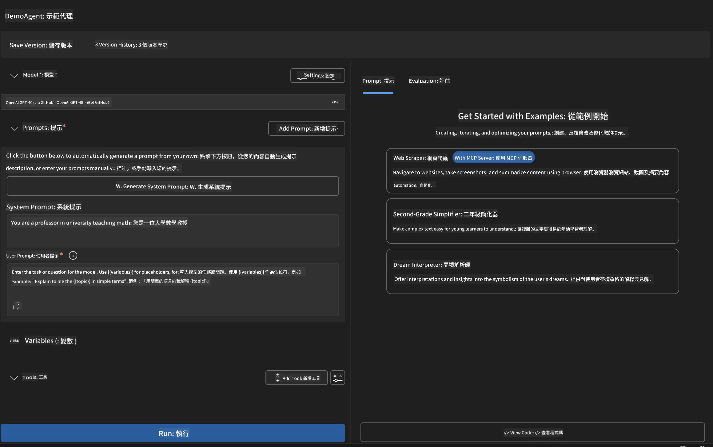
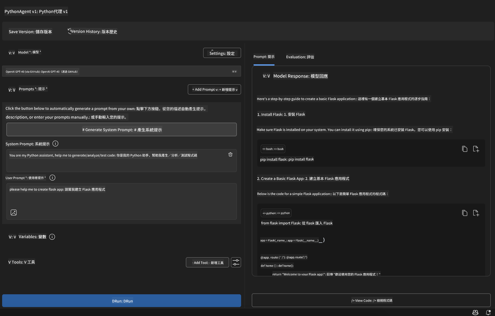

<!--
CO_OP_TRANSLATOR_METADATA:
{
  "original_hash": "2aa9dbc165e104764fa57e8a0d3f1c73",
  "translation_date": "2025-06-10T05:12:37+00:00",
  "source_file": "10-StreamliningAIWorkflowsBuildingAnMCPServerWithAIToolkit/lab1/README.md",
  "language_code": "hk"
}
-->
# 🚀 Module 1: AI Toolkit 基礎知識

[]()
[]()
[]()

## 📋 學習目標

完成本模組後，你將能夠：
- ✅ 安裝及設定 Visual Studio Code 的 AI Toolkit
- ✅ 瀏覽 Model Catalog，了解不同模型來源
- ✅ 使用 Playground 進行模型測試及實驗
- ✅ 利用 Agent Builder 建立自訂 AI 代理人
- ✅ 比較不同供應商模型的效能
- ✅ 應用提示工程的最佳實踐

## 🧠 AI Toolkit (AITK) 簡介

**Visual Studio Code 的 AI Toolkit** 是微軟的旗艦擴充套件，將 VS Code 變成一個完整的 AI 開發環境。它連結 AI 研究與實際應用開發，讓各種技能層級的開發者都能輕鬆使用生成式 AI。

### 🌟 主要功能

| 功能 | 說明 | 使用場景 |
|---------|-------------|----------|
| **🗂️ Model Catalog** | 取得來自 GitHub、ONNX、OpenAI、Anthropic、Google 的 100+ 模型 | 模型發現與選擇 |
| **🔌 BYOM 支援** | 整合你自己的模型（本地或遠端） | 自訂模型部署 |
| **🎮 互動式 Playground** | 實時模型測試與聊天介面 | 快速原型與測試 |
| **📎 多模態支援** | 處理文字、圖片及附件 | 複雜 AI 應用 |
| **⚡ 批次處理** | 同時執行多個提示 | 高效測試流程 |
| **📊 模型評估** | 內建指標（F1、相關性、相似度、一致性） | 效能評估 |

### 🎯 AI Toolkit 的重要性

- **🚀 加速開發**：從想法到原型只需數分鐘
- **🔄 統一工作流程**：多個 AI 供應商共用一個介面
- **🧪 簡易實驗**：無需複雜設定即可比較模型
- **📈 生產準備**：從原型無縫過渡到部署

## 🛠️ 前置需求與安裝

### 📦 安裝 AI Toolkit 擴充套件

**步驟 1：開啟擴充套件市集**
1. 打開 Visual Studio Code
2. 進入擴充套件視圖 (`Ctrl+Shift+X` 或 `Cmd+Shift+X`)
3. 搜尋「AI Toolkit」

**步驟 2：選擇版本**
- **🟢 正式版**：建議用於生產環境
- **🔶 預覽版**：搶先體驗最新功能

**步驟 3：安裝並啟用**



### ✅ 驗證清單
- [ ] AI Toolkit 圖示出現在 VS Code 側邊欄
- [ ] 擴充套件已啟用並運作中
- [ ] 輸出面板沒有安裝錯誤訊息

## 🧪 實作練習 1：探索 GitHub 模型

**🎯 目標**：熟悉 Model Catalog 並測試你的第一個 AI 模型

### 📊 步驟 1：瀏覽 Model Catalog

Model Catalog 是你進入 AI 生態系的入口，彙整多個供應商的模型，方便你發掘和比較。

**🔍 導覽指南：**

點擊 AI Toolkit 側邊欄的 **MODELS - Catalog**



**💡 小貼士**：尋找符合你需求的模型特性（例如程式碼生成、創意寫作、分析）。

**⚠️ 注意**：GitHub 托管的模型（GitHub Models）免費使用，但有請求與 token 限制。若要使用非 GitHub 模型（例如透過 Azure AI 或其他端點的外部模型），需要提供相應的 API 金鑰或認證。

### 🚀 步驟 2：新增並設定你的第一個模型

**模型選擇策略：**
- **GPT-4.1**：適合複雜推理與分析
- **Phi-4-mini**：輕量快速，適合簡單任務

**🔧 設定流程：**
1. 從目錄選擇 **OpenAI GPT-4.1**
2. 點擊 **Add to My Models** 將模型加入使用列表
3. 選擇 **Try in Playground** 啟動測試環境
4. 等待模型初始化（首次設定可能需一些時間）


**⚙️ 了解模型參數：**
- **Temperature**：控制創意程度（0 = 確定性，1 = 創意）
- **Max Tokens**：最大回應長度
- **Top-p**：核取樣以增加回應多樣性

### 🎯 步驟 3：掌握 Playground 介面

Playground 是你的 AI 實驗室，以下是發揮最大效能的方法：

**🎨 提示工程最佳實踐：**
1. **具體明確**：清晰詳細的指令效果更好
2. **提供背景**：包含相關上下文資訊
3. **使用範例**：示範你想要的結果
4. **反覆調整**：根據初步結果優化提示

**🧪 測試場景：**
```markdown
# Example 1: Code Generation
"Write a Python function that calculates the factorial of a number using recursion. Include error handling and docstrings."

# Example 2: Creative Writing
"Write a professional email to a client explaining a project delay, maintaining a positive tone while being transparent about challenges."

# Example 3: Data Analysis
"Analyze this sales data and provide insights: [paste your data]. Focus on trends, anomalies, and actionable recommendations."
```



### 🏆 挑戰練習：模型效能比較

**🎯 目標**：使用相同提示比較不同模型，了解它們的優勢

**📋 操作指引：**
1. 將 **Phi-4-mini** 加入工作區
2. 對 GPT-4.1 和 Phi-4-mini 使用相同提示



3. 比較回應品質、速度和準確度
4. 將結果紀錄於報告中


**💡 重要洞察：**
- 何時使用大型語言模型（LLM）或小型語言模型（SLM）
- 成本與效能的取捨
- 不同模型的專長功能

## 🤖 實作練習 2：用 Agent Builder 建立自訂代理人

**🎯 目標**：打造專為特定任務與流程設計的 AI 代理人

### 🏗️ 步驟 1：認識 Agent Builder

Agent Builder 是 AI Toolkit 的核心功能，讓你建立專用的 AI 助手，結合大型語言模型的能力，搭配自訂指令、特定參數及專業知識。

**🧠 代理人架構組件：**
- **核心模型**：基礎 LLM（GPT-4、Groks、Phi 等）
- **系統提示**：定義代理人個性與行為
- **參數**：微調設定以達最佳效能
- **工具整合**：連接外部 API 與 MCP 服務
- **記憶體**：對話上下文與會話持續性



### ⚙️ 步驟 2：深入代理人設定

**🎨 有效系統提示撰寫：**
```markdown
# Template Structure:
## Role Definition
You are a [specific role] with expertise in [domain].

## Capabilities
- List specific abilities
- Define scope of knowledge
- Clarify limitations

## Behavior Guidelines
- Response style (formal, casual, technical)
- Output format preferences
- Error handling approach

## Examples
Provide 2-3 examples of ideal interactions
```

*當然，你也可以使用 Generate System Prompt 功能，讓 AI 幫你生成及優化提示*

**🔧 參數優化建議：**
| 參數 | 推薦範圍 | 使用情境 |
|-----------|------------------|----------|
| **Temperature** | 0.1-0.3 | 技術性/事實性回應 |
| **Temperature** | 0.7-0.9 | 創意/腦力激盪任務 |
| **Max Tokens** | 500-1000 | 簡潔回應 |
| **Max Tokens** | 2000-4000 | 詳細解說 |

### 🐍 步驟 3：實務練習 - Python 程式設計代理人

**🎯 任務**：打造專門的 Python 程式助理

**📋 設定步驟：**

1. **模型選擇**：選擇 **Claude 3.5 Sonnet**（非常適合程式碼相關）

2. **系統提示設計**：
```markdown
# Python Programming Expert Agent

## Role
You are a senior Python developer with 10+ years of experience. You excel at writing clean, efficient, and well-documented Python code.

## Capabilities
- Write production-ready Python code
- Debug complex issues
- Explain code concepts clearly
- Suggest best practices and optimizations
- Provide complete working examples

## Response Format
- Always include docstrings
- Add inline comments for complex logic
- Suggest testing approaches
- Mention relevant libraries when applicable

## Code Quality Standards
- Follow PEP 8 style guidelines
- Use type hints where appropriate
- Handle exceptions gracefully
- Write readable, maintainable code
```

3. **參數設定**：
   - Temperature: 0.2（保持一致且可靠的程式碼）
   - Max Tokens: 2000（詳細解釋）
   - Top-p: 0.9（平衡創意）



### 🧪 步驟 4：測試你的 Python 代理人

**測試場景：**
1. **基本功能**：「建立一個找出質數的函數」
2. **複雜演算法**：「實作包含插入、刪除和搜尋方法的二元搜尋樹」
3. **實務問題**：「建立一個可處理速率限制與重試的網頁爬蟲」
4. **除錯**：「修正這段程式碼 [貼上有問題的程式碼]」

**🏆 成功標準：**
- ✅ 程式碼能順利執行
- ✅ 包含完整註解
- ✅ 遵循 Python 最佳實踐
- ✅ 提供清晰解說
- ✅ 建議改進方向

## 🎓 Module 1 總結與後續步驟

### 📊 知識檢測

測試你的理解：
- [ ] 能否說明目錄中不同模型的差異？
- [ ] 是否成功建立並測試自訂代理人？
- [ ] 是否了解如何為不同用途優化參數？
- [ ] 能否設計有效的系統提示？

### 📚 延伸資源

- **AI Toolkit 文件**： [Official Microsoft Docs](https://github.com/microsoft/vscode-ai-toolkit)
- **提示工程指南**： [Best Practices](https://platform.openai.com/docs/guides/prompt-engineering)
- **AI Toolkit 模型**： [Models in Develpment](https://github.com/microsoft/vscode-ai-toolkit/blob/main/doc/models.md)

**🎉 恭喜你！** 你已掌握 AI Toolkit 的基礎，準備好開發更進階的 AI 應用！

### 🔜 繼續下一模組

準備好挑戰更高階功能？前往 **[Module 2: MCP with AI Toolkit Fundamentals](../lab2/README.md)**，你將學習如何：
- 使用 Model Context Protocol (MCP) 連接代理人與外部工具
- 建立 Playwright 瀏覽器自動化代理人
- 整合 MCP 伺服器與 AI Toolkit 代理人
- 利用外部資料與功能強化代理人

**免責聲明**：  
本文件係使用 AI 翻譯服務 [Co-op Translator](https://github.com/Azure/co-op-translator) 進行翻譯。雖然我哋努力確保準確性，但請注意，自動翻譯可能包含錯誤或不準確之處。原始文件以其原文為準。對於重要資訊，建議採用專業人工翻譯。我哋對因使用本翻譯而引起嘅任何誤解或錯誤詮釋概不負責。