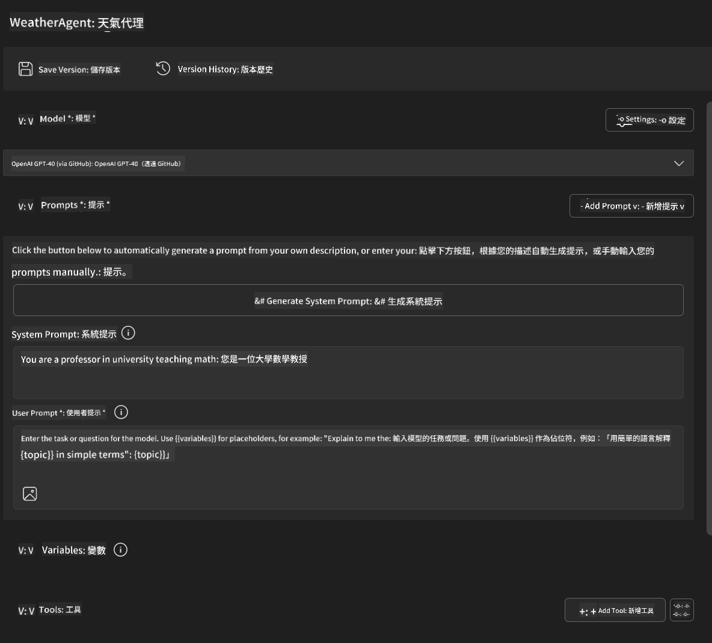
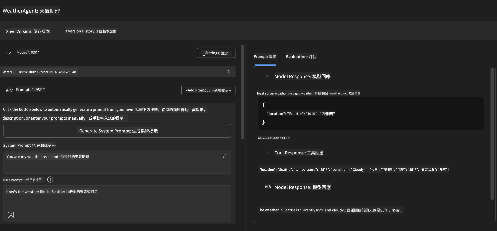
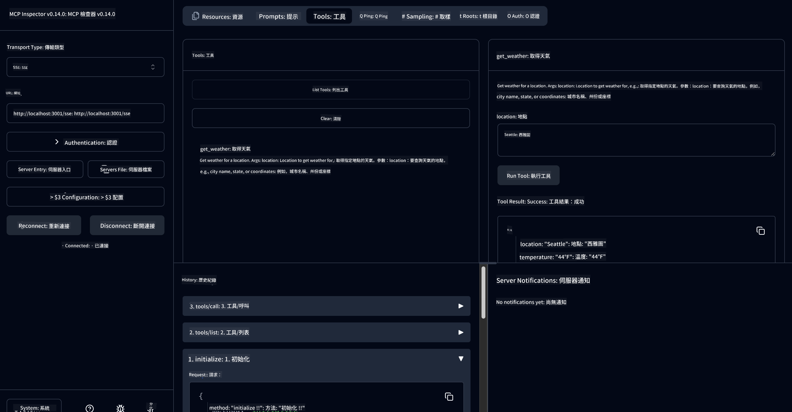

<!--
CO_OP_TRANSLATOR_METADATA:
{
  "original_hash": "dd8da3f75addcef453fe11f02a270217",
  "translation_date": "2025-06-10T06:05:36+00:00",
  "source_file": "10-StreamliningAIWorkflowsBuildingAnMCPServerWithAIToolkit/lab3/README.md",
  "language_code": "hk"
}
-->
# 🔧 Module 3: 使用 AI Toolkit 進階開發 MCP


## 🎯 學習目標

完成本實驗後，你將能夠：

- ✅ 使用 AI Toolkit 建立自訂 MCP 伺服器
- ✅ 配置並使用最新 MCP Python SDK (v1.9.3)
- ✅ 設定並運用 MCP Inspector 進行除錯
- ✅ 在 Agent Builder 和 Inspector 環境中除錯 MCP 伺服器
- ✅ 了解進階 MCP 伺服器開發流程

## 📋 先決條件

- 完成 Lab 2（MCP 基礎）
- 安裝有 AI Toolkit 擴充功能的 VS Code
- Python 3.10+ 環境
- Node.js 及 npm 用於 Inspector 設定

## 🏗️ 你將會建立

在本實驗中，你會建立一個 **Weather MCP Server**，示範：

- 自訂 MCP 伺服器實作
- 與 AI Toolkit Agent Builder 整合
- 專業除錯流程
- 現代 MCP SDK 使用模式

---

## 🔧 核心元件概覽

### 🐍 MCP Python SDK  
Model Context Protocol Python SDK 是建立自訂 MCP 伺服器的基礎。你會使用具備強化除錯功能的 1.9.3 版本。

### 🔍 MCP Inspector  
強大的除錯工具，提供：

- 即時伺服器監控
- 工具執行視覺化
- 網路請求/回應檢視
- 互動式測試環境

---

## 📖 實作步驟說明

### 第一步：在 Agent Builder 建立 WeatherAgent

1. **透過 AI Toolkit 擴充功能，在 VS Code 開啟 Agent Builder**
2. **建立一個新 agent，設定如下：**
   - Agent 名稱：`WeatherAgent`



### 第二步：初始化 MCP Server 專案

1. **在 Agent Builder 選擇 Tools → Add Tool**
2. **選擇「MCP Server」**
3. **選擇「Create A new MCP Server」**
4. **挑選 `python-weather` 範本**
5. **命名你的伺服器：** `weather_mcp`


### 第三步：打開並檢視專案

1. **在 VS Code 中開啟產生的專案**
2. **檢查專案結構：**
   ```
   weather_mcp/
   ├── src/
   │   ├── __init__.py
   │   └── server.py
   ├── inspector/
   │   ├── package.json
   │   └── package-lock.json
   ├── .vscode/
   │   ├── launch.json
   │   └── tasks.json
   ├── pyproject.toml
   └── README.md
   ```

### 第四步：升級至最新 MCP SDK

> **🔍 為何升級？** 我們想使用最新 MCP SDK (v1.9.3) 及 Inspector 服務 (0.14.0)，以獲得更強大功能和更好的除錯體驗。

#### 4a. 更新 Python 相依套件

**編輯 `pyproject.toml`:** update [./code/weather_mcp/pyproject.toml](../../../../10-StreamliningAIWorkflowsBuildingAnMCPServerWithAIToolkit/lab3/code/weather_mcp/pyproject.toml)


#### 4b. Update Inspector Configuration

**Edit `inspector/package.json`:** update [./code/weather_mcp/inspector/package.json](../../../../10-StreamliningAIWorkflowsBuildingAnMCPServerWithAIToolkit/lab3/code/weather_mcp/inspector/package.json)

#### 4c. Update Inspector Dependencies

**Edit `inspector/package-lock.json`:** update [./code/weather_mcp/inspector/package-lock.json](../../../../10-StreamliningAIWorkflowsBuildingAnMCPServerWithAIToolkit/lab3/code/weather_mcp/inspector/package-lock.json)

> **📝 Note:** This file contains extensive dependency definitions. Below is the essential structure - the full content ensures proper dependency resolution.


> **⚡ Full Package Lock:** The complete package-lock.json contains ~3000 lines of dependency definitions. The above shows the key structure - use the provided file for complete dependency resolution.

### Step 5: Configure VS Code Debugging

*Note: Please copy the file in the specified path to replace the corresponding local file*

#### 5a. Update Launch Configuration

**Edit `.vscode/launch.json`：**

```json
{
  "version": "0.2.0",
  "configurations": [
    {
      "name": "Attach to Local MCP",
      "type": "debugpy",
      "request": "attach",
      "connect": {
        "host": "localhost",
        "port": 5678
      },
      "presentation": {
        "hidden": true
      },
      "internalConsoleOptions": "neverOpen",
      "postDebugTask": "Terminate All Tasks"
    },
    {
      "name": "Launch Inspector (Edge)",
      "type": "msedge",
      "request": "launch",
      "url": "http://localhost:6274?timeout=60000&serverUrl=http://localhost:3001/sse#tools",
      "cascadeTerminateToConfigurations": [
        "Attach to Local MCP"
      ],
      "presentation": {
        "hidden": true
      },
      "internalConsoleOptions": "neverOpen"
    },
    {
      "name": "Launch Inspector (Chrome)",
      "type": "chrome",
      "request": "launch",
      "url": "http://localhost:6274?timeout=60000&serverUrl=http://localhost:3001/sse#tools",
      "cascadeTerminateToConfigurations": [
        "Attach to Local MCP"
      ],
      "presentation": {
        "hidden": true
      },
      "internalConsoleOptions": "neverOpen"
    }
  ],
  "compounds": [
    {
      "name": "Debug in Agent Builder",
      "configurations": [
        "Attach to Local MCP"
      ],
      "preLaunchTask": "Open Agent Builder",
    },
    {
      "name": "Debug in Inspector (Edge)",
      "configurations": [
        "Launch Inspector (Edge)",
        "Attach to Local MCP"
      ],
      "preLaunchTask": "Start MCP Inspector",
      "stopAll": true
    },
    {
      "name": "Debug in Inspector (Chrome)",
      "configurations": [
        "Launch Inspector (Chrome)",
        "Attach to Local MCP"
      ],
      "preLaunchTask": "Start MCP Inspector",
      "stopAll": true
    }
  ]
}
```

**編輯 `.vscode/tasks.json`：**

```
{
  "version": "2.0.0",
  "tasks": [
    {
      "label": "Start MCP Server",
      "type": "shell",
      "command": "python -m debugpy --listen 127.0.0.1:5678 src/__init__.py sse",
      "isBackground": true,
      "options": {
        "cwd": "${workspaceFolder}",
        "env": {
          "PORT": "3001"
        }
      },
      "problemMatcher": {
        "pattern": [
          {
            "regexp": "^.*$",
            "file": 0,
            "location": 1,
            "message": 2
          }
        ],
        "background": {
          "activeOnStart": true,
          "beginsPattern": ".*",
          "endsPattern": "Application startup complete|running"
        }
      }
    },
    {
      "label": "Start MCP Inspector",
      "type": "shell",
      "command": "npm run dev:inspector",
      "isBackground": true,
      "options": {
        "cwd": "${workspaceFolder}/inspector",
        "env": {
          "CLIENT_PORT": "6274",
          "SERVER_PORT": "6277",
        }
      },
      "problemMatcher": {
        "pattern": [
          {
            "regexp": "^.*$",
            "file": 0,
            "location": 1,
            "message": 2
          }
        ],
        "background": {
          "activeOnStart": true,
          "beginsPattern": "Starting MCP inspector",
          "endsPattern": "Proxy server listening on port"
        }
      },
      "dependsOn": [
        "Start MCP Server"
      ]
    },
    {
      "label": "Open Agent Builder",
      "type": "shell",
      "command": "echo ${input:openAgentBuilder}",
      "presentation": {
        "reveal": "never"
      },
      "dependsOn": [
        "Start MCP Server"
      ],
    },
    {
      "label": "Terminate All Tasks",
      "command": "echo ${input:terminate}",
      "type": "shell",
      "problemMatcher": []
    }
  ],
  "inputs": [
    {
      "id": "openAgentBuilder",
      "type": "command",
      "command": "ai-mlstudio.agentBuilder",
      "args": {
        "initialMCPs": [ "local-server-weather_mcp" ],
        "triggeredFrom": "vsc-tasks"
      }
    },
    {
      "id": "terminate",
      "type": "command",
      "command": "workbench.action.tasks.terminate",
      "args": "terminateAll"
    }
  ]
}
```


---

## 🚀 執行及測試你的 MCP 伺服器

### 第六步：安裝相依套件

完成設定變更後，執行以下指令：

**安裝 Python 相依套件：**
```bash
uv sync
```

**安裝 Inspector 相依套件：**
```bash
cd inspector
npm install
```

### 第七步：使用 Agent Builder 除錯

1. **按 F5 或使用「Debug in Agent Builder」設定**
2. **從除錯面板選擇複合設定**
3. **等待伺服器啟動並開啟 Agent Builder**
4. **使用自然語言查詢測試你的 Weather MCP 伺服器**

輸入提示範例

SYSTEM_PROMPT

```
You are my weather assistant
```

USER_PROMPT

```
How's the weather like in Seattle
```



### 第八步：使用 MCP Inspector 除錯

1. **使用「Debug in Inspector」設定（Edge 或 Chrome）**
2. **開啟 `http://localhost:6274` 的 Inspector 介面**
3. **探索互動測試環境：**
   - 查看可用工具
   - 測試工具執行
   - 監控網路請求
   - 除錯伺服器回應



---

## 🎯 主要學習成果

完成本實驗後，你已經：

- [x] **使用 AI Toolkit 範本建立自訂 MCP 伺服器**
- [x] **升級至最新 MCP SDK** (v1.9.3) 以提升功能
- [x] **設定專業除錯流程**，適用於 Agent Builder 與 Inspector
- [x] **安裝並運用 MCP Inspector** 進行互動式伺服器測試
- [x] **掌握 VS Code 除錯設定**，促進 MCP 開發效率

## 🔧 進階功能探索

| 功能 | 描述 | 使用場景 |
|---------|-------------|----------|
| **MCP Python SDK v1.9.3** | 最新協議實作 | 現代伺服器開發 |
| **MCP Inspector 0.14.0** | 互動式除錯工具 | 即時伺服器測試 |
| **VS Code 除錯** | 整合開發環境 | 專業除錯流程 |
| **Agent Builder 整合** | 直接連結 AI Toolkit | 端對端代理測試 |

## 📚 延伸資源

- [MCP Python SDK Documentation](https://modelcontextprotocol.io/docs/sdk/python)
- [AI Toolkit Extension Guide](https://code.visualstudio.com/docs/ai/ai-toolkit)
- [VS Code Debugging Documentation](https://code.visualstudio.com/docs/editor/debugging)
- [Model Context Protocol Specification](https://modelcontextprotocol.io/docs/concepts/architecture)

---

**🎉 恭喜！** 你已成功完成 Lab 3，現在可以利用專業開發流程來建立、除錯及部署自訂 MCP 伺服器。

### 🔜 繼續下一模組

準備好將 MCP 技能應用到實務開發流程？繼續到 **[Module 4: Practical MCP Development - Custom GitHub Clone Server](../lab4/README.md)**，你將會：

- 建立可用於生產的 MCP 伺服器，自動化 GitHub 倉庫操作
- 實作 MCP 的 GitHub 倉庫克隆功能
- 將自訂 MCP 伺服器整合至 VS Code 與 GitHub Copilot Agent Mode
- 在生產環境測試及部署自訂 MCP 伺服器
- 學習開發者實務工作流程自動化

**免責聲明**：  
本文件係使用 AI 翻譯服務 [Co-op Translator](https://github.com/Azure/co-op-translator) 進行翻譯。雖然我哋致力保持準確性，但請注意，自動翻譯可能會有錯誤或不準確之處。原文文件嘅母語版本應視為權威來源。對於重要資料，建議採用專業人工翻譯。我哋對因使用此翻譯而引致嘅任何誤解或誤釋概不負責。