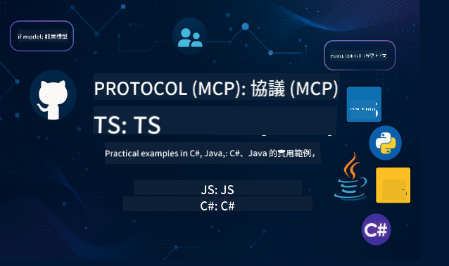

<!--
CO_OP_TRANSLATOR_METADATA:
{
  "original_hash": "c7fbf0cdaa44b3245daff0c8bb4f439e",
  "translation_date": "2025-06-11T14:56:08+00:00",
  "source_file": "README.md",
  "language_code": "hk"
}
-->
 

跟住以下步驟開始使用呢啲資源：
1. **Fork 呢個 Repository**：撳 
2. **Clone 呢個 Repository**：   `git clone https://github.com/microsoft/mcp-for-beginners.git`
3. [**加入 Azure AI Foundry Discord，同專家同其他開發者交流**](https://discord.com/invite/ByRwuEEgH4)

### 🌐 多語言支援

#### 透過 GitHub Action 支援（自動化同保持最新）
[法文](../fr/README.md) | [西班牙文](../es/README.md) | [德文](../de/README.md) | [俄文](../ru/README.md) | [阿拉伯文](../ar/README.md) | [波斯文 (法爾西語)](../fa/README.md) | [烏爾都文](../ur/README.md) | [中文（簡體）](../zh/README.md) | [中文（繁體，澳門）](../mo/README.md) | [中文（繁體，香港）](./README.md) | [中文（繁體，台灣）](../tw/README.md) | [日文](../ja/README.md) | [韓文](../ko/README.md) | [印地文](../hi/README.md) | [孟加拉文](../bn/README.md) | [馬拉地文](../mr/README.md) | [尼泊爾文](../ne/README.md) | [旁遮普文（古魯穆奇）](../pa/README.md) | [葡萄牙文（葡萄牙）](../pt/README.md) | [葡萄牙文（巴西）](../br/README.md) | [意大利文](../it/README.md) | [波蘭文](../pl/README.md) | [土耳其文](../tr/README.md) | [希臘文](../el/README.md) | [泰文](../th/README.md) | [瑞典文](../sv/README.md) | [丹麥文](../da/README.md) | [挪威文](../no/README.md) | [芬蘭文](../fi/README.md) | [荷蘭文](../nl/README.md) | [希伯來文](../he/README.md) | [越南文](../vi/README.md) | [印尼文](../id/README.md) | [馬來文](../ms/README.md) | [他加祿文（菲律賓語）](../tl/README.md) | [斯瓦希里文](../sw/README.md) | [匈牙利文](../hu/README.md) | [捷克文](../cs/README.md) | [斯洛伐克文](../sk/README.md) | [羅馬尼亞文](../ro/README.md) | [保加利亞文](../bg/README.md) | [塞爾維亞文（西里爾字母）](../sr/README.md) | [克羅地亞文](../hr/README.md) | [斯洛文尼亞文](../sl/README.md)Please write the output from left to right.

[法文](../fr/README.md) | [西班牙文](../es/README.md) | [德文](../de/README.md) | [俄文](../ru/README.md) | [阿拉伯文](../ar/README.md) | [波斯文 (法爾西語)](../fa/README.md) | [烏爾都文](../ur/README.md) | [中文（簡體）](../zh/README.md) | [中文（繁體，澳門）](../mo/README.md) | [中文（繁體，香港）](./README.md) | [中文（繁體，台灣）](../tw/README.md) | [日文](../ja/README.md) | [韓文](../ko/README.md) | [印地文](../hi/README.md) | [孟加拉文](../bn/README.md) | [馬拉地文](../mr/README.md) | [尼泊爾文](../ne/README.md) | [旁遮普文（古魯穆奇）](../pa/README.md) | [葡萄牙文（葡萄牙）](../pt/README.md) | [葡萄牙文（巴西）](../br/README.md) | [意大利文](../it/README.md) | [波蘭文](../pl/README.md) | [土耳其文](../tr/README.md) | [希臘文](../el/README.md) | [泰文](../th/README.md) | [瑞典文](../sv/README.md) | [丹麥文](../da/README.md) | [挪威文](../no/README.md) | [芬蘭文](../fi/README.md) | [荷蘭文](../nl/README.md) | [希伯來文](../he/README.md) | [越南文](../vi/README.md) | [印尼文](../id/README.md) | [馬來文](../ms/README.md) | [他加祿文（菲律賓語）](../tl/README.md) | [斯瓦希里文](../sw/README.md) | [匈牙利文](../hu/README.md) | [捷克文](../cs/README.md) | [斯洛伐克文](../sk/README.md) | [羅馬尼亞文](../ro/README.md) | [保加利亞文](../bg/README.md) | [塞爾維亞文（西里爾字母）](../sr/README.md) | [克羅地亞文](../hr/README.md) | [斯洛文尼亞文](../sl/README.md)
# 🚀 Model Context Protocol (MCP) 初學者課程

## **用 C#、Java、JavaScript、Python 同 TypeScript 實戰學 MCP**

## 🧠 Model Context Protocol 課程概覽

**Model Context Protocol (MCP)** 係一個先進嘅框架，專為標準化 AI 模型同客戶端應用程式之間嘅互動而設計。呢個開源課程提供有結構嘅學習路徑，包含實用嘅程式碼範例同真實世界嘅應用案例，涵蓋 C#、Java、JavaScript、TypeScript 同 Python 等熱門編程語言。

無論你係 AI 開發者、系統架構師定係軟件工程師，呢份指南都係你掌握 MCP 基礎同實施策略嘅全面資源。

## 🔗 官方 MCP 資源

- 📘 [MCP Documentation](https://modelcontextprotocol.io/) – 詳細教學同用戶指南  
- 📜 [MCP Specification](https://spec.modelcontextprotocol.io/) – 協議架構同技術參考  
- 🧑‍💻 [MCP GitHub Repository](https://github.com/modelcontextprotocol) – 開源 SDK、工具同程式碼範例  

## 🧭 完整 MCP 課程結構

| 章節 | 標題 | 說明 | 連結 |
|--|--|--|--|
| 00 | **MCP 簡介** | 介紹 Model Context Protocol 同佢喺 AI 流程中嘅重要性，包括咩係 MCP、點解標準化咁重要，以及實際應用同好處 | [Introduction](./00-Introduction/README.md) |
| 01 | **核心概念解說** | 深入探討 MCP 嘅核心概念，包括客戶端-伺服器架構、主要協議組件同訊息傳遞模式 | [Core Concepts](./01-CoreConcepts/README.md) |
| 02 | **MCP 嘅安全性** | 識別 MCP 系統中嘅安全威脅，採用嘅技術同最佳實踐以保障實施安全 | [Security](/02-Security/README.md) |
| 03 | **開始使用 MCP** | 環境設置同配置，建立基本 MCP 伺服器同客戶端，將 MCP 整合入現有應用程式 | [Getting Started](./03-GettingStarted/README.md) |
| 3.1 | **第一個伺服器** | 用 MCP 協議建立基本伺服器，了解伺服器同客戶端嘅互動，並測試伺服器功能 | [First Server](./03-GettingStarted/01-first-server/README.md) |
| 3.2 | **第一個客戶端** | 用 MCP 協議建立基本客戶端，了解客戶端同伺服器嘅互動，並測試客戶端功能 | [First Client](./03-GettingStarted/02-client/README.md) |
| 3.3 | **結合大型語言模型嘅客戶端** | 用 MCP 協議建立結合大型語言模型 (LLM) 嘅客戶端 | [Client with LLM](./03-GettingStarted/03-llm-client/README.md) |
| 3.4 | **用 Visual Studio Code 使用伺服器** | 設定 Visual Studio Code 以使用 MCP 協議連接伺服器 | [Consuming a server with Visual Studio Code](./03-GettingStarted/04-vscode/README.md) |
| 3.5 | **用 SSE 建立伺服器** | SSE 幫助我哋將伺服器公開到互聯網，本章教你點用 SSE 建立伺服器 | [Creating a server using SSE](./03-GettingStarted/05-sse-server/README.md) |
| 3.6 | **使用 AI Toolkit** | AI Toolkit 係一個好用嘅工具，幫你管理 AI 同 MCP 嘅工作流程 | [Use AI Toolkit](./03-GettingStarted/06-aitk/README.md) |
| 3.7 | **測試你嘅伺服器** | 測試係開發流程中好重要，呢章會教你用幾種唔同嘅工具嚟測試 | [Testing your server](./03-GettingStarted/07-testing/README.md) |
| 3.8 | **部署你嘅伺服器** | 點由本地開發過渡到生產環境？呢章會教你開發同部署伺服器嘅方法 | [Deploy your server](./03-GettingStarted/08-deployment/README.md) |
| 04 | **實務應用** | 喺唔同語言用 SDK，除錯、測試同驗證，設計可重用嘅提示模板同工作流程 | [Practical Implementation](./04-PracticalImplementation/README.md) |
| 05 | **MCP 進階主題** | 多模態 AI 工作流程同擴展性、安全擴展策略、MCP 喺企業生態系統中嘅應用 | [Advanced Topics](./05-AdvancedTopics/README.md) |
| 5.1 | **MCP 同 Azure 整合** | 展示同 Azure 嘅整合方法 | [MCP Azure integration](./05-AdvancedTopics/mcp-integration/README.md) |
| 5.2 | **多模態** | 教你點處理唔同嘅模態，例如圖像等 | [Multi modality](./05-AdvancedTopics/mcp-multi-modality/README.md) |
| 5.3 | **MCP OAuth2 示範** | 一個簡約嘅 Spring Boot 應用示範 OAuth2 同 MCP，作為授權同資源伺服器。展示安全嘅令牌發行、受保護端點、Azure Container Apps 部署同 API 管理整合。 | [MCP OAuth2 Demo](./05-AdvancedTopics/mcp-oauth2-demo/README.md) |
| 5.4 | **Root Contexts** | 更深入了解 root context 同點樣實施 | [Root Contexts](./05-AdvancedTopics/mcp-root-contexts/README.md) |
| 5.5 | **Routing** | 學習唔同類型嘅路由 | [Routing](./05-AdvancedTopics/mcp-routing/README.md) |
| 5.6 | **Sampling** | 學習點樣處理抽樣 | [Sampling](./05-AdvancedTopics/mcp-sampling/README.md) |
| 5.7 | **Scaling** | 了解 MCP 伺服器嘅擴展，包括水平同垂直擴展策略、資源優化同性能調校 | [Scaling](./05-AdvancedTopics/mcp-scaling/README.md) |
| 5.8 | **Security** | 保護你嘅 MCP 伺服器，包括身份驗證、授權同數據保護策略 | [Security](./05-AdvancedTopics/mcp-security/README.md) |
| 5.9 | **Web Search MCP** | Python MCP 伺服器同客戶端整合 SerpAPI，實現即時嘅網頁、新聞、產品搜索同問答。示範多工具協調、外部 API 整合同強健嘅錯誤處理 | [Web Search MCP](./05-AdvancedTopics/web-search-mcp/README.md) |
| 5.10 | **實時串流** | 喺現今數據驅動嘅世界，即時數據串流變得好重要，幫助企業同應用即時取得資訊作出決策。 | [Realtime Streaming](./05-AdvancedTopics/mcp-realtimestreaming/README.md) |
| 06 | **社區貢獻** | 點樣貢獻程式碼同文件，透過 GitHub 協作，社區驅動嘅改進同反饋 | [Community Contributions](./06-CommunityContributions/README.md) |
| 07 | **早期採用嘅心得** | 真實世界嘅實施經驗同有效方法，建立同部署基於 MCP 嘅方案，趨勢同未來路線圖 | [Insights](./07-LessonsFromEarlyAdoption/README.md) |
| 08 | **MCP 最佳實踐** | 性能調校同優化，設計容錯 MCP 系統，測試同韌性策略 | [Best Practices](./08-BestPractices/README.md) |
| 09 | **MCP 案例研究** | 深入探討 MCP 解決方案架構、部署藍圖及整合技巧，附有註解圖表及專案導覽 | [Case Studies](./09-CaseStudy/README.md) |
| 10 | **優化 AI 工作流程：利用 AI Toolkit 建立 MCP 伺服器** | 全面實作工作坊，結合 MCP 與 Microsoft 的 AI Toolkit for VS Code。透過實務模組學習建立智能應用，將 AI 模型與現實工具串連，涵蓋基礎知識、自訂伺服器開發及生產部署策略。 | [Hands On Lab](./10-StreamliningAIWorkflowsBuildingAnMCPServerWithAIToolkit/README.md) |

## 範例專案

### 🧮 MCP 計算機範例專案：

  
<strong>按語言探索程式碼實作</strong>

  - [C# MCP Server 範例](./03-GettingStarted/samples/csharp/README.md)
  - [Java MCP 計算機](./03-GettingStarted/samples/java/calculator/README.md)
  - [JavaScript MCP 示範](./03-GettingStarted/samples/javascript/README.md)
  - [Python MCP Server](../../03-GettingStarted/samples/python/mcp_calculator_server.py)
  - [TypeScript MCP 範例](./03-GettingStarted/samples/typescript/README.md)

### 💡 MCP 進階計算機專案：

  
<strong>探索進階範例</strong>

  - [進階 C# 範例](./04-PracticalImplementation/samples/csharp/README.md)
  - [Java 容器應用程式範例](./04-PracticalImplementation/samples/java/containerapp/README.md)
  - [JavaScript 進階範例](./04-PracticalImplementation/samples/javascript/README.md)
  - [Python 複雜實作](../../04-PracticalImplementation/samples/python/mcp_sample.py)
  - [TypeScript 容器範例](./04-PracticalImplementation/samples/typescript/README.md)

## 🎯 MCP 學習前置條件

想充份掌握本課程內容，你應該具備：

- 基本的 C#、Java 或 Python 知識
- 理解客戶端-伺服器模型及 API
- （可選）熟悉機器學習概念

## 📚 學習指南

這裡有一份完整的 [學習指南](./study_guide.md) 幫助你有效瀏覽此資源庫。指南包括：

- 視覺化課程地圖，展示所有涵蓋主題
- 各資源庫區塊的詳細說明
- 如何使用範例專案的指引
- 適合不同技能層級的推薦學習路徑
- 補充學習旅程的額外資源

## 🛠️ 如何有效利用本課程

本指南中每堂課都包含：

1. 清晰解說 MCP 概念  
2. 多種語言的即時程式碼範例  
3. 練習題，實作真實 MCP 應用  
4. 進階學習者的額外資源  

## 📜 授權資訊

本內容採用 **MIT License** 授權。條款詳見 [LICENSE](../../LICENSE)。

## 🤝 貢獻指引

歡迎大家為本專案提供貢獻與建議。大部分貢獻需簽署
Contributor License Agreement (CLA)，確認你擁有並同意授權我們使用你的貢獻。詳情請見 <https://cla.opensource.microsoft.com>。

當你提交 pull request 時，CLA 機器人會自動判斷是否需要你提供 CLA，並在 PR 上標註（例如狀態檢查、留言）。只需依照機器人指示操作即可。你在所有使用我們 CLA 的資源庫中只需完成一次。

本專案已採用 [Microsoft Open Source Code of Conduct](https://opensource.microsoft.com/codeofconduct/)。
更多資訊請參考 [行為準則常見問題](https://opensource.microsoft.com/codeofconduct/faq/) 或聯絡 [opencode@microsoft.com](mailto:opencode@microsoft.com) 提問。

## 🎒 其他課程
我們團隊還有其他課程！歡迎參考：

- [AI Agents For Beginners](https://github.com/microsoft/ai-agents-for-beginners?WT.mc_id=academic-105485-koreyst)
- [Generative AI for Beginners using .NET](https://github.com/microsoft/Generative-AI-for-beginners-dotnet?WT.mc_id=academic-105485-koreyst)
- [Generative AI for Beginners using JavaScript](https://github.com/microsoft/generative-ai-with-javascript?WT.mc_id=academic-105485-koreyst)
- [Generative AI for Beginners](https://github.com/microsoft/generative-ai-for-beginners?WT.mc_id=academic-105485-koreyst)
- [ML for Beginners](https://aka.ms/ml-beginners?WT.mc_id=academic-105485-koreyst)
- [Data Science for Beginners](https://aka.ms/datascience-beginners?WT.mc_id=academic-105485-koreyst)
- [AI for Beginners](https://aka.ms/ai-beginners?WT.mc_id=academic-105485-koreyst)
- [Cybersecurity for Beginners](https://github.com/microsoft/Security-101??WT.mc_id=academic-96948-sayoung)
- [Web Dev for Beginners](https://aka.ms/webdev-beginners?WT.mc_id=academic-105485-koreyst)
- [IoT for Beginners](https://aka.ms/iot-beginners?WT.mc_id=academic-105485-koreyst)
- [XR Development for Beginners](https://github.com/microsoft/xr-development-for-beginners?WT.mc_id=academic-105485-koreyst)
- [Mastering GitHub Copilot for AI Paired Programming](https://aka.ms/GitHubCopilotAI?WT.mc_id=academic-105485-koreyst)
- [Mastering GitHub Copilot for C#/.NET Developers](https://github.com/microsoft/mastering-github-copilot-for-dotnet-csharp-developers?WT.mc_id=academic-105485-koreyst)
- [Choose Your Own Copilot Adventure](https://github.com/microsoft/CopilotAdventures?WT.mc_id=academic-105485-koreyst)

## ™️ 商標聲明

本項目可能包含項目、產品或服務的商標或標誌。授權使用 Microsoft 商標或標誌，須遵守並依照
[Microsoft 的商標及品牌指引](https://www.microsoft.com/legal/intellectualproperty/trademarks/usage/general)。
在本項目修改版本中使用 Microsoft 商標或標誌，不得引起混淆或暗示 Microsoft 贊助。
任何第三方商標或標誌的使用，須遵守該第三方的政策。

**免責聲明**：  
本文件使用 AI 翻譯服務 [Co-op Translator](https://github.com/Azure/co-op-translator) 進行翻譯。雖然我們致力於準確性，但請注意，自動翻譯可能包含錯誤或不準確之處。原始文件的母語版本應被視為權威來源。對於重要資訊，建議採用專業人工翻譯。對於因使用本翻譯而引致的任何誤解或誤釋，我們概不負責。