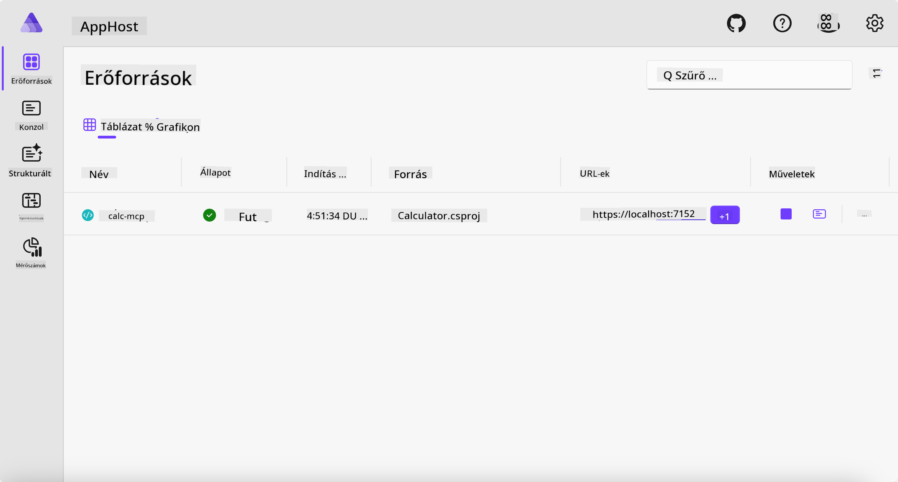

<!--
CO_OP_TRANSLATOR_METADATA:
{
  "original_hash": "0bc7bd48f55f1565f1d95ccb2c16f728",
  "translation_date": "2025-06-18T07:52:43+00:00",
  "source_file": "04-PracticalImplementation/samples/csharp/README.md",
  "language_code": "hu"
}
-->
# Minta

Az előző példa bemutatja, hogyan használjunk helyi .NET projektet az `stdio` típussal, és hogyan futtassuk a szervert helyben egy konténerben. Ez sok esetben jó megoldás. Ugyanakkor hasznos lehet, ha a szerver távolról, például egy felhőalapú környezetben fut. Erre való az `http` típus.

Ha megnézzük a megoldást az `04-PracticalImplementation` mappában, elsőre sokkal bonyolultabbnak tűnhet, mint az előző. De valójában nincs így. Ha alaposan megnézed a `src/Calculator` projektet, látni fogod, hogy nagyrészt ugyanaz a kód, mint az előző példában. Az egyetlen különbség, hogy egy másik könyvtárat, az `ModelContextProtocol.AspNetCore`-t használjuk az HTTP kérések kezelésére. Emellett a `IsPrime` metódust priváttá tesszük, hogy megmutassuk, hogy a kódban lehetnek privát metódusok is. A többi kód ugyanaz, mint korábban.

A többi projekt a [.NET Aspire](https://learn.microsoft.com/dotnet/aspire/get-started/aspire-overview)-ból származik. A .NET Aspire jelenléte a megoldásban jobb fejlesztői élményt biztosít fejlesztés és tesztelés közben, valamint segít az observabilitásban. A szerver futtatásához nem kötelező, de jó gyakorlat, ha benne van a megoldásban.

## Indítsd el a szervert helyben

1. A VS Code-ban (a C# DevKit kiterjesztéssel) navigálj az `04-PracticalImplementation/samples/csharp` könyvtárba.
1. Futtasd a következő parancsot a szerver indításához:

   ```bash
    dotnet watch run --project ./src/AppHost
   ```

1. Amikor egy webböngésző megnyitja a .NET Aspire irányítópultot, jegyezd meg az `http` URL-t. Valami ilyesminek kell lennie: `http://localhost:5058/`.

   

## Streamable HTTP tesztelése az MCP Inspectorral

Ha Node.js 22.7.5 vagy újabb verziód van, használhatod az MCP Inspectort a szerver tesztelésére.

Indítsd el a szervert, majd futtasd a következő parancsot egy terminálban:

```bash
npx @modelcontextprotocol/inspector http://localhost:5058
```


- Válaszd ki a `Streamable HTTP` as the Transport type.
- In the Url field, enter the URL of the server noted earlier, and append `/mcp`-t. Ez az `http` kell legyen (nem `https`) something like `http://localhost:5058/mcp`.
- select the Connect button.

A nice thing about the Inspector is that it provide a nice visibility on what is happening.

- Try listing the available tools
- Try some of them, it should works just like before.

## Test MCP Server with GitHub Copilot Chat in VS Code

To use the Streamable HTTP transport with GitHub Copilot Chat, change the configuration of the `calc-mcp` szerver, amit korábban hoztál létre, így néz ki:

```jsonc
// .vscode/mcp.json
{
  "servers": {
    "calc-mcp": {
      "type": "http",
      "url": "http://localhost:5058/mcp"
    }
  }
}
```

Végezz néhány tesztet:

- Kérdezd meg: „3 prímszám 6780 után”. Figyeld meg, hogy a Copilot az új eszközöket, a `NextFivePrimeNumbers`-t használja, és csak az első 3 prímszámot adja vissza.
- Kérdezd meg: „7 prímszám 111 után”, hogy lásd, mi történik.
- Kérdezd meg: „Johnnak 24 cukorkája van, és mindet el akarja osztani a 3 gyereke között. Hány cukorka jut egy gyerekre?”, hogy lásd, mi történik.

## Szerver telepítése Azure-ra

Telepítsük a szervert az Azure-ra, hogy többen használhassák.

Terminálban navigálj az `04-PracticalImplementation/samples/csharp` mappába, majd futtasd a következő parancsot:

```bash
azd up
```

A telepítés befejezése után valami ilyesmi üzenetet kell látnod:


Másold ki az URL-t, és használd az MCP Inspectorban, illetve a GitHub Copilot Chatben.

```jsonc
// .vscode/mcp.json
{
  "servers": {
    "calc-mcp": {
      "type": "http",
      "url": "https://calc-mcp.gentleriver-3977fbcf.australiaeast.azurecontainerapps.io/mcp"
    }
  }
}
```

## Mi következik?

Különböző szállítási típusokat és tesztelő eszközöket próbálunk ki. Emellett telepítjük az MCP szerveredet az Azure-ra is. De mi van akkor, ha a szervernek privát erőforrásokhoz kell hozzáférnie? Például egy adatbázishoz vagy privát API-hoz? A következő fejezetben megnézzük, hogyan javíthatjuk a szerver biztonságát.

**Felelősségkizárás**:  
Ez a dokumentum az AI fordító szolgáltatás, a [Co-op Translator](https://github.com/Azure/co-op-translator) segítségével készült. Bár törekszünk a pontosságra, kérjük, vegye figyelembe, hogy az automatikus fordítások hibákat vagy pontatlanságokat tartalmazhatnak. Az eredeti dokumentum anyanyelvű változata tekintendő hivatalos forrásnak. Kritikus információk esetén professzionális emberi fordítást javaslunk. Nem vállalunk felelősséget az ebből a fordításból eredő félreértésekért vagy téves értelmezésekért.