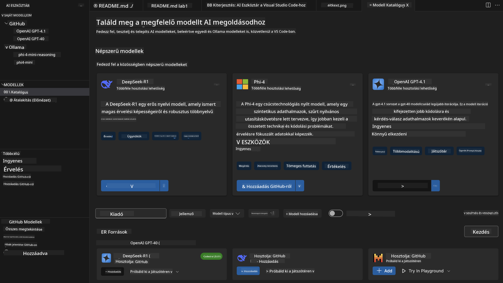
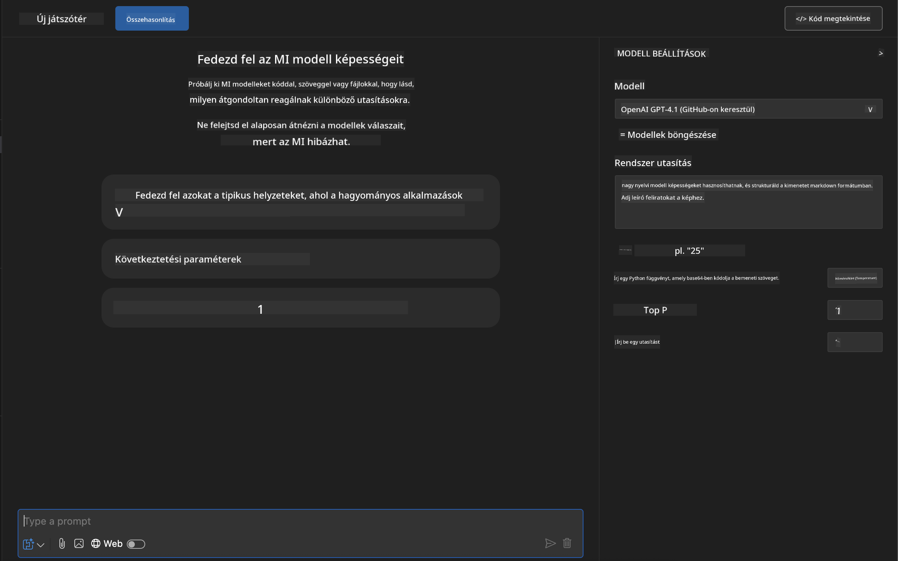
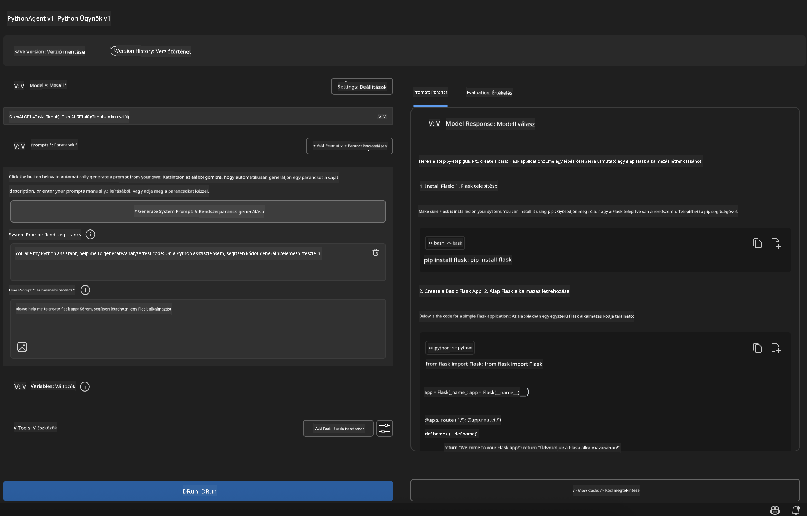

<!--
CO_OP_TRANSLATOR_METADATA:
{
  "original_hash": "2aa9dbc165e104764fa57e8a0d3f1c73",
  "translation_date": "2025-06-10T05:28:48+00:00",
  "source_file": "10-StreamliningAIWorkflowsBuildingAnMCPServerWithAIToolkit/lab1/README.md",
  "language_code": "hu"
}
-->
# 🚀 Modul 1: AI Toolkit Alapjai

[]()
[]()
[]()

## 📋 Tanulási célok

A modul végére képes leszel:
- ✅ Telepíteni és beállítani az AI Toolkit-et a Visual Studio Code-hoz
- ✅ Navigálni a Model Catalog-ban és megérteni a különböző modellforrásokat
- ✅ Használni a Playground-t modellteszteléshez és kísérletezéshez
- ✅ Egyedi AI ügynököket létrehozni az Agent Builder segítségével
- ✅ Összehasonlítani a modellek teljesítményét különböző szolgáltatóknál
- ✅ Alkalmazni a legjobb gyakorlatokat a prompt tervezésben

## 🧠 Bevezetés az AI Toolkit-be (AITK)

Az **AI Toolkit a Visual Studio Code-hoz** a Microsoft zászlóshajó kiterjesztése, amely a VS Code-ot egy átfogó AI fejlesztői környezetté alakítja. Áthidalja a szakadékot az AI kutatás és a gyakorlati alkalmazásfejlesztés között, így a generatív AI minden fejlesztő számára elérhetővé válik, a kezdőktől a haladókig.

### 🌟 Főbb képességek

| Funkció | Leírás | Használati eset |
|---------|-------------|----------|
| **🗂️ Model Catalog** | Több mint 100 modell elérése GitHub-ról, ONNX-ről, OpenAI-ról, Anthropic-ról, Google-ról | Modellek felfedezése és kiválasztása |
| **🔌 BYOM támogatás** | Saját modellek integrálása (helyi/távoli) | Egyedi modell telepítés |
| **🎮 Interaktív Playground** | Valós idejű modelltesztelés csevegőfelülettel | Gyors prototípus készítés és tesztelés |
| **📎 Többmodalitás támogatás** | Szöveg, képek és mellékletek kezelése | Összetett AI alkalmazások |
| **⚡ Tömeges feldolgozás** | Több prompt egyidejű futtatása | Hatékony tesztelési folyamatok |
| **📊 Modell értékelés** | Beépített metrikák (F1, relevancia, hasonlóság, koherencia) | Teljesítmény értékelése |

### 🎯 Miért fontos az AI Toolkit

- **🚀 Gyorsított fejlesztés**: Ötlettől a prototípusig percek alatt
- **🔄 Egységes munkafolyamat**: Egy felület több AI szolgáltatóhoz
- **🧪 Egyszerű kísérletezés**: Modellek összehasonlítása bonyolult beállítás nélkül
- **📈 Éles környezetre kész**: Zökkenőmentes átmenet prototípusról éles alkalmazásra

## 🛠️ Előfeltételek és beállítás

### 📦 AI Toolkit kiterjesztés telepítése

**1. lépés: Extensions Marketplace megnyitása**
1. Indítsd el a Visual Studio Code-ot
2. Nyisd meg a Extensions nézetet (`Ctrl+Shift+X` vagy `Cmd+Shift+X`)
3. Keresd meg az "AI Toolkit"-et

**2. lépés: Válaszd ki a verziót**
- **🟢 Release**: Ajánlott éles használatra
- **🔶 Pre-release**: Korai hozzáférés a legújabb funkciókhoz

**3. lépés: Telepítés és aktiválás**


### ✅ Ellenőrző lista a telepítéshez
- [ ] Megjelenik az AI Toolkit ikon a VS Code oldalsávban
- [ ] A kiterjesztés engedélyezve és aktív
- [ ] Nincsenek telepítési hibák az output panelen

## 🧪 Gyakorlati feladat 1: GitHub modellek felfedezése

**🎯 Cél**: Ismerd meg a Model Catalog-ot és teszteld az első AI modelledet

### 📊 1. lépés: Navigálás a Model Catalog-ban

A Model Catalog az AI ökoszisztéma kapuja. Több szolgáltató modelljeit gyűjti össze, megkönnyítve a felfedezést és az összehasonlítást.

**🔍 Navigációs útmutató:**

Kattints az **MODELS - Catalog** elemre az AI Toolkit oldalsávban



**💡 Tipp**: Keresd azokat a modelleket, amelyek speciális képességekkel rendelkeznek, és megfelelnek az igényeidnek (pl. kódgenerálás, kreatív írás, elemzés).

**⚠️ Megjegyzés**: A GitHub-on tárolt modellek (GitHub Models) ingyenesen használhatók, de lekérdezési és token korlátok vonatkoznak rájuk. Ha nem-GitHub modelleket szeretnél használni (pl. Azure AI vagy más végpontok), akkor meg kell adnod a megfelelő API kulcsot vagy hitelesítést.

### 🚀 2. lépés: Első modell hozzáadása és konfigurálása

**Modell kiválasztási stratégia:**
- **GPT-4.1**: Komplex gondolkodásra és elemzésre a legjobb
- **Phi-4-mini**: Könnyű, gyors válaszok egyszerű feladatokhoz

**🔧 Konfiguráció menete:**
1. Válaszd ki az **OpenAI GPT-4.1** modellt a katalógusból
2. Kattints az **Add to My Models** gombra - ez regisztrálja a modellt használatra
3. Válaszd a **Try in Playground** opciót a tesztkörnyezet elindításához
4. Várj a modell inicializálására (az első beállítás eltarthat egy ideig)



**⚙️ Modellparaméterek megértése:**
- **Temperature**: Kreativitás szabályozása (0 = determinisztikus, 1 = kreatív)
- **Max Tokens**: Válasz maximális hossza
- **Top-p**: Nucleus mintavételezés a válasz változatosságához

### 🎯 3. lépés: Ismerd meg a Playground felületét

A Playground az AI kísérletező laborod. Így hozhatod ki belőle a legtöbbet:

**🎨 Prompt tervezés legjobb gyakorlatai:**
1. **Légy konkrét**: Egyértelmű, részletes utasítások jobb eredményt adnak
2. **Adj kontextust**: Fontos háttérinformációkat is adj meg
3. **Használj példákat**: Mutasd meg a modellnek, mit vársz el példákkal
4. **Ismételj**: Finomítsd a promptokat az első eredmények alapján

**🧪 Tesztelési forgatókönyvek:**
```markdown
# Example 1: Code Generation
"Write a Python function that calculates the factorial of a number using recursion. Include error handling and docstrings."

# Example 2: Creative Writing
"Write a professional email to a client explaining a project delay, maintaining a positive tone while being transparent about challenges."

# Example 3: Data Analysis
"Analyze this sales data and provide insights: [paste your data]. Focus on trends, anomalies, and actionable recommendations."
```


### 🏆 Kihívás: Modellek teljesítményének összehasonlítása

**🎯 Cél**: Azonos promptokkal összehasonlítani különböző modelleket, hogy megértsd az erősségeiket

**📋 Utasítások:**
1. Add hozzá a **Phi-4-mini** modellt a munkaterületedhez
2. Használd ugyanazt a promptot mind a GPT-4.1, mind a Phi-4-mini esetében


3. Hasonlítsd össze a válaszok minőségét, sebességét és pontosságát
4. Dokumentáld az eredményeket a jelentés szekcióban


**💡 Fontos felismerések:**
- Mikor érdemes LLM-et vagy SLM-et használni
- Költség és teljesítmény közötti kompromisszumok
- Különböző modellek speciális képességei

## 🤖 Gyakorlati feladat 2: Egyedi ügynökök építése az Agent Builder-rel

**🎯 Cél**: Olyan specializált AI ügynököket létrehozni, amelyek adott feladatokra és munkafolyamatokra szabottak

### 🏗️ 1. lépés: Az Agent Builder megismerése

Az Agent Builder az AI Toolkit igazi ereje. Lehetővé teszi, hogy célzott AI asszisztenseket hozz létre, amelyek nagy nyelvi modellek erejét ötvözik egyedi utasításokkal, specifikus paraméterekkel és szakértői tudással.

**🧠 Az ügynök architektúra elemei:**
- **Core Model**: Az alap LLM (GPT-4, Groks, Phi stb.)
- **System Prompt**: Meghatározza az ügynök személyiségét és viselkedését
- **Paraméterek**: Finomhangolt beállítások az optimális teljesítményhez
- **Eszköz integrációk**: Külső API-k és MCP szolgáltatások csatlakoztatása
- **Memória**: Beszélgetés kontextusa és munkamenet megőrzése


### ⚙️ 2. lépés: Mélyebb betekintés az ügynök konfigurációba

**🎨 Hatékony rendszer promptok létrehozása:**
```markdown
# Template Structure:
## Role Definition
You are a [specific role] with expertise in [domain].

## Capabilities
- List specific abilities
- Define scope of knowledge
- Clarify limitations

## Behavior Guidelines
- Response style (formal, casual, technical)
- Output format preferences
- Error handling approach

## Examples
Provide 2-3 examples of ideal interactions
```

*Természetesen használhatod a Generate System Prompt funkciót is, hogy AI segítségével generálj és optimalizálj promptokat*

**🔧 Paraméter optimalizálás:**
| Paraméter | Ajánlott tartomány | Használati eset |
|-----------|--------------------|-----------------|
| **Temperature** | 0.1-0.3 | Technikai/faktikus válaszok |
| **Temperature** | 0.7-0.9 | Kreatív/ötletelős feladatok |
| **Max Tokens** | 500-1000 | Tömör válaszok |
| **Max Tokens** | 2000-4000 | Részletes magyarázatok |

### 🐍 3. lépés: Gyakorlati feladat – Python programozó ügynök

**🎯 Küldetés**: Készíts egy speciális Python kódoló asszisztenst

**📋 Konfigurációs lépések:**

1. **Modell kiválasztása**: Válaszd a **Claude 3.5 Sonnet** modellt (kiváló kódoláshoz)

2. **Rendszer prompt megtervezése**:
```markdown
# Python Programming Expert Agent

## Role
You are a senior Python developer with 10+ years of experience. You excel at writing clean, efficient, and well-documented Python code.

## Capabilities
- Write production-ready Python code
- Debug complex issues
- Explain code concepts clearly
- Suggest best practices and optimizations
- Provide complete working examples

## Response Format
- Always include docstrings
- Add inline comments for complex logic
- Suggest testing approaches
- Mention relevant libraries when applicable

## Code Quality Standards
- Follow PEP 8 style guidelines
- Use type hints where appropriate
- Handle exceptions gracefully
- Write readable, maintainable code
```

3. **Paraméterek beállítása**:
   - Temperature: 0.2 (következetes, megbízható kód)
   - Max Tokens: 2000 (részletes magyarázatok)
   - Top-p: 0.9 (kiegyensúlyozott kreativitás)



### 🧪 4. lépés: Python ügynök tesztelése

**Teszt forgatókönyvek:**
1. **Alapfunkció**: "Készíts egy függvényt prímszámok keresésére"
2. **Összetett algoritmus**: "Valósíts meg egy bináris keresőfát beszúrás, törlés és keresés metódusokkal"
3. **Valós probléma**: "Építs egy webes adatgyűjtőt, amely kezeli a lekérdezési korlátokat és újrapróbálkozásokat"
4. **Hibakeresés**: "Javítsd ki ezt a kódot [illeszd be a hibás kódot]"

**🏆 Sikerkritériumok:**
- ✅ A kód hiba nélkül fut
- ✅ Megfelelő dokumentációt tartalmaz
- ✅ Követi a Python legjobb gyakorlatait
- ✅ Világos magyarázatokat ad
- ✅ Fejlesztési javaslatokat tesz

## 🎓 Modul 1 összefoglaló és továbblépés

### 📊 Tudásellenőrzés

Teszteld a tudásod:
- [ ] Meg tudod magyarázni a katalógusban lévő modellek közti különbségeket?
- [ ] Sikeresen létrehoztál és teszteltél egy egyedi ügynököt?
- [ ] Érted, hogyan optimalizáld a paramétereket különböző feladatokhoz?
- [ ] Képes vagy hatékony rendszer promptokat tervezni?

### 📚 További források

- **AI Toolkit dokumentáció**: [Official Microsoft Docs](https://github.com/microsoft/vscode-ai-toolkit)
- **Prompt tervezési útmutató**: [Best Practices](https://platform.openai.com/docs/guides/prompt-engineering)
- **Modellek az AI Toolkit-ben**: [Models in Development](https://github.com/microsoft/vscode-ai-toolkit/blob/main/doc/models.md)

**🎉 Gratulálunk!** Elsajátítottad az AI Toolkit alapjait, készen állsz fejlettebb AI alkalmazások építésére!

### 🔜 Folytatás a következő modulra

Készen állsz a haladóbb funkciókra? Folytasd a **[Modul 2: MCP az AI Toolkit alapjaival](../lab2/README.md)** résznél, ahol megtanulhatod, hogyan:
- Csatlakoztasd ügynökeidet külső eszközökhöz a Model Context Protocol (MCP) segítségével
- Építs böngésző automatizáló ügynököket Playwright-tel
- Integráld az MCP szervereket az AI Toolkit ügynökeiddel
- Felturbózd az ügynökeidet külső adatokkal és képességekkel

**Nyilatkozat**:  
Ezt a dokumentumot az AI fordító szolgáltatás, a [Co-op Translator](https://github.com/Azure/co-op-translator) segítségével fordítottuk. Bár a pontosságra törekszünk, kérjük, vegye figyelembe, hogy az automatikus fordítások tartalmazhatnak hibákat vagy pontatlanságokat. Az eredeti dokumentum az anyanyelvén tekintendő hiteles forrásnak. Kritikus információk esetén szakmai, emberi fordítást javaslunk. Nem vállalunk felelősséget a fordítás használatából eredő félreértésekért vagy téves értelmezésekért.