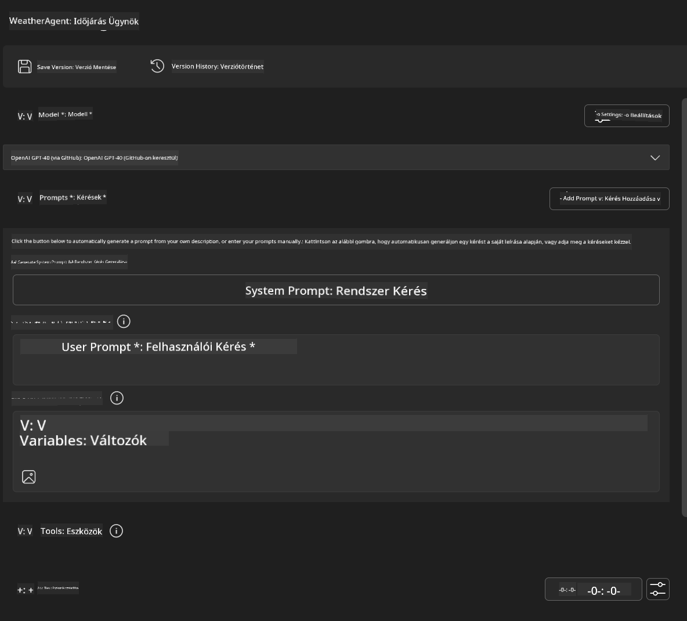
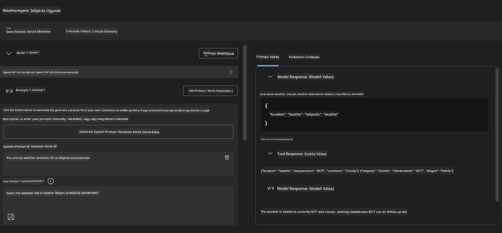

<!--
CO_OP_TRANSLATOR_METADATA:
{
  "original_hash": "dd8da3f75addcef453fe11f02a270217",
  "translation_date": "2025-06-10T06:17:27+00:00",
  "source_file": "10-StreamliningAIWorkflowsBuildingAnMCPServerWithAIToolkit/lab3/README.md",
  "language_code": "hu"
}
-->
# 🔧 Modul 3: Fejlett MCP Fejlesztés AI Toolkit-kel


## 🎯 Tanulási célok

A labor végére képes leszel:

- ✅ Egyedi MCP szervereket létrehozni az AI Toolkit segítségével
- ✅ Beállítani és használni a legújabb MCP Python SDK-t (v1.9.3)
- ✅ Telepíteni és használni az MCP Inspectort hibakereséshez
- ✅ Hibakeresni MCP szervereket mind az Agent Builder, mind az Inspector környezetben
- ✅ Megérteni a fejlett MCP szerverfejlesztési munkafolyamatokat

## 📋 Előfeltételek

- A 2. labor (MCP alapok) elvégzése
- VS Code AI Toolkit kiterjesztéssel
- Python 3.10+ környezet
- Node.js és npm az Inspector telepítéséhez

## 🏗️ Amit építeni fogsz

Ebben a laborban egy **Weather MCP Server**-t hozol létre, amely bemutatja:
- Egyedi MCP szerver megvalósítást
- Integrációt az AI Toolkit Agent Builderrel
- Professzionális hibakeresési munkafolyamatokat
- Modern MCP SDK használati mintákat

---

## 🔧 Fő komponensek áttekintése

### 🐍 MCP Python SDK  
A Model Context Protocol Python SDK az alapot nyújtja egyedi MCP szerverek építéséhez. A 1.9.3-as verziót használjuk, amely fejlettebb hibakeresési lehetőségeket kínál.

### 🔍 MCP Inspector  
Egy erőteljes hibakereső eszköz, amely:
- Valós idejű szerverfigyelést biztosít
- Eszközök futtatásának vizualizálását
- Hálózati kérések és válaszok ellenőrzését
- Interaktív tesztelési környezetet

---

## 📖 Lépésről lépésre megvalósítás

### 1. lépés: WeatherAgent létrehozása az Agent Builderben

1. **Indítsd el az Agent Buildert** a VS Code AI Toolkit kiterjesztésén keresztül  
2. **Hozz létre egy új agentet** az alábbi beállításokkal:  
   - Agent név: `WeatherAgent`



### 2. lépés: MCP szerver projekt inicializálása

1. **Navigálj a Tools → Add Tool menüpontra** az Agent Builderben  
2. **Válaszd az "MCP Server" lehetőséget**  
3. **Válaszd a "Create A new MCP Server" opciót**  
4. **Válaszd ki a `python-weather` sablont**  
5. **Nevezd el a szervert:** `weather_mcp`


### 3. lépés: Projekt megnyitása és átnézése

1. **Nyisd meg a létrehozott projektet** VS Code-ban  
2. **Tekintsd át a projekt struktúráját:**  
   ```
   weather_mcp/
   ├── src/
   │   ├── __init__.py
   │   └── server.py
   ├── inspector/
   │   ├── package.json
   │   └── package-lock.json
   ├── .vscode/
   │   ├── launch.json
   │   └── tasks.json
   ├── pyproject.toml
   └── README.md
   ```

### 4. lépés: Frissítés a legújabb MCP SDK-ra

> **🔍 Miért frissítsünk?** A legújabb MCP SDK-t (v1.9.3) és Inspector szolgáltatást (0.14.0) szeretnénk használni a fejlettebb funkciók és jobb hibakeresés érdekében.

#### 4a. Python függőségek frissítése

**Szerkeszd a `pyproject.toml`:** update [./code/weather_mcp/pyproject.toml](../../../../10-StreamliningAIWorkflowsBuildingAnMCPServerWithAIToolkit/lab3/code/weather_mcp/pyproject.toml)


#### 4b. Update Inspector Configuration

**Edit `inspector/package.json`:** update [./code/weather_mcp/inspector/package.json](../../../../10-StreamliningAIWorkflowsBuildingAnMCPServerWithAIToolkit/lab3/code/weather_mcp/inspector/package.json)

#### 4c. Update Inspector Dependencies

**Edit `inspector/package-lock.json`:** update [./code/weather_mcp/inspector/package-lock.json](../../../../10-StreamliningAIWorkflowsBuildingAnMCPServerWithAIToolkit/lab3/code/weather_mcp/inspector/package-lock.json)

> **📝 Note:** This file contains extensive dependency definitions. Below is the essential structure - the full content ensures proper dependency resolution.


> **⚡ Full Package Lock:** The complete package-lock.json contains ~3000 lines of dependency definitions. The above shows the key structure - use the provided file for complete dependency resolution.

### Step 5: Configure VS Code Debugging

*Note: Please copy the file in the specified path to replace the corresponding local file*

#### 5a. Update Launch Configuration

**Edit `.vscode/launch.json` fájlokat:**

```json
{
  "version": "0.2.0",
  "configurations": [
    {
      "name": "Attach to Local MCP",
      "type": "debugpy",
      "request": "attach",
      "connect": {
        "host": "localhost",
        "port": 5678
      },
      "presentation": {
        "hidden": true
      },
      "internalConsoleOptions": "neverOpen",
      "postDebugTask": "Terminate All Tasks"
    },
    {
      "name": "Launch Inspector (Edge)",
      "type": "msedge",
      "request": "launch",
      "url": "http://localhost:6274?timeout=60000&serverUrl=http://localhost:3001/sse#tools",
      "cascadeTerminateToConfigurations": [
        "Attach to Local MCP"
      ],
      "presentation": {
        "hidden": true
      },
      "internalConsoleOptions": "neverOpen"
    },
    {
      "name": "Launch Inspector (Chrome)",
      "type": "chrome",
      "request": "launch",
      "url": "http://localhost:6274?timeout=60000&serverUrl=http://localhost:3001/sse#tools",
      "cascadeTerminateToConfigurations": [
        "Attach to Local MCP"
      ],
      "presentation": {
        "hidden": true
      },
      "internalConsoleOptions": "neverOpen"
    }
  ],
  "compounds": [
    {
      "name": "Debug in Agent Builder",
      "configurations": [
        "Attach to Local MCP"
      ],
      "preLaunchTask": "Open Agent Builder",
    },
    {
      "name": "Debug in Inspector (Edge)",
      "configurations": [
        "Launch Inspector (Edge)",
        "Attach to Local MCP"
      ],
      "preLaunchTask": "Start MCP Inspector",
      "stopAll": true
    },
    {
      "name": "Debug in Inspector (Chrome)",
      "configurations": [
        "Launch Inspector (Chrome)",
        "Attach to Local MCP"
      ],
      "preLaunchTask": "Start MCP Inspector",
      "stopAll": true
    }
  ]
}
```

**Szerkeszd a `.vscode/tasks.json` fájlt:**

```
{
  "version": "2.0.0",
  "tasks": [
    {
      "label": "Start MCP Server",
      "type": "shell",
      "command": "python -m debugpy --listen 127.0.0.1:5678 src/__init__.py sse",
      "isBackground": true,
      "options": {
        "cwd": "${workspaceFolder}",
        "env": {
          "PORT": "3001"
        }
      },
      "problemMatcher": {
        "pattern": [
          {
            "regexp": "^.*$",
            "file": 0,
            "location": 1,
            "message": 2
          }
        ],
        "background": {
          "activeOnStart": true,
          "beginsPattern": ".*",
          "endsPattern": "Application startup complete|running"
        }
      }
    },
    {
      "label": "Start MCP Inspector",
      "type": "shell",
      "command": "npm run dev:inspector",
      "isBackground": true,
      "options": {
        "cwd": "${workspaceFolder}/inspector",
        "env": {
          "CLIENT_PORT": "6274",
          "SERVER_PORT": "6277",
        }
      },
      "problemMatcher": {
        "pattern": [
          {
            "regexp": "^.*$",
            "file": 0,
            "location": 1,
            "message": 2
          }
        ],
        "background": {
          "activeOnStart": true,
          "beginsPattern": "Starting MCP inspector",
          "endsPattern": "Proxy server listening on port"
        }
      },
      "dependsOn": [
        "Start MCP Server"
      ]
    },
    {
      "label": "Open Agent Builder",
      "type": "shell",
      "command": "echo ${input:openAgentBuilder}",
      "presentation": {
        "reveal": "never"
      },
      "dependsOn": [
        "Start MCP Server"
      ],
    },
    {
      "label": "Terminate All Tasks",
      "command": "echo ${input:terminate}",
      "type": "shell",
      "problemMatcher": []
    }
  ],
  "inputs": [
    {
      "id": "openAgentBuilder",
      "type": "command",
      "command": "ai-mlstudio.agentBuilder",
      "args": {
        "initialMCPs": [ "local-server-weather_mcp" ],
        "triggeredFrom": "vsc-tasks"
      }
    },
    {
      "id": "terminate",
      "type": "command",
      "command": "workbench.action.tasks.terminate",
      "args": "terminateAll"
    }
  ]
}
```


---

## 🚀 MCP szerver futtatása és tesztelése

### 6. lépés: Függőségek telepítése

A konfigurációs módosítások után futtasd a következő parancsokat:

**Python függőségek telepítése:**  
```bash
uv sync
```

**Inspector függőségek telepítése:**  
```bash
cd inspector
npm install
```

### 7. lépés: Hibakeresés Agent Builderrel

1. **Nyomd meg az F5-öt** vagy válaszd a **"Debug in Agent Builder"** konfigurációt  
2. **Válaszd ki az összetett konfigurációt** a hibakereső panelen  
3. **Várd meg, amíg elindul a szerver és megnyílik az Agent Builder**  
4. **Teszteld az időjárás MCP szervert természetes nyelvű lekérdezésekkel**

Például ilyen bemenettel:

SYSTEM_PROMPT

```
You are my weather assistant
```

USER_PROMPT

```
How's the weather like in Seattle
```



### 8. lépés: Hibakeresés MCP Inspectorral

1. **Használd a "Debug in Inspector" konfigurációt** (Edge vagy Chrome böngészőben)  
2. **Nyisd meg az Inspector felületét** a `http://localhost:6274` címen  
3. **Fedezd fel az interaktív tesztelési környezetet:**  
   - Elérhető eszközök megtekintése  
   - Eszközök futtatásának tesztelése  
   - Hálózati kérések figyelése  
   - Szerver válaszainak hibakeresése


---

## 🎯 Fő tanulságok

A labor elvégzése után:

- [x] **Létrehoztál egyedi MCP szervert** AI Toolkit sablonok használatával  
- [x] **Frissítettél a legújabb MCP SDK-ra** (v1.9.3) a bővített funkciókért  
- [x] **Beállítottál professzionális hibakeresési munkafolyamatokat** mind Agent Builderben, mind Inspectorban  
- [x] **Telepítetted az MCP Inspectort** az interaktív szerverteszteléshez  
- [x] **Megtapasztaltad a VS Code hibakeresési konfigurációit** MCP fejlesztéshez

## 🔧 Feltárt fejlett funkciók

| Funkció | Leírás | Használati eset |
|---------|---------|-----------------|
| **MCP Python SDK v1.9.3** | Legújabb protokoll implementáció | Modern szerverfejlesztés |
| **MCP Inspector 0.14.0** | Interaktív hibakereső eszköz | Valós idejű szervertesztelés |
| **VS Code hibakeresés** | Integrált fejlesztői környezet | Professzionális hibakeresési munkafolyamat |
| **Agent Builder integráció** | Közvetlen AI Toolkit kapcsolat | Teljes körű agent tesztelés |

## 📚 További források

- [MCP Python SDK dokumentáció](https://modelcontextprotocol.io/docs/sdk/python)  
- [AI Toolkit kiterjesztés útmutató](https://code.visualstudio.com/docs/ai/ai-toolkit)  
- [VS Code hibakeresési dokumentáció](https://code.visualstudio.com/docs/editor/debugging)  
- [Model Context Protocol specifikáció](https://modelcontextprotocol.io/docs/concepts/architecture)

---

**🎉 Gratulálunk!** Sikeresen befejezted a 3. laboratóriumot, és most már képes vagy egyedi MCP szervereket létrehozni, hibakeresni és éles környezetbe telepíteni professzionális fejlesztési munkafolyamatok segítségével.

### 🔜 Folytatás a következő modullal

Készen állsz, hogy a megszerzett MCP tudásodat valós fejlesztési munkafolyamatokban is használd? Folytasd a **[4. modul: Gyakorlati MCP fejlesztés – Egyedi GitHub klón szerver](../lab4/README.md)**-hez, ahol:  
- Egy éles környezetbe alkalmas MCP szervert építesz, amely automatizálja a GitHub tároló műveleteket  
- Megvalósítod a GitHub tároló klónozását MCP-n keresztül  
- Integrálod az egyedi MCP szervereket VS Code-dal és GitHub Copilot Agent Mode-dal  
- Teszteled és telepíted az egyedi MCP szervereket éles környezetben  
- Megtanulod a fejlesztők számára hasznos munkafolyamat-automatizálást

**Felelősségkizárás**:  
Ez a dokumentum az AI fordító szolgáltatás, a [Co-op Translator](https://github.com/Azure/co-op-translator) segítségével készült. Bár törekszünk a pontosságra, kérjük, vegye figyelembe, hogy az automatikus fordítások hibákat vagy pontatlanságokat tartalmazhatnak. Az eredeti dokumentum az anyanyelvén tekintendő hiteles forrásnak. Kritikus információk esetén javasolt professzionális, emberi fordítást igénybe venni. Nem vállalunk felelősséget a fordítás használatából eredő félreértésekért vagy téves értelmezésekért.