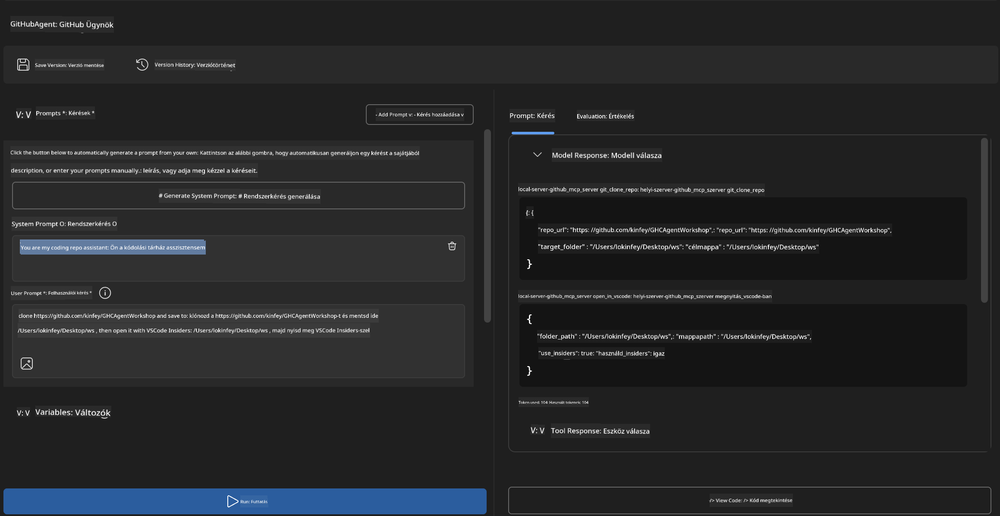
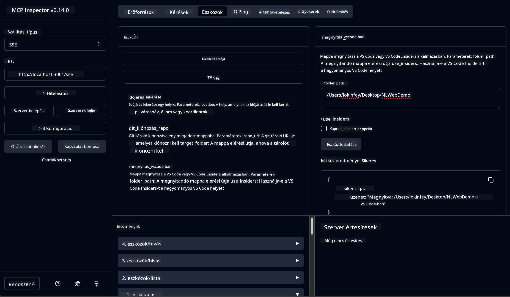

<!--
CO_OP_TRANSLATOR_METADATA:
{
  "original_hash": "f83bc722dc758efffd68667d6a1db470",
  "translation_date": "2025-06-10T06:55:46+00:00",
  "source_file": "10-StreamliningAIWorkflowsBuildingAnMCPServerWithAIToolkit/lab4/README.md",
  "language_code": "hu"
}
-->
# 🐙 4. modul: Gyakorlati MCP fejlesztés – Egyedi GitHub klón szerver


> **⚡ Gyors indulás:** Építs egy éles használatra kész MCP szervert, amely automatizálja a GitHub repository klónozását és a VS Code integrációt mindössze 30 perc alatt!

## 🎯 Tanulási célok

A labor végére képes leszel:

- ✅ Egyedi MCP szervert létrehozni valós fejlesztési munkafolyamatokhoz
- ✅ GitHub repository klónozási funkciót megvalósítani MCP-n keresztül
- ✅ Egyedi MCP szervereket integrálni VS Code-dal és Agent Builderrel
- ✅ GitHub Copilot Agent Mode-ot használni egyedi MCP eszközökkel
- ✅ Tesztelni és éles környezetbe telepíteni egyedi MCP szervereket

## 📋 Előfeltételek

- Az 1-3. laborok teljesítése (MCP alapok és haladó fejlesztés)
- GitHub Copilot előfizetés ([ingyenes regisztráció elérhető](https://github.com/github-copilot/signup))
- VS Code AI Toolkit és GitHub Copilot bővítményekkel
- Telepített és konfigurált Git CLI

## 🏗️ Projekt áttekintés

### **Valós fejlesztési kihívás**
Fejlesztőként gyakran használjuk a GitHub-ot repositoryk klónozására és megnyitására VS Code-ban vagy VS Code Insiders-ben. Ez a kézi folyamat a következőket foglalja magában:
1. Terminál/parancssor megnyitása
2. Áthelyezkedés a kívánt könyvtárba
3. `git clone` parancs futtatása
4. VS Code megnyitása a klónozott könyvtárban

**Az MCP megoldásunk ezt egyetlen intelligens parancsba sűríti!**

### **Amit építeni fogsz**
Egy **GitHub Clone MCP Server** (`git_mcp_server`), amely a következőket nyújtja:

| Funkció | Leírás | Előny |
|---------|-------------|---------|
| 🔄 **Okos repository klónozás** | GitHub repo-k klónozása validációval | Automatikus hibakezelés |
| 📁 **Intelligens könyvtárkezelés** | Biztonságos könyvtár ellenőrzés és létrehozás | Felülírás megelőzése |
| 🚀 **Platformfüggetlen VS Code integráció** | Projektek megnyitása VS Code/Insiders-ben | Zökkenőmentes munkafolyamat |
| 🛡️ **Robosztus hibakezelés** | Hálózati, jogosultsági és elérési hibák kezelése | Éles környezetre kész megbízhatóság |

---

## 📖 Lépésről lépésre megvalósítás

### 1. lépés: GitHub Agent létrehozása az Agent Builderben

1. **Indítsd el az Agent Buildert** az AI Toolkit bővítményen keresztül
2. **Hozz létre egy új agentet** az alábbi konfigurációval:
   ```
   Agent Name: GitHubAgent
   ```

3. **Egyedi MCP szerver inicializálása:**
   - Navigálj a **Tools** → **Add Tool** → **MCP Server** menüpontra
   - Válaszd a **"Create A new MCP Server"** opciót
   - Válaszd a **Python sablont** a maximális rugalmasságért
   - **Szerver neve:** `git_mcp_server`

### 2. lépés: GitHub Copilot Agent Mode konfigurálása

1. **Nyisd meg a GitHub Copilotot** VS Code-ban (Ctrl/Cmd + Shift + P → "GitHub Copilot: Open")
2. **Válaszd ki az Agent Modelt** a Copilot felületen
3. **Válaszd a Claude 3.7 modellt** a jobb érvelési képességekért
4. **Kapcsold be az MCP integrációt** az eszközhozzáféréshez

> **💡 Profi tipp:** A Claude 3.7 kiválóan érti a fejlesztési munkafolyamatokat és a hibakezelési mintákat.

### 3. lépés: Az MCP szerver alapvető funkcióinak megvalósítása

**Használd a következő részletes promptot GitHub Copilot Agent Mode-ban:**

```
Create two MCP tools with the following comprehensive requirements:

🔧 TOOL A: clone_repository
Requirements:
- Clone any GitHub repository to a specified local folder
- Return the absolute path of the successfully cloned project
- Implement comprehensive validation:
  ✓ Check if target directory already exists (return error if exists)
  ✓ Validate GitHub URL format (https://github.com/user/repo)
  ✓ Verify git command availability (prompt installation if missing)
  ✓ Handle network connectivity issues
  ✓ Provide clear error messages for all failure scenarios

🚀 TOOL B: open_in_vscode
Requirements:
- Open specified folder in VS Code or VS Code Insiders
- Cross-platform compatibility (Windows/Linux/macOS)
- Use direct application launch (not terminal commands)
- Auto-detect available VS Code installations
- Handle cases where VS Code is not installed
- Provide user-friendly error messages

Additional Requirements:
- Follow MCP 1.9.3 best practices
- Include proper type hints and documentation
- Implement logging for debugging purposes
- Add input validation for all parameters
- Include comprehensive error handling
```

### 4. lépés: MCP szerver tesztelése

#### 4a. Tesztelés az Agent Builderben

1. **Indítsd el a hibakeresési konfigurációt** az Agent Builderben
2. **Állítsd be az agentet az alábbi rendszerprompttal:**

```
SYSTEM_PROMPT:
You are my intelligent coding repository assistant. You help developers efficiently clone GitHub repositories and set up their development environment. Always provide clear feedback about operations and handle errors gracefully.
```

3. **Teszteld valós felhasználói szcenáriókkal:**

```
USER_PROMPT EXAMPLES:

Scenario : Basic Clone and Open
"Clone {Your GitHub Repo link such as https://github.com/kinfey/GHCAgentWorkshop
 } and save to {The global path you specify}, then open it with VS Code Insiders"
```



**Várt eredmények:**
- ✅ Sikeres klónozás és elérési út megerősítése
- ✅ Automatikus VS Code indítás
- ✅ Egyértelmű hibaüzenetek érvénytelen helyzetekre
- ✅ Szélsőséges esetek helyes kezelése

#### 4b. Tesztelés az MCP Inspectorban



---

**🎉 Gratulálunk!** Sikeresen létrehoztál egy gyakorlati, éles környezetbe telepíthető MCP szervert, amely megoldja a valós fejlesztési munkafolyamatok kihívásait. Az egyedi GitHub klón szervered bizonyítja az MCP erejét a fejlesztői hatékonyság automatizálásában és fejlesztésében.

### 🏆 Elért eredmények:
- ✅ **MCP fejlesztő** – Egyedi MCP szerver létrehozása
- ✅ **Munkafolyamat automatizáló** – Fejlesztési folyamatok egyszerűsítése  
- ✅ **Integrációs szakértő** – Több fejlesztői eszköz összekapcsolása
- ✅ **Éles környezetre kész** – Telepíthető megoldások építése

---

## 🎓 Workshop befejezése: Az utad a Model Context Protocol-lal

**Kedves Workshop résztvevő!**

Gratulálunk, hogy végigcsináltad a Model Context Protocol workshop négy modulját! Hosszú utat tettél meg az AI Toolkit alapjainak megértésétől az éles használatra kész MCP szerverek építéséig, amelyek valós fejlesztési kihívásokat oldanak meg.

### 🚀 Tanulási út összefoglaló:

**[1. modul](../lab1/README.md):** Megismerted az AI Toolkit alapjait, modellek tesztelését és az első AI agent létrehozását.

**[2. modul](../lab2/README.md):** Megtanultad az MCP architektúrát, integráltad a Playwright MCP-t és elkészítetted az első böngészőautomatizáló agentet.

**[3. modul](../lab3/README.md):** Haladó MCP szerverfejlesztést sajátítottál el a Weather MCP szerverrel és a hibakereső eszközökkel.

**[4. modul](../lab4/README.md):** Most mindezt egy gyakorlati GitHub repository munkafolyamat automatizáló eszköz létrehozására alkalmaztad.

### 🌟 Amit elsajátítottál:

- ✅ **AI Toolkit ökoszisztéma:** Modellek, agentek és integrációs minták
- ✅ **MCP architektúra:** Kliens-szerver felépítés, kommunikációs protokollok és biztonság
- ✅ **Fejlesztői eszközök:** Playground, Inspector és éles telepítés
- ✅ **Egyedi fejlesztés:** Saját MCP szerverek építése, tesztelése és üzemeltetése
- ✅ **Gyakorlati alkalmazások:** Valós munkafolyamatok AI-alapú megoldása

### 🔮 Következő lépések:

1. **Építsd meg saját MCP szervered:** Használd ezeket a képességeket egyedi munkafolyamataid automatizálására
2. **Csatlakozz az MCP közösséghez:** Oszd meg alkotásaidat és tanulj másoktól
3. **Fedezd fel a haladó integrációkat:** Kapcsold össze MCP szervereidet vállalati rendszerekkel
4. **Járulj hozzá nyílt forráshoz:** Segíts az MCP eszközök és dokumentáció fejlesztésében

Ne feledd, ez a workshop csak a kezdet. A Model Context Protocol ökoszisztéma gyorsan fejlődik, és most már felkészült vagy arra, hogy az AI-alapú fejlesztőeszközök élvonalában légy.

**Köszönjük a részvételed és a tanulás iránti elkötelezettséged!**

Reméljük, hogy ez a workshop inspirációt adott arra, hogyan építs és használj AI eszközöket fejlesztési utadon.

**Jó kódolást!**

---

**Felelősségkizárás**:  
Ezt a dokumentumot az AI fordító szolgáltatás, a [Co-op Translator](https://github.com/Azure/co-op-translator) segítségével fordítottuk le. Bár a pontosságra törekszünk, kérjük, vegye figyelembe, hogy az automatikus fordítások tartalmazhatnak hibákat vagy pontatlanságokat. Az eredeti dokumentum az anyanyelvén tekintendő hiteles forrásnak. Fontos információk esetén javasolt szakmai, emberi fordítást igénybe venni. Nem vállalunk felelősséget az ebből a fordításból eredő félreértésekért vagy téves értelmezésekért.