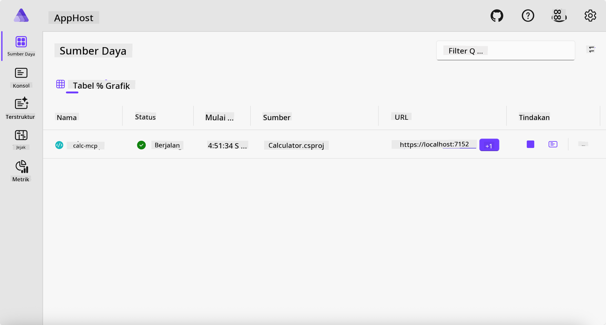

<!--
CO_OP_TRANSLATOR_METADATA:
{
  "original_hash": "0bc7bd48f55f1565f1d95ccb2c16f728",
  "translation_date": "2025-06-18T07:51:57+00:00",
  "source_file": "04-PracticalImplementation/samples/csharp/README.md",
  "language_code": "id"
}
-->
# Contoh

Contoh sebelumnya menunjukkan cara menggunakan proyek .NET lokal dengan tipe `stdio`. Dan bagaimana menjalankan server secara lokal di dalam container. Ini adalah solusi yang baik dalam banyak situasi. Namun, terkadang berguna jika server dijalankan secara remote, seperti di lingkungan cloud. Di sinilah tipe `http` berperan.

Melihat solusi di folder `04-PracticalImplementation`, mungkin terlihat jauh lebih kompleks dibandingkan yang sebelumnya. Tapi sebenarnya tidak demikian. Jika Anda perhatikan proyek `src/Calculator`, Anda akan melihat bahwa sebagian besar kodenya sama dengan contoh sebelumnya. Perbedaannya hanya kita menggunakan library berbeda `ModelContextProtocol.AspNetCore` untuk menangani permintaan HTTP. Dan kita mengubah metode `IsPrime` menjadi private, hanya untuk menunjukkan bahwa Anda bisa memiliki metode private dalam kode Anda. Sisanya sama seperti sebelumnya.

Proyek lain berasal dari [.NET Aspire](https://learn.microsoft.com/dotnet/aspire/get-started/aspire-overview). Memiliki .NET Aspire dalam solusi akan meningkatkan pengalaman pengembang saat mengembangkan dan menguji serta membantu dengan observabilitas. Ini tidak wajib untuk menjalankan server, tapi merupakan praktik baik untuk menyertakannya dalam solusi Anda.

## Mulai server secara lokal

1. Dari VS Code (dengan ekstensi C# DevKit), navigasikan ke direktori `04-PracticalImplementation/samples/csharp`.
1. Jalankan perintah berikut untuk memulai server:

   ```bash
    dotnet watch run --project ./src/AppHost
   ```

1. Ketika browser web membuka dashboard .NET Aspire, catat URL `http`. Seharusnya seperti `http://localhost:5058/`.

   

## Uji Streamable HTTP dengan MCP Inspector

Jika Anda menggunakan Node.js versi 22.7.5 ke atas, Anda dapat menggunakan MCP Inspector untuk menguji server Anda.

Mulai server dan jalankan perintah berikut di terminal:

```bash
npx @modelcontextprotocol/inspector http://localhost:5058
```


- Pilih `Streamable HTTP` as the Transport type.
- In the Url field, enter the URL of the server noted earlier, and append `/mcp`. Seharusnya itu adalah `http` (bukan `https`) something like `http://localhost:5058/mcp`.
- select the Connect button.

A nice thing about the Inspector is that it provide a nice visibility on what is happening.

- Try listing the available tools
- Try some of them, it should works just like before.

## Test MCP Server with GitHub Copilot Chat in VS Code

To use the Streamable HTTP transport with GitHub Copilot Chat, change the configuration of the `calc-mcp` server yang dibuat sebelumnya agar terlihat seperti ini:

```jsonc
// .vscode/mcp.json
{
  "servers": {
    "calc-mcp": {
      "type": "http",
      "url": "http://localhost:5058/mcp"
    }
  }
}
```

Lakukan beberapa pengujian:

- Minta "3 bilangan prima setelah 6780". Perhatikan bagaimana Copilot akan menggunakan tools baru `NextFivePrimeNumbers` dan hanya mengembalikan 3 bilangan prima pertama.
- Minta "7 bilangan prima setelah 111", untuk melihat apa yang terjadi.
- Minta "John memiliki 24 permen dan ingin membagikannya ke 3 anaknya. Berapa banyak permen yang didapat setiap anak?", untuk melihat hasilnya.

## Deploy server ke Azure

Mari kita deploy server ke Azure agar lebih banyak orang bisa menggunakannya.

Dari terminal, navigasikan ke folder `04-PracticalImplementation/samples/csharp` dan jalankan perintah berikut:

```bash
azd up
```

Setelah proses deploy selesai, Anda akan melihat pesan seperti ini:


Ambil URL tersebut dan gunakan di MCP Inspector serta di GitHub Copilot Chat.

```jsonc
// .vscode/mcp.json
{
  "servers": {
    "calc-mcp": {
      "type": "http",
      "url": "https://calc-mcp.gentleriver-3977fbcf.australiaeast.azurecontainerapps.io/mcp"
    }
  }
}
```

## Selanjutnya?

Kita mencoba berbagai tipe transport dan alat pengujian. Kita juga deploy server MCP Anda ke Azure. Tapi bagaimana jika server kita perlu mengakses sumber daya privat? Misalnya, database atau API privat? Di bab berikutnya, kita akan melihat bagaimana kita bisa meningkatkan keamanan server kita.

**Penafian**:  
Dokumen ini telah diterjemahkan menggunakan layanan terjemahan AI [Co-op Translator](https://github.com/Azure/co-op-translator). Meskipun kami berupaya untuk mencapai akurasi, harap diketahui bahwa terjemahan otomatis mungkin mengandung kesalahan atau ketidakakuratan. Dokumen asli dalam bahasa aslinya harus dianggap sebagai sumber yang berwenang. Untuk informasi penting, disarankan menggunakan terjemahan profesional oleh manusia. Kami tidak bertanggung jawab atas kesalahpahaman atau penafsiran yang keliru yang timbul dari penggunaan terjemahan ini.