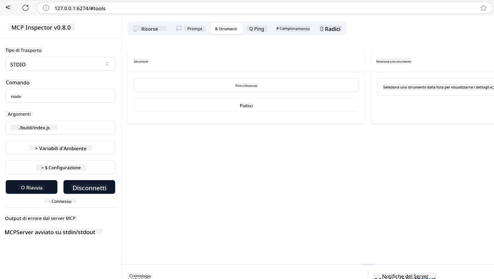

<!--
CO_OP_TRANSLATOR_METADATA:
{
  "original_hash": "37563349cd6894fe00489bf3b4d488ae",
  "translation_date": "2025-06-02T10:33:30+00:00",
  "source_file": "03-GettingStarted/01-first-server/README.md",
  "language_code": "it"
}
-->
### -2- Creare il progetto

Ora che hai installato l’SDK, creiamo il progetto:

### -3- Creare i file del progetto

### -4- Creare il codice del server

### -5- Aggiungere uno strumento e una risorsa

Aggiungi uno strumento e una risorsa inserendo il seguente codice:

### -6 Codice finale

Aggiungiamo l’ultimo pezzo di codice necessario per far partire il server:

### -7- Testare il server

Avvia il server con il seguente comando:

### -8- Eseguire usando l’inspector

L’inspector è uno strumento molto utile che può avviare il server e ti permette di interagire con esso per testarne il funzionamento. Avviamolo:

> [!NOTE]
> potrebbe apparire diverso nel campo "command" poiché contiene il comando per eseguire un server con il runtime specifico che stai usando

Dovresti vedere questa interfaccia utente:

1. Connettiti al server selezionando il pulsante Connect  
   Una volta connesso, dovresti vedere quanto segue:

   

2. Seleziona "Tools" e poi "listTools", vedrai apparire "Add", seleziona "Add" e inserisci i valori dei parametri.

   Dovresti ricevere questa risposta, cioè il risultato dello strumento "add":

   

Complimenti, hai creato e avviato con successo il tuo primo server!

### SDK ufficiali

MCP offre SDK ufficiali per diversi linguaggi:
- [C# SDK](https://github.com/modelcontextprotocol/csharp-sdk) - Mantenuto in collaborazione con Microsoft
- [Java SDK](https://github.com/modelcontextprotocol/java-sdk) - Mantenuto in collaborazione con Spring AI
- [TypeScript SDK](https://github.com/modelcontextprotocol/typescript-sdk) - Implementazione ufficiale TypeScript
- [Python SDK](https://github.com/modelcontextprotocol/python-sdk) - Implementazione ufficiale Python
- [Kotlin SDK](https://github.com/modelcontextprotocol/kotlin-sdk) - Implementazione ufficiale Kotlin
- [Swift SDK](https://github.com/modelcontextprotocol/swift-sdk) - Mantenuto in collaborazione con Loopwork AI
- [Rust SDK](https://github.com/modelcontextprotocol/rust-sdk) - Implementazione ufficiale Rust

## Punti chiave

- Configurare un ambiente di sviluppo MCP è semplice grazie agli SDK specifici per linguaggio
- Costruire server MCP significa creare e registrare strumenti con schemi chiari
- Testare e fare debug è fondamentale per implementazioni MCP affidabili

## Esempi

- [Calcolatrice Java](../samples/java/calculator/README.md)
- [Calcolatrice .Net](../../../../03-GettingStarted/samples/csharp)
- [Calcolatrice JavaScript](../samples/javascript/README.md)
- [Calcolatrice TypeScript](../samples/typescript/README.md)
- [Calcolatrice Python](../../../../03-GettingStarted/samples/python)

## Esercizio

Crea un semplice server MCP con uno strumento a tua scelta:  
1. Implementa lo strumento nel linguaggio che preferisci (.NET, Java, Python o JavaScript).  
2. Definisci i parametri di input e i valori di ritorno.  
3. Usa lo strumento inspector per verificare che il server funzioni correttamente.  
4. Testa l’implementazione con diversi input.

## Soluzione

[Soluzione](./solution/README.md)

## Risorse aggiuntive

- [Repository MCP su GitHub](https://github.com/microsoft/mcp-for-beginners)

## Cosa fare dopo

Prossimo: [Getting Started with MCP Clients](/03-GettingStarted/02-client/README.md)

**Disclaimer**:  
Questo documento è stato tradotto utilizzando il servizio di traduzione automatica AI [Co-op Translator](https://github.com/Azure/co-op-translator). Pur impegnandoci per l’accuratezza, si prega di considerare che le traduzioni automatiche possono contenere errori o imprecisioni. Il documento originale nella sua lingua nativa deve essere considerato la fonte autorevole. Per informazioni critiche, si raccomanda la traduzione professionale effettuata da un esperto umano. Non ci assumiamo alcuna responsabilità per eventuali fraintendimenti o interpretazioni errate derivanti dall’uso di questa traduzione.