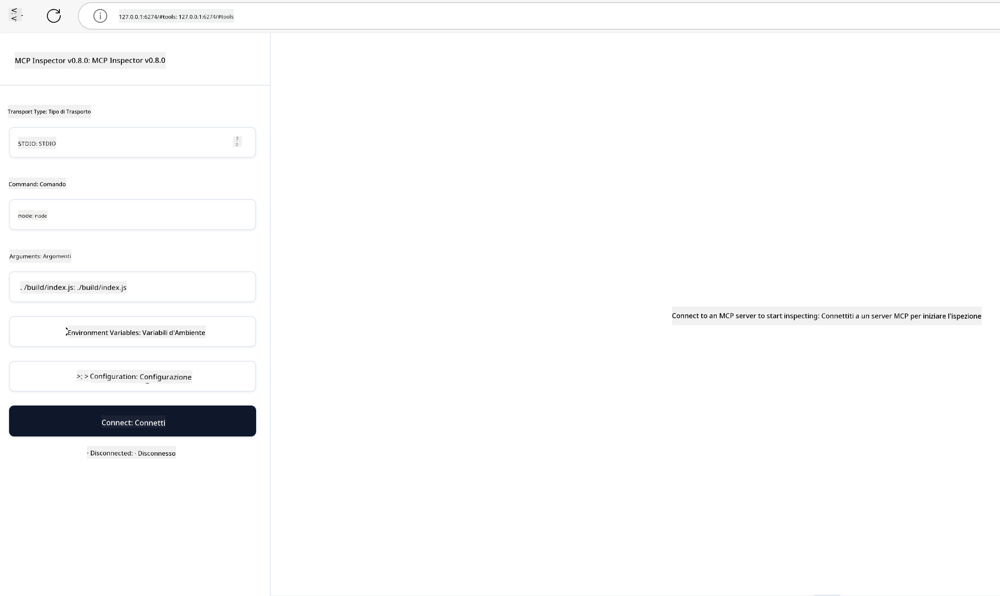

<!--
CO_OP_TRANSLATOR_METADATA:
{
  "original_hash": "e650db55873b456296a9c620069e2f71",
  "translation_date": "2025-06-02T11:08:29+00:00",
  "source_file": "03-GettingStarted/01-first-server/README.md",
  "language_code": "it"
}
-->
### -2- Crea il progetto

Ora che hai installato il SDK, creiamo il progetto: 

### -3- Crea i file del progetto

### -4- Scrivi il codice del server

### -5- Aggiungi uno strumento e una risorsa

Aggiungi uno strumento e una risorsa inserendo il seguente codice: 

### -6 Codice finale

Aggiungiamo l'ultimo pezzo di codice necessario per far partire il server: 

### -7- Testa il server

Avvia il server con il seguente comando: 

### -8- Esegui usando l'inspector

L'inspector è uno strumento molto utile che avvia il server e ti permette di interagire con esso per testarne il funzionamento. Avviamolo:

> [!NOTE]
> il campo "command" potrebbe apparire diverso in base al runtime specifico che stai utilizzando

Dovresti vedere questa interfaccia utente:

1. Connettiti al server selezionando il pulsante Connect  
   Una volta connesso, vedrai la seguente schermata:

   

2. Seleziona "Tools" e poi "listTools", vedrai apparire "Add". Seleziona "Add" e inserisci i valori dei parametri.

   Dovresti vedere la risposta seguente, cioè il risultato dello strumento "add":

   

Complimenti, hai creato ed eseguito con successo il tuo primo server!

### SDK ufficiali

MCP offre SDK ufficiali per diversi linguaggi:
- [C# SDK](https://github.com/modelcontextprotocol/csharp-sdk) - Mantenuto in collaborazione con Microsoft
- [Java SDK](https://github.com/modelcontextprotocol/java-sdk) - Mantenuto in collaborazione con Spring AI
- [TypeScript SDK](https://github.com/modelcontextprotocol/typescript-sdk) - Implementazione ufficiale in TypeScript
- [Python SDK](https://github.com/modelcontextprotocol/python-sdk) - Implementazione ufficiale in Python
- [Kotlin SDK](https://github.com/modelcontextprotocol/kotlin-sdk) - Implementazione ufficiale in Kotlin
- [Swift SDK](https://github.com/modelcontextprotocol/swift-sdk) - Mantenuto in collaborazione con Loopwork AI
- [Rust SDK](https://github.com/modelcontextprotocol/rust-sdk) - Implementazione ufficiale in Rust

## Punti chiave

- Configurare un ambiente di sviluppo MCP è semplice grazie agli SDK specifici per linguaggio
- Costruire server MCP significa creare e registrare strumenti con schemi chiari
- Testare e fare debug è fondamentale per implementazioni MCP affidabili

## Esempi 

- [Java Calculator](../samples/java/calculator/README.md)
- [.Net Calculator](../../../../03-GettingStarted/samples/csharp)
- [JavaScript Calculator](../samples/javascript/README.md)
- [TypeScript Calculator](../samples/typescript/README.md)
- [Python Calculator](../../../../03-GettingStarted/samples/python)

## Compito

Crea un server MCP semplice con uno strumento a tua scelta:
1. Implementa lo strumento nel linguaggio che preferisci (.NET, Java, Python o JavaScript).
2. Definisci i parametri di input e i valori di ritorno.
3. Esegui lo strumento inspector per verificare che il server funzioni correttamente.
4. Testa l’implementazione con diversi input.

## Soluzione

[Soluzione](./solution/README.md)

## Risorse aggiuntive

- [Repository MCP su GitHub](https://github.com/microsoft/mcp-for-beginners)

## Cosa fare dopo

Successivo: [Getting Started with MCP Clients](/03-GettingStarted/02-client/README.md)

**Disclaimer**:  
Questo documento è stato tradotto utilizzando il servizio di traduzione automatica AI [Co-op Translator](https://github.com/Azure/co-op-translator). Pur impegnandoci per garantire accuratezza, si prega di notare che le traduzioni automatiche possono contenere errori o imprecisioni. Il documento originale nella sua lingua nativa deve essere considerato la fonte autorevole. Per informazioni critiche, si raccomanda una traduzione professionale effettuata da un umano. Non siamo responsabili per eventuali fraintendimenti o interpretazioni errate derivanti dall’uso di questa traduzione.