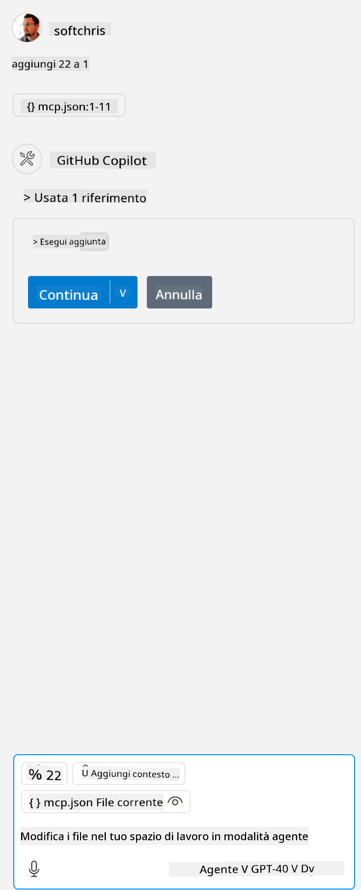

<!--
CO_OP_TRANSLATOR_METADATA:
{
  "original_hash": "54e9ffc5dba01afcb8880a9949fd1881",
  "translation_date": "2025-07-04T17:05:33+00:00",
  "source_file": "03-GettingStarted/04-vscode/README.md",
  "language_code": "it"
}
-->
Parliamo più nel dettaglio di come utilizzare l'interfaccia visiva nelle sezioni successive.

## Approccio

Ecco come dobbiamo procedere a grandi linee:

- Configurare un file per individuare il nostro MCP Server.
- Avviare/Connettersi al server per far sì che elenchi le sue funzionalità.
- Usare queste funzionalità tramite l'interfaccia GitHub Copilot Chat.

Perfetto, ora che abbiamo capito il flusso, proviamo a usare un MCP Server tramite Visual Studio Code con un esercizio.

## Esercizio: Consumare un server

In questo esercizio configureremo Visual Studio Code per trovare il tuo MCP server in modo che possa essere usato dall'interfaccia GitHub Copilot Chat.

### -0- Passo preliminare, abilitare la scoperta MCP Server

Potrebbe essere necessario abilitare la scoperta dei MCP Server.

1. Vai su `File -> Preferences -> Settings` in Visual Studio Code.

1. Cerca "MCP" e abilita `chat.mcp.discovery.enabled` nel file settings.json.

### -1- Creare il file di configurazione

Inizia creando un file di configurazione nella root del tuo progetto, ti servirà un file chiamato MCP.json da posizionare in una cartella chiamata .vscode. Dovrebbe essere così:

```text
.vscode
|-- mcp.json
```

Ora vediamo come aggiungere una voce per il server.

### -2- Configurare un server

Aggiungi il seguente contenuto a *mcp.json*:

```json
{
    "inputs": [],
    "servers": {
       "hello-mcp": {
           "command": "node",
           "args": [
               "build/index.js"
           ]
       }
    }
}
```

Qui sopra un esempio semplice di come avviare un server scritto in Node.js; per altri runtime indica il comando corretto per avviare il server usando `command` e `args`.

### -3- Avviare il server

Ora che hai aggiunto una voce, avvia il server:

1. Trova la tua voce in *mcp.json* e assicurati di vedere l'icona "play":

    

1. Clicca sull'icona "play", dovresti vedere l'icona degli strumenti in GitHub Copilot Chat aumentare il numero di strumenti disponibili. Se clicchi su questa icona, vedrai la lista degli strumenti registrati. Puoi selezionare/deselezionare ogni strumento a seconda se vuoi che GitHub Copilot li usi come contesto:

  

1. Per eseguire uno strumento, digita un prompt che corrisponda alla descrizione di uno dei tuoi strumenti, ad esempio un prompt come "add 22 to 1":

  

  Dovresti vedere una risposta che dice 23.

## Compito

Prova ad aggiungere una voce server al tuo file *mcp.json* e assicurati di poter avviare/fermare il server. Verifica anche di poter comunicare con gli strumenti sul tuo server tramite l'interfaccia GitHub Copilot Chat.

## Soluzione

[Soluzione](./solution/README.md)

## Punti Chiave

I punti chiave di questo capitolo sono i seguenti:

- Visual Studio Code è un ottimo client che ti permette di consumare diversi MCP Server e i loro strumenti.
- L'interfaccia GitHub Copilot Chat è il modo con cui interagisci con i server.
- Puoi richiedere all'utente input come chiavi API che possono essere passate al MCP Server configurando la voce server nel file *mcp.json*.

## Esempi

- [Calcolatrice Java](../samples/java/calculator/README.md)
- [Calcolatrice .Net](../../../../03-GettingStarted/samples/csharp)
- [Calcolatrice JavaScript](../samples/javascript/README.md)
- [Calcolatrice TypeScript](../samples/typescript/README.md)
- [Calcolatrice Python](../../../../03-GettingStarted/samples/python)

## Risorse Aggiuntive

- [Documentazione Visual Studio](https://code.visualstudio.com/docs/copilot/chat/mcp-servers)

## Cosa c'è dopo

- Prossimo: [Creare un SSE Server](../05-sse-server/README.md)

**Disclaimer**:  
Questo documento è stato tradotto utilizzando il servizio di traduzione automatica [Co-op Translator](https://github.com/Azure/co-op-translator). Pur impegnandoci per garantire accuratezza, si prega di notare che le traduzioni automatiche possono contenere errori o imprecisioni. Il documento originale nella sua lingua nativa deve essere considerato la fonte autorevole. Per informazioni critiche, si raccomanda una traduzione professionale effettuata da un umano. Non ci assumiamo alcuna responsabilità per eventuali malintesi o interpretazioni errate derivanti dall’uso di questa traduzione.