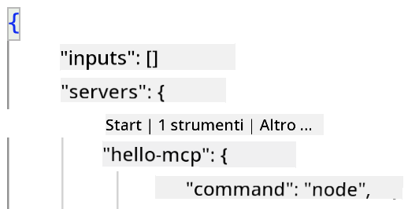
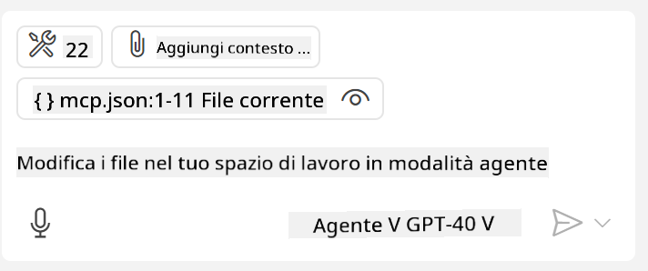

<!--
CO_OP_TRANSLATOR_METADATA:
{
  "original_hash": "8ea28e5e566edd5969337fd0b191ba3f",
  "translation_date": "2025-07-17T01:20:17+00:00",
  "source_file": "03-GettingStarted/04-vscode/README.md",
  "language_code": "it"
}
-->
# Consumare un server dalla modalità Agent di GitHub Copilot

Visual Studio Code e GitHub Copilot possono agire come client e consumare un MCP Server. Ti starai chiedendo perché dovremmo farlo? Beh, significa che tutte le funzionalità dell’MCP Server possono ora essere utilizzate direttamente dal tuo IDE. Immagina, ad esempio, di aggiungere il server MCP di GitHub: questo permetterebbe di controllare GitHub tramite prompt invece di digitare comandi specifici nel terminale. Oppure pensa a qualsiasi altra cosa che possa migliorare la tua esperienza da sviluppatore, tutto controllato tramite linguaggio naturale. Ora capisci il vantaggio, vero?

## Panoramica

Questa lezione spiega come usare Visual Studio Code e la modalità Agent di GitHub Copilot come client per il tuo MCP Server.

## Obiettivi di apprendimento

Al termine di questa lezione, sarai in grado di:

- Consumare un MCP Server tramite Visual Studio Code.
- Eseguire funzionalità come strumenti tramite GitHub Copilot.
- Configurare Visual Studio Code per trovare e gestire il tuo MCP Server.

## Utilizzo

Puoi controllare il tuo MCP server in due modi diversi:

- Interfaccia utente, vedrai come fare più avanti in questo capitolo.
- Terminale, è possibile controllare tutto dal terminale usando l’eseguibile `code`:

  Per aggiungere un MCP server al tuo profilo utente, usa l’opzione da riga di comando --add-mcp e fornisci la configurazione JSON del server nel formato {\"name\":\"server-name\",\"command\":...}.

  ```
  code --add-mcp "{\"name\":\"my-server\",\"command\": \"uvx\",\"args\": [\"mcp-server-fetch\"]}"
  ```

### Screenshot

  
  


Parliamo ora più nel dettaglio di come usare l’interfaccia visiva nelle sezioni successive.

## Approccio

Ecco come dobbiamo procedere a grandi linee:

- Configurare un file per trovare il nostro MCP Server.
- Avviare/Connettersi al server per far sì che elenchi le sue funzionalità.
- Usare queste funzionalità tramite l’interfaccia GitHub Copilot Chat.

Perfetto, ora che abbiamo capito il flusso, proviamo a usare un MCP Server tramite Visual Studio Code con un esercizio.

## Esercizio: Consumare un server

In questo esercizio configureremo Visual Studio Code per trovare il tuo MCP server in modo che possa essere usato dall’interfaccia GitHub Copilot Chat.

### -0- Passo preliminare, abilitare la scoperta del MCP Server

Potresti dover abilitare la scoperta dei MCP Server.

1. Vai su `File -> Preferences -> Settings` in Visual Studio Code.

1. Cerca "MCP" e abilita `chat.mcp.discovery.enabled` nel file settings.json.

### -1- Creare il file di configurazione

Inizia creando un file di configurazione nella root del tuo progetto, ti servirà un file chiamato MCP.json da posizionare nella cartella .vscode. Dovrebbe essere così:

```text
.vscode
|-- mcp.json
```

Ora vediamo come aggiungere una voce per il server.

### -2- Configurare un server

Aggiungi il seguente contenuto a *mcp.json*:

```json
{
    "inputs": [],
    "servers": {
       "hello-mcp": {
           "command": "node",
           "args": [
               "build/index.js"
           ]
       }
    }
}
```

Qui sopra un esempio semplice di come avviare un server scritto in Node.js; per altri runtime indica il comando corretto per avviare il server usando `command` e `args`.

### -3- Avviare il server

Ora che hai aggiunto una voce, avvia il server:

1. Trova la tua voce in *mcp.json* e assicurati di vedere l’icona "play":

    

1. Clicca sull’icona "play", dovresti vedere l’icona degli strumenti in GitHub Copilot Chat aumentare il numero di strumenti disponibili. Se clicchi su questa icona, vedrai la lista degli strumenti registrati. Puoi selezionare/deselezionare ogni strumento a seconda se vuoi che GitHub Copilot li usi come contesto:

  

1. Per eseguire uno strumento, digita un prompt che corrisponda alla descrizione di uno dei tuoi strumenti, ad esempio un prompt come "add 22 to 1":

  

  Dovresti vedere una risposta con il risultato 23.

## Compito

Prova ad aggiungere una voce server al tuo file *mcp.json* e assicurati di poter avviare/fermare il server. Verifica anche di poter comunicare con gli strumenti sul tuo server tramite l’interfaccia GitHub Copilot Chat.

## Soluzione

[Solution](./solution/README.md)

## Punti chiave

I punti chiave di questo capitolo sono:

- Visual Studio Code è un ottimo client che ti permette di consumare diversi MCP Server e i loro strumenti.
- L’interfaccia GitHub Copilot Chat è il modo con cui interagisci con i server.
- Puoi chiedere all’utente input come chiavi API che possono essere passate all’MCP Server quando configuri la voce server nel file *mcp.json*.

## Esempi

- [Java Calculator](../samples/java/calculator/README.md)
- [.Net Calculator](../../../../03-GettingStarted/samples/csharp)
- [JavaScript Calculator](../samples/javascript/README.md)
- [TypeScript Calculator](../samples/typescript/README.md)
- [Python Calculator](../../../../03-GettingStarted/samples/python)

## Risorse aggiuntive

- [Documentazione Visual Studio](https://code.visualstudio.com/docs/copilot/chat/mcp-servers)

## Cosa c’è dopo

- Successivo: [Creare un SSE Server](../05-sse-server/README.md)

**Disclaimer**:  
Questo documento è stato tradotto utilizzando il servizio di traduzione automatica [Co-op Translator](https://github.com/Azure/co-op-translator). Pur impegnandoci per garantire l’accuratezza, si prega di notare che le traduzioni automatiche possono contenere errori o imprecisioni. Il documento originale nella sua lingua nativa deve essere considerato la fonte autorevole. Per informazioni critiche, si raccomanda una traduzione professionale effettuata da un umano. Non ci assumiamo alcuna responsabilità per eventuali malintesi o interpretazioni errate derivanti dall’uso di questa traduzione.