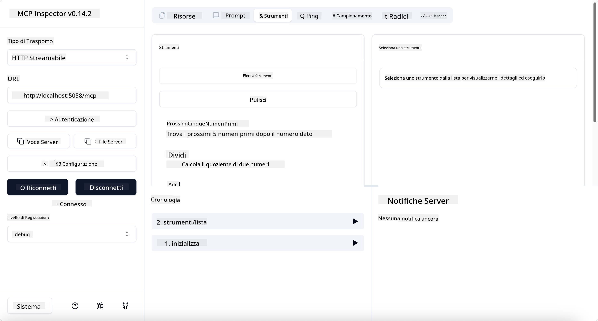

<!--
CO_OP_TRANSLATOR_METADATA:
{
  "original_hash": "0bc7bd48f55f1565f1d95ccb2c16f728",
  "translation_date": "2025-06-18T07:49:39+00:00",
  "source_file": "04-PracticalImplementation/samples/csharp/README.md",
  "language_code": "it"
}
-->
# Esempio

L'esempio precedente mostra come utilizzare un progetto .NET locale con il tipo `stdio`. E come eseguire il server localmente in un container. Questa è una buona soluzione in molte situazioni. Tuttavia, può essere utile avere il server in esecuzione da remoto, ad esempio in un ambiente cloud. Qui entra in gioco il tipo `http`.

Guardando la soluzione nella cartella `04-PracticalImplementation`, potrebbe sembrare molto più complessa della precedente. Ma in realtà non lo è. Se guardi attentamente il progetto `src/Calculator`, vedrai che è sostanzialmente lo stesso codice dell'esempio precedente. L'unica differenza è che stiamo usando una libreria diversa `ModelContextProtocol.AspNetCore` per gestire le richieste HTTP. E modifichiamo il metodo `IsPrime` rendendolo privato, solo per mostrare che nel tuo codice puoi avere metodi privati. Il resto del codice è uguale a prima.

Gli altri progetti provengono da [.NET Aspire](https://learn.microsoft.com/dotnet/aspire/get-started/aspire-overview). Avere .NET Aspire nella soluzione migliorerà l’esperienza dello sviluppatore durante lo sviluppo e il testing e aiuterà con l’osservabilità. Non è necessario per eseguire il server, ma è buona pratica averlo nella soluzione.

## Avviare il server localmente

1. Da VS Code (con l’estensione C# DevKit), naviga nella directory `04-PracticalImplementation/samples/csharp`.
1. Esegui il comando seguente per avviare il server:

   ```bash
    dotnet watch run --project ./src/AppHost
   ```

1. Quando un browser web apre la dashboard di .NET Aspire, prendi nota dell’URL `http`. Dovrebbe essere qualcosa come `http://localhost:5058/`.

   

## Testare Streamable HTTP con MCP Inspector

Se hai Node.js 22.7.5 o superiore, puoi usare MCP Inspector per testare il tuo server.

Avvia il server ed esegui il comando seguente in un terminale:

```bash
npx @modelcontextprotocol/inspector http://localhost:5058
```



- Seleziona `Streamable HTTP` as the Transport type.
- In the Url field, enter the URL of the server noted earlier, and append `/mcp`. Dovrebbe essere `http` (non `https`) something like `http://localhost:5058/mcp`.
- select the Connect button.

A nice thing about the Inspector is that it provide a nice visibility on what is happening.

- Try listing the available tools
- Try some of them, it should works just like before.

## Test MCP Server with GitHub Copilot Chat in VS Code

To use the Streamable HTTP transport with GitHub Copilot Chat, change the configuration of the `calc-mcp` server creato precedentemente per apparire così:

```jsonc
// .vscode/mcp.json
{
  "servers": {
    "calc-mcp": {
      "type": "http",
      "url": "http://localhost:5058/mcp"
    }
  }
}
```

Esegui alcuni test:

- Chiedi "3 numeri primi dopo 6780". Nota come Copilot utilizzerà i nuovi strumenti `NextFivePrimeNumbers` e restituirà solo i primi 3 numeri primi.
- Chiedi "7 numeri primi dopo 111", per vedere cosa succede.
- Chiedi "John ha 24 lecca-lecca e vuole distribuirli tutti ai suoi 3 figli. Quanti lecca-lecca riceve ciascun figlio?", per vedere cosa succede.

## Distribuire il server su Azure

Distribuiamo il server su Azure così più persone potranno usarlo.

Da un terminale, naviga nella cartella `04-PracticalImplementation/samples/csharp` ed esegui il comando seguente:

```bash
azd up
```

Al termine della distribuzione, dovresti vedere un messaggio come questo:


Prendi l’URL e usalo in MCP Inspector e in GitHub Copilot Chat.

```jsonc
// .vscode/mcp.json
{
  "servers": {
    "calc-mcp": {
      "type": "http",
      "url": "https://calc-mcp.gentleriver-3977fbcf.australiaeast.azurecontainerapps.io/mcp"
    }
  }
}
```

## Cosa c’è dopo?

Proviamo diversi tipi di trasporto e strumenti di test. Distribuiamo anche il tuo server MCP su Azure. Ma cosa succede se il nostro server deve accedere a risorse private? Per esempio, un database o un’API privata? Nel prossimo capitolo vedremo come possiamo migliorare la sicurezza del nostro server.

**Disclaimer**:  
Questo documento è stato tradotto utilizzando il servizio di traduzione automatica [Co-op Translator](https://github.com/Azure/co-op-translator). Pur impegnandoci per garantire l’accuratezza, si prega di considerare che le traduzioni automatiche possono contenere errori o imprecisioni. Il documento originale nella sua lingua madre deve essere considerato la fonte autorevole. Per informazioni critiche, si raccomanda la traduzione professionale effettuata da un umano. Non ci assumiamo alcuna responsabilità per eventuali malintesi o interpretazioni errate derivanti dall’uso di questa traduzione.