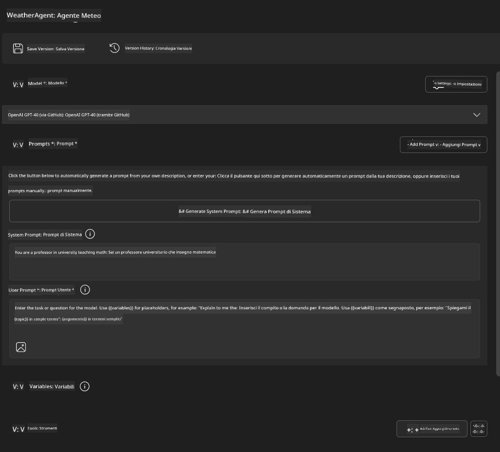
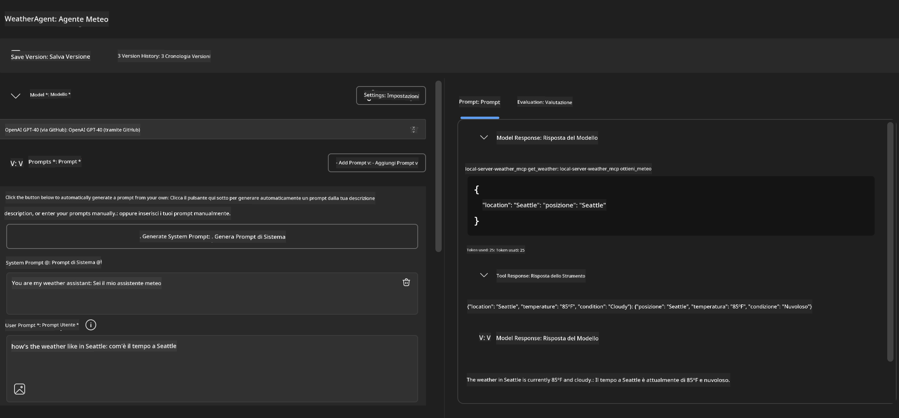
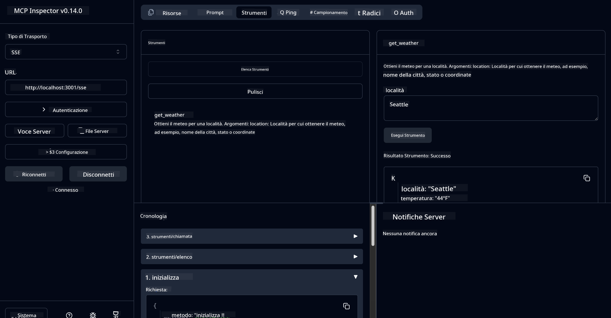

<!--
CO_OP_TRANSLATOR_METADATA:
{
  "original_hash": "dd8da3f75addcef453fe11f02a270217",
  "translation_date": "2025-06-10T06:10:02+00:00",
  "source_file": "10-StreamliningAIWorkflowsBuildingAnMCPServerWithAIToolkit/lab3/README.md",
  "language_code": "it"
}
-->
# 🔧 Modulo 3: Sviluppo Avanzato MCP con AI Toolkit


## 🎯 Obiettivi di Apprendimento

Al termine di questo laboratorio, sarai in grado di:

- ✅ Creare server MCP personalizzati usando AI Toolkit
- ✅ Configurare e utilizzare l’ultima versione del MCP Python SDK (v1.9.3)
- ✅ Configurare e utilizzare MCP Inspector per il debug
- ✅ Eseguire il debug dei server MCP sia in Agent Builder che in Inspector
- ✅ Comprendere i flussi di lavoro avanzati per lo sviluppo di server MCP

## 📋 Prerequisiti

- Completamento del Lab 2 (Fondamenti MCP)
- VS Code con estensione AI Toolkit installata
- Ambiente Python 3.10+ 
- Node.js e npm per la configurazione di Inspector

## 🏗️ Cosa Costruirai

In questo laboratorio, creerai un **Weather MCP Server** che dimostra:
- Implementazione personalizzata di un server MCP
- Integrazione con AI Toolkit Agent Builder
- Flussi di lavoro professionali per il debug
- Uso moderno del MCP SDK

---

## 🔧 Panoramica dei Componenti Principali

### 🐍 MCP Python SDK  
Il Model Context Protocol Python SDK fornisce la base per costruire server MCP personalizzati. Utilizzerai la versione 1.9.3 con funzionalità di debug migliorate.

### 🔍 MCP Inspector  
Uno strumento di debug potente che offre:
- Monitoraggio server in tempo reale
- Visualizzazione dell’esecuzione degli strumenti
- Ispezione delle richieste e risposte di rete
- Ambiente di test interattivo

---

## 📖 Implementazione Passo-Passo

### Passo 1: Crea un WeatherAgent in Agent Builder

1. **Avvia Agent Builder** in VS Code tramite l’estensione AI Toolkit  
2. **Crea un nuovo agente** con la seguente configurazione:  
   - Agent Name: `WeatherAgent`



### Passo 2: Inizializza il Progetto MCP Server

1. **Vai su Tools** → **Add Tool** in Agent Builder  
2. **Seleziona "MCP Server"** tra le opzioni disponibili  
3. **Scegli "Create A new MCP Server"**  
4. **Seleziona il template `python-weather`**  
5. **Dai un nome al tuo server:** `weather_mcp`


### Passo 3: Apri ed Esamina il Progetto

1. **Apri il progetto generato** in VS Code  
2. **Esamina la struttura del progetto:**  
   ```
   weather_mcp/
   ├── src/
   │   ├── __init__.py
   │   └── server.py
   ├── inspector/
   │   ├── package.json
   │   └── package-lock.json
   ├── .vscode/
   │   ├── launch.json
   │   └── tasks.json
   ├── pyproject.toml
   └── README.md
   ```

### Passo 4: Aggiorna all’Ultima Versione del MCP SDK

> **🔍 Perché aggiornare?** Vogliamo utilizzare l’ultima versione del MCP SDK (v1.9.3) e del servizio Inspector (0.14.0) per funzionalità avanzate e migliori capacità di debug.

#### 4a. Aggiorna le dipendenze Python

**Modifica `pyproject.toml`:** update [./code/weather_mcp/pyproject.toml](../../../../10-StreamliningAIWorkflowsBuildingAnMCPServerWithAIToolkit/lab3/code/weather_mcp/pyproject.toml)


#### 4b. Update Inspector Configuration

**Edit `inspector/package.json`:** update [./code/weather_mcp/inspector/package.json](../../../../10-StreamliningAIWorkflowsBuildingAnMCPServerWithAIToolkit/lab3/code/weather_mcp/inspector/package.json)

#### 4c. Update Inspector Dependencies

**Edit `inspector/package-lock.json`:** update [./code/weather_mcp/inspector/package-lock.json](../../../../10-StreamliningAIWorkflowsBuildingAnMCPServerWithAIToolkit/lab3/code/weather_mcp/inspector/package-lock.json)

> **📝 Note:** This file contains extensive dependency definitions. Below is the essential structure - the full content ensures proper dependency resolution.


> **⚡ Full Package Lock:** The complete package-lock.json contains ~3000 lines of dependency definitions. The above shows the key structure - use the provided file for complete dependency resolution.

### Step 5: Configure VS Code Debugging

*Note: Please copy the file in the specified path to replace the corresponding local file*

#### 5a. Update Launch Configuration

**Edit `.vscode/launch.json`:**

```json
{
  "version": "0.2.0",
  "configurations": [
    {
      "name": "Attach to Local MCP",
      "type": "debugpy",
      "request": "attach",
      "connect": {
        "host": "localhost",
        "port": 5678
      },
      "presentation": {
        "hidden": true
      },
      "internalConsoleOptions": "neverOpen",
      "postDebugTask": "Terminate All Tasks"
    },
    {
      "name": "Launch Inspector (Edge)",
      "type": "msedge",
      "request": "launch",
      "url": "http://localhost:6274?timeout=60000&serverUrl=http://localhost:3001/sse#tools",
      "cascadeTerminateToConfigurations": [
        "Attach to Local MCP"
      ],
      "presentation": {
        "hidden": true
      },
      "internalConsoleOptions": "neverOpen"
    },
    {
      "name": "Launch Inspector (Chrome)",
      "type": "chrome",
      "request": "launch",
      "url": "http://localhost:6274?timeout=60000&serverUrl=http://localhost:3001/sse#tools",
      "cascadeTerminateToConfigurations": [
        "Attach to Local MCP"
      ],
      "presentation": {
        "hidden": true
      },
      "internalConsoleOptions": "neverOpen"
    }
  ],
  "compounds": [
    {
      "name": "Debug in Agent Builder",
      "configurations": [
        "Attach to Local MCP"
      ],
      "preLaunchTask": "Open Agent Builder",
    },
    {
      "name": "Debug in Inspector (Edge)",
      "configurations": [
        "Launch Inspector (Edge)",
        "Attach to Local MCP"
      ],
      "preLaunchTask": "Start MCP Inspector",
      "stopAll": true
    },
    {
      "name": "Debug in Inspector (Chrome)",
      "configurations": [
        "Launch Inspector (Chrome)",
        "Attach to Local MCP"
      ],
      "preLaunchTask": "Start MCP Inspector",
      "stopAll": true
    }
  ]
}
```

**Modifica `.vscode/tasks.json`:**

```
{
  "version": "2.0.0",
  "tasks": [
    {
      "label": "Start MCP Server",
      "type": "shell",
      "command": "python -m debugpy --listen 127.0.0.1:5678 src/__init__.py sse",
      "isBackground": true,
      "options": {
        "cwd": "${workspaceFolder}",
        "env": {
          "PORT": "3001"
        }
      },
      "problemMatcher": {
        "pattern": [
          {
            "regexp": "^.*$",
            "file": 0,
            "location": 1,
            "message": 2
          }
        ],
        "background": {
          "activeOnStart": true,
          "beginsPattern": ".*",
          "endsPattern": "Application startup complete|running"
        }
      }
    },
    {
      "label": "Start MCP Inspector",
      "type": "shell",
      "command": "npm run dev:inspector",
      "isBackground": true,
      "options": {
        "cwd": "${workspaceFolder}/inspector",
        "env": {
          "CLIENT_PORT": "6274",
          "SERVER_PORT": "6277",
        }
      },
      "problemMatcher": {
        "pattern": [
          {
            "regexp": "^.*$",
            "file": 0,
            "location": 1,
            "message": 2
          }
        ],
        "background": {
          "activeOnStart": true,
          "beginsPattern": "Starting MCP inspector",
          "endsPattern": "Proxy server listening on port"
        }
      },
      "dependsOn": [
        "Start MCP Server"
      ]
    },
    {
      "label": "Open Agent Builder",
      "type": "shell",
      "command": "echo ${input:openAgentBuilder}",
      "presentation": {
        "reveal": "never"
      },
      "dependsOn": [
        "Start MCP Server"
      ],
    },
    {
      "label": "Terminate All Tasks",
      "command": "echo ${input:terminate}",
      "type": "shell",
      "problemMatcher": []
    }
  ],
  "inputs": [
    {
      "id": "openAgentBuilder",
      "type": "command",
      "command": "ai-mlstudio.agentBuilder",
      "args": {
        "initialMCPs": [ "local-server-weather_mcp" ],
        "triggeredFrom": "vsc-tasks"
      }
    },
    {
      "id": "terminate",
      "type": "command",
      "command": "workbench.action.tasks.terminate",
      "args": "terminateAll"
    }
  ]
}
```


---

## 🚀 Esecuzione e Test del Tuo MCP Server

### Passo 6: Installa le Dipendenze

Dopo aver modificato le configurazioni, esegui i seguenti comandi:

**Installa le dipendenze Python:**  
```bash
uv sync
```

**Installa le dipendenze di Inspector:**  
```bash
cd inspector
npm install
```

### Passo 7: Debug con Agent Builder

1. **Premi F5** oppure usa la configurazione **"Debug in Agent Builder"**  
2. **Seleziona la configurazione compound** dal pannello di debug  
3. **Attendi l’avvio del server** e l’apertura di Agent Builder  
4. **Testa il tuo weather MCP server** con query in linguaggio naturale

Inserisci un prompt come questo

SYSTEM_PROMPT

```
You are my weather assistant
```

USER_PROMPT

```
How's the weather like in Seattle
```



### Passo 8: Debug con MCP Inspector

1. **Usa la configurazione "Debug in Inspector"** (Edge o Chrome)  
2. **Apri l’interfaccia Inspector** all’indirizzo `http://localhost:6274`  
3. **Esplora l’ambiente di test interattivo:**  
   - Visualizza gli strumenti disponibili  
   - Testa l’esecuzione degli strumenti  
   - Monitora le richieste di rete  
   - Esegui il debug delle risposte del server



---

## 🎯 Risultati Chiave dell’Apprendimento

Completando questo laboratorio, hai:

- [x] **Creato un server MCP personalizzato** usando i template AI Toolkit  
- [x] **Aggiornato all’ultima versione del MCP SDK** (v1.9.3) per funzionalità avanzate  
- [x] **Configurato flussi di lavoro professionali per il debug** sia in Agent Builder che in Inspector  
- [x] **Configurato MCP Inspector** per test interattivi del server  
- [x] **Padroneggiato le configurazioni di debug in VS Code** per lo sviluppo MCP

## 🔧 Funzionalità Avanzate Esplorate

| Funzionalità             | Descrizione                     | Caso d’Uso                      |
|-------------------------|--------------------------------|--------------------------------|
| **MCP Python SDK v1.9.3**  | Ultima implementazione del protocollo | Sviluppo server moderno         |
| **MCP Inspector 0.14.0**    | Strumento di debug interattivo | Test server in tempo reale       |
| **Debugging in VS Code**    | Ambiente di sviluppo integrato | Flusso di lavoro professionale  |
| **Integrazione Agent Builder** | Connessione diretta con AI Toolkit | Test end-to-end dell’agente      |

## 📚 Risorse Aggiuntive

- [MCP Python SDK Documentation](https://modelcontextprotocol.io/docs/sdk/python)  
- [AI Toolkit Extension Guide](https://code.visualstudio.com/docs/ai/ai-toolkit)  
- [VS Code Debugging Documentation](https://code.visualstudio.com/docs/editor/debugging)  
- [Model Context Protocol Specification](https://modelcontextprotocol.io/docs/concepts/architecture)

---

**🎉 Congratulazioni!** Hai completato con successo il Lab 3 e ora puoi creare, eseguire il debug e distribuire server MCP personalizzati utilizzando flussi di lavoro professionali.

### 🔜 Prosegui al Modulo Successivo

Pronto ad applicare le tue competenze MCP in un flusso di lavoro di sviluppo reale? Continua con **[Modulo 4: Sviluppo MCP Pratico - Server Personalizzato per Clonazione GitHub](../lab4/README.md)** dove potrai:  
- Costruire un server MCP pronto per la produzione che automatizza operazioni su repository GitHub  
- Implementare la funzionalità di clonazione di repository GitHub tramite MCP  
- Integrare server MCP personalizzati con VS Code e GitHub Copilot Agent Mode  
- Testare e distribuire server MCP personalizzati in ambienti di produzione  
- Imparare l’automazione pratica dei flussi di lavoro per sviluppatori

**Disclaimer**:  
Questo documento è stato tradotto utilizzando il servizio di traduzione automatica [Co-op Translator](https://github.com/Azure/co-op-translator). Pur impegnandoci per l’accuratezza, si prega di notare che le traduzioni automatiche possono contenere errori o imprecisioni. Il documento originale nella sua lingua nativa deve essere considerato la fonte autorevole. Per informazioni critiche, si raccomanda la traduzione professionale effettuata da un umano. Non ci assumiamo responsabilità per eventuali fraintendimenti o interpretazioni errate derivanti dall’uso di questa traduzione.