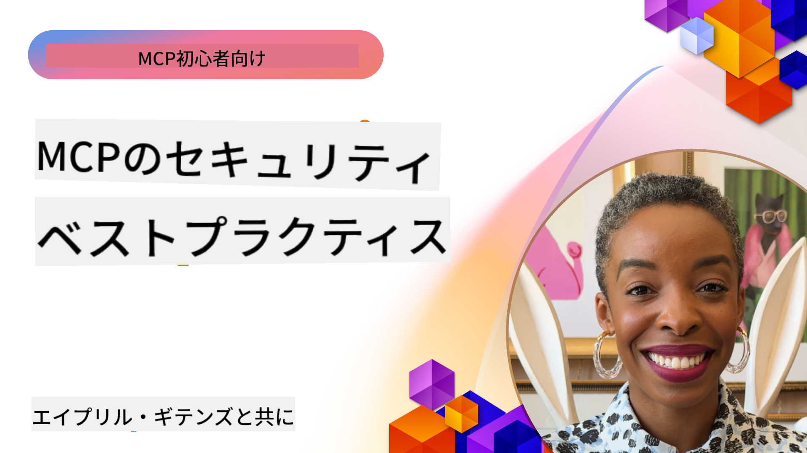

<!--
CO_OP_TRANSLATOR_METADATA:
{
  "original_hash": "14830e7df8352430ce7654b70ad969e1",
  "translation_date": "2025-07-29T00:19:04+00:00",
  "source_file": "02-Security/README.md",
  "language_code": "ja"
}
-->
# セキュリティのベストプラクティス

_(上の画像をクリックすると、このレッスンのビデオをご覧いただけます)_

Model Context Protocol (MCP) を採用することで、AI駆動型アプリケーションに強力な新機能がもたらされますが、従来のソフトウェアリスクを超えた独自のセキュリティ課題も生じます。安全なコーディング、最小権限、サプライチェーンセキュリティといった既存の懸念に加え、MCPやAIワークロードは、プロンプトインジェクション、ツールポイズニング、動的ツール変更、セッションハイジャック、混乱した副官攻撃、トークンパススルー脆弱性といった新たな脅威に直面します。これらのリスクを適切に管理しないと、データ流出、プライバシー侵害、意図しないシステム動作を引き起こす可能性があります。

このレッスンでは、MCPに関連する最も重要なセキュリティリスク（認証、認可、過剰な権限、間接的なプロンプトインジェクション、セッションセキュリティ、混乱した副官問題、トークンパススルー脆弱性、サプライチェーン脆弱性）を探り、それらを軽減するための実践的なコントロールとベストプラクティスを提供します。また、Prompt Shields、Azure Content Safety、GitHub Advanced Security などの Microsoft ソリューションを活用して MCP 実装を強化する方法も学びます。これらのコントロールを理解し適用することで、セキュリティ侵害の可能性を大幅に減らし、AIシステムの堅牢性と信頼性を確保できます。

# 学習目標

このレッスンの終わりまでに、次のことができるようになります：

- Model Context Protocol (MCP) によってもたらされる独自のセキュリティリスク（プロンプトインジェクション、ツールポイズニング、過剰な権限、セッションハイジャック、混乱した副官問題、トークンパススルー脆弱性、サプライチェーン脆弱性）を特定し、説明する。
- MCPセキュリティリスクに対する効果的な軽減コントロール（堅牢な認証、最小権限、セキュアなトークン管理、セッションセキュリティコントロール、サプライチェーン検証）を説明し、適用する。
- Prompt Shields、Azure Content Safety、GitHub Advanced Security などの Microsoft ソリューションを活用して MCP や AI ワークロードを保護する。
- ツールメタデータの検証、動的変更の監視、間接的なプロンプトインジェクション攻撃への防御、セッションハイジャックの防止の重要性を認識する。
- セキュアなコーディング、サーバーの強化、ゼロトラストアーキテクチャといった確立されたセキュリティのベストプラクティスを MCP 実装に統合し、セキュリティ侵害の可能性と影響を減らす。

# MCPセキュリティコントロール

重要なリソースにアクセスするシステムには、暗黙的にセキュリティ課題が伴います。セキュリティ課題は、基本的なセキュリティコントロールと概念を正しく適用することで一般的に対処できます。MCPは新たに定義されたばかりであり、仕様は非常に急速に変化しています。プロトコルが進化するにつれて、セキュリティコントロールも成熟し、エンタープライズや確立されたセキュリティアーキテクチャおよびベストプラクティスとの統合がより良くなるでしょう。

[Microsoft Digital Defense Report](https://aka.ms/mddr) に掲載された研究によると、報告された侵害の98%は堅牢なセキュリティ衛生によって防ぐことができるとされています。あらゆる種類の侵害に対する最善の保護は、基本的なセキュリティ衛生、安全なコーディングのベストプラクティス、サプライチェーンセキュリティを確実にすることです。これらの試行錯誤された実践は、セキュリティリスクを減らす上で最も大きな影響を与えます。

MCPを採用する際にセキュリティリスクに対処する方法をいくつか見ていきましょう。

> **Note:** 以下の情報は **2025年5月29日** 時点で正確です。MCPプロトコルは継続的に進化しており、将来の実装では新しい認証パターンやコントロールが導入される可能性があります。最新の更新情報とガイダンスについては、常に [MCP Specification](https://spec.modelcontextprotocol.io/) および公式の [MCP GitHub リポジトリ](https://github.com/modelcontextprotocol) と [セキュリティベストプラクティスページ](https://modelcontextprotocol.io/specification/draft/basic/security_best_practices) を参照してください。

### 問題の概要
元のMCP仕様では、開発者が独自の認証サーバーを作成することを前提としていました。これにはOAuthや関連するセキュリティ制約の知識が必要でした。MCPサーバーはOAuth 2.0認可サーバーとして機能し、外部サービス（例: Microsoft Entra ID）に委任するのではなく、必要なユーザー認証を直接管理していました。**2025年4月26日** 時点で、MCP仕様の更新により、MCPサーバーがユーザー認証を外部サービスに委任できるようになりました。

### リスク
- MCPサーバーの認可ロジックが誤って構成されると、機密データの露出やアクセス制御の誤適用が発生する可能性があります。
- ローカルMCPサーバーでのOAuthトークンの盗難。盗まれたトークンは、MCPサーバーを偽装して、そのトークンが対象とするサービスやデータにアクセスするために使用される可能性があります。

#### トークンパススルー
トークンパススルーは、認可仕様で明確に禁止されています。これには以下のようなセキュリティリスクが含まれます：

#### セキュリティコントロールの回避
MCPサーバーや下流のAPIは、レート制限、リクエスト検証、トラフィック監視など、トークンの対象やその他の資格情報制約に依存する重要なセキュリティコントロールを実装している可能性があります。クライアントがトークンを直接下流のAPIで使用できる場合、MCPサーバーがそれらを適切に検証したり、トークンが正しいサービスのために発行されたことを確認しない場合、これらのコントロールが回避されます。

#### 責任追跡と監査の問題
MCPサーバーは、クライアントが上流で発行されたアクセストークンを使用して呼び出している場合、MCPクライアントを識別または区別できなくなります。
下流のリソースサーバーのログには、実際にはMCPサーバーがトークンを転送しているにもかかわらず、異なるソースや異なるアイデンティティからのリクエストのように見える可能性があります。
これらの要因により、インシデント調査、コントロール、および監査が困難になります。
MCPサーバーがトークンのクレーム（例: ロール、権限、対象）やその他のメタデータを検証せずにトークンを転送する場合、盗まれたトークンを持つ悪意のあるアクターがサーバーをデータ流出のプロキシとして使用する可能性があります。

#### 信頼境界の問題
下流のリソースサーバーは特定のエンティティに信頼を付与します。この信頼には、発信元やクライアントの動作パターンに関する仮定が含まれる場合があります。この信頼境界が破られると、予期しない問題が発生する可能性があります。
トークンが適切に検証されずに複数のサービスで受け入れられる場合、1つのサービスが侵害されると、攻撃者はそのトークンを使用して他の接続されたサービスにアクセスすることができます。

#### 将来の互換性リスク
MCPサーバーが現在「純粋なプロキシ」として始まったとしても、後でセキュリティコントロールを追加する必要が生じる可能性があります。適切なトークン対象の分離を最初から行うことで、セキュリティモデルを進化させやすくなります。

### 軽減コントロール

**MCPサーバーは、MCPサーバーのために明示的に発行されていないトークンを受け入れてはなりません**

- **認可ロジックのレビューと強化**: MCPサーバーの認可実装を慎重に監査し、意図したユーザーやクライアントのみが機密リソースにアクセスできるようにします。実践的なガイダンスについては、[Azure API Management Your Auth Gateway For MCP Servers | Microsoft Community Hub](https://techcommunity.microsoft.com/blog/integrationsonazureblog/azure-api-management-your-auth-gateway-for-mcp-servers/4402690) および [Using Microsoft Entra ID To Authenticate With MCP Servers Via Sessions - Den Delimarsky](https://den.dev/blog/mcp-server-auth-entra-id-session/) を参照してください。
- **セキュアなトークンプラクティスの強制**: [Microsoftのトークン検証と有効期間に関するベストプラクティス](https://learn.microsoft.com/en-us/entra/identity-platform/access-tokens) に従い、アクセストークンの不正使用を防ぎ、トークンのリプレイや盗難のリスクを軽減します。
- **トークンストレージの保護**: トークンは常に安全に保存し、保存時および転送時に暗号化を使用して保護します。実装のヒントについては、[Use secure token storage and encrypt tokens](https://youtu.be/uRdX37EcCwg?si=6fSChs1G4glwXRy2) を参照してください。

# MCPサーバーの過剰な権限

### 問題の概要
MCPサーバーがアクセスしているサービス/リソースに対して過剰な権限を付与されている可能性があります。例えば、エンタープライズデータストアに接続するAIセールスアプリケーションの一部であるMCPサーバーは、セールスデータへのアクセスに限定されるべきであり、ストア内のすべてのファイルにアクセスできるべきではありません。最小権限の原則（最も古いセキュリティ原則の1つ）に立ち返ると、リソースはその意図されたタスクを実行するために必要な権限を超えて権限を持つべきではありません。AIは柔軟性を持たせるために、必要な正確な権限を定義するのが難しい場合があり、この分野での課題が増加します。

### リスク
- 過剰な権限を付与すると、MCPサーバーが意図されていないデータの流出や改変を引き起こす可能性があります。これは、データが個人識別情報（PII）である場合、プライバシー問題にもなり得ます。

### 軽減コントロール
- **最小権限の原則を適用する**: MCPサーバーに必要なタスクを実行するために必要最低限の権限のみを付与します。これらの権限を定期的にレビューし、必要以上の権限がないことを確認します。詳細なガイダンスについては、[Secure least-privileged access](https://learn.microsoft.com/entra/identity-platform/secure-least-privileged-access) を参照してください。
- **ロールベースのアクセス制御（RBAC）を使用する**: MCPサーバーに特定のリソースやアクションに厳密にスコープされたロールを割り当て、広範または不要な権限を避けます。
- **権限の監視と監査**: 権限の使用状況を継続的に監視し、アクセスログを監査して、過剰または未使用の権限を迅速に検出し修正します。

# 間接的なプロンプトインジェクション攻撃

### 問題の概要

悪意のある、または侵害されたMCPサーバーは、顧客データの露出や意図しないアクションを可能にすることで重大なリスクをもたらします。これらのリスクは、特にAIやMCPベースのワークロードにおいて関連性が高いです：

- **プロンプトインジェクション攻撃**: 攻撃者がプロンプトや外部コンテンツに悪意のある指示を埋め込み、AIシステムが意図しないアクションを実行したり、機密データを漏洩したりする原因となります。詳細はこちら: [Prompt Injection](https://simonwillison.net/2025/Apr/9/mcp-prompt-injection/)
- **ツールポイズニング**: 攻撃者がツールのメタデータ（説明やパラメータなど）を操作し、AIの動作に影響を与え、セキュリティコントロールを回避したり、データを流出させたりする可能性があります。詳細はこちら: [Tool Poisoning](https://invariantlabs.ai/blog/mcp-security-notification-tool-poisoning-attacks)
- **クロスドメインプロンプトインジェクション**: 悪意のある指示が文書、ウェブページ、または電子メールに埋め込まれ、それをAIが処理することでデータ漏洩や操作が発生します。
- **動的ツール変更（ラグプル）**: ユーザーの承認後にツール定義が変更され、ユーザーが気づかないうちに新しい悪意のある動作が導入される可能性があります。

これらの脆弱性は、MCPサーバーやツールを環境に統合する際に、堅牢な検証、監視、およびセキュリティコントロールが必要であることを強調しています。詳細については、上記のリンクを参照してください。

**間接的なプロンプトインジェクション**（クロスドメインプロンプトインジェクションまたはXPIAとも呼ばれる）は、Model Context Protocol (MCP) を含む生成AIシステムにおける重大な脆弱性です。この攻撃では、悪意のある指示が文書、ウェブページ、電子メールなどの外部コンテンツに隠されています。AIシステムがこのコンテンツを処理すると、埋め込まれた指示を正当なユーザーコマンドとして解釈し、データ漏洩、有害なコンテンツの生成、ユーザーインタラクションの操作などの意図しないアクションを引き起こす可能性があります。詳細な説明と実例については、[Prompt Injection](https://simonwillison.net/2025/Apr/9/mcp-prompt-injection/) を参照してください。

特に危険な形態のこの攻撃は、**ツールポイズニング**です。ここでは、攻撃者がMCPツールのメタデータ（ツールの説明やパラメータなど）に悪意のある指示を注入します。大規模言語モデル（LLM）はこのメタデータに依存してどのツールを呼び出すかを決定するため、改ざんされた説明はモデルを騙

# 混乱した代理問題

### 問題の説明

混乱した代理問題は、MCPサーバーがMCPクライアントとサードパーティAPIの間でプロキシとして機能する際に発生するセキュリティ脆弱性です。この脆弱性は、MCPサーバーが動的クライアント登録をサポートしないサードパーティ認可サーバーに対して静的なクライアントIDを使用して認証する場合に悪用される可能性があります。

### リスク

- **クッキーを利用した同意の回避**: ユーザーが以前にMCPプロキシサーバーを介して認証している場合、サードパーティ認可サーバーはユーザーのブラウザに同意クッキーを設定する可能性があります。攻撃者は、悪意のあるリダイレクトURIを含む認可リクエストを仕込んだリンクをユーザーに送ることでこれを悪用できます。
- **認可コードの窃取**: ユーザーが悪意のあるリンクをクリックすると、既存のクッキーのためにサードパーティ認可サーバーが同意画面をスキップし、認可コードが攻撃者のサーバーにリダイレクトされる可能性があります。
- **不正なAPIアクセス**: 攻撃者は盗まれた認可コードを使用してアクセストークンを取得し、ユーザーになりすましてサードパーティAPIにアクセスすることができます。

### 緩和策

- **明示的な同意の要件**: 静的クライアントIDを使用するMCPプロキシサーバーは、サードパーティ認可サーバーに転送する前に、動的に登録された各クライアントに対してユーザーの同意を取得する必要があります。
- **適切なOAuth実装**: OAuth 2.1のセキュリティベストプラクティスに従い、認可リクエストにコードチャレンジ（PKCE）を使用して傍受攻撃を防ぎます。
- **クライアントの検証**: 悪意のある行為者による悪用を防ぐため、リダイレクトURIやクライアント識別子の厳格な検証を実施します。

# トークンパススルーの脆弱性

### 問題の説明

「トークンパススルー」はアンチパターンであり、MCPサーバーがMCPクライアントからトークンを受け取り、それがMCPサーバー自身に正しく発行されたものであるかを検証せずに、下流のAPIに「そのまま渡す」行為を指します。この実践はMCP認可仕様に明確に違反し、重大なセキュリティリスクを引き起こします。

### リスク

- **セキュリティ制御の回避**: クライアントがトークンを直接下流のAPIで使用できる場合、レート制限、リクエスト検証、トラフィック監視などの重要なセキュリティ制御を回避する可能性があります。
- **責任追跡と監査の問題**: クライアントが上流で発行されたアクセストークンを使用すると、MCPサーバーはMCPクライアントを識別または区別できなくなり、インシデント調査や監査が困難になります。
- **データ流出**: トークンのクレームを適切に検証せずに渡すと、盗まれたトークンを持つ悪意のある行為者がサーバーをプロキシとしてデータを流出させる可能性があります。
- **信頼境界の侵害**: 下流のリソースサーバーは、特定のエンティティに対して信頼を付与し、その起源や行動パターンについての仮定を持つことがあります。この信頼境界が破られると、予期しないセキュリティ問題が発生する可能性があります。
- **マルチサービストークンの悪用**: トークンが適切に検証されずに複数のサービスで受け入れられる場合、1つのサービスが侵害されると、攻撃者はそのトークンを使用して他の接続されたサービスにアクセスする可能性があります。

### 緩和策

- **トークンの検証**: MCPサーバーは、MCPサーバー自身のために明示的に発行されていないトークンを受け入れてはなりません。
- **オーディエンスの検証**: トークンがMCPサーバーのアイデンティティに一致する正しいオーディエンスクレームを持っていることを常に検証します。
- **適切なトークンライフサイクル管理**: 短命のアクセストークンと適切なトークンローテーションの実践を実施し、トークンの盗難や悪用のリスクを軽減します。

# セッションハイジャック

### 問題の説明

セッションハイジャックは、サーバーがクライアントにセッションIDを提供し、第三者がそのセッションIDを取得して使用し、元のクライアントになりすまして不正な操作を行う攻撃手法です。これは、MCPリクエストを処理するステートフルなHTTPサーバーにおいて特に懸念されます。

### リスク

- **セッションハイジャックによるプロンプト注入**: セッションIDを取得した攻撃者が、クライアントが接続しているサーバーとセッション状態を共有するサーバーに悪意のあるイベントを送信し、潜在的に有害な操作を引き起こしたり、機密データにアクセスしたりする可能性があります。
- **セッションハイジャックによるなりすまし**: セッションIDを盗んだ攻撃者が、MCPサーバーに直接呼び出しを行い、認証を回避して正当なユーザーとして扱われる可能性があります。
- **再開可能なストリームの侵害**: サーバーが再配信/再開可能なストリームをサポートしている場合、攻撃者がリクエストを途中で終了させることで、元のクライアントが後で潜在的に悪意のあるコンテンツで再開する可能性があります。

### 緩和策

- **認可の検証**: 認可を実装するMCPサーバーは、すべての受信リクエストを検証し、認証にセッションを使用してはなりません。
- **セキュアなセッションID**: MCPサーバーは、セキュアな乱数生成器を使用して生成された安全で非決定的なセッションIDを使用する必要があります。予測可能または連続的な識別子は避けてください。
- **ユーザー固有のセッションバインディング**: MCPサーバーは、セッションIDをユーザー固有の情報にバインドし、セッションIDを認可されたユーザーの内部ユーザーIDのような情報と組み合わせた形式（例: `<user_id>:<session_id>`）を使用するべきです。
- **セッションの有効期限**: セッションIDが侵害された場合の脆弱性の期間を制限するために、適切なセッションの有効期限とローテーションを実施します。
- **通信のセキュリティ**: セッションIDの傍受を防ぐため、すべての通信にHTTPSを使用します。

# サプライチェーンセキュリティ

AI時代においてもサプライチェーンセキュリティは基本的な要素ですが、サプライチェーンの範囲は拡大しています。従来のコードパッケージに加え、基盤モデル、埋め込みサービス、コンテキストプロバイダー、サードパーティAPIなど、すべてのAI関連コンポーネントを厳密に検証し、監視する必要があります。これらのいずれも、適切に管理されない場合、脆弱性やリスクをもたらす可能性があります。

**AIとMCPにおける主要なサプライチェーンセキュリティの実践:**
- **統合前にすべてのコンポーネントを検証する**: オープンソースライブラリだけでなく、AIモデル、データソース、外部APIも含めます。出所、ライセンス、既知の脆弱性を常に確認してください。
- **安全なデプロイパイプラインを維持する**: セキュリティスキャンを統合した自動化CI/CDパイプラインを使用して、問題を早期に検出します。信頼できるアーティファクトのみを本番環境にデプロイしてください。
- **継続的な監視と監査**: モデルやデータサービスを含むすべての依存関係を継続的に監視し、新たな脆弱性やサプライチェーン攻撃を検出します。
- **最小権限とアクセス制御を適用する**: モデル、データ、サービスへのアクセスをMCPサーバーの機能に必要な範囲に制限します。
- **脅威への迅速な対応**: 侵害が検出された場合、コンポーネントのパッチ適用や交換、シークレットや認証情報のローテーションを行うプロセスを用意してください。

[GitHub Advanced Security](https://github.com/security/advanced-security) は、シークレットスキャン、依存関係スキャン、CodeQL分析などの機能を提供します。これらのツールは [Azure DevOps](https://azure.microsoft.com/en-us/products/devops) や [Azure Repos](https://azure.microsoft.com/en-us/products/devops/repos/) と統合し、コードやAIサプライチェーンコンポーネント全体の脆弱性を特定し、軽減するのに役立ちます。

Microsoftはまた、すべての製品に対して広範なサプライチェーンセキュリティ実践を内部で実施しています。詳細は [The Journey to Secure the Software Supply Chain at Microsoft](https://devblogs.microsoft.com/engineering-at-microsoft/the-journey-to-secure-the-software-supply-chain-at-microsoft/) をご覧ください。

# MCP実装のセキュリティ態勢を向上させるための確立されたセキュリティベストプラクティス

MCP実装は、それが構築される組織環境の既存のセキュリティ態勢を継承します。そのため、MCPを全体的なAIシステムの一部として考慮する際には、既存のセキュリティ態勢全体を向上させることをお勧めします。以下の確立されたセキュリティ制御は特に重要です:

- AIアプリケーションにおけるセキュアコーディングのベストプラクティス - [OWASP Top 10](https://owasp.org/www-project-top-ten/)、[OWASP Top 10 for LLMs](https://genai.owasp.org/download/43299/?tmstv=1731900559) に対する保護、シークレットやトークンのためのセキュアボールトの使用、アプリケーションコンポーネント間のエンドツーエンドのセキュア通信の実装など。
- サーバーのハードニング - 可能な場合はMFAを使用し、パッチを最新の状態に保ち、サーバーをサードパーティのIDプロバイダーと統合するなど。
- デバイス、インフラストラクチャ、アプリケーションを最新のパッチで維持する
- セキュリティ監視 - AIアプリケーション（MCPクライアント/サーバーを含む）のログを中央のSIEMに送信し、異常な活動を検出するためのログと監視を実装する
- ゼロトラストアーキテクチャ - ネットワークおよびID制御を使用してコンポーネントを論理的に分離し、AIアプリケーションが侵害された場合の横方向の移動を最小限に抑える

# 重要なポイント

- セキュリティの基本は依然として重要: セキュアコーディング、最小権限、サプライチェーンの検証、継続的な監視は、MCPおよびAIワークロードに不可欠です。
- MCPは新たなリスクをもたらします—プロンプト注入、ツールポイズニング、セッションハイジャック、混乱した代理問題、トークンパススルーの脆弱性、過剰な権限など、従来およびAI特有の制御が必要です。
- 外部IDプロバイダー（Microsoft Entra IDなど）を活用し、堅牢な認証、認可、トークン管理の実践を使用してください。
- ツールメタデータの検証、動的な変更の監視、Microsoft Prompt Shieldsのようなソリューションを使用して、間接的なプロンプト注入やツールポイズニングを防ぎます。
- 非決定的なセッションIDを使用し、セッションをユーザーIDにバインドし、認証にセッションを使用しないことで、セッション管理をセキュアにします。
- 動的に登録された各クライアントに対して明示的なユーザー同意を要求し、適切なOAuthセキュリティ実践を実装することで、混乱した代理攻撃を防ぎます。
- MCPサーバーが明示的に発行されたトークンのみを受け入れ、トークンクレームを適切に検証することで、トークンパススルーの脆弱性を回避します。
- モデル、埋め込み、コンテキストプロバイダーを含むAIサプライチェーンのすべてのコンポーネントをコード依存関係と同じ厳密さで扱います。
- 進化するMCP仕様に対応し、コミュニティに貢献して安全な標準を形成する手助けをしてください。

# 追加リソース

## 外部リソース
- [Microsoft Digital Defense Report](https://aka.ms/mddr)
- [MCP Specification](https://spec.modelcontextprotocol.io/)
- [MCP Security Best Practices](https://modelcontextprotocol.io/specification/draft/basic/security_best_practices)
- [MCP Authorization Specification](https://modelcontextprotocol.io/specification/draft/basic/authorization)
- [OAuth 2.0 Security Best Practices (RFC 9700)](https://datatracker.ietf.org/doc/html/rfc9700)
- [Prompt Injection in MCP (Simon Willison)](https://simonwillison.net/2025/Apr/9/mcp-prompt-injection/)
- [Tool Poisoning Attacks (Invariant Labs)](https://invariantlabs.ai/blog/mcp-security-notification-tool-poisoning-attacks)
- [Rug Pulls in MCP (Wiz Security)](https://www.wiz.io/blog/mcp-security-research-briefing#remote-servers-22)
- [Prompt Shields Documentation (Microsoft)](https://learn.microsoft.com/azure/ai-services/content-safety/concepts/jailbreak-detection)
- [OWASP Top 10](https://owasp.org/www-project-top-ten/)
- [OWASP Top 10 for LLMs](https://genai.owasp.org/download/43299/?tmstv=1731900559)
- [GitHub Advanced Security](https://github.com/security/advanced-security)
- [Azure DevOps](https://azure.microsoft.com/products/devops)
- [Azure Repos](https://azure.microsoft.com/products/devops/repos/)
- [The Journey to Secure the Software Supply Chain at Microsoft](https://devblogs.microsoft.com/engineering-at-microsoft/the-journey-to-secure-the-software-supply-chain-at-microsoft/)
- [Secure Least-Privileged Access (Microsoft)](https://learn.microsoft.com/entra/identity-platform/secure-least-privileged-access)
- [Best Practices for Token Validation and Lifetime](https://learn.microsoft.com/entra/identity-platform/access-tokens)
- [Use Secure Token Storage and Encrypt Tokens (YouTube)](https://youtu.be/uRdX37EcCwg?si=6fSChs1G4glwXRy2)
- [Azure API Management as Auth Gateway for MCP](https://techcommunity.microsoft.com/blog/integrationsonazureblog/azure-api-management-your-auth-gateway-for-mcp-servers/4402690)
- [Using Microsoft Entra ID to Authenticate with MCP Servers](https://den.dev/blog/mcp-server-auth-entra-id-session/)

## 追加のセキュリティドキュメント

**免責事項**:  
この文書は、AI翻訳サービス [Co-op Translator](https://github.com/Azure/co-op-translator) を使用して翻訳されています。正確性を追求しておりますが、自動翻訳には誤りや不正確な部分が含まれる可能性があることをご承知ください。元の言語で記載された文書が正式な情報源とみなされるべきです。重要な情報については、専門の人間による翻訳を推奨します。この翻訳の使用に起因する誤解や誤解釈について、当方は一切の責任を負いません。