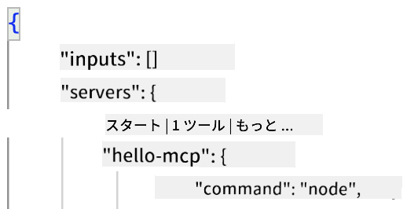
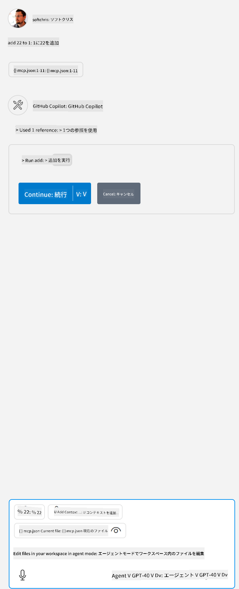

<!--
CO_OP_TRANSLATOR_METADATA:
{
  "original_hash": "54e9ffc5dba01afcb8880a9949fd1881",
  "translation_date": "2025-07-13T19:25:38+00:00",
  "source_file": "03-GettingStarted/04-vscode/README.md",
  "language_code": "ja"
}
-->
次のセクションでは、ビジュアルインターフェースの使い方について詳しく説明します。

## アプローチ

大まかな流れは以下の通りです：

- MCPサーバーを見つけるための設定ファイルを作成する。
- サーバーを起動／接続し、その機能一覧を取得する。
- GitHub Copilot Chatインターフェースを通じてその機能を利用する。

流れが理解できたので、次はVisual Studio Codeを使ってMCPサーバーを利用する練習をしてみましょう。

## 演習：サーバーの利用

この演習では、Visual Studio Codeを設定してMCPサーバーを見つけ、GitHub Copilot Chatインターフェースから利用できるようにします。

### -0- 事前準備：MCPサーバーの検出を有効化

MCPサーバーの検出を有効にする必要があるかもしれません。

1. Visual Studio Codeで `ファイル -> 設定 -> 設定` に移動します。

1. 「MCP」で検索し、settings.jsonファイル内の `chat.mcp.discovery.enabled` を有効にします。

### -1- 設定ファイルの作成

まず、プロジェクトのルートに設定ファイルを作成します。`.vscode` フォルダ内に `MCP.json` というファイルを置きます。内容は以下のようになります：

```text
.vscode
|-- mcp.json
```

次に、サーバーのエントリを追加する方法を見てみましょう。

### -2- サーバーの設定

*mcp.json* に以下の内容を追加します：

```json
{
    "inputs": [],
    "servers": {
       "hello-mcp": {
           "command": "node",
           "args": [
               "build/index.js"
           ]
       }
    }
}
```

上記はNode.jsで書かれたサーバーを起動する簡単な例です。その他のランタイムの場合は、`command` と `args` を使って適切な起動コマンドを指定してください。

### -3- サーバーの起動

エントリを追加したら、サーバーを起動しましょう：

1. *mcp.json* 内のエントリを見つけ、「再生」アイコンがあることを確認します：

    

1. 「再生」アイコンをクリックすると、GitHub Copilot Chatのツールアイコンに利用可能なツールの数が増えます。ツールアイコンをクリックすると登録されたツールの一覧が表示されます。GitHub Copilotにツールをコンテキストとして使わせたい場合は、チェックを入れたり外したりできます：

  

1. ツールを実行するには、ツールの説明に合致するプロンプトを入力します。例えば「add 22 to 1」のようなプロンプトです：

  

  「23」と返答が返ってくるはずです。

## 課題

*mcp.json* にサーバーのエントリを追加し、サーバーの起動・停止ができることを確認してください。また、GitHub Copilot Chatインターフェースを通じてサーバーのツールと通信できることも確認しましょう。

## 解答例

[解答例](./solution/README.md)

## 重要なポイント

この章のポイントは以下の通りです：

- Visual Studio Codeは複数のMCPサーバーとそのツールを利用できる優れたクライアントです。
- GitHub Copilot Chatインターフェースがサーバーとのやり取りの窓口となります。
- APIキーなどのユーザー入力をプロンプトで受け取り、*mcp.json* のサーバー設定に渡すことができます。

## サンプル

- [Java Calculator](../samples/java/calculator/README.md)
- [.Net Calculator](../../../../03-GettingStarted/samples/csharp)
- [JavaScript Calculator](../samples/javascript/README.md)
- [TypeScript Calculator](../samples/typescript/README.md)
- [Python Calculator](../../../../03-GettingStarted/samples/python)

## 追加リソース

- [Visual Studio ドキュメント](https://code.visualstudio.com/docs/copilot/chat/mcp-servers)

## 次に進む

- 次へ: [SSEサーバーの作成](../05-sse-server/README.md)

**免責事項**：  
本書類はAI翻訳サービス「[Co-op Translator](https://github.com/Azure/co-op-translator)」を使用して翻訳されました。正確性を期しておりますが、自動翻訳には誤りや不正確な部分が含まれる可能性があります。原文の言語によるオリジナル文書が正式な情報源とみなされるべきです。重要な情報については、専門の人間による翻訳を推奨します。本翻訳の利用により生じたいかなる誤解や誤訳についても、当方は責任を負いかねます。