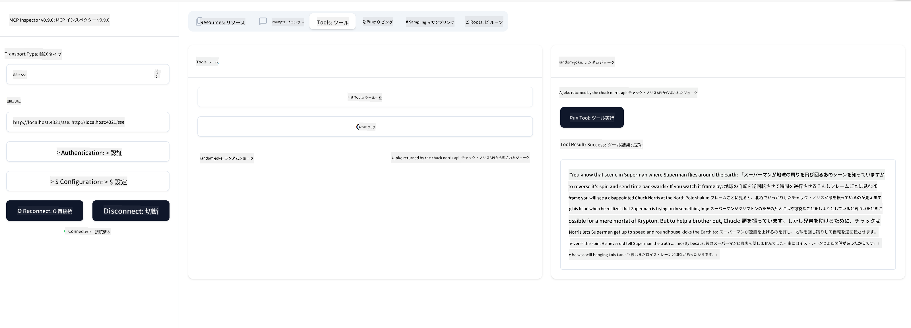

<!--
CO_OP_TRANSLATOR_METADATA:
{
  "original_hash": "d90ca3d326c48fab2ac0ebd3a9876f59",
  "translation_date": "2025-07-04T16:16:32+00:00",
  "source_file": "03-GettingStarted/05-sse-server/README.md",
  "language_code": "ja"
}
-->
SSEについて少し理解できたので、次はSSEサーバーを作ってみましょう。

## 演習：SSEサーバーの作成

サーバーを作成するにあたって、次の2点を意識する必要があります：

- 接続とメッセージ用のエンドポイントを公開するためにウェブサーバーを使うこと。
- stdioを使っていたときと同様に、ツールやリソース、プロンプトを使ってサーバーを構築すること。

### -1- サーバーインスタンスの作成

サーバーを作成するには、stdioと同じ型を使います。ただし、トランスポートにはSSEを選択する必要があります。  

次に必要なルートを追加しましょう。

### -2- ルートの追加

接続と受信メッセージを処理するルートを追加します：  

次にサーバーの機能を追加しましょう。

### -3- サーバー機能の追加

SSE固有の部分が定義できたので、ツールやプロンプト、リソースなどのサーバー機能を追加します。  

完成したコードは以下のようになります：  

素晴らしい、SSEを使ったサーバーができました。次は動作確認をしてみましょう。

## 演習：Inspectorを使ったSSEサーバーのデバッグ

Inspectorは前のレッスン[最初のサーバーを作成する](/03-GettingStarted/01-first-server/README.md)で紹介した便利なツールです。ここでも使えるか試してみましょう。

### -1- Inspectorの起動

Inspectorを起動するには、まずSSEサーバーが動いている必要があります。では起動しましょう：

1. サーバーを起動する  

1. Inspectorを起動する

    > ![NOTE]
    > サーバーを起動しているターミナルとは別のウィンドウで実行してください。また、以下のコマンドはサーバーが動作しているURLに合わせて調整が必要です。

    ```sh
    npx @modelcontextprotocol/inspector --cli http://localhost:8000/sse --method tools/list
    ```

Inspectorの起動方法はどのランタイムでも同じです。サーバーのパスや起動コマンドを渡す代わりに、サーバーが動作しているURLと`/sse`ルートを指定している点に注目してください。

### -2- ツールの試用

ドロップダウンリストからSSEを選択し、サーバーが動作しているURL（例： http://localhost:4321/sse）を入力して「Connect」ボタンを押します。前回同様にツール一覧を表示し、ツールを選択して入力値を渡すと、以下のような結果が得られます：



素晴らしい、Inspectorで操作できました。次はVisual Studio Codeでの使い方を見てみましょう。

## 課題

サーバーにさらに機能を追加してみてください。例えば[このページ](https://api.chucknorris.io/)を参考にAPIを呼び出すツールを追加するなど、サーバーの形は自由です。楽しんでください :)

## 解答例

[解答例](./solution/README.md) 動作するコードの一例を示しています。

## まとめ

この章のポイントは以下の通りです：

- SSEはstdioに次ぐ2つ目のサポートされているトランスポートです。
- SSEをサポートするには、ウェブフレームワークを使って接続とメッセージの管理が必要です。
- InspectorやVisual Studio Codeを使ってstdioサーバーと同様にSSEサーバーを利用できます。ただしstdioとSSEでは少し違いがあり、SSEではサーバーを別途起動してからInspectorを実行し、InspectorではURLを指定する必要があります。

## サンプル

- [Java Calculator](../samples/java/calculator/README.md)
- [.Net Calculator](../../../../03-GettingStarted/samples/csharp)
- [JavaScript Calculator](../samples/javascript/README.md)
- [TypeScript Calculator](../samples/typescript/README.md)
- [Python Calculator](../../../../03-GettingStarted/samples/python)

## 追加リソース

- [SSE](https://developer.mozilla.org/en-US/docs/Web/API/Server-sent_events)

## 次に学ぶこと

- 次へ：[MCPによるHTTPストリーミング（Streamable HTTP）](../06-http-streaming/README.md)

**免責事項**：  
本書類はAI翻訳サービス「[Co-op Translator](https://github.com/Azure/co-op-translator)」を使用して翻訳されました。正確性を期しておりますが、自動翻訳には誤りや不正確な部分が含まれる可能性があります。原文の言語によるオリジナル文書が正式な情報源とみなされるべきです。重要な情報については、専門の人間による翻訳を推奨します。本翻訳の利用により生じた誤解や誤訳について、当方は一切の責任を負いかねます。