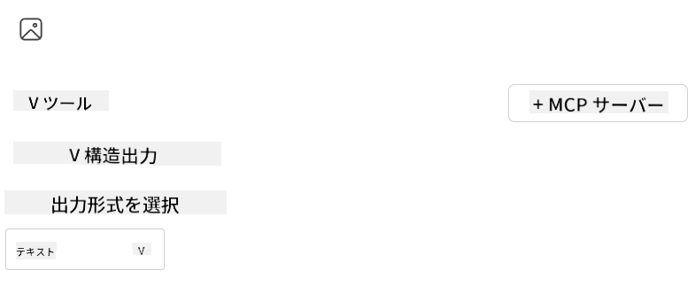

<!--
CO_OP_TRANSLATOR_METADATA:
{
  "original_hash": "d1980763f2a545ca6648363bf5757b5a",
  "translation_date": "2025-06-12T22:27:00+00:00",
  "source_file": "03-GettingStarted/07-aitk/README.md",
  "language_code": "ja"
}
-->
# Visual Studio Code用AI Toolkit拡張機能でサーバーを利用する

AIエージェントを構築するとき、賢い応答を生成するだけでなく、エージェントに実際に行動を起こす能力を持たせることが重要です。そこで役立つのがModel Context Protocol（MCP）です。MCPは、エージェントが外部のツールやサービスに一貫した方法でアクセスできるようにします。まるでエージェントを実際に使えるツールボックスに接続するようなイメージです。

例えば、エージェントを電卓MCPサーバーに接続すると、「47×89はいくつ？」といったプロンプトを受け取るだけで計算ができるようになり、ロジックをハードコードしたりカスタムAPIを作成する必要がなくなります。

## 概要

このレッスンでは、Visual Studio Codeの[AI Toolkit](https://aka.ms/AIToolkit)拡張機能を使って、電卓MCPサーバーをエージェントに接続し、加算、減算、乗算、除算などの数学的演算を自然言語で実行できるようにする方法を解説します。

AI ToolkitはVisual Studio Code向けの強力な拡張機能で、エージェント開発を効率化します。AIエンジニアはローカルやクラウド上で生成AIモデルを開発・テストしながら簡単にAIアプリケーションを構築できます。現在、主要な生成モデルの多くに対応しています。

*Note*: AI Toolkitは現在PythonとTypeScriptに対応しています。

## 学習目標

このレッスンの終わりには、以下ができるようになります。

- AI Toolkitを使ってMCPサーバーを利用する方法
- エージェント設定を構成し、MCPサーバーが提供するツールを検出・活用できるようにする方法
- 自然言語を通じてMCPツールを利用する方法

## アプローチ

大まかな流れは以下の通りです。

- エージェントを作成し、システムプロンプトを定義する
- 電卓ツールを備えたMCPサーバーを作成する
- Agent BuilderをMCPサーバーに接続する
- 自然言語でツール呼び出しをテストする

流れがわかったところで、MCPを通じて外部ツールを活用し、エージェントの能力を拡張する設定を始めましょう！

## 前提条件

- [Visual Studio Code](https://code.visualstudio.com/)
- [Visual Studio Code用AI Toolkit](https://aka.ms/AIToolkit)

## 演習：サーバーの利用

この演習では、Visual Studio Code内でAI Toolkitを使い、MCPサーバーのツールを備えたAIエージェントを構築、実行、強化します。

### -0- 事前準備：My ModelsにOpenAI GPT-4oモデルを追加する

この演習では**GPT-4o**モデルを使用します。エージェント作成前に**My Models**に追加しておきましょう。


1. **Activity Bar**から**AI Toolkit**拡張機能を開く。
2. **Catalog**セクションで**Models**を選択し、**Model Catalog**を新しいエディタタブで開く。
3. 検索バーに**OpenAI GPT-4o**と入力する。
4. **+ Add**をクリックし、モデルを**My Models**に追加する。**Hosted by GitHub**のモデルを選択していることを確認。
5. **Activity Bar**で**OpenAI GPT-4o**モデルがリストに表示されていることを確認。

### -1- エージェントの作成

**Agent (Prompt) Builder**を使うと、自分だけのAIエージェントを作成・カスタマイズできます。ここでは新しいエージェントを作成し、会話を担当するモデルを割り当てます。


1. **Activity Bar**から**AI Toolkit**拡張機能を開く。
2. **Tools**セクションで**Agent (Prompt) Builder**を選択し、新しいエディタタブで開く。
3. **+ New Agent**ボタンをクリック。コマンドパレットでセットアップウィザードが起動。
4. 名前に**Calculator Agent**と入力し、Enterキーを押す。
5. **Agent (Prompt) Builder**の**Model**欄で**OpenAI GPT-4o (via GitHub)**モデルを選択。

### -2- エージェントのシステムプロンプト作成

エージェントの骨組みができたら、その性格や目的を決めます。ここでは**Generate system prompt**機能を使い、電卓エージェントとしての振る舞いを説明し、モデルにシステムプロンプトを書かせます。


1. **Prompts**セクションで**Generate system prompt**ボタンをクリック。プロンプトビルダーが開き、AIがシステムプロンプトを生成。
2. **Generate a prompt**ウィンドウに以下を入力：`You are a helpful and efficient math assistant. When given a problem involving basic arithmetic, you respond with the correct result.`
3. **Generate**ボタンをクリック。右下に生成中の通知が表示される。生成が完了すると、プロンプトが**Agent (Prompt) Builder**の**System prompt**欄に表示される。
4. **System prompt**を確認し、必要に応じて修正。

### -3- MCPサーバーの作成

エージェントのシステムプロンプトで振る舞いを決めたので、次は実際の機能を持たせます。ここでは加算、減算、乗算、除算を実行できる電卓MCPサーバーを作成します。このサーバーにより、エージェントは自然言語の指示に応じてリアルタイムに計算が可能になります。



AI ToolkitにはMCPサーバー作成を簡単にするテンプレートが用意されています。ここではPythonテンプレートを使って電卓MCPサーバーを作成します。

*Note*: AI Toolkitは現在PythonとTypeScriptに対応しています。

1. **Agent (Prompt) Builder**の**Tools**セクションで**+ MCP Server**ボタンをクリック。コマンドパレットでセットアップウィザードが起動。
2. **+ Add Server**を選択。
3. **Create a New MCP Server**を選択。
4. **python-weather**テンプレートを選択。
5. MCPサーバーテンプレートの保存先に**Default folder**を選択。
6. サーバー名に**Calculator**と入力。
7. 新しいVisual Studio Codeウィンドウが開くので、**Yes, I trust the authors**を選択。
8. ターミナル（**Terminal** > **New Terminal**）で仮想環境を作成：`python -m venv .venv`
9. ターミナルで仮想環境を有効化：
    1. Windows - `.venv\Scripts\activate`
    2. macOS/Linux - `source venv/bin/activate`
10. ターミナルで依存関係をインストール：`pip install -e .[dev]`
11. **Activity Bar**の**Explorer**ビューで**src**ディレクトリを展開し、**server.py**を開く。
12. **server.py**のコードを以下に置き換えて保存：

    ```python
    """
    Sample MCP Calculator Server implementation in Python.

    
    This module demonstrates how to create a simple MCP server with calculator tools
    that can perform basic arithmetic operations (add, subtract, multiply, divide).
    """
    
    from mcp.server.fastmcp import FastMCP
    
    server = FastMCP("calculator")
    
    @server.tool()
    def add(a: float, b: float) -> float:
        """Add two numbers together and return the result."""
        return a + b
    
    @server.tool()
    def subtract(a: float, b: float) -> float:
        """Subtract b from a and return the result."""
        return a - b
    
    @server.tool()
    def multiply(a: float, b: float) -> float:
        """Multiply two numbers together and return the result."""
        return a * b
    
    @server.tool()
    def divide(a: float, b: float) -> float:
        """
        Divide a by b and return the result.
        
        Raises:
            ValueError: If b is zero
        """
        if b == 0:
            raise ValueError("Cannot divide by zero")
        return a / b
    ```

### -4- 電卓MCPサーバーでエージェントを実行する

エージェントにツールが備わったので、実際に使ってみましょう。このセクションでは、プロンプトを送信してエージェントが電卓MCPサーバーの適切なツールを活用しているかをテスト・検証します。


ローカル開発マシンで**Agent Builder**をMCPクライアントとして使い、電卓MCPサーバーを実行します。

1. `F5` to start debugging the MCP server. The **Agent (Prompt) Builder** will open in a new editor tab. The status of the server is visible in the terminal.
1. In the **User prompt** field of the **Agent (Prompt) Builder**, enter the following prompt: `I bought 3 items priced at $25 each, and then used a $20 discount. How much did I pay?`
1. Click the **Run** button to generate the agent's response.
1. Review the agent output. The model should conclude that you paid **$55**.
1. Here's a breakdown of what should occur:
    - The agent selects the **multiply** and **substract** tools to aid in the calculation.
    - The respective `a` and `b` values are assigned for the **multiply** tool.
    - The respective `a` and `b` の値が**subtract**ツールに割り当てられます。
    - 各ツールからの応答はそれぞれの**Tool Response**に表示されます。
    - モデルの最終出力は最終的な**Model Response**に表示されます。
2. 追加のプロンプトを送信してエージェントをさらにテストできます。**User prompt**欄をクリックして既存のプロンプトを変更してください。
3. テストが終わったら、**terminal**で**CTRL/CMD+C**を押してサーバーを停止します。

## 課題

**server.py**ファイルに新しいツール（例：数値の平方根を返す機能）を追加してみましょう。新しいツール（または既存ツール）を使うプロンプトを送信し、エージェントが活用できるか試してください。新しいツールを反映するにはサーバーの再起動が必要です。

## 解答例

[Solution](./solution/README.md)

## まとめ

この章のポイントは以下の通りです。

- AI Toolkit拡張機能は、MCPサーバーとそのツールを利用する優れたクライアントである。
- MCPサーバーに新しいツールを追加することで、エージェントの機能を拡張できる。
- AI ToolkitにはPython MCPサーバーテンプレートなど、カスタムツール作成を簡単にするテンプレートが含まれている。

## 追加リソース

- [AI Toolkitドキュメント](https://aka.ms/AIToolkit/doc)

## 次のステップ

- 次へ: [Testing & Debugging](/03-GettingStarted/08-testing/README.md)

**免責事項**：  
本書類はAI翻訳サービス「[Co-op Translator](https://github.com/Azure/co-op-translator)」を使用して翻訳されています。正確性を期しておりますが、自動翻訳には誤りや不正確な部分が含まれる可能性があります。正式な情報源としては、原文の原語版を参照してください。重要な情報については、専門の人間翻訳をご利用されることを推奨します。本翻訳の利用により生じたいかなる誤解や解釈の相違についても、当方は責任を負いかねます。