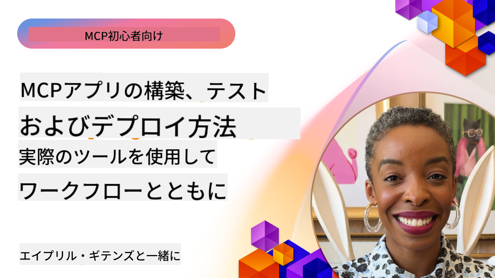

<!--
CO_OP_TRANSLATOR_METADATA:
{
  "original_hash": "8a20383b884e55ca6289bab35796448c",
  "translation_date": "2025-07-29T00:09:17+00:00",
  "source_file": "04-PracticalImplementation/README.md",
  "language_code": "ja"
}
-->
# 実践的な実装

[](https://youtu.be/vCN9-mKBDfQ)

_(上の画像をクリックすると、このレッスンのビデオを視聴できます)_

実践的な実装は、Model Context Protocol (MCP) の力を実感できる場面です。MCPの理論やアーキテクチャを理解することも重要ですが、これらの概念を実際に適用して、現実の問題を解決するソリューションを構築、テスト、デプロイすることで、その真価が発揮されます。この章では、概念的な知識と実践的な開発のギャップを埋め、MCPベースのアプリケーションを実現するプロセスを案内します。

知的アシスタントの開発、AIのビジネスワークフローへの統合、データ処理のためのカスタムツールの構築など、どのような用途であっても、MCPは柔軟な基盤を提供します。その言語に依存しない設計と、主要なプログラミング言語向けの公式SDKにより、幅広い開発者が利用可能です。これらのSDKを活用することで、迅速にプロトタイプを作成し、反復を重ね、さまざまなプラットフォームや環境でソリューションをスケールアップできます。

以下のセクションでは、C#、Java、TypeScript、JavaScript、PythonでMCPを実装するための実践的な例、サンプルコード、デプロイ戦略を紹介します。また、MCPサーバーのデバッグやテスト、API管理、Azureを使用したクラウドへのデプロイ方法についても学びます。これらの実践的なリソースは、学習を加速させ、堅牢で本番環境対応のMCPアプリケーションを自信を持って構築できるようにするためのものです。

## 概要

このレッスンでは、複数のプログラミング言語におけるMCP実装の実践的な側面に焦点を当てます。C#、Java、TypeScript、JavaScript、PythonのMCP SDKを使用して堅牢なアプリケーションを構築し、MCPサーバーをデバッグおよびテストし、再利用可能なリソース、プロンプト、ツールを作成する方法を探ります。

## 学習目標

このレッスンの終了時には、以下ができるようになります：

- さまざまなプログラミング言語の公式SDKを使用してMCPソリューションを実装する
- MCPサーバーを体系的にデバッグおよびテストする
- サーバー機能（リソース、プロンプト、ツール）を作成して使用する
- 複雑なタスクのための効果的なMCPワークフローを設計する
- パフォーマンスと信頼性を最適化したMCP実装を行う

## 公式SDKリソース

Model Context Protocolは、複数の言語向けに公式SDKを提供しています：

- [C# SDK](https://github.com/modelcontextprotocol/csharp-sdk)
- [Java SDK](https://github.com/modelcontextprotocol/java-sdk) 
- [TypeScript SDK](https://github.com/modelcontextprotocol/typescript-sdk)
- [Python SDK](https://github.com/modelcontextprotocol/python-sdk)
- [Kotlin SDK](https://github.com/modelcontextprotocol/kotlin-sdk)

## MCP SDKの活用

このセクションでは、複数のプログラミング言語でMCPを実装するための実践的な例を紹介します。サンプルコードは、言語ごとに整理された`samples`ディレクトリにあります。

### 利用可能なサンプル

リポジトリには、以下の言語での[サンプル実装](../../../04-PracticalImplementation/samples)が含まれています：

- [C#](./samples/csharp/README.md)
- [Java](./samples/java/containerapp/README.md)
- [TypeScript](./samples/typescript/README.md)
- [JavaScript](./samples/javascript/README.md)
- [Python](./samples/python/README.md)

各サンプルでは、その特定の言語とエコシステムにおける主要なMCPの概念と実装パターンを示しています。

## コアサーバー機能

MCPサーバーは、以下の機能の任意の組み合わせを実装できます：

### リソース

リソースは、ユーザーやAIモデルが使用するためのコンテキストやデータを提供します：

- ドキュメントリポジトリ
- ナレッジベース
- 構造化データソース
- ファイルシステム

### プロンプト

プロンプトは、ユーザー向けのテンプレート化されたメッセージやワークフローです：

- 事前定義された会話テンプレート
- ガイド付きのインタラクションパターン
- 特化した対話構造

### ツール

ツールは、AIモデルが実行するための機能です：

- データ処理ユーティリティ
- 外部API統合
- 計算能力
- 検索機能

## サンプル実装：C#実装

公式C# SDKリポジトリには、MCPのさまざまな側面を示すいくつかのサンプル実装が含まれています：

- **基本的なMCPクライアント**：MCPクライアントを作成し、ツールを呼び出すシンプルな例
- **基本的なMCPサーバー**：基本的なツール登録を備えた最小限のサーバー実装
- **高度なMCPサーバー**：ツール登録、認証、エラーハンドリングを備えたフル機能のサーバー
- **ASP.NET統合**：ASP.NET Coreとの統合を示す例
- **ツール実装パターン**：さまざまな複雑さのツールを実装するためのパターン

C# MCP SDKはプレビュー段階にあり、APIは変更される可能性があります。SDKの進化に伴い、このブログも随時更新されます。

### 主な機能

- [C# MCP Nuget ModelContextProtocol](https://www.nuget.org/packages/ModelContextProtocol)
- [最初のMCPサーバーを構築する](https://devblogs.microsoft.com/dotnet/build-a-model-context-protocol-mcp-server-in-csharp/)

完全なC#実装サンプルについては、[公式C# SDKサンプルリポジトリ](https://github.com/modelcontextprotocol/csharp-sdk)をご覧ください。

## サンプル実装：Java実装

Java SDKは、エンタープライズグレードの機能を備えた堅牢なMCP実装オプションを提供します。

### 主な機能

- Spring Frameworkとの統合
- 強力な型安全性
- リアクティブプログラミングのサポート
- 包括的なエラーハンドリング

完全なJava実装サンプルについては、サンプルディレクトリ内の[Javaサンプル](samples/java/containerapp/README.md)をご覧ください。

## サンプル実装：JavaScript実装

JavaScript SDKは、軽量で柔軟なMCP実装アプローチを提供します。

### 主な機能

- Node.jsおよびブラウザのサポート
- PromiseベースのAPI
- Expressなどのフレームワークとの簡単な統合
- ストリーミング用のWebSocketサポート

完全なJavaScript実装サンプルについては、サンプルディレクトリ内の[JavaScriptサンプル](samples/javascript/README.md)をご覧ください。

## サンプル実装：Python実装

Python SDKは、優れた機械学習フレームワーク統合を備えたPython的なMCP実装を提供します。

### 主な機能

- asyncioによる非同期/awaitサポート
- FastAPIとの統合
- シンプルなツール登録
- 人気のある機械学習ライブラリとのネイティブ統合

完全なPython実装サンプルについては、サンプルディレクトリ内の[Pythonサンプル](samples/python/README.md)をご覧ください。

## API管理

Azure API Managementは、MCPサーバーを保護するための優れたソリューションです。Azure API ManagementインスタンスをMCPサーバーの前に配置し、以下のような機能を処理させることができます：

- レート制限
- トークン管理
- モニタリング
- 負荷分散
- セキュリティ

### Azureサンプル

以下のAzureサンプルでは、MCPサーバーを作成し、Azure API Managementで保護する方法を示しています：[Azure API Managementを使用したMCPサーバーの作成と保護](https://github.com/Azure-Samples/remote-mcp-apim-functions-python)

以下の画像で認証フローを確認できます：


上記の画像では、以下が行われます：

- Microsoft Entraを使用した認証/認可
- Azure API Managementがゲートウェイとして機能し、ポリシーを使用してトラフィックを管理
- Azure Monitorがすべてのリクエストをログに記録してさらなる分析を可能に

#### 認証フロー

認証フローの詳細を以下で確認できます：


#### MCP認証仕様

[MCP認証仕様](https://modelcontextprotocol.io/specification/2025-03-26/basic/authorization#2-10-third-party-authorization-flow)についてさらに学ぶ

## AzureへのリモートMCPサーバーのデプロイ

以下の手順で、前述のサンプルをデプロイしてみましょう：

1. リポジトリをクローン

    ```bash
    git clone https://github.com/Azure-Samples/remote-mcp-apim-functions-python.git
    cd remote-mcp-apim-functions-python
    ```

1. `Microsoft.App`リソースプロバイダーを登録

   - Azure CLIを使用している場合、`az provider register --namespace Microsoft.App --wait`を実行
   - Azure PowerShellを使用している場合、`Register-AzResourceProvider -ProviderNamespace Microsoft.App`を実行。その後、`(Get-AzResourceProvider -ProviderNamespace Microsoft.App).RegistrationState`を実行して登録が完了したか確認

1. この[azd](https://aka.ms/azd)コマンドを実行して、API管理サービス、関数アプリ（コード付き）、およびその他の必要なAzureリソースをプロビジョニング

    ```shell
    azd up
    ```

    このコマンドは、Azure上にすべてのクラウドリソースをデプロイします

### MCP Inspectorを使用したサーバーのテスト

1. **新しいターミナルウィンドウ**で、MCP Inspectorをインストールして実行

    ```shell
    npx @modelcontextprotocol/inspector
    ```

    以下のようなインターフェースが表示されるはずです：

    

1. 表示されたURL（例：[http://127.0.0.1:6274/#resources](http://127.0.0.1:6274/#resources)）をCTRLクリックしてMCP Inspector Webアプリをロード
1. トランスポートタイプを`SSE`に設定
1. `azd up`後に表示されたAPI管理SSEエンドポイントのURLを設定し、**接続**：

    ```shell
    https://<apim-servicename-from-azd-output>.azure-api.net/mcp/sse
    ```

1. **ツール一覧**を表示。ツールをクリックして**ツールを実行**。

すべての手順が正常に完了した場合、MCPサーバーに接続され、ツールを呼び出すことができるはずです。

## Azure向けMCPサーバー

[Remote-mcp-functions](https://github.com/Azure-Samples/remote-mcp-functions-dotnet)：このリポジトリセットは、Azure Functionsを使用してPython、C# .NET、Node/TypeScriptでカスタムリモートMCP（Model Context Protocol）サーバーを構築およびデプロイするためのクイックスタートテンプレートです。

このサンプルは、以下を可能にする完全なソリューションを提供します：

- ローカルでの構築と実行：ローカルマシンでMCPサーバーを開発およびデバッグ
- Azureへのデプロイ：シンプルな`azd up`コマンドでクラウドに簡単にデプロイ
- クライアントからの接続：VS CodeのCopilotエージェントモードやMCP Inspectorツールを含むさまざまなクライアントからMCPサーバーに接続

### 主な機能

- 設計段階からのセキュリティ：MCPサーバーはキーとHTTPSを使用して保護
- 認証オプション：組み込み認証および/またはAPI管理を使用したOAuthをサポート
- ネットワーク分離：Azure Virtual Networks（VNET）を使用したネットワーク分離を許可
- サーバーレスアーキテクチャ：スケーラブルでイベント駆動型の実行のためにAzure Functionsを活用
- ローカル開発：包括的なローカル開発およびデバッグサポート
- シンプルなデプロイ：Azureへの簡素化されたデプロイプロセス

リポジトリには、すぐに本番対応のMCPサーバー実装を開始するために必要なすべての構成ファイル、ソースコード、およびインフラストラクチャ定義が含まれています。

- [Azure Remote MCP Functions Python](https://github.com/Azure-Samples/remote-mcp-functions-python) - Pythonを使用したAzure FunctionsによるMCPのサンプル実装

- [Azure Remote MCP Functions .NET](https://github.com/Azure-Samples/remote-mcp-functions-dotnet) - C# .NETを使用したAzure FunctionsによるMCPのサンプル実装

- [Azure Remote MCP Functions Node/Typescript](https://github.com/Azure-Samples/remote-mcp-functions-typescript) - Node/TypeScriptを使用したAzure FunctionsによるMCPのサンプル実装

## 重要なポイント

- MCP SDKは、堅牢なMCPソリューションを実装するための言語固有のツールを提供
- デバッグとテストプロセスは、信頼性の高いMCPアプリケーションにとって重要
- 再利用可能なプロンプトテンプレートは、一貫したAIとのやり取りを可能に
- よく設計されたワークフローは、複数のツールを使用した複雑なタスクを調整可能
- MCPソリューションの実装には、セキュリティ、パフォーマンス、エラーハンドリングの考慮が必要

## 演習

自分の分野での現実的な問題を解決するための実践的なMCPワークフローを設計してください：

1. この問題を解決するのに役立つ3～4つのツールを特定
2. これらのツールがどのように相互作用するかを示すワークフローダイアグラムを作成
3. 好きな言語を使用してツールの基本バージョンを1つ実装
4. モデルがツールを効果的に使用できるようにするプロンプトテンプレートを作成

## 追加リソース

---

次へ：[高度なトピック](../05-AdvancedTopics/README.md)

**免責事項**:  
この文書は、AI翻訳サービス [Co-op Translator](https://github.com/Azure/co-op-translator) を使用して翻訳されています。正確性を追求しておりますが、自動翻訳には誤りや不正確な部分が含まれる可能性があることをご承知ください。元の言語で記載された文書が正式な情報源とみなされるべきです。重要な情報については、専門の人間による翻訳を推奨します。この翻訳の使用に起因する誤解や誤解釈について、当方は一切の責任を負いません。