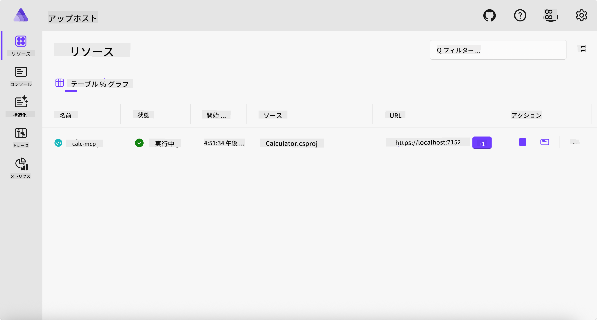
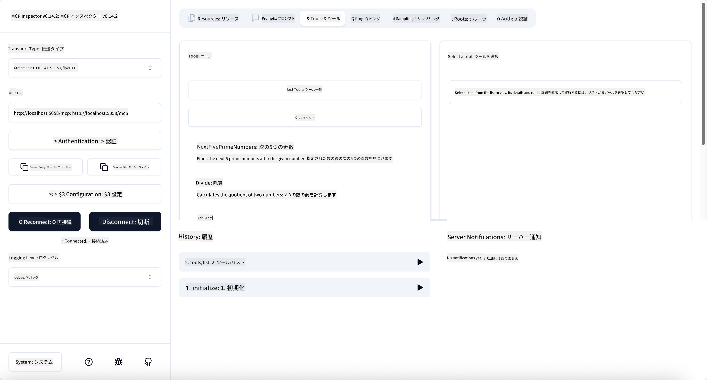

<!--
CO_OP_TRANSLATOR_METADATA:
{
  "original_hash": "0bc7bd48f55f1565f1d95ccb2c16f728",
  "translation_date": "2025-06-18T07:47:56+00:00",
  "source_file": "04-PracticalImplementation/samples/csharp/README.md",
  "language_code": "ja"
}
-->
# サンプル

前の例では、ローカルの.NETプロジェクトを`stdio`タイプで使う方法と、コンテナ内でサーバーをローカル実行する方法を示しました。多くの状況で良い解決策ですが、クラウド環境のようにリモートでサーバーを動かすことも有用です。ここで`http`タイプが役立ちます。

`04-PracticalImplementation`フォルダー内のソリューションを見ると、前の例よりずっと複雑に見えるかもしれません。しかし実際はそうではありません。プロジェクト`src/Calculator`をよく見ると、ほとんど前の例と同じコードであることがわかります。唯一の違いは、HTTPリクエストを扱うために別のライブラリ`ModelContextProtocol.AspNetCore`を使っていることと、メソッド`IsPrime`をprivateに変更して、コード内でプライベートメソッドを持てることを示している点です。それ以外のコードは前と同じです。

他のプロジェクトは[.NET Aspire](https://learn.microsoft.com/dotnet/aspire/get-started/aspire-overview)からのものです。ソリューションに.NET Aspireを含めることで、開発やテストの体験が向上し、可観測性も助けられます。サーバーを動かすのに必須ではありませんが、ソリューションに入れておくのは良い習慣です。

## サーバーをローカルで起動する

1. VS Code（C# DevKit拡張機能付き）から`04-PracticalImplementation/samples/csharp`ディレクトリに移動します。  
1. 以下のコマンドを実行してサーバーを起動します。

   ```bash
    dotnet watch run --project ./src/AppHost
   ```

1. Webブラウザで.NET Aspireダッシュボードが開いたら、`http`のURLを確認してください。`http://localhost:5058/`のようになっているはずです。

   

## MCP InspectorでStreamable HTTPをテストする

Node.js 22.7.5以降をお持ちの場合、MCP Inspectorを使ってサーバーをテストできます。

サーバーを起動し、ターミナルで以下のコマンドを実行してください。

```bash
npx @modelcontextprotocol/inspector http://localhost:5058
```



- `Streamable HTTP` as the Transport type.
- In the Url field, enter the URL of the server noted earlier, and append `/mcp`を選択します。`http`であるはずです（`https`) something like `http://localhost:5058/mcp`.
- select the Connect button.

A nice thing about the Inspector is that it provide a nice visibility on what is happening.

- Try listing the available tools
- Try some of them, it should works just like before.

## Test MCP Server with GitHub Copilot Chat in VS Code

To use the Streamable HTTP transport with GitHub Copilot Chat, change the configuration of the `calc-mcp`ではありません）。先ほど作成したサーバーは以下のようになります：

```jsonc
// .vscode/mcp.json
{
  "servers": {
    "calc-mcp": {
      "type": "http",
      "url": "http://localhost:5058/mcp"
    }
  }
}
```

いくつかテストをしてみましょう：

- 「6780の後の3つの素数を教えて」と聞いてみてください。Copilotが新しいツール`NextFivePrimeNumbers`を使い、最初の3つの素数だけを返すことに注目してください。  
- 「111の後の7つの素数を教えて」と聞いて、どうなるか確認してください。  
- 「ジョンは24個のロリポップを3人の子供に全部配りたい。1人あたり何個になるか？」と聞いて、結果を見てみましょう。

## サーバーをAzureにデプロイする

より多くの人が使えるように、サーバーをAzureにデプロイしましょう。

ターミナルから`04-PracticalImplementation/samples/csharp`フォルダーに移動し、以下のコマンドを実行します。

```bash
azd up
```

デプロイが完了すると、次のようなメッセージが表示されます。


URLをコピーして、MCP InspectorやGitHub Copilot Chatで使ってください。

```jsonc
// .vscode/mcp.json
{
  "servers": {
    "calc-mcp": {
      "type": "http",
      "url": "https://calc-mcp.gentleriver-3977fbcf.australiaeast.azurecontainerapps.io/mcp"
    }
  }
}
```

## 次は？

異なるトランスポートタイプやテストツールを試しました。また、MCPサーバーをAzureにデプロイしました。では、もしサーバーがプライベートリソースにアクセスする必要があったら？例えばデータベースやプライベートAPIなどです。次の章では、サーバーのセキュリティをどう強化できるかを見ていきます。

**免責事項**：  
本書類はAI翻訳サービス「[Co-op Translator](https://github.com/Azure/co-op-translator)」を使用して翻訳されました。正確性の向上に努めておりますが、自動翻訳には誤りや不正確な箇所が含まれる可能性があります。原文の言語による原本が正式な情報源とみなされます。重要な情報については、専門の人間による翻訳を推奨いたします。本翻訳の利用により生じたいかなる誤解や誤訳についても、当方は一切責任を負いかねます。