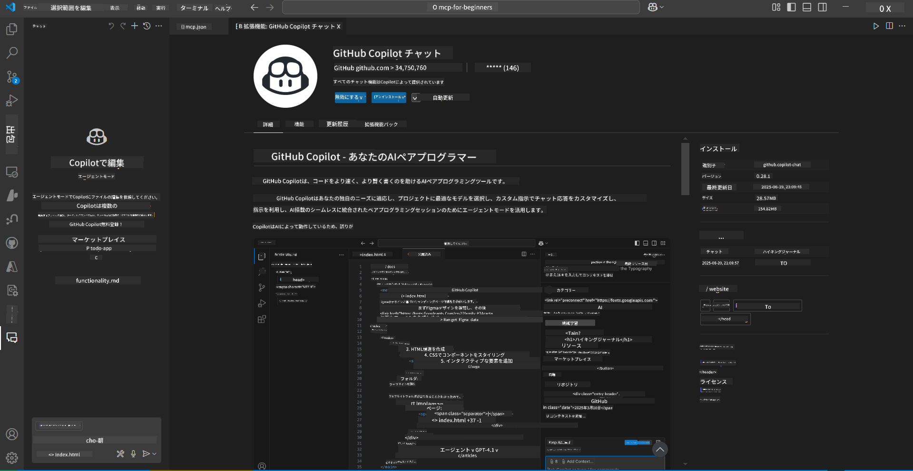
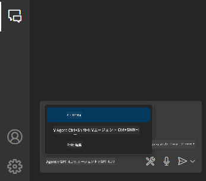
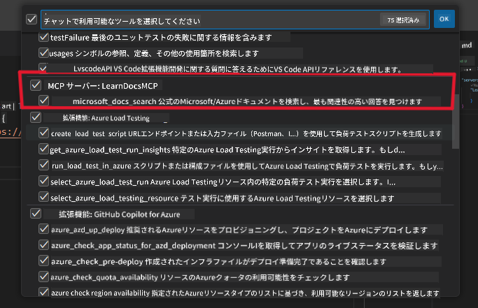
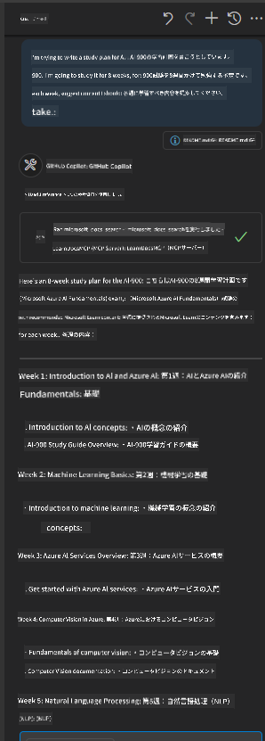
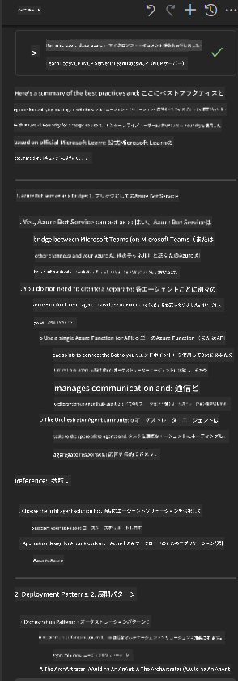

<!--
CO_OP_TRANSLATOR_METADATA:
{
  "original_hash": "db532b1ec386c9ce38c791653dc3c881",
  "translation_date": "2025-06-21T14:36:34+00:00",
  "source_file": "09-CaseStudy/docs-mcp/solution/scenario3/README.md",
  "language_code": "ja"
}
-->
# シナリオ 3: VS Code 内での MCP サーバーを使ったエディター内ドキュメント

## 概要

このシナリオでは、MCP サーバーを使って Microsoft Learn Docs を Visual Studio Code の環境に直接取り込む方法を学びます。ブラウザのタブを何度も切り替えてドキュメントを探す代わりに、エディター内で公式ドキュメントを検索・参照できます。この方法により作業の効率が上がり、集中力を保ちつつ、GitHub Copilot のようなツールとのシームレスな連携が可能になります。

- コーディング環境を離れずに VS Code 内でドキュメントを検索・閲覧。
- ドキュメントを参照し、README やコースファイルにリンクを直接挿入。
- GitHub Copilot と MCP を組み合わせて、AI を活用したスムーズなドキュメント作業を実現。

## 学習目標

この章の終わりには、VS Code 内で MCP サーバーをセットアップして活用し、ドキュメント作成や開発のワークフローを向上させる方法が理解できるようになります。具体的には以下ができるようになります。

- MCP サーバーを使ったドキュメント検索のためにワークスペースを設定。
- VS Code 内から直接ドキュメントを検索し、挿入。
- GitHub Copilot と MCP の連携による生産性向上と AI 支援ワークフローの活用。

これらのスキルにより、集中力を維持しながらドキュメントの品質を高め、開発者やテクニカルライターとしての生産性を向上させることができます。

## ソリューション

エディター内でドキュメントにアクセスするために、MCP サーバーを VS Code と GitHub Copilot に統合する一連の手順を踏みます。この方法は、コース作成者やドキュメントライター、開発者がエディター内で集中しながらドキュメントや Copilot と連携して作業したい場合に最適です。

- コースやプロジェクトのドキュメント作成中に README に素早く参照リンクを追加。
- Copilot でコードを生成し、MCP で関連ドキュメントを即座に検索・引用。
- エディター内で集中力を保ち、生産性を向上。

### ステップバイステップガイド

はじめるには、以下の手順に従ってください。各ステップには assets フォルダーからのスクリーンショットを追加して視覚的に説明できます。

1. **MCP 設定を追加する：**  
   プロジェクトのルートに `.vscode/mcp.json` ファイルを作成し、以下の設定を追加します。  
   ```json
   {
     "servers": {
       "LearnDocsMCP": {
         "url": "https://learn.microsoft.com/api/mcp"
       }
     }
   }
   ```  
   この設定により、VS Code が [`Microsoft Learn Docs MCP server`](https://github.com/MicrosoftDocs/mcp) に接続する方法を指定します。  
   
   
    
2. **GitHub Copilot Chat パネルを開く：**  
   まだ GitHub Copilot 拡張機能をインストールしていない場合は、VS Code の拡張機能ビューからインストールしてください。[Visual Studio Code Marketplace](https://marketplace.visualstudio.com/items?itemName=GitHub.copilot-chat) から直接ダウンロードできます。その後、サイドバーから Copilot Chat パネルを開きます。  

   

3. **エージェントモードを有効にしツールを確認：**  
   Copilot Chat パネルでエージェントモードを有効にします。  

   

   エージェントモードを有効にした後、MCP サーバーが利用可能なツールの一覧に表示されていることを確認します。これにより、Copilot エージェントがドキュメントサーバーにアクセスして関連情報を取得できるようになります。  
   
   

4. **新しいチャットを開始しエージェントに質問：**  
   Copilot Chat パネルで新しいチャットを開き、ドキュメントに関する質問をエージェントに投げかけます。エージェントは MCP サーバーを使って、Microsoft Learn の関連ドキュメントを直接エディター内に取得・表示します。

   - *「トピック X の学習計画を作成したいです。8 週間かけて学習する予定なので、各週に取り組むべき内容を提案してください。」*

   

5. **ライブクエリ：**

   > Azure AI Foundry Discord の [#get-help](https://discord.gg/D6cRhjHWSC) セクションからのライブクエリを紹介します（[元メッセージを見る](https://discord.com/channels/1113626258182504448/1385498306720829572)）：  
   
   *「Azure AI Foundry 上で開発された AI エージェントを使ったマルチエージェントソリューションの展開方法について教えてください。Copilot Studio チャンネルのような直接的な展開方法がないようですが、企業ユーザーが連携して作業を進めるためにはどのような展開方法がありますか？  
   Azure Bot サービスを使って MS Teams と Azure AI Foundry エージェントの橋渡しをする方法もあると聞きますが、Azure Bot をセットアップして Azure AI Foundry の Orchestrator Agent に Azure Function 経由で接続しオーケストレーションを行う方法は有効でしょうか？それとも、マルチエージェントソリューションの各 AI エージェントごとに Azure Function を作成し、Bot Framework でオーケストレーションを行う必要がありますか？他に良い方法があれば教えてください。」*

   

   エージェントは関連するドキュメントのリンクや要約を返し、それをマークダウンファイルに直接挿入したり、コード内で参照として使うことができます。

### サンプルクエリ

以下は試してみることができるクエリの例です。これらのクエリは、MCP サーバーと Copilot が連携して、VS Code を離れずに即座に文脈に応じたドキュメントや参照を提供する様子を示します。

- 「Azure Functions のトリガーの使い方を教えてください。」
- 「Azure Key Vault の公式ドキュメントへのリンクを挿入してください。」
- 「Azure リソースのセキュリティベストプラクティスは何ですか？」
- 「Azure AI サービスのクイックスタートを見つけてください。」

これらのクエリを通じて、MCP サーバーと Copilot の連携により、VS Code 内で即時かつ文脈に沿ったドキュメント参照が可能になることを体験できます。

---

**免責事項**：  
本書類はAI翻訳サービス「[Co-op Translator](https://github.com/Azure/co-op-translator)」を使用して翻訳されました。正確性には努めておりますが、自動翻訳には誤りや不正確な部分が含まれる可能性があることをご了承ください。原文の言語によるオリジナル文書が正式な情報源とみなされます。重要な情報については、専門の人間による翻訳を推奨いたします。本翻訳の利用により生じたいかなる誤解や誤訳についても、当方は一切の責任を負いかねます。