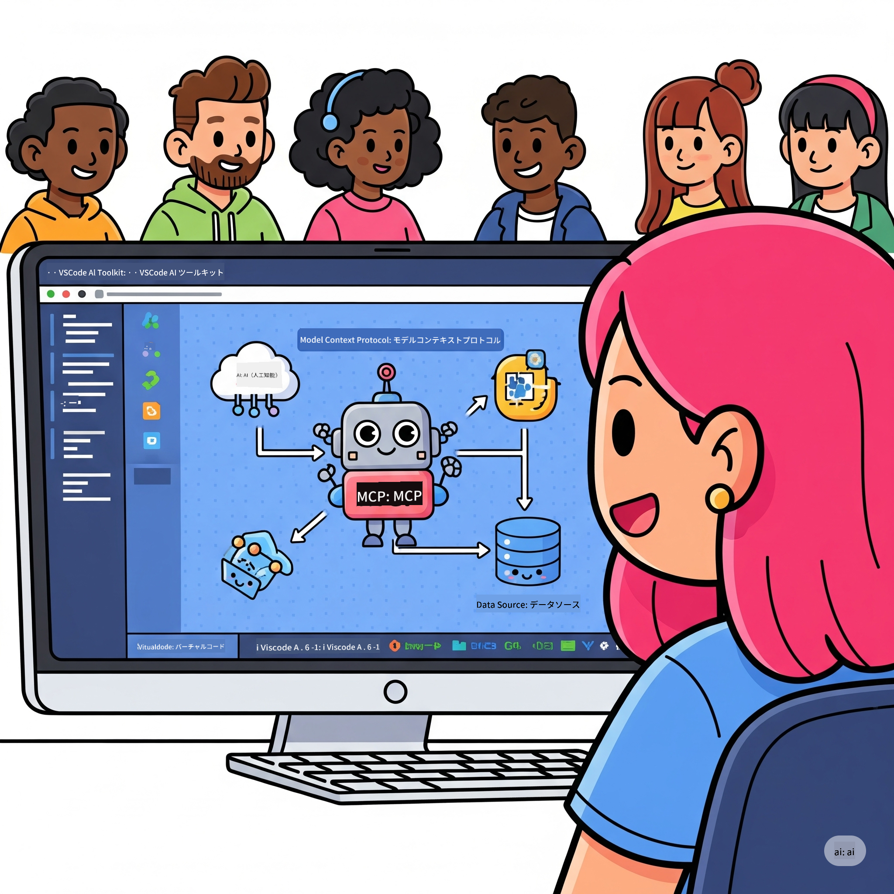

<!--
CO_OP_TRANSLATOR_METADATA:
{
  "original_hash": "787440926586cd064b0899fd1c514f52",
  "translation_date": "2025-06-10T04:50:58+00:00",
  "source_file": "10-StreamliningAIWorkflowsBuildingAnMCPServerWithAIToolkit/README.md",
  "language_code": "ja"
}
-->
# AIワークフローの効率化：AI Toolkitを使ったMCPサーバー構築

## 🎯 概要

**Model Context Protocol (MCP) ワークショップ**へようこそ！この実践的なワークショップでは、AIアプリケーション開発を革新する2つの最先端技術を組み合わせています：

- **🔗 Model Context Protocol (MCP)**：シームレスなAIツール統合のためのオープン標準
- **🛠️ AI Toolkit for Visual Studio Code (AITK)**：Microsoftが提供する強力なAI開発拡張機能

### 🎓 学べること

このワークショップを終える頃には、AIモデルと実際のツールやサービスをつなぐインテリジェントなアプリケーションの構築方法を習得します。自動テストからカスタムAPI統合まで、複雑なビジネス課題を解決する実践的なスキルを身につけましょう。

## 🏗️ 技術スタック

### 🔌 Model Context Protocol (MCP)

MCPはAIのための**「USB-C」**のような存在で、AIモデルを外部ツールやデータソースに接続するための共通規格です。

**✨ 主な特徴：**
- 🔄 **標準化された統合**：AIツール接続のための共通インターフェース
- 🏛️ **柔軟なアーキテクチャ**：stdio/SSEトランスポートによるローカル＆リモートサーバー対応
- 🧰 **豊富なエコシステム**：ツール、プロンプト、リソースを一つのプロトコルで管理
- 🔒 **エンタープライズ対応**：組み込みのセキュリティと信頼性

**🎯 MCPの重要性：**
USB-Cがケーブルの混乱を解消したように、MCPはAI統合の複雑さを解消します。ひとつのプロトコルで無限の可能性を。

### 🤖 AI Toolkit for Visual Studio Code (AITK)

MicrosoftのフラッグシップAI開発拡張機能で、VS CodeをAI開発の強力なプラットフォームに変えます。

**🚀 主な機能：**
- 📦 **モデルカタログ**：Azure AI、GitHub、Hugging Face、Ollamaのモデルにアクセス
- ⚡ **ローカル推論**：ONNX最適化されたCPU/GPU/NPU実行
- 🏗️ **エージェントビルダー**：MCP統合によるビジュアルAIエージェント開発
- 🎭 **マルチモーダル対応**：テキスト、ビジョン、構造化出力のサポート

**💡 開発メリット：**
- 設定不要のモデルデプロイ
- ビジュアルなプロンプトエンジニアリング
- リアルタイムテストプレイグラウンド
- シームレスなMCPサーバー統合

## 📚 学習の流れ

### [🚀 モジュール1：AI Toolkit基礎](./lab1/README.md)
**所要時間**：15分
- 🛠️ VS Code用AI Toolkitのインストールと設定
- 🗂️ モデルカタログの探索（GitHub、ONNX、OpenAI、Anthropic、Googleから100以上のモデル）
- 🎮 インタラクティブプレイグラウンドでリアルタイムモデルテストを習得
- 🤖 Agent Builderで初めてのAIエージェントを作成
- 📊 組み込みの指標（F1、関連性、類似性、一貫性）でモデル性能を評価
- ⚡ バッチ処理とマルチモーダル対応機能を学習

**🎯 学習目標**：AITKの機能を十分に理解し、実用的なAIエージェントを作成する

### [🌐 モジュール2：MCPとAI Toolkit基礎](./lab2/README.md)
**所要時間**：20分
- 🧠 Model Context Protocol (MCP)のアーキテクチャと概念を習得
- 🌐 MicrosoftのMCPサーバーエコシステムを探る
- 🤖 Playwright MCPサーバーを使ったブラウザ自動化エージェントを構築
- 🔧 MCPサーバーをAI ToolkitのAgent Builderに統合
- 📊 エージェント内でMCPツールの設定とテストを実施
- 🚀 MCP対応エージェントをエクスポートし、本番環境に展開

**🎯 学習目標**：MCPを活用して外部ツールと連携したAIエージェントを展開する

### [🔧 モジュール3：AI Toolkitによる高度なMCP開発](./lab3/README.md)
**所要時間**：20分
- 💻 AI Toolkitを使ってカスタムMCPサーバーを作成
- 🐍 最新のMCP Python SDK（v1.9.3）を設定・利用
- 🔍 MCP Inspectorをセットアップし、デバッグに活用
- 🛠️ プロフェッショナルなデバッグワークフローでWeather MCPサーバーを構築
- 🧪 Agent BuilderとInspector両環境でMCPサーバーをデバッグ

**🎯 学習目標**：最新ツールを使ったカスタムMCPサーバーの開発とデバッグを習得

### [🐙 モジュール4：実践的MCP開発 - カスタムGitHubクローンサーバー](./lab4/README.md)
**所要時間**：30分
- 🏗️ 開発ワークフロー向けの実践的なGitHub Clone MCPサーバーを構築
- 🔄 バリデーションとエラーハンドリングを備えたスマートなリポジトリクローンを実装
- 📁 インテリジェントなディレクトリ管理とVS Code連携を作成
- 🤖 GitHub Copilot Agent ModeとカスタムMCPツールを活用
- 🛡️ 本番対応の信頼性とクロスプラットフォーム互換性を適用

**🎯 学習目標**：実際の開発ワークフローを効率化する本番対応のMCPサーバーを展開する

## 💡 実用例と影響

### 🏢 エンタープライズユースケース

#### 🔄 DevOps自動化
インテリジェントな自動化で開発ワークフローを変革：
- **スマートリポジトリ管理**：AIによるコードレビューとマージ判断
- **インテリジェントCI/CD**：コード変更に基づく自動パイプライン最適化
- **Issueトリアージ**：バグの自動分類と割り当て

#### 🧪 品質保証の革新
AI搭載の自動化でテストを強化：
- **インテリジェントテスト生成**：包括的なテストスイートの自動作成
- **ビジュアル回帰テスト**：AIによるUI変更検出
- **パフォーマンス監視**：問題の事前発見と解決

#### 📊 データパイプラインの知能化
賢いデータ処理ワークフローを構築：
- **適応型ETLプロセス**：自己最適化するデータ変換
- **異常検知**：リアルタイムのデータ品質監視
- **インテリジェントルーティング**：スマートなデータフロー管理

#### 🎧 カスタマーエクスペリエンス向上
卓越した顧客対応を実現：
- **コンテキスト対応サポート**：顧客履歴にアクセス可能なAIエージェント
- **プロアクティブな問題解決**：予測型カスタマーサービス
- **マルチチャネル統合**：プラットフォーム横断の統一AI体験

## 🛠️ 前提条件とセットアップ

### 💻 システム要件

| コンポーネント | 要件 | 備考 |
|-----------|-------------|-------|
| **OS** | Windows 10以上、macOS 10.15以上、Linux | いずれも最新のOSで可 |
| **Visual Studio Code** | 最新の安定版 | AITK利用に必須 |
| **Node.js** | v18.0以上とnpm | MCPサーバー開発用 |
| **Python** | 3.10以上 | Python製MCPサーバーは任意 |
| **メモリ** | 最低8GB RAM | ローカルモデル用は16GB推奨 |

### 🔧 開発環境

#### 推奨VS Code拡張機能
- **AI Toolkit** (ms-windows-ai-studio.windows-ai-studio)
- **Python** (ms-python.python)
- **Python Debugger** (ms-python.debugpy)
- **GitHub Copilot** (GitHub.copilot) - 任意だが便利

#### 任意ツール
- **uv**：最新のPythonパッケージマネージャー
- **MCP Inspector**：MCPサーバー用ビジュアルデバッグツール
- **Playwright**：ウェブ自動化のサンプル用

## 🎖️ 学習成果と認定パス

### 🏆 スキル習得チェックリスト

このワークショップを修了すると、以下のスキルをマスターできます：

#### 🎯 コアコンピテンシー
- [ ] **MCPプロトコルの習熟**：アーキテクチャと実装パターンの深い理解
- [ ] **AITKの熟練**：AI Toolkitを使った迅速な開発技術
- [ ] **カスタムサーバー開発**：本番対応のMCPサーバーの構築・展開・保守
- [ ] **ツール統合の卓越性**：既存の開発ワークフローとAIのシームレスな連携
- [ ] **問題解決の応用力**：学んだスキルを実際のビジネス課題に活用

#### 🔧 技術スキル
- [ ] VS CodeでのAI Toolkitセットアップと設定
- [ ] カスタムMCPサーバーの設計と実装
- [ ] GitHubモデルとMCPアーキテクチャの統合
- [ ] Playwrightを使った自動テストワークフローの構築
- [ ] AIエージェントの本番展開
- [ ] MCPサーバーのデバッグと最適化

#### 🚀 高度な能力
- [ ] エンタープライズ規模のAI統合アーキテクチャ設計
- [ ] AIアプリケーション向けセキュリティベストプラクティスの実装
- [ ] スケーラブルなMCPサーバーアーキテクチャの設計
- [ ] 特定ドメイン向けカスタムツールチェーンの作成
- [ ] AIネイティブ開発のメンター育成

## 📖 追加リソース
- [MCP仕様書](https://modelcontextprotocol.io/docs)
- [AI Toolkit GitHubリポジトリ](https://github.com/microsoft/vscode-ai-toolkit)
- [MCPサーバーサンプル集](https://github.com/modelcontextprotocol/servers)
- [ベストプラクティスガイド](https://modelcontextprotocol.io/docs/best-practices)

---

**🚀 AI開発ワークフローを革新する準備はできましたか？**

MCPとAI Toolkitでインテリジェントアプリケーションの未来を一緒に創りましょう！

**免責事項**：  
本書類はAI翻訳サービス「Co-op Translator」（https://github.com/Azure/co-op-translator）を使用して翻訳されました。正確性の向上に努めておりますが、自動翻訳には誤りや不正確な部分が含まれる可能性があります。原文の言語での文書が正式な情報源とみなされるべきです。重要な情報については、専門の人間による翻訳を推奨します。本翻訳の利用により生じた誤解や誤訳について、当方は一切の責任を負いかねます。