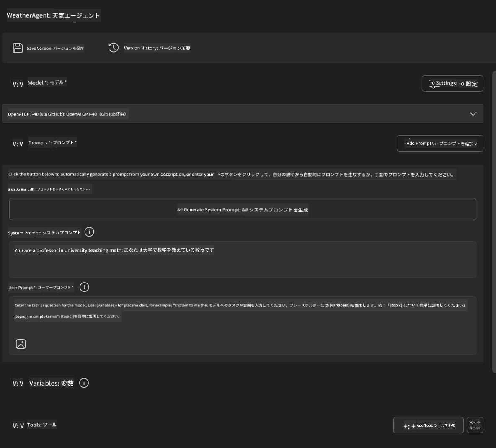
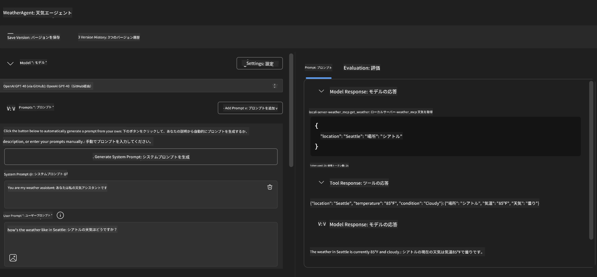

<!--
CO_OP_TRANSLATOR_METADATA:
{
  "original_hash": "dd8da3f75addcef453fe11f02a270217",
  "translation_date": "2025-06-10T06:06:16+00:00",
  "source_file": "10-StreamliningAIWorkflowsBuildingAnMCPServerWithAIToolkit/lab3/README.md",
  "language_code": "ja"
}
-->
# 🔧 モジュール 3: AI Toolkit を使った高度な MCP 開発


## 🎯 学習目標

このラボの終了時には、以下ができるようになります：

- ✅ AI Toolkit を使ってカスタム MCP サーバーを作成する
- ✅ 最新の MCP Python SDK (v1.9.3) を設定・利用する
- ✅ MCP Inspector をセットアップしてデバッグに活用する
- ✅ Agent Builder と Inspector 環境の両方で MCP サーバーをデバッグする
- ✅ 高度な MCP サーバー開発のワークフローを理解する

## 📋 前提条件

- ラボ 2 (MCP 基礎) の修了
- AI Toolkit 拡張機能がインストールされた VS Code
- Python 3.10+ 環境
- Inspector セットアップのための Node.js と npm

## 🏗️ 作成するもの

このラボでは、以下を示す **Weather MCP Server** を作成します：
- カスタム MCP サーバーの実装
- AI Toolkit Agent Builder との統合
- プロフェッショナルなデバッグワークフロー
- 最新の MCP SDK 利用パターン

---

## 🔧 コアコンポーネントの概要

### 🐍 MCP Python SDK
Model Context Protocol の Python SDK は、カスタム MCP サーバー構築の基盤です。バージョン 1.9.3 を使い、強化されたデバッグ機能を利用します。

### 🔍 MCP Inspector
強力なデバッグツールで、以下を提供します：
- リアルタイムのサーバーモニタリング
- ツール実行の可視化
- ネットワークリクエスト／レスポンスの検査
- インタラクティブなテスト環境

---

## 📖 ステップバイステップ実装

### ステップ 1: Agent Builder で WeatherAgent を作成

1. VS Code の AI Toolkit 拡張機能から **Agent Builder を起動**
2. 以下の設定で **新しいエージェントを作成**：
   - エージェント名: `WeatherAgent`



### ステップ 2: MCP サーバープロジェクトの初期化

1. Agent Builder で **Tools → Add Tool** に移動
2. 利用可能なオプションから **"MCP Server" を選択**
3. **"Create A new MCP Server" を選択**
4. `python-weather` テンプレートを選ぶ
5. サーバー名を設定：`weather_mcp`


### ステップ 3: プロジェクトを開いて確認

1. 生成されたプロジェクトを VS Code で開く
2. プロジェクト構成を確認：
   ```
   weather_mcp/
   ├── src/
   │   ├── __init__.py
   │   └── server.py
   ├── inspector/
   │   ├── package.json
   │   └── package-lock.json
   ├── .vscode/
   │   ├── launch.json
   │   └── tasks.json
   ├── pyproject.toml
   └── README.md
   ```

### ステップ 4: 最新 MCP SDK にアップグレード

> **🔍 なぜアップグレード？** 最新の MCP SDK (v1.9.3) と Inspector サービス (0.14.0) を使うことで、機能強化とより良いデバッグが可能になるためです。

#### 4a. Python 依存関係の更新

**`pyproject.toml`:** update [./code/weather_mcp/pyproject.toml](../../../../10-StreamliningAIWorkflowsBuildingAnMCPServerWithAIToolkit/lab3/code/weather_mcp/pyproject.toml)


#### 4b. Update Inspector Configuration

**Edit `inspector/package.json`:** update [./code/weather_mcp/inspector/package.json](../../../../10-StreamliningAIWorkflowsBuildingAnMCPServerWithAIToolkit/lab3/code/weather_mcp/inspector/package.json)

#### 4c. Update Inspector Dependencies

**Edit `inspector/package-lock.json`:** update [./code/weather_mcp/inspector/package-lock.json](../../../../10-StreamliningAIWorkflowsBuildingAnMCPServerWithAIToolkit/lab3/code/weather_mcp/inspector/package-lock.json)

> **📝 Note:** This file contains extensive dependency definitions. Below is the essential structure - the full content ensures proper dependency resolution.


> **⚡ Full Package Lock:** The complete package-lock.json contains ~3000 lines of dependency definitions. The above shows the key structure - use the provided file for complete dependency resolution.

### Step 5: Configure VS Code Debugging

*Note: Please copy the file in the specified path to replace the corresponding local file*

#### 5a. Update Launch Configuration

**Edit `.vscode/launch.json` を編集：**

```json
{
  "version": "0.2.0",
  "configurations": [
    {
      "name": "Attach to Local MCP",
      "type": "debugpy",
      "request": "attach",
      "connect": {
        "host": "localhost",
        "port": 5678
      },
      "presentation": {
        "hidden": true
      },
      "internalConsoleOptions": "neverOpen",
      "postDebugTask": "Terminate All Tasks"
    },
    {
      "name": "Launch Inspector (Edge)",
      "type": "msedge",
      "request": "launch",
      "url": "http://localhost:6274?timeout=60000&serverUrl=http://localhost:3001/sse#tools",
      "cascadeTerminateToConfigurations": [
        "Attach to Local MCP"
      ],
      "presentation": {
        "hidden": true
      },
      "internalConsoleOptions": "neverOpen"
    },
    {
      "name": "Launch Inspector (Chrome)",
      "type": "chrome",
      "request": "launch",
      "url": "http://localhost:6274?timeout=60000&serverUrl=http://localhost:3001/sse#tools",
      "cascadeTerminateToConfigurations": [
        "Attach to Local MCP"
      ],
      "presentation": {
        "hidden": true
      },
      "internalConsoleOptions": "neverOpen"
    }
  ],
  "compounds": [
    {
      "name": "Debug in Agent Builder",
      "configurations": [
        "Attach to Local MCP"
      ],
      "preLaunchTask": "Open Agent Builder",
    },
    {
      "name": "Debug in Inspector (Edge)",
      "configurations": [
        "Launch Inspector (Edge)",
        "Attach to Local MCP"
      ],
      "preLaunchTask": "Start MCP Inspector",
      "stopAll": true
    },
    {
      "name": "Debug in Inspector (Chrome)",
      "configurations": [
        "Launch Inspector (Chrome)",
        "Attach to Local MCP"
      ],
      "preLaunchTask": "Start MCP Inspector",
      "stopAll": true
    }
  ]
}
```

**`.vscode/tasks.json` を編集：**

```
{
  "version": "2.0.0",
  "tasks": [
    {
      "label": "Start MCP Server",
      "type": "shell",
      "command": "python -m debugpy --listen 127.0.0.1:5678 src/__init__.py sse",
      "isBackground": true,
      "options": {
        "cwd": "${workspaceFolder}",
        "env": {
          "PORT": "3001"
        }
      },
      "problemMatcher": {
        "pattern": [
          {
            "regexp": "^.*$",
            "file": 0,
            "location": 1,
            "message": 2
          }
        ],
        "background": {
          "activeOnStart": true,
          "beginsPattern": ".*",
          "endsPattern": "Application startup complete|running"
        }
      }
    },
    {
      "label": "Start MCP Inspector",
      "type": "shell",
      "command": "npm run dev:inspector",
      "isBackground": true,
      "options": {
        "cwd": "${workspaceFolder}/inspector",
        "env": {
          "CLIENT_PORT": "6274",
          "SERVER_PORT": "6277",
        }
      },
      "problemMatcher": {
        "pattern": [
          {
            "regexp": "^.*$",
            "file": 0,
            "location": 1,
            "message": 2
          }
        ],
        "background": {
          "activeOnStart": true,
          "beginsPattern": "Starting MCP inspector",
          "endsPattern": "Proxy server listening on port"
        }
      },
      "dependsOn": [
        "Start MCP Server"
      ]
    },
    {
      "label": "Open Agent Builder",
      "type": "shell",
      "command": "echo ${input:openAgentBuilder}",
      "presentation": {
        "reveal": "never"
      },
      "dependsOn": [
        "Start MCP Server"
      ],
    },
    {
      "label": "Terminate All Tasks",
      "command": "echo ${input:terminate}",
      "type": "shell",
      "problemMatcher": []
    }
  ],
  "inputs": [
    {
      "id": "openAgentBuilder",
      "type": "command",
      "command": "ai-mlstudio.agentBuilder",
      "args": {
        "initialMCPs": [ "local-server-weather_mcp" ],
        "triggeredFrom": "vsc-tasks"
      }
    },
    {
      "id": "terminate",
      "type": "command",
      "command": "workbench.action.tasks.terminate",
      "args": "terminateAll"
    }
  ]
}
```

---

## 🚀 MCP サーバーの起動とテスト

### ステップ 6: 依存関係のインストール

設定変更後、以下のコマンドを実行：

**Python 依存関係のインストール：**
```bash
uv sync
```

**Inspector 依存関係のインストール：**
```bash
cd inspector
npm install
```

### ステップ 7: Agent Builder でデバッグ

1. **F5 キーを押す**か、**"Debug in Agent Builder"** 構成を使用
2. デバッグパネルから複合構成を選択
3. サーバー起動と Agent Builder の起動を待つ
4. 自然言語クエリで Weather MCP サーバーをテスト

以下のような入力を行います

SYSTEM_PROMPT

```
You are my weather assistant
```

USER_PROMPT

```
How's the weather like in Seattle
```



### ステップ 8: MCP Inspector でデバッグ

1. **"Debug in Inspector"** 構成を使用（Edge または Chrome）
2. `http://localhost:6274` で Inspector インターフェースを開く
3. インタラクティブなテスト環境を探索：
   - 利用可能なツールの確認
   - ツール実行のテスト
   - ネットワークリクエストの監視
   - サーバーレスポンスのデバッグ


---

## 🎯 主要な学習成果

このラボを終えて、以下ができるようになりました：

- [x] AI Toolkit テンプレートを使ったカスタム MCP サーバーの作成
- [x] 最新 MCP SDK (v1.9.3) へのアップグレードによる機能強化
- [x] Agent Builder と Inspector 両方のプロフェッショナルなデバッグワークフローの設定
- [x] インタラクティブなサーバーテストのための MCP Inspector のセットアップ
- [x] MCP 開発における VS Code のデバッグ構成の習得

## 🔧 探索した高度な機能

| 機能 | 説明 | 利用例 |
|---------|-------------|----------|
| **MCP Python SDK v1.9.3** | 最新のプロトコル実装 | モダンなサーバー開発 |
| **MCP Inspector 0.14.0** | インタラクティブなデバッグツール | リアルタイムのサーバーテスト |
| **VS Code デバッグ** | 統合開発環境 | プロフェッショナルなデバッグワークフロー |
| **Agent Builder 統合** | AI Toolkit との直接接続 | エンドツーエンドのエージェントテスト |

## 📚 追加リソース

- [MCP Python SDK ドキュメント](https://modelcontextprotocol.io/docs/sdk/python)
- [AI Toolkit 拡張機能ガイド](https://code.visualstudio.com/docs/ai/ai-toolkit)
- [VS Code デバッグドキュメント](https://code.visualstudio.com/docs/editor/debugging)
- [Model Context Protocol 仕様](https://modelcontextprotocol.io/docs/concepts/architecture)

---

**🎉 おめでとうございます！** ラボ 3 を無事に完了し、プロフェッショナルな開発ワークフローでカスタム MCP サーバーの作成、デバッグ、デプロイができるようになりました。

### 🔜 次のモジュールへ進む

実際の開発ワークフローで MCP スキルを活かす準備はできましたか？続けて **[モジュール 4: 実践的 MCP 開発 - カスタム GitHub クローンサーバー](../lab4/README.md)** に進みましょう。ここでは：

- GitHub リポジトリ操作を自動化する本番対応の MCP サーバーを構築
- MCP 経由で GitHub リポジトリのクローン機能を実装
- VS Code と GitHub Copilot Agent Mode とカスタム MCP サーバーの統合
- 本番環境でのカスタム MCP サーバーのテストとデプロイ
- 開発者向けの実践的なワークフロー自動化を学習

**免責事項**:  
本書類はAI翻訳サービス「[Co-op Translator](https://github.com/Azure/co-op-translator)」を使用して翻訳されています。正確性には努めておりますが、自動翻訳には誤りや不正確な部分が含まれる可能性があることをご承知おきください。原文の言語で記載された文書が正式な情報源とみなされます。重要な情報については、専門の人間による翻訳を推奨します。本翻訳の使用により生じた誤解や誤訳について、当方は一切の責任を負いかねます。