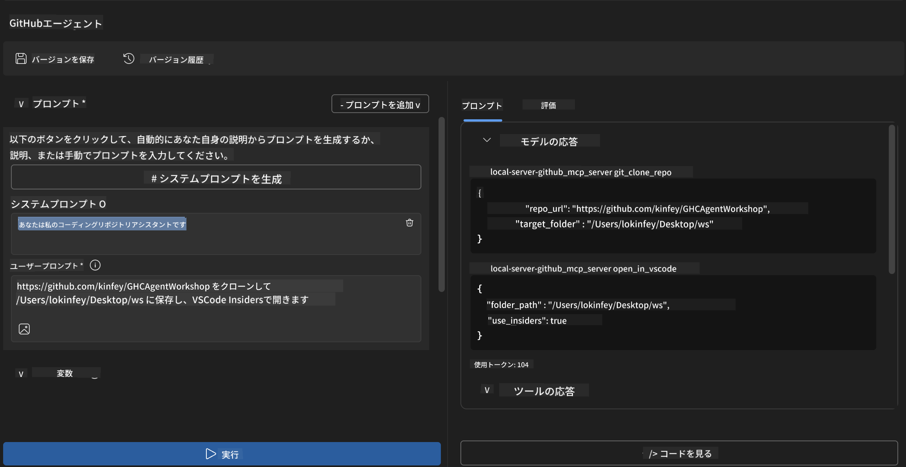
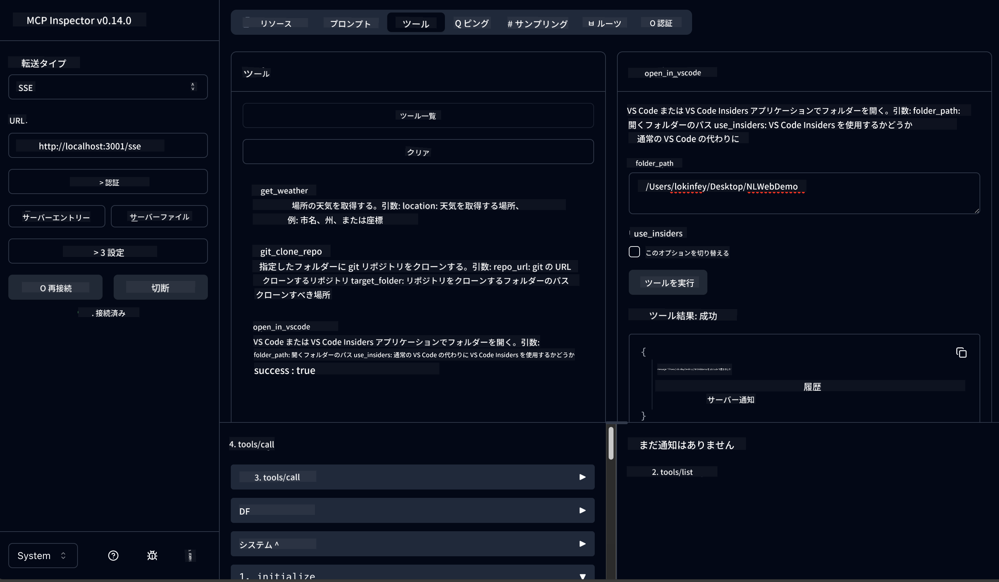

<!--
CO_OP_TRANSLATOR_METADATA:
{
  "original_hash": "f83bc722dc758efffd68667d6a1db470",
  "translation_date": "2025-06-10T06:43:57+00:00",
  "source_file": "10-StreamliningAIWorkflowsBuildingAnMCPServerWithAIToolkit/lab4/README.md",
  "language_code": "ja"
}
-->
# 🐙 モジュール4: 実践的MCP開発 - カスタムGitHubクローンサーバー


> **⚡ クイックスタート:** たった30分で、GitHubリポジトリのクローン作成とVS Code連携を自動化する本番対応のMCPサーバーを構築しましょう！

## 🎯 学習目標

このラボを終える頃には、以下ができるようになります：

- ✅ 実務向けのカスタムMCPサーバーを作成する
- ✅ MCPを通じてGitHubリポジトリのクローン機能を実装する
- ✅ カスタムMCPサーバーをVS CodeおよびAgent Builderと統合する
- ✅ GitHub Copilot Agent ModeをカスタムMCPツールで活用する
- ✅ 本番環境でカスタムMCPサーバーのテストとデプロイを行う

## 📋 前提条件

- ラボ1〜3（MCPの基礎と高度な開発）の完了
- GitHub Copilotのサブスクリプション（[無料登録可能](https://github.com/github-copilot/signup)）
- AI ToolkitとGitHub Copilot拡張機能が入ったVS Code
- Git CLIのインストールと設定

## 🏗️ プロジェクト概要

### **実務開発の課題**
開発者として、GitHubからリポジトリをクローンし、VS CodeまたはVS Code Insidersで開く作業を頻繁に行います。この手動プロセスは以下のステップを含みます：
1. ターミナルやコマンドプロンプトを開く
2. 目的のディレクトリへ移動する
3. `git clone` コマンドを実行する
4. クローンしたディレクトリでVS Codeを開く

**私たちのMCPソリューションはこれを一つのスマートコマンドにまとめます！**

### **作成するもの**
**GitHub Clone MCPサーバー** (`git_mcp_server`) は以下を提供します：

| 機能 | 説明 | 利点 |
|---------|-------------|---------|
| 🔄 **スマートリポジトリクローン** | GitHubリポジトリを検証付きでクローン | 自動エラーチェック |
| 📁 **賢いディレクトリ管理** | 安全にディレクトリの存在確認と作成 | 上書き防止 |
| 🚀 **クロスプラットフォームVS Code連携** | VS Code/Insidersでプロジェクトを開く | スムーズなワークフロー移行 |
| 🛡️ **堅牢なエラーハンドリング** | ネットワーク、権限、パス問題を処理 | 本番対応の信頼性 |

---

## 📖 ステップバイステップ実装

### ステップ1: Agent BuilderでGitHubエージェントを作成

1. AI Toolkit拡張機能から**Agent Builder**を起動
2. 次の設定で**新しいエージェントを作成**：
   ```
   Agent Name: GitHubAgent
   ```

3. **カスタムMCPサーバーの初期化:**
   - **Tools** → **Add Tool** → **MCP Server**へ移動
   - **"Create A new MCP Server"**を選択
   - 柔軟性の高い**Pythonテンプレート**を選択
   - **サーバー名:** `git_mcp_server`

### ステップ2: GitHub Copilot Agent Modeの設定

1. VS CodeでGitHub Copilotを開く（Ctrl/Cmd + Shift + P → "GitHub Copilot: Open"）
2. Copilotインターフェースで**Agent Model**を選択
3. 高度な推論能力を持つ**Claude 3.7モデル**を選択
4. ツールアクセス用に**MCP統合を有効化**

> **💡 プロのコツ:** Claude 3.7は開発ワークフローとエラーハンドリングのパターン理解に優れています。

### ステップ3: MCPサーバーのコア機能を実装

**以下の詳細なプロンプトをGitHub Copilot Agent Modeで使用してください：**

```
Create two MCP tools with the following comprehensive requirements:

🔧 TOOL A: clone_repository
Requirements:
- Clone any GitHub repository to a specified local folder
- Return the absolute path of the successfully cloned project
- Implement comprehensive validation:
  ✓ Check if target directory already exists (return error if exists)
  ✓ Validate GitHub URL format (https://github.com/user/repo)
  ✓ Verify git command availability (prompt installation if missing)
  ✓ Handle network connectivity issues
  ✓ Provide clear error messages for all failure scenarios

🚀 TOOL B: open_in_vscode
Requirements:
- Open specified folder in VS Code or VS Code Insiders
- Cross-platform compatibility (Windows/Linux/macOS)
- Use direct application launch (not terminal commands)
- Auto-detect available VS Code installations
- Handle cases where VS Code is not installed
- Provide user-friendly error messages

Additional Requirements:
- Follow MCP 1.9.3 best practices
- Include proper type hints and documentation
- Implement logging for debugging purposes
- Add input validation for all parameters
- Include comprehensive error handling
```

### ステップ4: MCPサーバーのテスト

#### 4a. Agent Builderでのテスト

1. Agent Builderのデバッグ構成を起動
2. 次のシステムプロンプトでエージェントを設定：

```
SYSTEM_PROMPT:
You are my intelligent coding repository assistant. You help developers efficiently clone GitHub repositories and set up their development environment. Always provide clear feedback about operations and handle errors gracefully.
```

3. 実際のユーザーシナリオでテスト：

```
USER_PROMPT EXAMPLES:

Scenario : Basic Clone and Open
"Clone {Your GitHub Repo link such as https://github.com/kinfey/GHCAgentWorkshop
 } and save to {The global path you specify}, then open it with VS Code Insiders"
```



**期待される結果:**
- ✅ パス確認付きの正常なクローン完了
- ✅ 自動でVS Codeが起動
- ✅ 無効なケースでの明確なエラーメッセージ
- ✅ エッジケースの適切な処理

#### 4b. MCP Inspectorでのテスト



---

**🎉 おめでとうございます！** 実務で使える本番対応のMCPサーバーを無事に作成できました。カスタムGitHubクローンサーバーは、開発者の生産性を自動化・向上させるMCPの力を示しています。

### 🏆 獲得した実績:
- ✅ **MCP開発者** - カスタムMCPサーバーを作成
- ✅ **ワークフロー自動化者** - 開発プロセスを効率化  
- ✅ **統合エキスパート** - 複数の開発ツールを連携
- ✅ **本番対応者** - デプロイ可能なソリューションを構築

---

## 🎓 ワークショップ完了：Model Context Protocolとの旅

**ワークショップ参加者の皆さまへ**

Model Context Protocolワークショップの4つのモジュールをすべて修了したことをお祝いします！AI Toolkitの基本から始まり、実務に使えるMCPサーバー構築まで大きく成長されました。

### 🚀 学習の振り返り：

**[モジュール1](../lab1/README.md)**：AI Toolkitの基礎、モデルテスト、初めてのAIエージェント作成を体験。

**[モジュール2](../lab2/README.md)**：MCPのアーキテクチャを学び、Playwright MCPを統合し、ブラウザ自動化エージェントを構築。

**[モジュール3](../lab3/README.md)**：カスタムMCPサーバー開発へ進み、Weather MCPサーバーとデバッグツールをマスター。

**[モジュール4](../lab4/README.md)**：実践的なGitHubリポジトリのワークフロー自動化ツールを完成。

### 🌟 習得したスキル：

- ✅ **AI Toolkitエコシステム**：モデル、エージェント、統合パターン
- ✅ **MCPアーキテクチャ**：クライアント・サーバーデザイン、通信プロトコル、セキュリティ
- ✅ **開発ツール**：PlaygroundからInspector、そして本番デプロイまで
- ✅ **カスタム開発**：独自MCPサーバーの構築、テスト、デプロイ
- ✅ **実践応用**：AIを使った現実のワークフロー課題の解決

### 🔮 次のステップ：

1. **自分だけのMCPサーバーを構築**：独自のワークフロー自動化に挑戦
2. **MCPコミュニティに参加**：作品を共有し、他者から学ぶ
3. **高度な統合を探求**：企業システムとの連携を拡大
4. **オープンソースに貢献**：MCPツールやドキュメントの改善に参加

このワークショップはあくまで始まりです。Model Context Protocolのエコシステムは急速に進化しており、あなたはAI搭載開発ツールの最前線に立つ準備ができています。

**ご参加と学習への熱意に感謝します！**

このワークショップが、あなたの開発とAIツール活用の未来を切り拓くきっかけとなることを願っています。

**楽しいコーディングを！**

---

**免責事項**：  
本書類はAI翻訳サービス「[Co-op Translator](https://github.com/Azure/co-op-translator)」を使用して翻訳されました。正確性の向上に努めておりますが、自動翻訳には誤りや不正確な部分が含まれる可能性があることをご理解ください。原文の言語で記載された文書が正式な情報源となります。重要な情報については、専門の人間による翻訳を推奨いたします。本翻訳の使用により生じた誤解や誤訳について、当方は一切の責任を負いかねます。