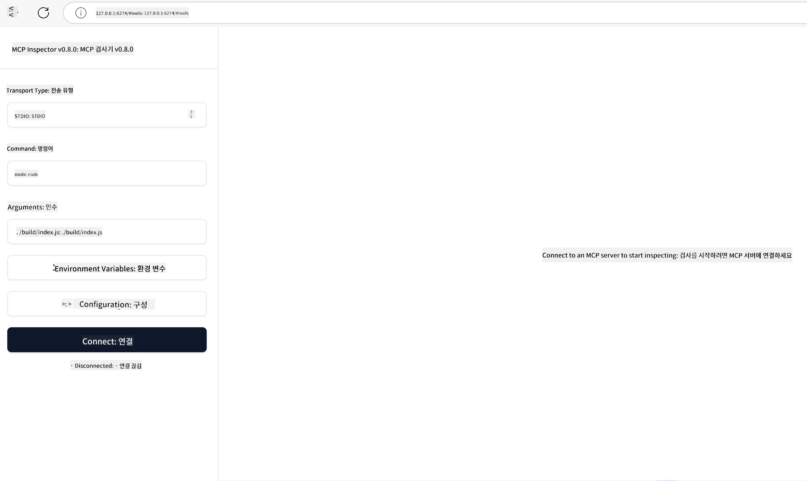

<!--
CO_OP_TRANSLATOR_METADATA:
{
  "original_hash": "8a20383b884e55ca6289bab35796448c",
  "translation_date": "2025-07-29T00:26:43+00:00",
  "source_file": "04-PracticalImplementation/README.md",
  "language_code": "ko"
}
-->
# 실용적 구현

[](https://youtu.be/vCN9-mKBDfQ)

_(위 이미지를 클릭하면 이 강의의 동영상을 볼 수 있습니다)_

실용적 구현은 Model Context Protocol(MCP)의 강력함을 실제로 체감할 수 있는 부분입니다. MCP의 이론과 아키텍처를 이해하는 것도 중요하지만, 이러한 개념을 활용하여 실제 문제를 해결하는 솔루션을 구축, 테스트 및 배포할 때 진정한 가치를 발견할 수 있습니다. 이 장에서는 개념적 지식과 실질적 개발 간의 간극을 메우며 MCP 기반 애플리케이션을 실현하는 과정을 안내합니다.

지능형 비서 개발, AI를 비즈니스 워크플로에 통합, 데이터 처리용 맞춤형 도구 구축 등 어떤 작업을 하든 MCP는 유연한 기반을 제공합니다. 언어에 구애받지 않는 설계와 인기 있는 프로그래밍 언어를 위한 공식 SDK 덕분에 다양한 개발자가 쉽게 접근할 수 있습니다. 이러한 SDK를 활용하면 다양한 플랫폼과 환경에서 솔루션을 빠르게 프로토타입, 반복 및 확장할 수 있습니다.

다음 섹션에서는 C#, Java, TypeScript, JavaScript, Python에서 MCP를 구현하는 실용적인 예제, 샘플 코드 및 배포 전략을 제공합니다. 또한 MCP 서버를 디버그하고 테스트하는 방법, API를 관리하는 방법, Azure를 사용하여 클라우드에 솔루션을 배포하는 방법을 배울 수 있습니다. 이러한 실습 자료는 학습 속도를 높이고 강력하고 생산 준비가 된 MCP 애플리케이션을 자신 있게 구축할 수 있도록 돕기 위해 설계되었습니다.

## 개요

이 강의는 여러 프로그래밍 언어에서 MCP 구현의 실질적인 측면에 중점을 둡니다. C#, Java, TypeScript, JavaScript, Python에서 MCP SDK를 사용하는 방법, MCP 서버를 디버그하고 테스트하는 방법, 재사용 가능한 리소스, 프롬프트 및 도구를 생성하는 방법을 탐구합니다.

## 학습 목표

이 강의를 마치면 다음을 수행할 수 있습니다:

- 다양한 프로그래밍 언어의 공식 SDK를 사용하여 MCP 솔루션 구현
- MCP 서버를 체계적으로 디버그 및 테스트
- 서버 기능(리소스, 프롬프트, 도구)을 생성 및 사용
- 복잡한 작업을 위한 효과적인 MCP 워크플로 설계
- 성능과 신뢰성을 최적화한 MCP 구현

## 공식 SDK 리소스

Model Context Protocol은 여러 언어에 대한 공식 SDK를 제공합니다:

- [C# SDK](https://github.com/modelcontextprotocol/csharp-sdk)
- [Java SDK](https://github.com/modelcontextprotocol/java-sdk) 
- [TypeScript SDK](https://github.com/modelcontextprotocol/typescript-sdk)
- [Python SDK](https://github.com/modelcontextprotocol/python-sdk)
- [Kotlin SDK](https://github.com/modelcontextprotocol/kotlin-sdk)

## MCP SDK 활용하기

이 섹션에서는 여러 프로그래밍 언어에서 MCP를 구현하는 실용적인 예제를 제공합니다. `samples` 디렉터리에서 언어별로 정리된 샘플 코드를 확인할 수 있습니다.

### 사용 가능한 샘플

저장소에는 다음 언어의 [샘플 구현](../../../04-PracticalImplementation/samples)이 포함되어 있습니다:

- [C#](./samples/csharp/README.md)
- [Java](./samples/java/containerapp/README.md)
- [TypeScript](./samples/typescript/README.md)
- [JavaScript](./samples/javascript/README.md)
- [Python](./samples/python/README.md)

각 샘플은 해당 언어와 생태계에 대한 주요 MCP 개념과 구현 패턴을 보여줍니다.

## 핵심 서버 기능

MCP 서버는 다음 기능 중 어떤 조합이든 구현할 수 있습니다:

### 리소스

리소스는 사용자 또는 AI 모델이 사용할 수 있는 컨텍스트와 데이터를 제공합니다:

- 문서 저장소
- 지식 기반
- 구조화된 데이터 소스
- 파일 시스템

### 프롬프트

프롬프트는 사용자에게 템플릿 메시지와 워크플로를 제공합니다:

- 사전 정의된 대화 템플릿
- 안내된 상호작용 패턴
- 특수화된 대화 구조

### 도구

도구는 AI 모델이 실행할 수 있는 기능입니다:

- 데이터 처리 유틸리티
- 외부 API 통합
- 계산 기능
- 검색 기능

## 샘플 구현: C# 구현

공식 C# SDK 저장소에는 MCP의 다양한 측면을 보여주는 여러 샘플 구현이 포함되어 있습니다:

- **기본 MCP 클라이언트**: MCP 클라이언트를 생성하고 도구를 호출하는 간단한 예제
- **기본 MCP 서버**: 기본 도구 등록 기능을 갖춘 최소 서버 구현
- **고급 MCP 서버**: 도구 등록, 인증 및 오류 처리를 포함한 완전한 서버
- **ASP.NET 통합**: ASP.NET Core와의 통합을 보여주는 예제
- **도구 구현 패턴**: 다양한 복잡성 수준의 도구 구현 패턴

C# MCP SDK는 미리보기 상태이며 API는 변경될 수 있습니다. SDK가 발전함에 따라 이 블로그를 지속적으로 업데이트할 예정입니다.

### 주요 기능

- [C# MCP Nuget ModelContextProtocol](https://www.nuget.org/packages/ModelContextProtocol)
- [첫 번째 MCP 서버 구축](https://devblogs.microsoft.com/dotnet/build-a-model-context-protocol-mcp-server-in-csharp/)

완전한 C# 구현 샘플은 [공식 C# SDK 샘플 저장소](https://github.com/modelcontextprotocol/csharp-sdk)를 방문하세요.

## 샘플 구현: Java 구현

Java SDK는 엔터프라이즈급 기능을 갖춘 강력한 MCP 구현 옵션을 제공합니다.

### 주요 기능

- Spring Framework 통합
- 강력한 타입 안전성
- 반응형 프로그래밍 지원
- 포괄적인 오류 처리

완전한 Java 구현 샘플은 샘플 디렉터리의 [Java 샘플](samples/java/containerapp/README.md)을 참조하세요.

## 샘플 구현: JavaScript 구현

JavaScript SDK는 가볍고 유연한 MCP 구현 접근 방식을 제공합니다.

### 주요 기능

- Node.js 및 브라우저 지원
- Promise 기반 API
- Express 및 기타 프레임워크와의 쉬운 통합
- 스트리밍을 위한 WebSocket 지원

완전한 JavaScript 구현 샘플은 샘플 디렉터리의 [JavaScript 샘플](samples/javascript/README.md)을 참조하세요.

## 샘플 구현: Python 구현

Python SDK는 뛰어난 ML 프레임워크 통합을 갖춘 Python 친화적인 MCP 구현 접근 방식을 제공합니다.

### 주요 기능

- asyncio를 활용한 Async/await 지원
- FastAPI 통합
- 간단한 도구 등록
- 인기 있는 ML 라이브러리와의 네이티브 통합

완전한 Python 구현 샘플은 샘플 디렉터리의 [Python 샘플](samples/python/README.md)을 참조하세요.

## API 관리

Azure API Management는 MCP 서버를 보호하는 데 유용한 솔루션입니다. Azure API Management 인스턴스를 MCP 서버 앞에 배치하여 다음과 같은 기능을 처리할 수 있습니다:

- 속도 제한
- 토큰 관리
- 모니터링
- 로드 밸런싱
- 보안

### Azure 샘플

Azure API Management를 사용하여 MCP 서버를 생성하고 보호하는 [샘플](https://github.com/Azure-Samples/remote-mcp-apim-functions-python)을 확인하세요.

아래 이미지에서 인증 흐름이 어떻게 이루어지는지 확인할 수 있습니다:


위 이미지에서는 다음이 이루어집니다:

- Microsoft Entra를 사용하여 인증/인가가 이루어집니다.
- Azure API Management는 게이트웨이 역할을 하며 정책을 사용하여 트래픽을 관리합니다.
- Azure Monitor는 모든 요청을 기록하여 추가 분석을 수행합니다.

#### 인증 흐름

인증 흐름을 더 자세히 살펴보겠습니다:


#### MCP 인증 사양

[MCP 인증 사양](https://modelcontextprotocol.io/specification/2025-03-26/basic/authorization#2-10-third-party-authorization-flow)에 대해 자세히 알아보세요.

## 원격 MCP 서버를 Azure에 배포하기

앞서 언급한 샘플을 배포해 보겠습니다:

1. 저장소를 클론합니다.

    ```bash
    git clone https://github.com/Azure-Samples/remote-mcp-apim-functions-python.git
    cd remote-mcp-apim-functions-python
    ```

1. `Microsoft.App` 리소스 공급자를 등록합니다.

   - Azure CLI를 사용하는 경우 `az provider register --namespace Microsoft.App --wait`를 실행합니다.
   - Azure PowerShell을 사용하는 경우 `Register-AzResourceProvider -ProviderNamespace Microsoft.App`을 실행합니다. 그런 다음 `(Get-AzResourceProvider -ProviderNamespace Microsoft.App).RegistrationState`를 실행하여 등록이 완료되었는지 확인합니다.

1. [azd](https://aka.ms/azd) 명령을 실행하여 API 관리 서비스, 함수 앱(코드 포함) 및 기타 필요한 Azure 리소스를 프로비저닝합니다.

    ```shell
    azd up
    ```

    이 명령은 모든 클라우드 리소스를 Azure에 배포해야 합니다.

### MCP Inspector로 서버 테스트하기

1. **새 터미널 창**에서 MCP Inspector를 설치하고 실행합니다.

    ```shell
    npx @modelcontextprotocol/inspector
    ```

    다음과 같은 인터페이스가 표시됩니다:

    

1. 앱에서 표시된 URL(e.g. [http://127.0.0.1:6274/#resources](http://127.0.0.1:6274/#resources))을 CTRL 클릭하여 MCP Inspector 웹 앱을 로드합니다.
1. 전송 유형을 `SSE`로 설정합니다.
1. `azd up` 후 표시된 API Management SSE 엔드포인트 URL을 설정하고 **Connect**를 클릭합니다:

    ```shell
    https://<apim-servicename-from-azd-output>.azure-api.net/mcp/sse
    ```

1. **도구 목록**을 확인합니다. 도구를 클릭하고 **Run Tool**을 실행합니다.

모든 단계가 성공적으로 완료되었다면 MCP 서버에 연결되었으며 도구를 호출할 수 있습니다.

## Azure용 MCP 서버

[Remote-mcp-functions](https://github.com/Azure-Samples/remote-mcp-functions-dotnet): 이 저장소 세트는 Python, C# .NET 또는 Node/TypeScript를 사용하여 Azure Functions로 사용자 지정 원격 MCP(Model Context Protocol) 서버를 구축하고 배포하기 위한 빠른 시작 템플릿입니다.

샘플은 다음을 포함한 완전한 솔루션을 제공합니다:

- 로컬에서 빌드 및 실행: 로컬 머신에서 MCP 서버를 개발 및 디버그
- Azure에 배포: 간단한 azd up 명령으로 클라우드에 쉽게 배포
- 클라이언트에서 연결: VS Code의 Copilot 에이전트 모드 및 MCP Inspector 도구를 포함한 다양한 클라이언트에서 MCP 서버에 연결

### 주요 기능

- 설계에 따른 보안: MCP 서버는 키와 HTTPS를 사용하여 보호됩니다.
- 인증 옵션: 내장 인증 및/또는 API 관리 기능을 사용하여 OAuth 지원
- 네트워크 격리: Azure Virtual Networks(VNET)를 사용하여 네트워크 격리 가능
- 서버리스 아키텍처: Azure Functions를 활용하여 확장 가능하고 이벤트 중심의 실행 제공
- 로컬 개발: 포괄적인 로컬 개발 및 디버깅 지원
- 간단한 배포: Azure로의 간소화된 배포 프로세스

저장소에는 프로덕션 준비가 된 MCP 서버 구현을 빠르게 시작할 수 있는 데 필요한 모든 구성 파일, 소스 코드 및 인프라 정의가 포함되어 있습니다.

- [Azure Remote MCP Functions Python](https://github.com/Azure-Samples/remote-mcp-functions-python) - Python을 사용한 Azure Functions 기반 MCP 구현 샘플

- [Azure Remote MCP Functions .NET](https://github.com/Azure-Samples/remote-mcp-functions-dotnet) - C# .NET을 사용한 Azure Functions 기반 MCP 구현 샘플

- [Azure Remote MCP Functions Node/Typescript](https://github.com/Azure-Samples/remote-mcp-functions-typescript) - Node/TypeScript를 사용한 Azure Functions 기반 MCP 구현 샘플

## 주요 요점

- MCP SDK는 강력한 MCP 솔루션 구현을 위한 언어별 도구를 제공합니다.
- 디버깅 및 테스트 프로세스는 신뢰할 수 있는 MCP 애플리케이션을 위해 중요합니다.
- 재사용 가능한 프롬프트 템플릿은 일관된 AI 상호작용을 가능하게 합니다.
- 잘 설계된 워크플로는 여러 도구를 사용하여 복잡한 작업을 조율할 수 있습니다.
- MCP 솔루션 구현은 보안, 성능 및 오류 처리를 고려해야 합니다.

## 연습

자신의 도메인에서 실제 문제를 해결하는 실용적인 MCP 워크플로를 설계하세요:

1. 이 문제를 해결하는 데 유용한 도구 3-4개를 식별합니다.
2. 이러한 도구가 상호작용하는 방식을 보여주는 워크플로 다이어그램을 만듭니다.
3. 선호하는 언어를 사용하여 도구 중 하나의 기본 버전을 구현합니다.
4. 모델이 도구를 효과적으로 사용할 수 있도록 돕는 프롬프트 템플릿을 만듭니다.

## 추가 자료

---

다음: [고급 주제](../05-AdvancedTopics/README.md)

**면책 조항**:  
이 문서는 AI 번역 서비스 [Co-op Translator](https://github.com/Azure/co-op-translator)를 사용하여 번역되었습니다. 정확성을 위해 최선을 다하고 있지만, 자동 번역에는 오류나 부정확성이 포함될 수 있습니다. 원본 문서의 원어 버전을 권위 있는 출처로 간주해야 합니다. 중요한 정보의 경우, 전문적인 인간 번역을 권장합니다. 이 번역 사용으로 인해 발생하는 오해나 잘못된 해석에 대해 책임을 지지 않습니다.