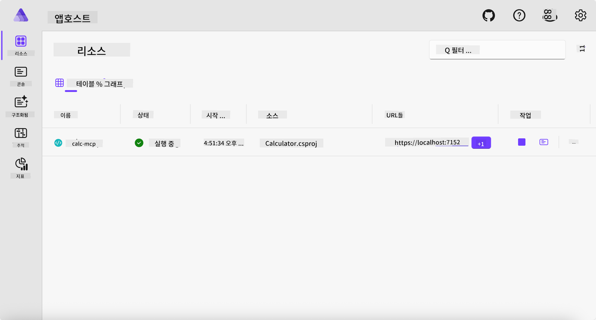
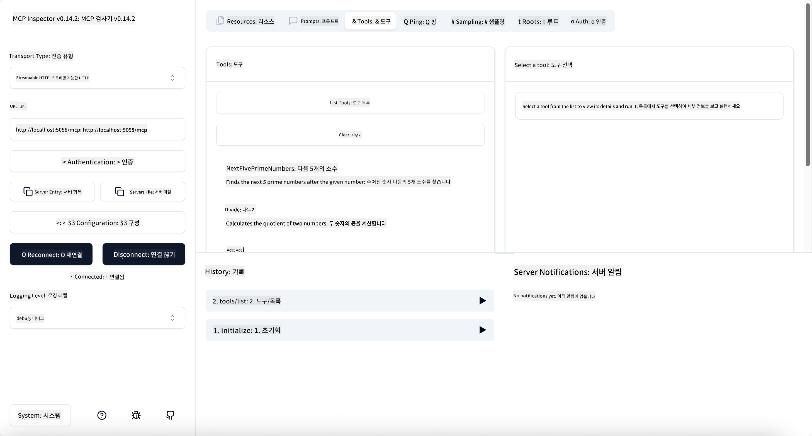

<!--
CO_OP_TRANSLATOR_METADATA:
{
  "original_hash": "0bc7bd48f55f1565f1d95ccb2c16f728",
  "translation_date": "2025-06-18T07:48:08+00:00",
  "source_file": "04-PracticalImplementation/samples/csharp/README.md",
  "language_code": "ko"
}
-->
# 샘플

이전 예제에서는 로컬 .NET 프로젝트를 `stdio` 타입과 함께 사용하는 방법과 컨테이너에서 로컬로 서버를 실행하는 방법을 보여줍니다. 많은 상황에서 좋은 해결책이 될 수 있습니다. 하지만 클라우드 환경처럼 서버를 원격으로 실행하는 것도 유용할 수 있습니다. 이럴 때 `http` 타입이 필요합니다.

`04-PracticalImplementation` 폴더의 솔루션을 보면 이전 예제보다 훨씬 복잡해 보일 수 있습니다. 하지만 실제로는 그렇지 않습니다. `src/Calculator` 프로젝트를 자세히 살펴보면 대부분 이전 예제와 같은 코드임을 알 수 있습니다. 유일한 차이점은 HTTP 요청을 처리하기 위해 다른 라이브러리 `ModelContextProtocol.AspNetCore`를 사용한다는 점과, 코드 내에서 private 메서드를 가질 수 있음을 보여주기 위해 `IsPrime` 메서드를 private로 변경했다는 것입니다. 나머지 코드는 이전과 동일합니다.

다른 프로젝트들은 [.NET Aspire](https://learn.microsoft.com/dotnet/aspire/get-started/aspire-overview)에서 가져온 것입니다. 솔루션에 .NET Aspire가 포함되면 개발자 경험이 향상되고 개발 및 테스트 과정에서 관찰 가능성이 좋아집니다. 서버 실행에 필수는 아니지만 솔루션에 포함하는 것이 좋은 습관입니다.

## 로컬에서 서버 시작하기

1. VS Code(C# DevKit 확장 프로그램과 함께)에서 `04-PracticalImplementation/samples/csharp` 디렉터리로 이동합니다.
1. 다음 명령어를 실행하여 서버를 시작합니다:

   ```bash
    dotnet watch run --project ./src/AppHost
   ```

1. 웹 브라우저가 .NET Aspire 대시보드를 열면 `http` URL을 확인하세요. 보통 `http://localhost:5058/`와 비슷할 것입니다.

   

## MCP Inspector로 Streamable HTTP 테스트하기

Node.js 22.7.5 이상이 설치되어 있다면 MCP Inspector를 사용해 서버를 테스트할 수 있습니다.

서버를 시작한 후 터미널에서 다음 명령어를 실행하세요:

```bash
npx @modelcontextprotocol/inspector http://localhost:5058
```



- `Streamable HTTP` as the Transport type.
- In the Url field, enter the URL of the server noted earlier, and append `/mcp`를 선택하세요. `http`이어야 하며 (이전 서버 `https`) something like `http://localhost:5058/mcp`.
- select the Connect button.

A nice thing about the Inspector is that it provide a nice visibility on what is happening.

- Try listing the available tools
- Try some of them, it should works just like before.

## Test MCP Server with GitHub Copilot Chat in VS Code

To use the Streamable HTTP transport with GitHub Copilot Chat, change the configuration of the `calc-mcp`가 아니라) 다음과 같은 서버가 생성되어야 합니다:

```jsonc
// .vscode/mcp.json
{
  "servers": {
    "calc-mcp": {
      "type": "http",
      "url": "http://localhost:5058/mcp"
    }
  }
}
```

몇 가지 테스트를 해보세요:

- "6780 이후의 첫 3개의 소수"를 요청해 보세요. Copilot이 새 도구 `NextFivePrimeNumbers`를 사용해 처음 3개의 소수만 반환하는 것을 확인할 수 있습니다.
- "111 이후의 첫 7개의 소수"를 요청해 보세요. 어떤 결과가 나오는지 확인해 보세요.
- "John이 사탕 24개를 3명의 아이에게 모두 나누어 주려고 합니다. 각 아이가 몇 개씩 받나요?"를 요청해 보세요. 어떤 결과가 나오는지 확인해 보세요.

## 서버를 Azure에 배포하기

더 많은 사용자가 서버를 사용할 수 있도록 Azure에 서버를 배포해 보겠습니다.

터미널에서 `04-PracticalImplementation/samples/csharp` 폴더로 이동한 후 다음 명령어를 실행하세요:

```bash
azd up
```

배포가 완료되면 다음과 같은 메시지가 표시됩니다:


URL을 복사하여 MCP Inspector와 GitHub Copilot Chat에서 사용하세요.

```jsonc
// .vscode/mcp.json
{
  "servers": {
    "calc-mcp": {
      "type": "http",
      "url": "https://calc-mcp.gentleriver-3977fbcf.australiaeast.azurecontainerapps.io/mcp"
    }
  }
}
```

## 다음은?

우리는 다양한 전송 타입과 테스트 도구를 시도해 보았습니다. 또한 MCP 서버를 Azure에 배포했습니다. 그런데 만약 서버가 데이터베이스나 비공개 API 같은 사설 리소스에 접근해야 한다면 어떻게 할까요? 다음 장에서는 서버의 보안을 어떻게 강화할 수 있는지 살펴보겠습니다.

**면책 조항**:  
이 문서는 AI 번역 서비스 [Co-op Translator](https://github.com/Azure/co-op-translator)를 사용하여 번역되었습니다. 정확성을 위해 노력하고 있으나, 자동 번역에는 오류나 부정확한 내용이 포함될 수 있음을 유의하시기 바랍니다. 원본 문서의 원어 버전이 권위 있는 자료로 간주되어야 합니다. 중요한 정보의 경우, 전문적인 인간 번역을 권장합니다. 본 번역 사용으로 인해 발생하는 오해나 잘못된 해석에 대해 당사는 책임을 지지 않습니다.