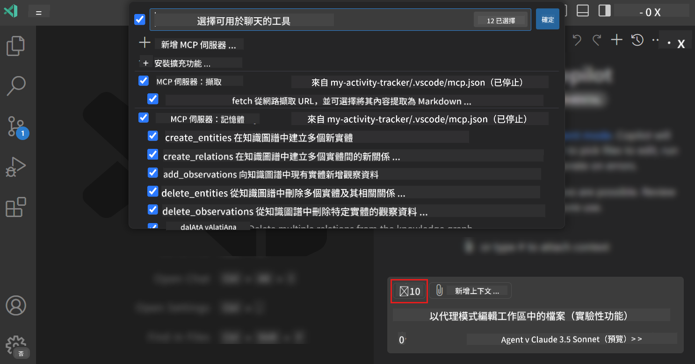

<!--
CO_OP_TRANSLATOR_METADATA:
{
  "original_hash": "8ea28e5e566edd5969337fd0b191ba3f",
  "translation_date": "2025-07-17T00:02:00+00:00",
  "source_file": "03-GettingStarted/04-vscode/README.md",
  "language_code": "mo"
}
-->
# 從 GitHub Copilot Agent 模式使用伺服器

Visual Studio Code 和 GitHub Copilot 可以作為客戶端來使用 MCP 伺服器。你可能會問，為什麼我們要這麼做？這代表 MCP 伺服器的所有功能現在都能直接在你的 IDE 裡使用。想像一下，如果你加入 GitHub 的 MCP 伺服器，就能透過提示詞來控制 GitHub，而不必在終端機輸入特定指令。或者，想像任何能提升你開發體驗的功能，都能用自然語言來操作。現在你應該能看到這樣做的好處了吧？

## 概覽

本課程將介紹如何使用 Visual Studio Code 和 GitHub Copilot 的 Agent 模式，作為你的 MCP 伺服器的客戶端。

## 學習目標

完成本課程後，你將能夠：

- 透過 Visual Studio Code 使用 MCP 伺服器。
- 透過 GitHub Copilot 執行工具等功能。
- 設定 Visual Studio Code 以尋找並管理你的 MCP 伺服器。

## 使用方式

你可以用兩種方式控制你的 MCP 伺服器：

- 使用者介面，稍後本章會示範如何操作。
- 終端機，可以用 `code` 執行檔從終端機控制：

  要將 MCP 伺服器加入你的使用者設定檔，請使用 --add-mcp 命令列選項，並提供 JSON 格式的伺服器設定，如 {\"name\":\"server-name\",\"command\":...}。

  ```
  code --add-mcp "{\"name\":\"my-server\",\"command\": \"uvx\",\"args\": [\"mcp-server-fetch\"]}"
  ```

### 截圖

  
  


接下來的章節我們會更詳細說明如何使用視覺介面。

## 方法

高層次來說，我們需要這樣做：

- 設定一個檔案來尋找 MCP 伺服器。
- 啟動／連接該伺服器，讓它列出可用功能。
- 透過 GitHub Copilot Chat 介面使用這些功能。

了解流程後，讓我們透過練習嘗試用 Visual Studio Code 使用 MCP 伺服器。

## 練習：使用伺服器

在這個練習中，我們將設定 Visual Studio Code 以尋找你的 MCP 伺服器，讓它能在 GitHub Copilot Chat 介面中使用。

### -0- 前置步驟，啟用 MCP 伺服器發現功能

你可能需要啟用 MCP 伺服器的發現功能。

1. 在 Visual Studio Code 中，前往 `File -> Preferences -> Settings`。

1. 搜尋「MCP」，並在 settings.json 檔案中啟用 `chat.mcp.discovery.enabled`。

### -1- 建立設定檔

先在專案根目錄建立設定檔，你需要一個名為 MCP.json 的檔案，並放在名為 .vscode 的資料夾中。內容應該像這樣：

```text
.vscode
|-- mcp.json
```

接著，我們來看看如何新增伺服器條目。

### -2- 設定伺服器

將以下內容加入 *mcp.json*：

```json
{
    "inputs": [],
    "servers": {
       "hello-mcp": {
           "command": "node",
           "args": [
               "build/index.js"
           ]
       }
    }
}
```

上面是一個簡單的範例，示範如何啟動一個用 Node.js 撰寫的伺服器，其他執行環境請用 `command` 和 `args` 指定正確的啟動指令。

### -3- 啟動伺服器

新增條目後，開始啟動伺服器：

1. 找到 *mcp.json* 中的條目，確認你看到「播放」圖示：

    

1. 點擊「播放」圖示，你會看到 GitHub Copilot Chat 中的工具圖示顯示可用工具數量增加。點擊該工具圖示，會列出已註冊的工具。你可以勾選或取消勾選工具，決定是否讓 GitHub Copilot 將它們作為上下文使用：

  

1. 要執行工具，輸入你知道會符合其中一個工具描述的提示詞，例如「add 22 to 1」：

  

  你應該會看到回應是 23。

## 作業

嘗試在 *mcp.json* 檔案中新增伺服器條目，並確保你能啟動／停止伺服器。也要確認你能透過 GitHub Copilot Chat 介面與伺服器上的工具溝通。

## 解答

[解答](./solution/README.md)

## 重要重點

本章重點如下：

- Visual Studio Code 是一個很棒的客戶端，能讓你使用多個 MCP 伺服器及其工具。
- GitHub Copilot Chat 介面是你與伺服器互動的方式。
- 你可以提示使用者輸入像是 API 金鑰等資訊，並在 *mcp.json* 設定伺服器條目時傳遞給 MCP 伺服器。

## 範例

- [Java 計算機](../samples/java/calculator/README.md)
- [.Net 計算機](../../../../03-GettingStarted/samples/csharp)
- [JavaScript 計算機](../samples/javascript/README.md)
- [TypeScript 計算機](../samples/typescript/README.md)
- [Python 計算機](../../../../03-GettingStarted/samples/python)

## 其他資源

- [Visual Studio 文件](https://code.visualstudio.com/docs/copilot/chat/mcp-servers)

## 接下來

- 下一步：[建立 SSE 伺服器](../05-sse-server/README.md)

**免責聲明**：  
本文件係使用 AI 翻譯服務 [Co-op Translator](https://github.com/Azure/co-op-translator) 進行翻譯。雖然我們致力於確保準確性，但請注意，自動翻譯可能包含錯誤或不準確之處。原始文件的母語版本應視為權威來源。對於重要資訊，建議採用專業人工翻譯。我們不對因使用本翻譯而產生的任何誤解或誤釋承擔責任。