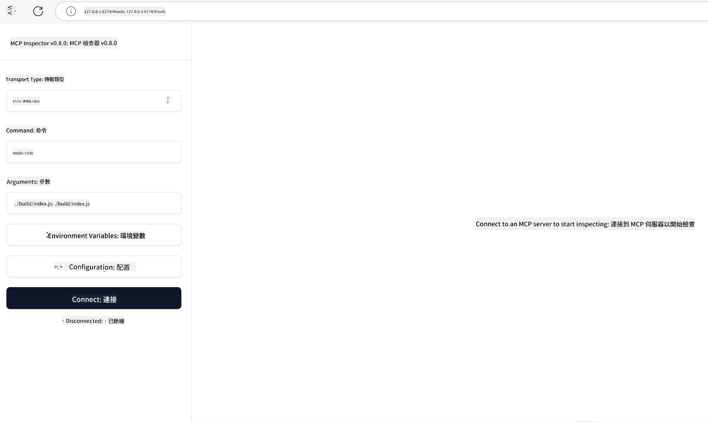

<!--
CO_OP_TRANSLATOR_METADATA:
{
  "original_hash": "e25bc265a51244a7a2d93b3761543a1f",
  "translation_date": "2025-06-13T02:06:11+00:00",
  "source_file": "03-GettingStarted/08-testing/README.md",
  "language_code": "mo"
}
-->
## Тестирање и отклањање грешака

Пре него што почнете са тестирањем вашег MCP сервера, важно је разумети расположиве алате и најбоље праксе за отклањање грешака. Ефикасно тестирање осигурава да ваш сервер ради како се очекује и помаже вам да брзо идентификујете и решите проблеме. Следећи одељак описује препоручене приступе за валидацију ваше MCP имплементације.

## Преглед

Овај час обухвата како изабрати прави приступ тестирању и најефикаснији алат за тестирање.

## Циљеви учења

На крају овог часа, моћи ћете да:

- Опишете различите приступе тестирању.
- Користите различите алате за ефикасно тестирање вашег кода.

## Тестирање MCP сервера

MCP пружа алате који вам помажу да тестирате и отклањате грешке на вашим серверима:

- **MCP Inspector**: алат из командне линије који може да се покреће као CLI алат и као визуелни алат.
- **Ручно тестирање**: Можете користити алат као што је curl за извођење веб захтева, али сваки алат који може да изврши HTTP захтеве је погодан.
- **Јединично тестирање**: Могуће је користити ваш омиљени тестирачки фрејмворк за тестирање функција како сервера тако и клијента.

### Коришћење MCP Inspector-а

Описали смо коришћење овог алата у претходним часовима, али хајде да га укратко представимо. То је алат направљен у Node.js и можете га користити позивањем извршног фајла `npx` који ће привремено преузети и инсталирати сам алат, а након извршења вашег захтева очистиће се.

[MCP Inspector](https://github.com/modelcontextprotocol/inspector) вам помаже да:

- **Откријете могућности сервера**: Аутоматски детектује расположиве ресурсе, алате и упите
- **Тестирате извршење алата**: Испробајте различите параметре и видите одговоре у реалном времену
- **Прегледате метаподатке сервера**: Испитајте информације о серверу, шеме и конфигурације

Типично покретање овог алата изгледа овако:

```bash
npx @modelcontextprotocol/inspector node build/index.js
```

Горња команда покреће MCP и његов визуелни интерфејс и отвара локални веб интерфејс у вашем претраживачу. Можете очекивати да видите контролни панел који приказује ваше регистроване MCP сервере, њихове расположиве алате, ресурсе и упите. Интерфејс вам омогућава интерактивно тестирање извршења алата, преглед метаподатака сервера и приказ одговора у реалном времену, што олакшава валидацију и отклањање грешака у вашим MCP имплементацијама.

Ево како то може изгледати: 

Такође можете покренути овај алат у CLI режиму тако што ћете додати атрибут `--cli`. Ево примера покретања алата у "CLI" режиму који приказује све алате на серверу:

```sh
npx @modelcontextprotocol/inspector --cli node build/index.js --method tools/list
```

### Ручно тестирање

Поред покретања инспектор алата за тестирање могућности сервера, сличан приступ је коришћење клијента који може да користи HTTP, као што је curl.

Помоћу curl-а можете директно тестирати MCP сервере коришћењем HTTP захтева:

```bash
# Example: Test server metadata
curl http://localhost:3000/v1/metadata

# Example: Execute a tool
curl -X POST http://localhost:3000/v1/tools/execute \
  -H "Content-Type: application/json" \
  -d '{"name": "calculator", "parameters": {"expression": "2+2"}}'
```

Као што видите из горњег примера коришћења curl-а, користите POST захтев да позовете алат са payload-ом који садржи име алата и његове параметре. Користите приступ који вам највише одговара. CLI алати уопштено су бржи за коришћење и лако се могу скриптовати што може бити корисно у CI/CD окружењу.

### Јединично тестирање

Креирајте јединичне тестове за ваше алате и ресурсе како бисте били сигурни да раде како је предвиђено. Ево примера кода за тестирање.

```python
import pytest

from mcp.server.fastmcp import FastMCP
from mcp.shared.memory import (
    create_connected_server_and_client_session as create_session,
)

# Mark the whole module for async tests
pytestmark = pytest.mark.anyio


async def test_list_tools_cursor_parameter():
    """Test that the cursor parameter is accepted for list_tools.

    Note: FastMCP doesn't currently implement pagination, so this test
    only verifies that the cursor parameter is accepted by the client.
    """

 server = FastMCP("test")

    # Create a couple of test tools
    @server.tool(name="test_tool_1")
    async def test_tool_1() -> str:
        """First test tool"""
        return "Result 1"

    @server.tool(name="test_tool_2")
    async def test_tool_2() -> str:
        """Second test tool"""
        return "Result 2"

    async with create_session(server._mcp_server) as client_session:
        # Test without cursor parameter (omitted)
        result1 = await client_session.list_tools()
        assert len(result1.tools) == 2

        # Test with cursor=None
        result2 = await client_session.list_tools(cursor=None)
        assert len(result2.tools) == 2

        # Test with cursor as string
        result3 = await client_session.list_tools(cursor="some_cursor_value")
        assert len(result3.tools) == 2

        # Test with empty string cursor
        result4 = await client_session.list_tools(cursor="")
        assert len(result4.tools) == 2
    
```

Горњи код ради следеће:

- Користи pytest фрејмворк који вам омогућава да креирате тестове као функције и користите assert изјаве.
- Креира MCP сервер са два различита алата.
- Користи `assert` изјаву да провери да су одређени услови испуњени.

Погледајте [потпуни фајл овде](https://github.com/modelcontextprotocol/python-sdk/blob/main/tests/client/test_list_methods_cursor.py)

На основу горњег фајла можете тестирати свој сервер да бисте били сигурни да су могућности креиране како треба.

Сви главни SDK имају сличне одељке за тестирање, па их можете прилагодити вашем одабраном runtime-у.

## Примери

- [Java Calculator](../samples/java/calculator/README.md)
- [.Net Calculator](../../../../03-GettingStarted/samples/csharp)
- [JavaScript Calculator](../samples/javascript/README.md)
- [TypeScript Calculator](../samples/typescript/README.md)
- [Python Calculator](../../../../03-GettingStarted/samples/python)

## Додатни ресурси

- [Python SDK](https://github.com/modelcontextprotocol/python-sdk)

## Шта следи

- Следеће: [Deployment](/03-GettingStarted/09-deployment/README.md)

**Disclaimer**:  
This document has been translated using AI translation service [Co-op Translator](https://github.com/Azure/co-op-translator). While we strive for accuracy, please be aware that automated translations may contain errors or inaccuracies. The original document in its native language should be considered the authoritative source. For critical information, professional human translation is recommended. We are not liable for any misunderstandings or misinterpretations arising from the use of this translation.

---

Could you please clarify what language "mo" refers to? There are several possibilities (e.g., Moldovan, Moore, or others). Once confirmed, I can provide the translation.