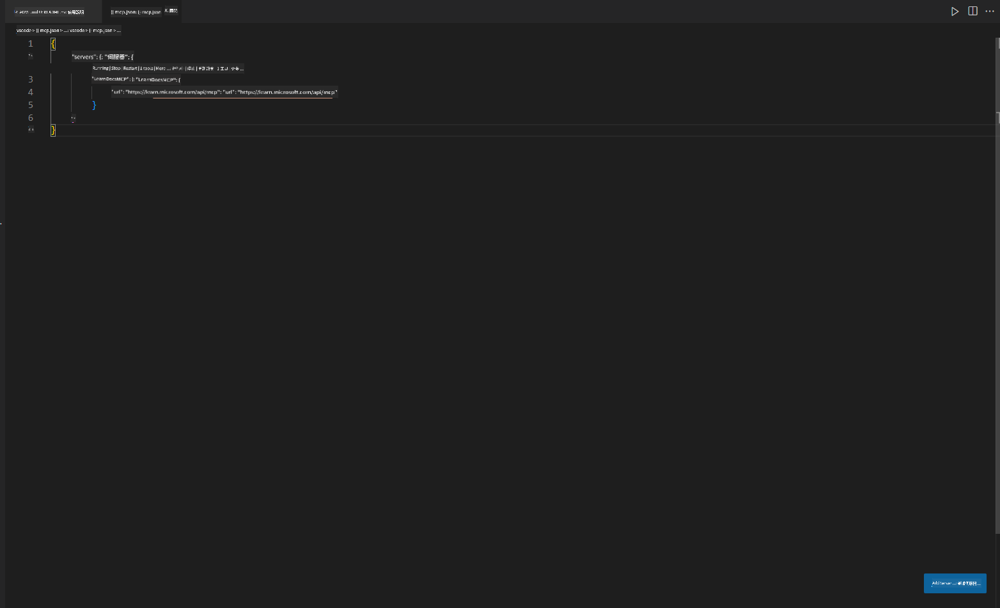
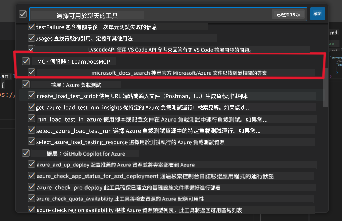
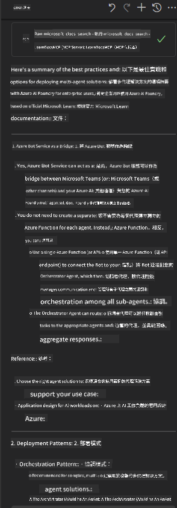

<!--
CO_OP_TRANSLATOR_METADATA:
{
  "original_hash": "db532b1ec386c9ce38c791653dc3c881",
  "translation_date": "2025-06-21T14:35:56+00:00",
  "source_file": "09-CaseStudy/docs-mcp/solution/scenario3/README.md",
  "language_code": "mo"
}
-->
# 情境 3：在 VS Code 編輯器內使用 MCP 伺服器的文件

## 概覽

在此情境中，您將學習如何利用 MCP 伺服器，將 Microsoft Learn 文件直接帶入 Visual Studio Code 環境中。您不必再頻繁切換瀏覽器分頁搜尋文件，而是可以在編輯器內存取、搜尋並參考官方文件。此方法能簡化您的工作流程，保持專注，並與 GitHub Copilot 等工具無縫整合。

- 在 VS Code 內搜尋並閱讀文件，無需離開程式碼環境。
- 直接參考文件並插入連結到 README 或課程檔案中。
- 結合 GitHub Copilot 與 MCP，打造順暢的 AI 驅動文件工作流程。

## 學習目標

完成本章後，您將了解如何在 VS Code 中設定並使用 MCP 伺服器，以提升文件與開發流程。您將能夠：

- 配置工作區以使用 MCP 伺服器進行文件查詢。
- 直接在 VS Code 內搜尋並插入文件內容。
- 結合 GitHub Copilot 與 MCP 的力量，實現更高效的 AI 輔助工作流程。

這些技能將幫助您保持專注、提升文件品質，並增強作為開發者或技術寫手的生產力。

## 解決方案

為了實現編輯器內文件存取，您將依序完成整合 MCP 伺服器、VS Code 與 GitHub Copilot 的步驟。此方案非常適合課程作者、文件撰寫者及開發者，讓您在編輯器中專注工作，同時利用文件與 Copilot 的功能。

- 在撰寫課程或專案文件時，快速加入 README 的參考連結。
- 利用 Copilot 生成程式碼，並用 MCP 即時尋找與引用相關文件。
- 保持在編輯器內的專注，提高生產力。

### 逐步指南

開始前，請依照以下步驟操作。每個步驟都可以搭配資源資料夾中的截圖，幫助您更直觀地理解流程。

1. **新增 MCP 設定檔：**  
   在專案根目錄建立一個 `.vscode/mcp.json` 檔案，並加入以下設定：  
   ```json
   {
     "servers": {
       "LearnDocsMCP": {
         "url": "https://learn.microsoft.com/api/mcp"
       }
     }
   }
   ```  
   此設定告訴 VS Code 如何連接到 [`Microsoft Learn Docs MCP server`](https://github.com/MicrosoftDocs/mcp)。

   

2. **開啟 GitHub Copilot Chat 面板：**  
   如果尚未安裝 GitHub Copilot 擴充功能，請前往 VS Code 的擴充功能視圖安裝。您也可以直接從 [Visual Studio Code Marketplace](https://marketplace.visualstudio.com/items?itemName=GitHub.copilot-chat) 下載。接著，從側邊欄開啟 Copilot Chat 面板。

   

3. **啟用代理模式並確認工具：**  
   在 Copilot Chat 面板中啟用代理模式。

   

   啟用後，確認 MCP 伺服器已列為可用工具之一。這確保 Copilot 代理能存取文件伺服器以擷取相關資訊。

   

4. **開始新對話並向代理提問：**  
   在 Copilot Chat 面板開啟新對話，您現在可以向代理提出文件查詢。代理會使用 MCP 伺服器，在編輯器內直接取得並顯示相關的 Microsoft Learn 文件。

   - *「我正在撰寫主題 X 的學習計畫，計畫學習 8 週，請為每週建議應該學習的內容。」*

   

5. **即時查詢：**

   > 以下取自 Azure AI Foundry Discord 中 [#get-help](https://discord.gg/D6cRhjHWSC) 頻道的即時查詢（[查看原始訊息](https://discord.com/channels/1113626258182504448/1385498306720829572)）：
   
   *「我正在尋找如何部署多代理解決方案的答案，這些 AI 代理是在 Azure AI Foundry 上開發的。我發現沒有直接的部署方式，例如 Copilot Studio 頻道。那麼，企業用戶要如何部署，才能進行互動並完成任務？  
   有許多文章或部落格提到可以使用 Azure Bot 服務，作為 MS Teams 與 Azure AI Foundry 代理之間的橋樑。如果我設置一個 Azure Bot，透過 Azure Function 連接到 Azure AI Foundry 上的 Orchestrator Agent 進行編排，這樣做可行嗎？還是我需要為多代理方案中每個 AI 代理建立 Azure Function，讓 Bot Framework 負責編排？其他建議也非常歡迎。」*

   

   代理會回應相關文件連結和摘要，您可以直接插入到 markdown 檔案中，或作為程式碼中的參考。

### 範例查詢

以下是一些您可以嘗試的範例查詢，展示 MCP 伺服器與 Copilot 如何協同工作，在不離開 VS Code 的情況下，立即提供情境相關的文件與參考：

- 「示範如何使用 Azure Functions 觸發器。」
- 「插入 Azure Key Vault 官方文件的連結。」
- 「有哪些保護 Azure 資源的最佳實務？」
- 「找一個 Azure AI 服務的快速入門範例。」

這些查詢將展示 MCP 伺服器與 Copilot 如何攜手，提供即時且具上下文的文件與參考，讓您在 VS Code 中輕鬆完成工作。

**免責聲明**：  
本文件係使用 AI 翻譯服務 [Co-op Translator](https://github.com/Azure/co-op-translator) 進行翻譯。雖然我們力求準確，但請注意，自動翻譯可能包含錯誤或不準確之處。原始文件的母語版本應視為權威來源。對於重要資訊，建議採用專業人工翻譯。我們不對因使用本翻譯而引起的任何誤解或誤釋負責。