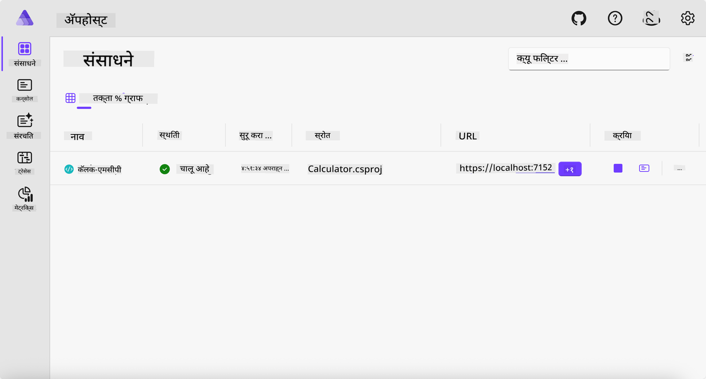

<!--
CO_OP_TRANSLATOR_METADATA:
{
  "original_hash": "0bc7bd48f55f1565f1d95ccb2c16f728",
  "translation_date": "2025-06-18T07:48:41+00:00",
  "source_file": "04-PracticalImplementation/samples/csharp/README.md",
  "language_code": "mr"
}
-->
# नमुना

मागील उदाहरणात दाखवले आहे की स्थानिक .NET प्रोजेक्ट कसा वापरायचा `stdio` प्रकारासह. आणि कंटेनरमध्ये स्थानिकपणे सर्व्हर कसा चालवायचा. हे अनेक परिस्थितींमध्ये चांगले समाधान आहे. मात्र, सर्व्हर दूरस्थपणे चालवणे, जसे की क्लाउड वातावरणात, उपयुक्त ठरू शकते. यासाठी `http` प्रकार वापरला जातो.

`04-PracticalImplementation` फोल्डरमधील सोल्यूशन पाहिल्यावर ते मागील उदाहरणापेक्षा जास्त गुंतागुंतीचे वाटू शकते. पण प्रत्यक्षात तसे नाही. जर तुम्ही प्रोजेक्ट `src/Calculator` नीट पाहिलात, तर तुम्हाला लक्षात येईल की तो बहुतेक मागील उदाहरणासारखाच कोड आहे. फरक इतकाच की आम्ही HTTP विनंत्या हाताळण्यासाठी वेगळ्या लायब्ररीचा वापर करतो, म्हणजे `ModelContextProtocol.AspNetCore`. आणि मेथड `IsPrime` ला प्रायव्हेट बनवतो, फक्त दाखवण्यासाठी की तुमच्या कोडमध्ये प्रायव्हेट मेथड्स असू शकतात. उरलेला कोड अगदी अगोदरच्याच प्रमाणे आहे.

इतर प्रोजेक्ट [.NET Aspire](https://learn.microsoft.com/dotnet/aspire/get-started/aspire-overview) मधून आहेत. सोल्यूशनमध्ये .NET Aspire असणे विकासकाच्या विकास आणि चाचणीच्या अनुभवात सुधारणा करते आणि निरीक्षणक्षमतेस मदत करते. सर्व्हर चालवण्यासाठी ते आवश्यक नाही, पण सोल्यूशनमध्ये ठेवणे चांगली पद्धत आहे.

## स्थानिकपणे सर्व्हर सुरू करा

1. VS Code (C# DevKit विस्तारासह) मध्ये, `04-PracticalImplementation/samples/csharp` निर्देशिकेत जा.
2. सर्व्हर सुरू करण्यासाठी खालील कमांड चालवा:

   ```bash
    dotnet watch run --project ./src/AppHost
   ```

3. जेव्हा वेब ब्राउझर .NET Aspire डॅशबोर्ड उघडेल, तेव्हा `http` URL लक्षात ठेवा. ते साधारणपणे `http://localhost:5058/` सारखे असावे.

   

## MCP Inspector सह Streamable HTTP ची चाचणी करा

जर तुमच्याकडे Node.js 22.7.5 किंवा त्याहून नवीन आवृत्ती असेल, तर तुम्ही MCP Inspector वापरून तुमचा सर्व्हर तपासू शकता.

सर्व्हर सुरू करा आणि टर्मिनलमध्ये खालील कमांड चालवा:

```bash
npx @modelcontextprotocol/inspector http://localhost:5058
```


- `Streamable HTTP` as the Transport type.
- In the Url field, enter the URL of the server noted earlier, and append `/mcp` निवडा. ते `http` असावे (नाहीतर `https`) something like `http://localhost:5058/mcp`.
- select the Connect button.

A nice thing about the Inspector is that it provide a nice visibility on what is happening.

- Try listing the available tools
- Try some of them, it should works just like before.

## Test MCP Server with GitHub Copilot Chat in VS Code

To use the Streamable HTTP transport with GitHub Copilot Chat, change the configuration of the `calc-mcp` सर्व्हर आधी तयार केलेला असावा ज्याचा हा स्वरूप आहे:

```jsonc
// .vscode/mcp.json
{
  "servers": {
    "calc-mcp": {
      "type": "http",
      "url": "http://localhost:5058/mcp"
    }
  }
}
```

काही चाचण्या करा:

- "6780 नंतरचे 3 प्राइम नंबर" विचारा. लक्षात ठेवा की Copilot नवीन टूल्स `NextFivePrimeNumbers` वापरेल आणि फक्त पहिले 3 प्राइम नंबर परत करेल.
- "111 नंतरचे 7 प्राइम नंबर" विचारा, काय होते ते पाहण्यासाठी.
- "जॉनकडे 24 लॉली आहेत आणि तो त्यांना त्याच्या 3 मुलांमध्ये वाटू इच्छितो. प्रत्येक मुलाकडे किती लॉली जातील?" विचारा, काय होते ते पाहण्यासाठी.

## सर्व्हर Azure वर तैनात करा

आता सर्व्हर Azure वर तैनात करूया, जेणेकरून अधिक लोक त्याचा वापर करू शकतील.

टर्मिनलमधून, `04-PracticalImplementation/samples/csharp` फोल्डरमध्ये जा आणि खालील कमांड चालवा:

```bash
azd up
```

तैनाती पूर्ण झाल्यावर, तुम्हाला खालीलप्रमाणे संदेश दिसेल:


URL घेऊन त्याचा वापर MCP Inspector आणि GitHub Copilot Chat मध्ये करा.

```jsonc
// .vscode/mcp.json
{
  "servers": {
    "calc-mcp": {
      "type": "http",
      "url": "https://calc-mcp.gentleriver-3977fbcf.australiaeast.azurecontainerapps.io/mcp"
    }
  }
}
```

## पुढे काय?

आपण वेगवेगळे ट्रान्सपोर्ट प्रकार आणि चाचणी साधने वापरून पाहतो. तसेच तुमचा MCP सर्व्हर Azure वर तैनात करतो. पण जर आमच्या सर्व्हरला खाजगी संसाधनांमध्ये प्रवेश हवा असेल तर? उदाहरणार्थ, डेटाबेस किंवा खाजगी API? पुढील अध्यायात आपण पाहू की सर्व्हरची सुरक्षा कशी वाढवता येईल.

**अस्वीकरण**:  
हा दस्तऐवज AI अनुवाद सेवा [Co-op Translator](https://github.com/Azure/co-op-translator) वापरून अनुवादित केला आहे. आम्ही अचूकतेसाठी प्रयत्न करतो, तरी कृपया लक्षात ठेवा की स्वयंचलित अनुवादांमध्ये चुका किंवा अचूकतेचा अभाव असू शकतो. मूळ दस्तऐवज त्याच्या स्थानिक भाषेत अधिकृत स्रोत मानला पाहिजे. महत्त्वाची माहिती असल्यास व्यावसायिक मानवी अनुवाद करण्याची शिफारस केली जाते. या अनुवादाच्या वापरामुळे उद्भवलेल्या कोणत्याही गैरसमजुती किंवा चुकीच्या अर्थलावासाठी आम्ही जबाबदार नाही.