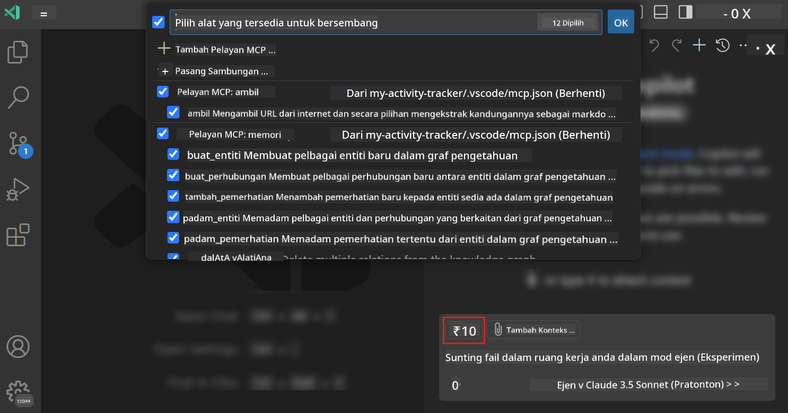

<!--
CO_OP_TRANSLATOR_METADATA:
{
  "original_hash": "8ea28e5e566edd5969337fd0b191ba3f",
  "translation_date": "2025-07-17T08:09:47+00:00",
  "source_file": "03-GettingStarted/04-vscode/README.md",
  "language_code": "ms"
}
-->
# Menggunakan pelayan dari mod Agen GitHub Copilot

Visual Studio Code dan GitHub Copilot boleh bertindak sebagai klien dan menggunakan MCP Server. Kenapa kita mahu buat begitu, anda mungkin tertanya? Ini bermakna apa sahaja ciri yang ada pada MCP Server kini boleh digunakan terus dari dalam IDE anda. Bayangkan anda menambah contohnya pelayan MCP GitHub, ini membolehkan anda mengawal GitHub melalui arahan bertulis tanpa perlu menaip arahan khusus di terminal. Atau bayangkan apa sahaja secara umum yang boleh meningkatkan pengalaman pembangun anda, semua dikawal menggunakan bahasa semula jadi. Sekarang anda mula nampak kelebihannya, bukan?

## Gambaran Keseluruhan

Pelajaran ini menerangkan cara menggunakan Visual Studio Code dan mod Agen GitHub Copilot sebagai klien untuk MCP Server anda.

## Objektif Pembelajaran

Menjelang akhir pelajaran ini, anda akan dapat:

- Menggunakan MCP Server melalui Visual Studio Code.
- Menjalankan keupayaan seperti alat melalui GitHub Copilot.
- Mengkonfigurasi Visual Studio Code untuk mencari dan mengurus MCP Server anda.

## Cara Penggunaan

Anda boleh mengawal MCP Server anda dengan dua cara berbeza:

- Antara muka pengguna, anda akan lihat bagaimana ini dilakukan kemudian dalam bab ini.
- Terminal, anda boleh mengawal perkara dari terminal menggunakan executable `code`:

  Untuk menambah MCP Server ke profil pengguna anda, gunakan pilihan baris arahan --add-mcp, dan berikan konfigurasi pelayan dalam bentuk JSON seperti {\"name\":\"server-name\",\"command\":...}.

  ```
  code --add-mcp "{\"name\":\"my-server\",\"command\": \"uvx\",\"args\": [\"mcp-server-fetch\"]}"
  ```

### Tangkapan Skrin





Mari kita bincang lebih lanjut tentang cara menggunakan antara muka visual dalam bahagian seterusnya.

## Pendekatan

Ini cara kita perlu mendekati pada tahap tinggi:

- Konfigurasikan fail untuk mencari MCP Server kita.
- Mulakan/Sambung ke pelayan tersebut untuk mendapatkan senarai keupayaannya.
- Gunakan keupayaan tersebut melalui antara muka GitHub Copilot Chat.

Bagus, sekarang kita faham alirannya, mari cuba gunakan MCP Server melalui Visual Studio Code dengan latihan.

## Latihan: Menggunakan pelayan

Dalam latihan ini, kita akan mengkonfigurasi Visual Studio Code untuk mencari MCP Server anda supaya ia boleh digunakan dari antara muka GitHub Copilot Chat.

### -0- Langkah awal, aktifkan penemuan MCP Server

Anda mungkin perlu mengaktifkan penemuan MCP Server.

1. Pergi ke `File -> Preferences -> Settings` dalam Visual Studio Code.

1. Cari "MCP" dan aktifkan `chat.mcp.discovery.enabled` dalam fail settings.json.

### -1- Cipta fail konfigurasi

Mula dengan mencipta fail konfigurasi di akar projek anda, anda perlu fail bernama MCP.json dan letakkan dalam folder bernama .vscode. Ia harus kelihatan seperti berikut:

```text
.vscode
|-- mcp.json
```

Seterusnya, mari lihat bagaimana kita boleh tambah entri pelayan.

### -2- Konfigurasikan pelayan

Tambah kandungan berikut ke *mcp.json*:

```json
{
    "inputs": [],
    "servers": {
       "hello-mcp": {
           "command": "node",
           "args": [
               "build/index.js"
           ]
       }
    }
}
```

Di atas adalah contoh mudah bagaimana untuk memulakan pelayan yang ditulis dalam Node.js, untuk runtime lain nyatakan arahan yang betul untuk memulakan pelayan menggunakan `command` dan `args`.

### -3- Mulakan pelayan

Sekarang anda telah menambah entri, mari mulakan pelayan:

1. Cari entri anda dalam *mcp.json* dan pastikan anda melihat ikon "play":

    

1. Klik ikon "play", anda akan lihat ikon alat dalam GitHub Copilot Chat bertambah bilangan alat yang tersedia. Jika anda klik ikon alat tersebut, anda akan lihat senarai alat yang didaftarkan. Anda boleh tandakan/tidak tandakan setiap alat bergantung sama ada anda mahu GitHub Copilot menggunakannya sebagai konteks:

  

1. Untuk menjalankan alat, taip arahan yang anda tahu akan sepadan dengan penerangan salah satu alat anda, contohnya arahan seperti "add 22 to 1":

  

  Anda sepatutnya melihat respons yang mengatakan 23.

## Tugasan

Cuba tambah entri pelayan ke dalam fail *mcp.json* anda dan pastikan anda boleh mulakan/hentikan pelayan. Pastikan juga anda boleh berkomunikasi dengan alat pada pelayan anda melalui antara muka GitHub Copilot Chat.

## Penyelesaian

[Solution](./solution/README.md)

## Perkara Penting

Perkara penting dari bab ini adalah seperti berikut:

- Visual Studio Code adalah klien hebat yang membolehkan anda menggunakan beberapa MCP Server dan alatnya.
- Antara muka GitHub Copilot Chat adalah cara anda berinteraksi dengan pelayan.
- Anda boleh meminta input pengguna seperti kunci API yang boleh dihantar ke MCP Server semasa mengkonfigurasi entri pelayan dalam fail *mcp.json*.

## Contoh

- [Java Calculator](../samples/java/calculator/README.md)
- [.Net Calculator](../../../../03-GettingStarted/samples/csharp)
- [JavaScript Calculator](../samples/javascript/README.md)
- [TypeScript Calculator](../samples/typescript/README.md)
- [Python Calculator](../../../../03-GettingStarted/samples/python)

## Sumber Tambahan

- [Dokumen Visual Studio](https://code.visualstudio.com/docs/copilot/chat/mcp-servers)

## Apa Seterusnya

- Seterusnya: [Mencipta SSE Server](../05-sse-server/README.md)

**Penafian**:  
Dokumen ini telah diterjemahkan menggunakan perkhidmatan terjemahan AI [Co-op Translator](https://github.com/Azure/co-op-translator). Walaupun kami berusaha untuk ketepatan, sila ambil perhatian bahawa terjemahan automatik mungkin mengandungi kesilapan atau ketidaktepatan. Dokumen asal dalam bahasa asalnya harus dianggap sebagai sumber yang sahih. Untuk maklumat penting, terjemahan profesional oleh manusia adalah disyorkan. Kami tidak bertanggungjawab atas sebarang salah faham atau salah tafsir yang timbul daripada penggunaan terjemahan ini.