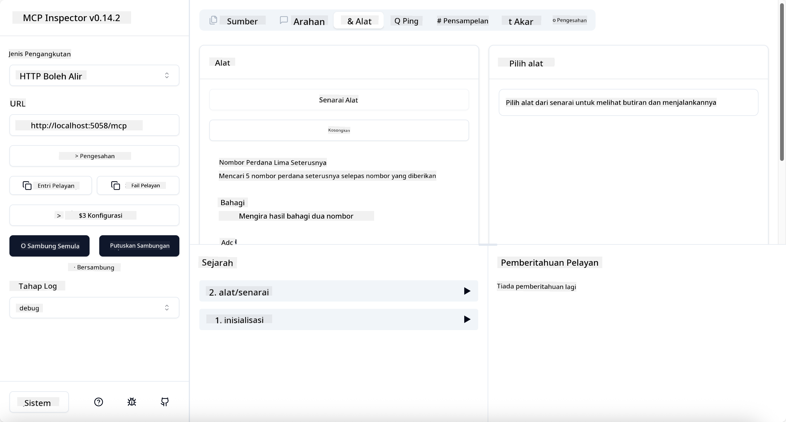

<!--
CO_OP_TRANSLATOR_METADATA:
{
  "original_hash": "0bc7bd48f55f1565f1d95ccb2c16f728",
  "translation_date": "2025-06-18T07:52:07+00:00",
  "source_file": "04-PracticalImplementation/samples/csharp/README.md",
  "language_code": "ms"
}
-->
# Contoh

Contoh sebelumnya menunjukkan cara menggunakan projek .NET tempatan dengan jenis `stdio`. Dan cara menjalankan server secara tempatan dalam sebuah kontena. Ini adalah penyelesaian yang baik dalam banyak situasi. Namun, ia juga berguna untuk menjalankan server secara jauh, seperti dalam persekitaran awan. Di sinilah jenis `http` digunakan.

Melihat pada penyelesaian dalam folder `04-PracticalImplementation`, ia mungkin kelihatan jauh lebih kompleks daripada yang sebelumnya. Tetapi sebenarnya, tidak begitu. Jika anda perhatikan projek `src/Calculator` dengan teliti, anda akan lihat bahawa ia kebanyakannya adalah kod yang sama seperti contoh sebelumnya. Perbezaan satu-satunya ialah kita menggunakan perpustakaan berbeza `ModelContextProtocol.AspNetCore` untuk mengendalikan permintaan HTTP. Dan kita mengubah kaedah `IsPrime` menjadi peribadi, hanya untuk menunjukkan bahawa anda boleh mempunyai kaedah peribadi dalam kod anda. Selebihnya kod adalah sama seperti sebelum ini.

Projek lain adalah daripada [.NET Aspire](https://learn.microsoft.com/dotnet/aspire/get-started/aspire-overview). Mempunyai .NET Aspire dalam penyelesaian akan meningkatkan pengalaman pembangun semasa membangunkan dan menguji serta membantu dengan kebolehamatan. Ia tidak diwajibkan untuk menjalankan server, tetapi ia adalah amalan yang baik untuk ada dalam penyelesaian anda.

## Mulakan server secara tempatan

1. Dari VS Code (dengan sambungan C# DevKit), navigasi ke direktori `04-PracticalImplementation/samples/csharp`.
1. Jalankan arahan berikut untuk memulakan server:

   ```bash
    dotnet watch run --project ./src/AppHost
   ```

1. Apabila pelayar web membuka papan pemuka .NET Aspire, perhatikan URL `http`. Ia sepatutnya seperti `http://localhost:5058/`.

   

## Uji Streamable HTTP dengan MCP Inspector

Jika anda mempunyai Node.js versi 22.7.5 ke atas, anda boleh menggunakan MCP Inspector untuk menguji server anda.

Mulakan server dan jalankan arahan berikut dalam terminal:

```bash
npx @modelcontextprotocol/inspector http://localhost:5058
```



- Pilih `Streamable HTTP` as the Transport type.
- In the Url field, enter the URL of the server noted earlier, and append `/mcp`. Ia sepatutnya `http` (bukan `https`) something like `http://localhost:5058/mcp`.
- select the Connect button.

A nice thing about the Inspector is that it provide a nice visibility on what is happening.

- Try listing the available tools
- Try some of them, it should works just like before.

## Test MCP Server with GitHub Copilot Chat in VS Code

To use the Streamable HTTP transport with GitHub Copilot Chat, change the configuration of the `calc-mcp` server yang telah dibuat sebelum ini untuk kelihatan seperti ini:

```jsonc
// .vscode/mcp.json
{
  "servers": {
    "calc-mcp": {
      "type": "http",
      "url": "http://localhost:5058/mcp"
    }
  }
}
```

Lakukan beberapa ujian:

- Minta "3 nombor perdana selepas 6780". Perhatikan bagaimana Copilot akan menggunakan alat baru `NextFivePrimeNumbers` dan hanya memulangkan 3 nombor perdana pertama.
- Minta "7 nombor perdana selepas 111", untuk lihat apa yang berlaku.
- Minta "John mempunyai 24 gula-gula dan ingin membahagikannya kepada 3 anaknya. Berapa gula-gula yang setiap anak dapat?", untuk lihat apa yang berlaku.

## Hantar server ke Azure

Mari kita hantar server ke Azure supaya lebih ramai orang boleh menggunakannya.

Dari terminal, navigasi ke folder `04-PracticalImplementation/samples/csharp` dan jalankan arahan berikut:

```bash
azd up
```

Setelah penghantaran selesai, anda akan melihat mesej seperti ini:


Ambil URL tersebut dan gunakan dalam MCP Inspector serta dalam GitHub Copilot Chat.

```jsonc
// .vscode/mcp.json
{
  "servers": {
    "calc-mcp": {
      "type": "http",
      "url": "https://calc-mcp.gentleriver-3977fbcf.australiaeast.azurecontainerapps.io/mcp"
    }
  }
}
```

## Apa seterusnya?

Kita cuba jenis pengangkutan dan alat ujian yang berbeza. Kita juga menghantar server MCP anda ke Azure. Tetapi bagaimana jika server kita perlu mengakses sumber peribadi? Contohnya, pangkalan data atau API peribadi? Dalam bab seterusnya, kita akan lihat bagaimana kita boleh meningkatkan keselamatan server kita.

**Penafian**:  
Dokumen ini telah diterjemahkan menggunakan perkhidmatan terjemahan AI [Co-op Translator](https://github.com/Azure/co-op-translator). Walaupun kami berusaha untuk ketepatan, sila ambil perhatian bahawa terjemahan automatik mungkin mengandungi kesilapan atau ketidaktepatan. Dokumen asal dalam bahasa asalnya harus dianggap sebagai sumber yang sahih. Untuk maklumat yang kritikal, terjemahan profesional oleh manusia adalah disyorkan. Kami tidak bertanggungjawab atas sebarang salah faham atau salah tafsir yang timbul daripada penggunaan terjemahan ini.