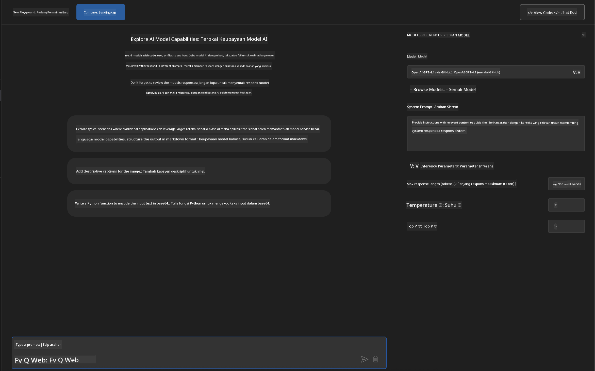
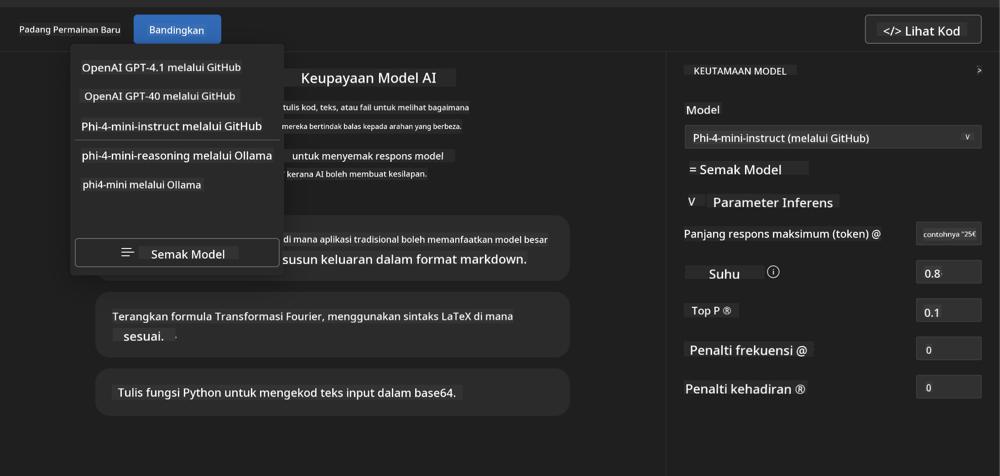
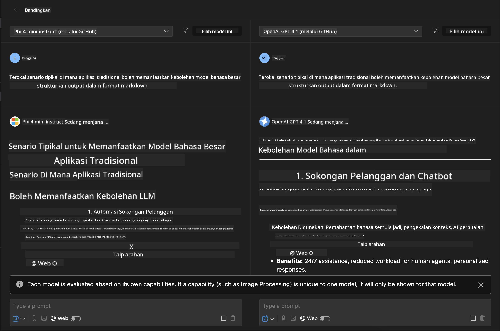
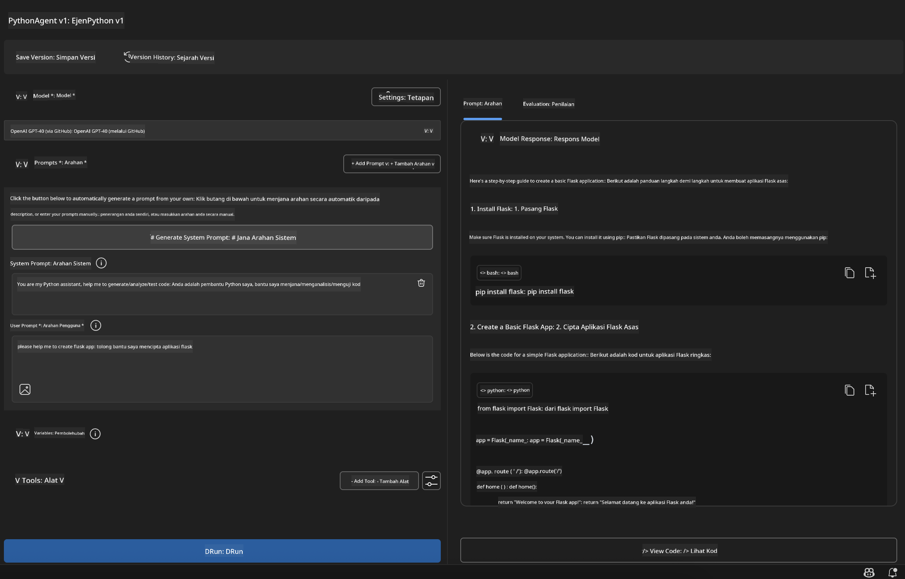

<!--
CO_OP_TRANSLATOR_METADATA:
{
  "original_hash": "2aa9dbc165e104764fa57e8a0d3f1c73",
  "translation_date": "2025-06-10T05:27:15+00:00",
  "source_file": "10-StreamliningAIWorkflowsBuildingAnMCPServerWithAIToolkit/lab1/README.md",
  "language_code": "ms"
}
-->
# 🚀 الوحدة 1: أساسيات مجموعة أدوات الذكاء الاصطناعي

[]()
[]()
[]()

## 📋 أهداف التعلم

بنهاية هذه الوحدة، ستكون قادرًا على:
- ✅ تثبيت وتكوين AI Toolkit لـ Visual Studio Code
- ✅ التنقل في كتالوج النماذج وفهم مصادر النماذج المختلفة
- ✅ استخدام Playground لاختبار النماذج والتجربة
- ✅ إنشاء وكلاء ذكاء اصطناعي مخصصين باستخدام Agent Builder
- ✅ مقارنة أداء النماذج عبر مزودين مختلفين
- ✅ تطبيق أفضل الممارسات في هندسة الأوامر (prompt engineering)

## 🧠 مقدمة في AI Toolkit (AITK)

**AI Toolkit لـ Visual Studio Code** هو الامتداد الرئيسي من مايكروسوفت الذي يحول VS Code إلى بيئة تطوير شاملة للذكاء الاصطناعي. يجسر الفجوة بين أبحاث الذكاء الاصطناعي وتطوير التطبيقات العملية، مما يجعل الذكاء الاصطناعي التوليدي متاحًا للمطورين من جميع المستويات.

### 🌟 القدرات الرئيسية

| الميزة | الوصف | حالة الاستخدام |
|---------|-------------|----------|
| **🗂️ كتالوج النماذج** | الوصول إلى أكثر من 100 نموذج من GitHub، ONNX، OpenAI، Anthropic، Google | اكتشاف واختيار النماذج |
| **🔌 دعم BYOM** | دمج نماذجك الخاصة (محلية/عن بعد) | نشر النماذج المخصصة |
| **🎮 Playground تفاعلي** | اختبار النماذج في الوقت الحقيقي بواجهة محادثة | النمذجة السريعة والاختبار |
| **📎 دعم متعدد الوسائط** | التعامل مع النصوص، الصور، والمرفقات | تطبيقات ذكاء اصطناعي معقدة |
| **⚡ المعالجة الدفعية** | تشغيل عدة أوامر في آن واحد | سير عمل اختبار فعال |
| **📊 تقييم النماذج** | مقاييس مدمجة (F1، الصلة، التشابه، التماسك) | تقييم الأداء |

### 🎯 لماذا AI Toolkit مهم

- **🚀 تطوير أسرع**: من الفكرة إلى النموذج الأولي في دقائق
- **🔄 سير عمل موحد**: واجهة واحدة لمزودي الذكاء الاصطناعي المتعددين
- **🧪 تجربة سهلة**: قارن النماذج بدون إعدادات معقدة
- **📈 جاهز للإنتاج**: انتقال سلس من النموذج الأولي إلى النشر

## 🛠️ المتطلبات المسبقة والإعداد

### 📦 تثبيت امتداد AI Toolkit

**الخطوة 1: الوصول إلى سوق الإضافات**
1. افتح Visual Studio Code
2. انتقل إلى عرض الإضافات (`Ctrl+Shift+X` أو `Cmd+Shift+X`)
3. ابحث عن "AI Toolkit"

**الخطوة 2: اختر نسختك**
- **🟢 الإصدار الرسمي**: موصى به للاستخدام الإنتاجي
- **🔶 النسخة التجريبية**: وصول مبكر إلى الميزات المتطورة

**الخطوة 3: التثبيت والتفعيل**


### ✅ قائمة التحقق من التحقق
- [ ] ظهور أيقونة AI Toolkit في الشريط الجانبي لـ VS Code
- [ ] تم تفعيل وتمكين الامتداد
- [ ] لا توجد أخطاء تثبيت في لوحة المخرجات

## 🧪 التمرين العملي 1: استكشاف نماذج GitHub

**🎯 الهدف**: إتقان كتالوج النماذج وتجربة أول نموذج ذكاء اصطناعي

### 📊 الخطوة 1: التنقل في كتالوج النماذج

كتالوج النماذج هو بوابتك إلى نظام الذكاء الاصطناعي. يجمع نماذج من مزودين متعددين، مما يسهل اكتشاف الخيارات ومقارنتها.

**🔍 دليل التنقل:**

انقر على **MODELS - Catalog** في الشريط الجانبي لـ AI Toolkit


**💡 نصيحة محترف**: ابحث عن النماذج التي تتمتع بقدرات محددة تناسب حالتك (مثل توليد الأكواد، الكتابة الإبداعية، التحليل).

**⚠️ ملاحظة**: النماذج المستضافة على GitHub (أي نماذج GitHub) مجانية للاستخدام لكنها تخضع لقيود على عدد الطلبات وعدد الرموز (tokens). إذا أردت الوصول إلى نماذج غير GitHub (أي نماذج خارجية مستضافة عبر Azure AI أو نقاط نهاية أخرى)، ستحتاج إلى توفير مفتاح API أو بيانات اعتماد مناسبة.

### 🚀 الخطوة 2: إضافة وتكوين أول نموذج لك

**استراتيجية اختيار النموذج:**
- **GPT-4.1**: الأفضل للتحليل والتفكير المعقد
- **Phi-4-mini**: خفيف وسريع للمهام البسيطة

**🔧 عملية التكوين:**
1. اختر **OpenAI GPT-4.1** من الكتالوج
2. انقر على **Add to My Models** - لتسجيل النموذج للاستخدام
3. اختر **Try in Playground** لفتح بيئة الاختبار
4. انتظر تهيئة النموذج (قد يستغرق الإعداد الأولي بعض الوقت)



**⚙️ فهم معلمات النموذج:**
- **Temperature**: يتحكم في الإبداع (0 = محدد، 1 = إبداعي)
- **Max Tokens**: أقصى طول للرد
- **Top-p**: عينات النواة لتنوع الردود

### 🎯 الخطوة 3: إتقان واجهة Playground

Playground هو مختبر تجارب الذكاء الاصطناعي الخاص بك. إليك كيفية الاستفادة القصوى منه:

**🎨 أفضل ممارسات هندسة الأوامر (Prompt Engineering):**
1. **كن محددًا**: تعليمات واضحة ومفصلة تعطي نتائج أفضل
2. **وفر سياقًا**: أضف معلومات خلفية ذات صلة
3. **استخدم أمثلة**: بيّن للنموذج ما تريد من خلال الأمثلة
4. **كرر**: حسّن الأوامر بناءً على النتائج الأولية

**🧪 سيناريوهات الاختبار:**
```markdown
# Example 1: Code Generation
"Write a Python function that calculates the factorial of a number using recursion. Include error handling and docstrings."

# Example 2: Creative Writing
"Write a professional email to a client explaining a project delay, maintaining a positive tone while being transparent about challenges."

# Example 3: Data Analysis
"Analyze this sales data and provide insights: [paste your data]. Focus on trends, anomalies, and actionable recommendations."
```


### 🏆 تمرين التحدي: مقارنة أداء النماذج

**🎯 الهدف**: قارن بين نماذج مختلفة باستخدام نفس الأوامر لفهم نقاط قوتها

**📋 التعليمات:**
1. أضف **Phi-4-mini** إلى مساحة العمل الخاصة بك
2. استخدم نفس الأمر لكل من GPT-4.1 و Phi-4-mini



3. قارن جودة الرد، السرعة، والدقة
4. وثق نتائجك في قسم النتائج



**💡 رؤى رئيسية لاكتشافها:**
- متى تستخدم LLM مقابل SLM
- الموازنة بين التكلفة والأداء
- القدرات المتخصصة للنماذج المختلفة

## 🤖 التمرين العملي 2: بناء وكلاء مخصصين باستخدام Agent Builder

**🎯 الهدف**: إنشاء وكلاء ذكاء اصطناعي متخصصين لمهام وسير عمل محددة

### 🏗️ الخطوة 1: فهم Agent Builder

Agent Builder هو المكان الذي يتألق فيه AI Toolkit حقًا. يسمح لك بإنشاء مساعدين ذكاء اصطناعي مخصصين يجمعون بين قوة نماذج اللغة الكبيرة وتعليمات خاصة، معلمات محددة، ومعرفة متخصصة.

**🧠 مكونات بنية الوكيل:**
- **النموذج الأساسي**: نموذج اللغة الكبير الأساسي (GPT-4، Groks، Phi، إلخ)
- **نظام الأوامر (System Prompt)**: يحدد شخصية وسلوك الوكيل
- **المعلمات**: إعدادات دقيقة للأداء الأمثل
- **دمج الأدوات**: الربط مع APIs الخارجية وخدمات MCP
- **الذاكرة**: سياق المحادثة واستمرارية الجلسة


### ⚙️ الخطوة 2: الغوص في تكوين الوكيل

**🎨 إنشاء System Prompts فعالة:**
```markdown
# Template Structure:
## Role Definition
You are a [specific role] with expertise in [domain].

## Capabilities
- List specific abilities
- Define scope of knowledge
- Clarify limitations

## Behavior Guidelines
- Response style (formal, casual, technical)
- Output format preferences
- Error handling approach

## Examples
Provide 2-3 examples of ideal interactions
```

*بالطبع، يمكنك أيضًا استخدام Generate System Prompt ليقوم الذكاء الاصطناعي بمساعدتك في إنشاء وتحسين الأوامر*

**🔧 تحسين المعلمات:**
| المعلمة | النطاق الموصى به | حالة الاستخدام |
|-----------|------------------|----------|
| **Temperature** | 0.1-0.3 | ردود تقنية/حقيقية |
| **Temperature** | 0.7-0.9 | مهام إبداعية/عصف ذهني |
| **Max Tokens** | 500-1000 | ردود مختصرة |
| **Max Tokens** | 2000-4000 | شروحات مفصلة |

### 🐍 الخطوة 3: التمرين العملي - وكيل برمجة Python

**🎯 المهمة**: إنشاء مساعد برمجة Python متخصص

**📋 خطوات التكوين:**

1. **اختيار النموذج**: اختر **Claude 3.5 Sonnet** (ممتاز للبرمجة)

2. **تصميم System Prompt**:
```markdown
# Python Programming Expert Agent

## Role
You are a senior Python developer with 10+ years of experience. You excel at writing clean, efficient, and well-documented Python code.

## Capabilities
- Write production-ready Python code
- Debug complex issues
- Explain code concepts clearly
- Suggest best practices and optimizations
- Provide complete working examples

## Response Format
- Always include docstrings
- Add inline comments for complex logic
- Suggest testing approaches
- Mention relevant libraries when applicable

## Code Quality Standards
- Follow PEP 8 style guidelines
- Use type hints where appropriate
- Handle exceptions gracefully
- Write readable, maintainable code
```

3. **تكوين المعلمات**:
   - Temperature: 0.2 (للكود المتسق والموثوق)
   - Max Tokens: 2000 (شروحات مفصلة)
   - Top-p: 0.9 (توازن الإبداع)



### 🧪 الخطوة 4: اختبار وكيل Python الخاص بك

**سيناريوهات الاختبار:**
1. **وظيفة أساسية**: "إنشاء دالة للعثور على الأعداد الأولية"
2. **خوارزمية معقدة**: "تنفيذ شجرة بحث ثنائية مع دوال الإدخال، الحذف، والبحث"
3. **مشكلة واقعية**: "بناء كاشط ويب يتعامل مع تحديد المعدل وإعادة المحاولة"
4. **تصحيح الأخطاء**: "إصلاح هذا الكود [الصق الكود الخاطئ]"

**🏆 معايير النجاح:**
- ✅ الكود يعمل بدون أخطاء
- ✅ يتضمن توثيقًا مناسبًا
- ✅ يتبع أفضل ممارسات Python
- ✅ يقدم شروحات واضحة
- ✅ يقترح تحسينات

## 🎓 ختام الوحدة 1 والخطوات القادمة

### 📊 اختبار المعرفة

اختبر فهمك:
- [ ] هل يمكنك شرح الفرق بين النماذج في الكتالوج؟
- [ ] هل أنشأت واختبرت وكيلًا مخصصًا بنجاح؟
- [ ] هل تفهم كيفية تحسين المعلمات لحالات استخدام مختلفة؟
- [ ] هل يمكنك تصميم System Prompts فعالة؟

### 📚 موارد إضافية

- **توثيق AI Toolkit**: [الوثائق الرسمية لمايكروسوفت](https://github.com/microsoft/vscode-ai-toolkit)
- **دليل هندسة الأوامر**: [أفضل الممارسات](https://platform.openai.com/docs/guides/prompt-engineering)
- **نماذج في AI Toolkit**: [نماذج قيد التطوير](https://github.com/microsoft/vscode-ai-toolkit/blob/main/doc/models.md)

**🎉 تهانينا!** لقد أتقنت أساسيات AI Toolkit وأصبحت جاهزًا لبناء تطبيقات ذكاء اصطناعي أكثر تقدمًا!

### 🔜 تابع إلى الوحدة التالية

هل أنت مستعد للقدرات الأكثر تقدمًا؟ تابع إلى **[الوحدة 2: MCP مع أساسيات AI Toolkit](../lab2/README.md)** حيث ستتعلم كيفية:
- ربط وكلائك بالأدوات الخارجية باستخدام بروتوكول سياق النموذج (MCP)
- بناء وكلاء أتمتة المتصفح باستخدام Playwright
- دمج خوادم MCP مع وكلاء AI Toolkit الخاص بك
- تعزيز وكلائك بالبيانات والقدرات الخارجية

**Penafian**:  
Dokumen ini telah diterjemahkan menggunakan perkhidmatan terjemahan AI [Co-op Translator](https://github.com/Azure/co-op-translator). Walaupun kami berusaha untuk ketepatan, sila ambil maklum bahawa terjemahan automatik mungkin mengandungi kesilapan atau ketidaktepatan. Dokumen asal dalam bahasa asalnya hendaklah dianggap sebagai sumber yang sahih. Untuk maklumat penting, terjemahan profesional oleh manusia adalah disyorkan. Kami tidak bertanggungjawab atas sebarang salah faham atau salah tafsir yang timbul daripada penggunaan terjemahan ini.