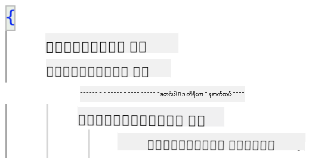
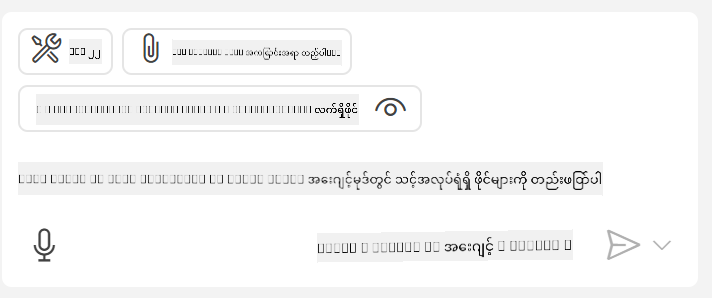

<!--
CO_OP_TRANSLATOR_METADATA:
{
  "original_hash": "0eb9557780cd0a2551cdb8a16c886b51",
  "translation_date": "2025-06-17T16:40:45+00:00",
  "source_file": "03-GettingStarted/04-vscode/README.md",
  "language_code": "my"
}
-->
နောက်ပိုင်းပိုင်းတွင် Visual Interface ကို ဘယ်လိုအသုံးပြုရမယ်ဆိုတာပိုမိုဆွေးနွေးကြမယ်။

## နည်းလမ်း

အထွေထွေ အဆင့်မြင့်နည်းလမ်းကတော့ ဒီလိုဖြစ်ပါတယ်-

- MCP Server ကို ရှာဖွေဖို့ဖိုင်တစ်ခုကို ပြင်ဆင်ပါ။
- ဖိုင်ထဲက server ကို စတင်ချိတ်ဆက်ပြီး ၎င်းရဲ့ စွမ်းဆောင်ရည်များကို စာရင်းပြုစုပါ။
- GitHub Copilot Chat interface မှတဆင့် ၎င်းစွမ်းဆောင်ရည်များကို အသုံးပြုပါ။

အိုကေ၊ ဒီလမ်းစဉ်ကို နားလည်သွားပြီဆိုတော့ Visual Studio Code မှတဆင့် MCP Server ကို ဘယ်လိုအသုံးပြုမလဲဆိုတာ လေ့ကျင့်ကြည့်ကြမယ်။

## လေ့ကျင့်ခန်း: Server ကို အသုံးပြုခြင်း

ဒီလေ့ကျင့်ခန်းမှာ Visual Studio Code ကို သင့် MCP server ကို ရှာဖွေဖို့ ပြင်ဆင်ပြီး GitHub Copilot Chat interface မှာ အသုံးပြုနိုင်အောင် ပြုလုပ်ပါမယ်။

### -0- ကြိုတင်အဆင့်၊ MCP Server ရှာဖွေမှုကို ဖွင့်ပါ

MCP Servers ရှာဖွေမှုကို ဖွင့်ထားဖို့ လိုအပ်နိုင်ပါတယ်။

1. `File -> Preferences -> Settings` သို့သွားပြီး settings.json ဖိုင်ထဲက ` in Visual Studio Code.

1. Search for "MCP" and enable `chat.mcp.discovery.enabled ကို ရှာပါ။

### -1- ဖိုင်တစ်ခု ဖန်တီးပါ

သင့် project ရဲ့ root folder မှာ .vscode folder ထဲမှာ MCP.json ဆိုတဲ့ ဖိုင်တစ်ခု ဖန်တီးပါ။ အောက်ပါပုံစံလိုမျိုး ဖြစ်ရပါမယ်-

```text
.vscode
|-- mcp.json
```

နောက်တစ်ဆင့်မှာ server entry ကို ဘယ်လိုထည့်မလဲ ကြည့်ကြရအောင်။

### -2- Server ကို ပြင်ဆင်ပါ

*mcp.json* ဖိုင်ထဲမှာ အောက်ပါအတိုင်း ထည့်သွင်းပါ-

```json
{
    "inputs": [],
    "servers": {
       "hello-mcp": {
           "command": "node",
           "args": [
               "build/index.js"
           ]
       }
    }
}
```

အထက်ပါနမူနာမှာ Node.js နဲ့ server ကို စတင်ဖို့ command ကို ဖော်ပြထားပါတယ်။ အခြား runtime တွေအတွက်တော့ `command` and `args` ကို သင့် runtime အလိုက် မှန်ကန်တဲ့ command နဲ့ ပြောင်းပါ။

### -3- Server ကို စတင်ပါ

Entry ထည့်ပြီးသွားပြီဆိုရင် server ကို စတင်ကြည့်ပါ-

1. *mcp.json* ထဲက entry ကို ရှာပြီး "play" အိုင်ကွန်ကို တွေ့ပါမယ်-

    

2. "play" အိုင်ကွန်ကို နှိပ်လိုက်ပါ၊ GitHub Copilot Chat ရဲ့ tools အိုင်ကွန်မှာ အသုံးပြုနိုင်တဲ့ tools အရေအတွက် တိုးလာတာ တွေ့ရပါမယ်။ အဲဒီ tools အိုင်ကွန်ကို နှိပ်လိုက်ရင် မှတ်ပုံတင်ထားတဲ့ tools တွေ စာရင်းပေါ်လာပါမယ်။ GitHub Copilot ကို context အနေနဲ့ အသုံးပြုချင်တာတွေကို သတ်မှတ်ဖို့ စစ်ပေးနိုင်ပါတယ်-

  

3. Tool တစ်ခုကို လည်ပတ်ဖို့ သင်သိပြီးတဲ့ prompt ကို ရိုက်ထည့်ပါ၊ ဥပမာ "add 22 to 1" ဆိုတဲ့ prompt-

  

  ၂၃ ဆိုတဲ့ ဖြေကြားချက်ကို တွေ့ရပါမယ်။

## လုပ်ငန်းတာဝန်

*mcp.json* ဖိုင်ထဲ server entry တစ်ခု ထည့်ပြီး server ကို စတင်/ရပ်တန့်နိုင်မှုကို စမ်းကြည့်ပါ။ GitHub Copilot Chat interface မှတဆင့် server ရဲ့ tools တွေနဲ့ ဆက်သွယ်နိုင်တာကိုလည်း သေချာစစ်ဆေးပါ။

## ဖြေရှင်းချက်

[Solution](./solution/README.md)

## အဓိကသင်ခန်းစာများ

ဒီအခန်းကနေ သင်ယူရမယ့် အချက်တွေကတော့-

- Visual Studio Code က MCP Servers အမျိုးမျိုးနဲ့ tools တွေကို အသုံးပြုနိုင်တဲ့ client အကောင်းဆုံးတစ်ခုဖြစ်ပါတယ်။
- GitHub Copilot Chat interface က server တွေနဲ့ ဆက်သွယ်ဖို့ အသုံးပြုတဲ့ နည်းလမ်းဖြစ်ပါတယ်။
- *mcp.json* ဖိုင်ထဲ server entry ပြင်ဆင်တဲ့အခါ API keys ကဲ့သို့သော user input များကို prompt ဖြင့် တောင်းနိုင်ပြီး MCP Server ကို ပို့ပေးနိုင်ပါတယ်။

## နမူနာများ

- [Java Calculator](../samples/java/calculator/README.md)
- [.Net Calculator](../../../../03-GettingStarted/samples/csharp)
- [JavaScript Calculator](../samples/javascript/README.md)
- [TypeScript Calculator](../samples/typescript/README.md)
- [Python Calculator](../../../../03-GettingStarted/samples/python)

## ထပ်ဆောင်း အရင်းအမြစ်များ

- [Visual Studio docs](https://code.visualstudio.com/docs/copilot/chat/mcp-servers)

## နောက်တစ်ခု

- နောက်တစ်ခု- [Creating an SSE Server](/03-GettingStarted/05-sse-server/README.md)

**အတည်မပြုချက်**  
ဤစာတမ်းကို AI ဘာသာပြန်ဝန်ဆောင်မှုဖြစ်သော [Co-op Translator](https://github.com/Azure/co-op-translator) ဖြင့် ဘာသာပြန်ထားပါသည်။ ကျွန်ုပ်တို့သည် တိကျမှန်ကန်မှုအတွက် ကြိုးစားပေမယ့် အလိုအလျောက် ဘာသာပြန်ခြင်းသည် အမှားများ သို့မဟုတ် မှားယွင်းချက်များ ပါဝင်နိုင်ကြောင်း သတိပြုပါရန် မေတ္တာရပ်ခံအပ်ပါသည်။ မူရင်းစာတမ်းကို ကိုယ်ပိုင်ဘာသာစကားဖြင့်သာ တရားဝင်အရင်းအမြစ်အဖြစ်ယူဆသင့်ပါသည်။ အရေးကြီးသောအချက်အလက်များအတွက် လူမှုလက်တွေ့ ဘာသာပြန်သူတစ်ဦး၏ ဘာသာပြန်မှုကို အကြံပြုပါသည်။ ဤဘာသာပြန်မှုကို အသုံးပြုမှုကြောင့် ဖြစ်ပေါ်လာသော နားလည်မှုအမှားများ သို့မဟုတ် မှားယွင်းဖော်ပြချက်များအတွက် ကျွန်ုပ်တို့သည် တာဝန်မခံပါ။